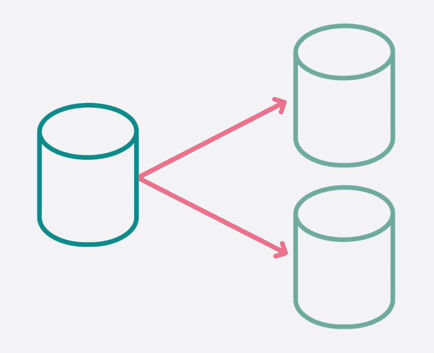

# 在可用性组中配置分发数据库

> 原文：<https://dev.to/am2/configuring-the-distribution-database-in-an-availability-group-56pn>

<figure>[](https://www.youtube.com/watch?v=5qSrmeiWsuc) 

<figcaption id="caption-attachment-1749">我💜复制</figcaption>

</figure>

从 SQL Server 2017 CU6 和 SQL Server 2016 SP2-CU3 开始，您现在可以将分发数据库配置为可用性组(AG)的一部分。到目前为止，您的分发数据库只能是独立实例或故障转移群集实例(FCI)的一部分。在这第一轮中，有一个相当大的限制列表[&限制](https://docs.microsoft.com/en-us/sql/relational-databases/replication/configure-distribution-availability-group)。事实上，您会注意到“支持的场景”列表比“限制或排除”列表要短

## 但是我遇到了一个问题

显然我有问题。我所有的博客帖子都是因为我遇到了一个问题。除了在这种情况下，一切都很好…我只是不明白为什么。

围绕复制的工具/图形用户界面并不总是最好的。这意味着我每隔一段时间就要钻研发行版数据库来直接查询它。有时，我会运行这样的查询来获取出版商列表:

```
SELECT  ServerID            = s.server_id, 
        ServerName          = s.name,
        p.*
FROM dbo.MSpublications AS p
JOIN sys.servers AS s ON s.server_id = p.publisher_id; 
```

这一直非常有效，多年来一直是我的首选查询。但是，当在可用性组中查看具有分发数据库的 SQL Server 2017 分发服务器时，这并不奏效。所有的出版物都有一个 1 的`publisher_id`，但是在`sys.servers`，`server_id` 1 是一个随机链接的服务器，绝对不是出版商。但是复制效果很好。可能复制是在另一个 AG 副本上设置的，`server_id` 1 就是从那里来的。

没有。在另一个复制品上，情况是一样的。1 是一个随机链接的服务器，与复制完全无关，更不用说发布者了。但是复制工作非常完美。一个在 dev 中摆弄它的队友证实，如果他更新了`publisher_id`来匹配我们*认为*应该加入的`server_id`，复制就会停止工作。所以，1 的`publisher_id`是正确的。或者特别。但也肯定不同于我在 SQL Server 的早期版本中看到的。

## 很有道理，真的

我想了想，发行版数据库在 AG 中不能基于 ID 值直接连接到`sys.servers`,这是有道理的。不同的副本可能具有预先存在的链接服务器，因此不可能在所有分发服务器副本之间保持 server_id 同步。如果仅仅依靠服务器名，那就更有意义了。但是……事情不是这样的。而`dbo.MSpublications`并不包含服务器名，它只是得到了那个该死的 ID 值。所以，也许在发行版数据库中有一个表，它使用这个表来代替`sys.servers`。果然，它就在那里，藏在众目睽睽之下:`dbo.MSreplservers`。我只需要在`dbo.MSpublications`和`sys.servers`之间添加一个连接。

```
SELECT  master_ServerID     = s.server_id, 
        master_ServerName   = s.name,
        dist_ServerID       = rs.srvid,
        dist_ServerName     = rs.srvname,
        p.*
FROM dbo.MSpublications AS p
JOIN dbo.MSreplservers AS rs ON rs.srvid = p.publisher_id
JOIN sys.servers AS s ON s.name = rs.srvname; 
```

事后看来，这实际上比我过去写的代码更有意义。对于同一个服务器，`dbo.MSreplservers`中的`srvid`与`sys.servers`中的`server_id`不同，这有点令人困惑。但是……这就是生活。AGs 让一切变得更复杂了。

在可用性组中配置分布数据库的帖子[最早出现在](https://am2.co/2019/04/configuring-the-distribution-database-in-an-availability-group/) [Andy M Mallon - AM](https://am2.co) 上。