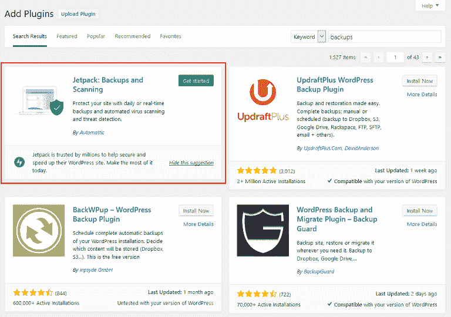
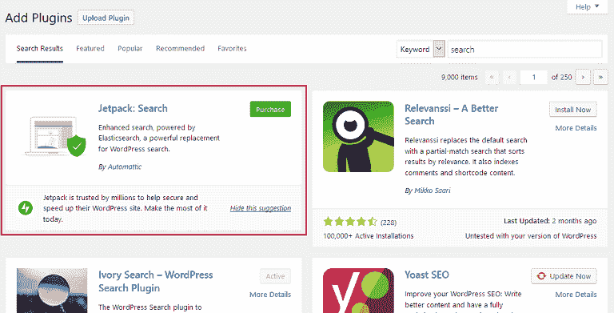
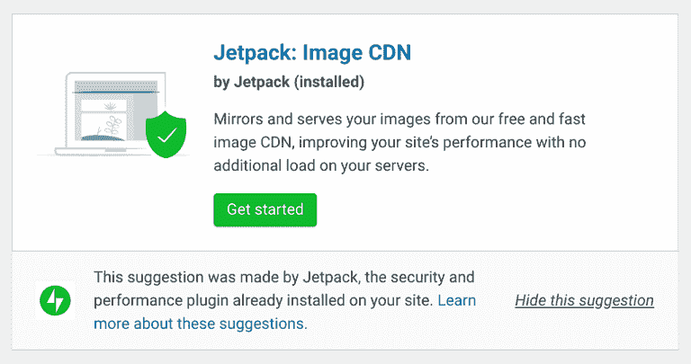

# Jetpack 的功能建议劫持了 WordPress 的所有内容

> 原文：<https://dev.to/bitofwp/jetpack-s-feature-suggestions-are-hijacking-what-wordpress-is-all-about-p3d>

Jetpack 7.1 发布于一个多月前。虽然人们在谈到新功能、安全修复等时讨论插件更新并不罕见，但*尤其是在 Jetpack* 这样一个广泛使用的插件上，这次发布激起了一些热烈的辩论。

这次发布自豪地为 WordPress 的新编辑器提供了六个新的模块:广告、营业时间、联系信息、MailChimp、幻灯片和视频。

但是许多人*没有意识到*的是，这个版本也在 WordPress 插件搜索屏幕中实现了功能建议，每当用户搜索已经在 Jetpack 中找到的类似功能时。你可以通过在插件搜索栏中搜索“社交分享”或“备份”来测试这一点。

请注意，Jetpack 的现有功能占据了第一名的位置，将所有其他建议都推下了一个档次。

虽然 Jetpack 声称他们的意图是让当前的 Jetpack 用户知道没有被使用的功能，这样他们就不会下载不必要的插件(毕竟有 45 个模块,),但是 WordPress 社区中的许多人都在叫嚣犯规。

## Jetpack 的功能建议的问题

距离 Jetpack 首次发布已经过去了八年。插件中有 45 个不同的模块，可以说大多数人并没有利用每一个可用的模块。事实上，大多数人可能甚至不知道所有存在的 Jetpack 模块，特别是因为 Jetpack 是如此普遍地预装在 WordPress 网站的主机上。

*问题就在这里*。

当谈到像 Jetpack 这样的预装软件被添加到他们的网站时，使用自托管 WordPress 网站的人并不总是有发言权。然而这种情况一直都在发生。

虽然可以选择卸载像 Jetpack 这样的插件，但我们都知道这并不总是会发生，尤其是如果一个网站所有者是 WordPress 的新手。

在默认的搜索屏幕中添加人工的功能建议会使预装插件(如 Jetpack)更进一步，误导用户，并使插件开发者面临更大的挑战:

*   用户通常认为排名第一的搜索结果是更好的选择
*   对于一些网站所有者来说，第三方插件可能是一个更好的解决方案，但是被 Jetpack 的建议所取代
*   UI 未能通知用户这些建议不是插件目录算法的一部分
*   “驳回”建议的能力是存在的，尽管设计并不清楚这不是一个实际的插件解决方案

换句话说，那些寻找插件解决方案的人会认为使用 Jetpack *永远是最好的选择*，第三方插件开发者会发现更难与这些人工结果竞争。

### 开创先例

仅仅考虑 Jetpack 是否违反了任何规则，误导了用户，或者给插件开发者增加了困难，这是不够的。当这样的事情发生时，你必须超越当前的情况进行思考。

例如，如果每一个附带一套功能的插件都开始劫持插件搜索屏幕并给出建议，那该怎么办？

执行搜索的网站所有者可能会在看到任何真实结果之前看到多个人工结果。如果网站所有者的行为与那些运行简单谷歌搜索的人的行为有任何相似之处，他们不太可能滚动很远来找到他们“认为”是合适的解决方案。

这使得与插件套件竞争几乎是不可能的，为未来的插件发布树立了一个可怕的先例，并且对 WordPress 用户是一种伤害。

更糟糕的是，劫持插件搜索屏幕会给以下情况留下空间:

*   错误地改变了 WordPress 管理界面(*因为当他们接管 JavaScript* 时，不是每个人都知道他们在做什么)
*   隐藏相互竞争的插件解决方案，让用户只看到开发者希望他们看到的那些
*   挑选谁能和谁不能实施这种做法(*换句话说，管理机构可以决定谁“违反了规则”，谁没有，这很不公平*

## 但是 Jetpack 是不是违规了？

还记得在古腾堡正式发布之前，人们对它的大惊小怪以及它看起来是如何终结生命的吗？嗯，有些人可能仍然讨厌它，但最重要的人正在调整，就像他们经常做的重大改变一样。事情是这样的，当古腾堡被释放的时候，没有违反规则。这只是对过去生活方式的重大改变——有些人不喜欢改变。

然而，当谈到 Jetpack 的功能建议时，有很多关于是否有任何官方指导方针被打破的谈论。毕竟，Jetpack ( *和他们的支持者*)大声宣称他们不是:

*   宣传任何东西
*   通过推荐其他插件误导网站所有者
*   建议高级升级
*   使得不可能拒绝建议

但是这就是全部的真相吗？

当你搜索“备份”这个词时，首先出现的是“Jetpack:备份和扫描”。你瞧，这是 Jetpack 提供的**高级功能，很容易被理解为宣传高级升级。由于它在搜索结果中排名第一，这微妙地暗示了 Jetpack 的备份解决方案是市场上的最佳选择。**

用“搜索”这个词再试一次，看看第一次会出现什么。是的，你猜对了，Jetpack: Search，还有一个号召行动的按钮**鼓励人们升级**，这明显违反了“禁止广告”的原则。

允许 Jetpack 推广他们的优质产品，而其他插件解决方案遵循这些指导方针，这给了他们一个机会来滥用他们作为一体化插件解决方案的地位，并获得不公平的优势。这也可能鼓励其他单一功能插件开始组合成插件套件来做同样的事情，这可能会很快变得混乱。

### Jetpack 用另一个更新(种)回溯

[Jetpack 7.2](https://jetpack.com/2019/04/04/jetpack-7-2-1-maintenance-release/) 于 2019 年 4 月 4 日发布，删除了之前建议高级升级的所有功能建议。

值得注意的是，尽管 Jetpack 删除了明显是高级插件升级的广告，WordPress 社区中的一些人仍然感到不安。

“我们犯了一个错误，我们正在立即纠正它，”Jetpack 团队代表杰西·弗里德曼说。“我们提供这些功能提示的目的是帮助您在最需要的时候发现您已经拥有的有用的 Jetpack 功能。今天，我们正在纠正一个判断错误，该错误导致提示 Jetpack 功能实际上需要升级。”

虽然 Jetpack 声称插入高级升级建议是一个“错误”，但他们承认这也是“判断失误”，这似乎是一个适得其反的有意识的决定。

Jetpack 的团队也重新设计了功能建议，试图更清楚地表明这些是建议，而不是插件搜索算法的一部分。

如果用户禁用两个以上的提示，那么在执行搜索时，Jetpack 将不再给出建议。

想要完全关闭特性建议的开发人员可以使用下面的代码:

`/**

*   移除 Jetpack 的功能提示。*
*   @见[https://jetpack.com/?p=59210](https://jetpack.com/?p=59210)*
*   [@param](https://dev.to/param) array $tools 要包含的额外工具数组。*/function jetpackcom _ remove _ search _ hints($tools){ unset($ tools[array _ search(' plugin-search . PHP '，$ tools，true)])；return $ tools} add _ filter(' jetpack _ tools _ to _ include '，' jetpackcom _ remove _ search _ hints ')；`

## 需要新指导方针的问题…或者[治理](https://wpgovernance.com/)

最终，网站所有者很可能会寻找 Jetpack 功能的替代品。通过允许 Jetpack 篡夺搜索结果，“不”宣传他们的优质功能，并决定另一个插件开发者是否可以做同样的事情，我们使人们更难找到替代品。

如果你问我们，改变指导方针或管理他们的人是直接的命令。

但最糟糕的是，它积极地分裂了本应是一个强大的社区的人们，致力于帮助用户建立网站，在需要时找到帮助，并取得成功。

*精选图片来源于 Unsplash 上 Ed 259 的照片*

帖子 [Jetpack 的功能建议是劫持 WordPress 是关于什么的](https://bitofwp.com/blog/jetpack-feature-suggestions-hijacking-debate/)首先出现在由 BitofWP 提供的 [WordPress 支持服务上。](https://bitofwp.com)