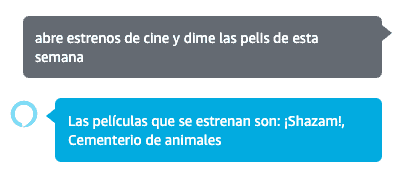
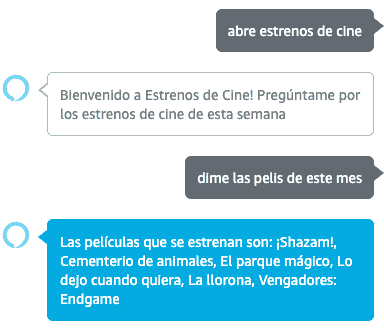
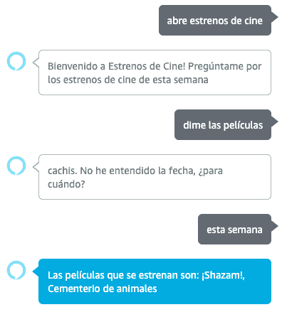

# Alexa 中的对话管理:简介和参考

> [https://dev . to/kini/dialog-management-en-Alexa-introduction-y-references-21-4](https://dev.to/kini/dialog-management-en-alexa-introduccion-y-referencias-21a4)

到目前为止，他已经算出了创造一种非常基本的技能并能够发表这种技能所需的步骤。这些步骤是我为了出版《T0》【电影明星】而采取的。这种技能是基于非常简单的用户交互，根据请求从后台作出响应。这是 Alexa 谈话的开始和结束，技能和用户之间没有轮流对话。

通过深入了解 Alexa 的功能，我发现了一些可以提高我技能的东西，例如配置强制插槽。在这种具体情况下，我们正在为 Alexa 可能进行的讨论打开大门，我们将委托 Alexa 来处理用户要求的某些方面。这就是所谓的对话管理，它使我们能够轮流创造对话技巧。

## 是轮值谈话技巧吗？

在电影明星的技巧中，我们用非常简单的用户交互来报道一个场景:

有了上述的说法，正在发生的是:

*   Alexa 通过调用名称*电影明星*获得技能
*   由于用户请求是一次性调用，因此在激发技能的同时也激发了一个动作请求，Alexa 创建了一个针对该特定意图的请求，并返回
*   在 aws lambda 中，back 在相应的处理程序中收集该请求，获取插槽值，本周，按日期筛选电影，并根据结果返回响应

和结束处决。用户和 Alexa 之间没有对话。

事实上，可以通过两个步骤以另一种方式调用:

按步骤:

*   Alexa 通过调用名称*电影明星*获得技能
*   作为无关联操作的请求，只需唤醒技能，然后将启动请求发送回
*   Alexa 响应欢迎语，等待下一次用户交互
*   用户执行特定操作
*   back，在 aws lambda 中，在相应的处理程序中收集请求，插槽值，本周，按日期筛选电影，并根据结果返回响应

在这种情况下，用户有两个请求，可以说与 Alexa 有一定的对话，但这实际上不是所谓的轮流对话的一部分。

现在，让我们想象一下以下情形:

为了避免重复所有的步骤说明(大部分都是相同的)，我们将重点讨论当用户不告诉 Alexa“用户想知道什么时候”时会发生什么情况。开始一个对话以收集这些信息，Alexa 将继续询问您是否理解答案，直到您认为您掌握了所有信息以完成对话并放弃回复。

有了这种技能，很简单，但让我们想象一下一种计划行程的技能，它需要收集来源、目的地、时间表、交通工具等信息。或一种在家点菜的技巧，带有烹饪类型、餐厅选择、送货地址等。

对于这种谈话技巧 Alexa 为我们提供了对话管理。

## 对话框管理

Dialog Management(对话管理)是 Alexa 技能套件附带的一组功能，用于进行轮调技能管理。

举几个例子:

*   强制插槽管理
*   确认插槽或尝试值
*   验证插槽值
*   处理两次尝试之间的对话流

随着对话管理功能的不断增加，通过简化开发和提高可用性，可以更轻松地管理与此类技能相关的案例。

### 递归

我打算在不同的帖子中讲述对话管理为我们提供的内容，包括具体的使用实例、代码等。但是，除此之外，还有许多良好的官方文件必须是主要的参考点。

我把迄今为止最有趣的链接放在这里:

*   在 Alexa 的网站上登陆 sobre 对话管理器
*   亚马逊官方指南:[对话设计](https://developer.amazon.com/ask-resources/guided/conversational-design-workshop/#/)
*   关于对话管理的官方指南
*   在 Alexa 的博客中，您可以通过过滤“对话管理”标签来查看所有相关文章

从以上四个参考资料开始，您将发现更多有关特定示例、对话模型信息(对话模型交互组件的一部分)、转换会话技能的后端代码示例等的链接。

**额外球:**如果你在我发表专题帖子之前看到资源，你会发现有些东西“过时了”。以此指存在着[对话自动委托给 Alexa](https://developer.amazon.com/docs/custom-skills/delegate-dialog-to-alexa.html#automatically-delegate-simple-dialogs-to-alexa) 。这是一个相对较新的东西，它有助于解决我先前为你们提供的资源所涉及的一些问题。在我未来的职位上，我会考虑到这一点。

* * *

我现在正致力于实施电影明星技能对话功能，并创建其他技能，使我能够深入了解其他功能。我会在博客上分享一切:)