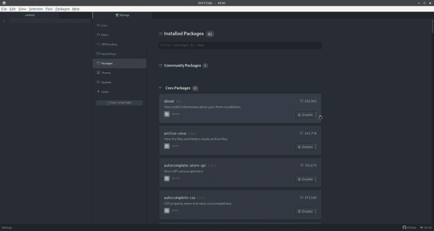
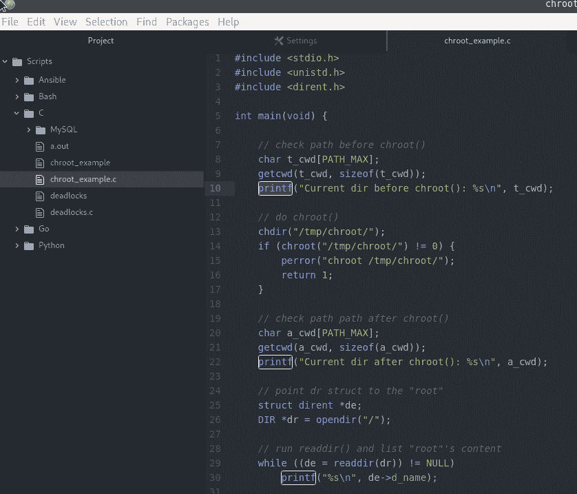
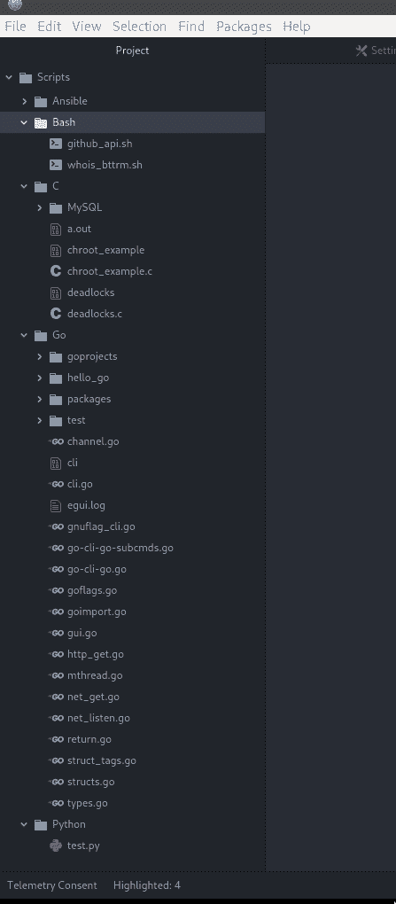
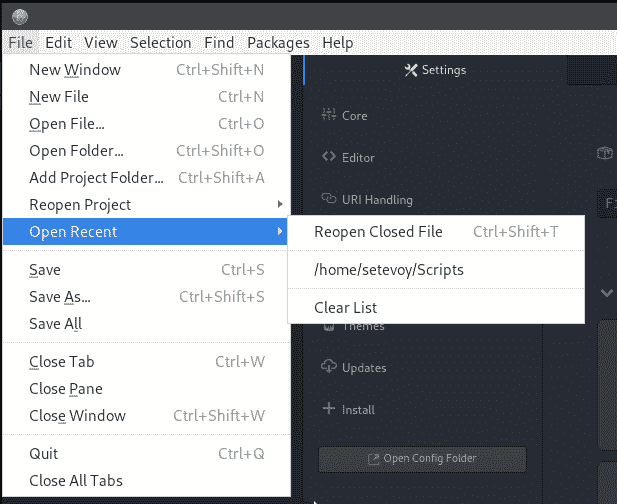
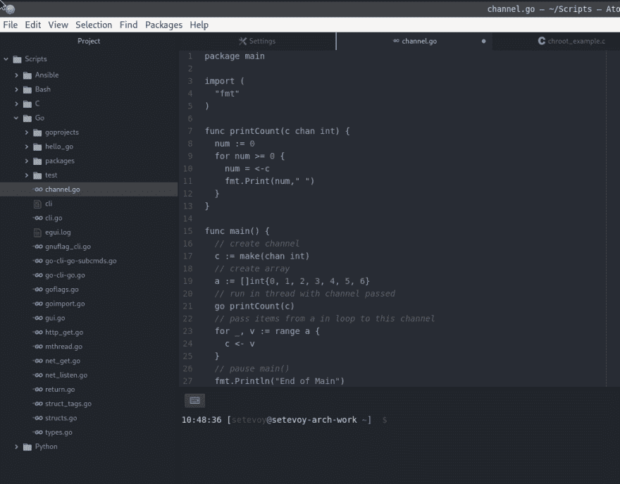
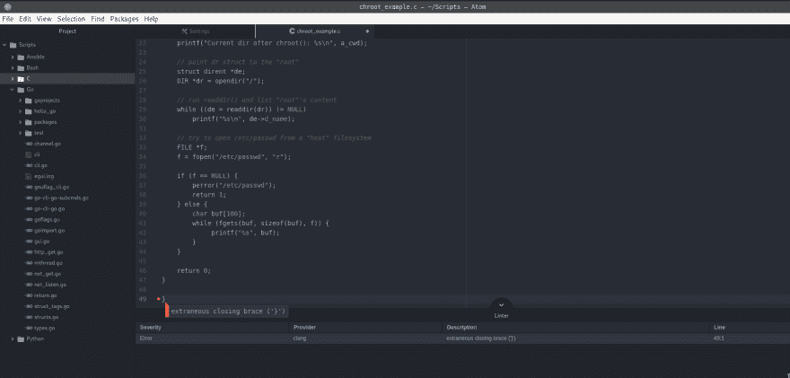
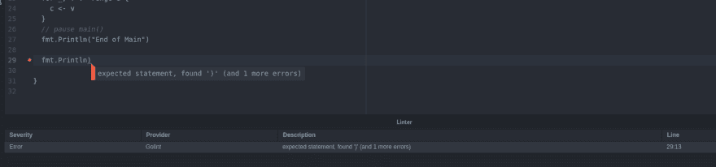
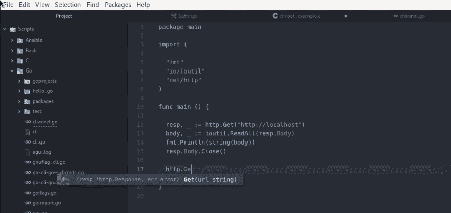
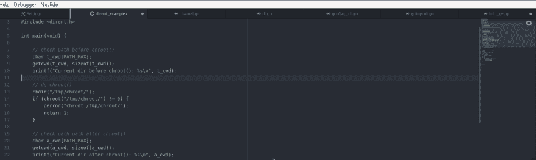

# Atom:有用的插件

> 原文：<https://dev.to/setevoy/atom-useful-plugins-179b>

[](https://res.cloudinary.com/practicaldev/image/fetch/s---bdxDrRI--/c_limit%2Cf_auto%2Cfl_progressive%2Cq_auto%2Cw_880/https://rtfm.co.ua/wp-content/uploads/2019/04/atom-4-logo-png-transparent.png) 通常，除了大的 Python 项目(上次很少发生)，我几乎在任何事情上都使用`vim`。在这种情况下，我有 PyCharm，它也用于带有 [`aws-cloudformation`](https://plugins.jetbrains.com/plugin/7371-aws-cloudformation) 插件的 AWS CloudFormation 模板。

对于 Go lang 程序，我使用了`vim`和 [`vim-go`](https://rtfm.co.ua/vim-prevrashhaem-redaktor-v-ide-plaginy-i-vot-eto-vot-vsyo/#vim-go) 插件，但上周末我尝试了 Atom 编辑器，看起来非常好。

所以在这篇文章中——一些有用的 Atom 插件让工作变得更容易。

这个列表并不完整，所以请随时在评论中建议其他插件。

### 安装原子

通常在 Linux 上——非常简单。

可使用`pacman` :
安装上拱

```
$ sudo pacman -S atom 
```

### 插件

你可以从*编辑>首选项>包*安装一个带有 Atom UI 的插件，或者从控制台使用`atm install`命令:

[](https://rtfm.co.ua/wp-content/uploads/2019/04/Screenshot_20190408_103708.png)T3】

```
$ apm install --help

Usage: apm install [<package_name>...]

apm install <package_name>@<package_version>

apm install <git_remote>

... 
```

#### [`highlight-selected`T4】](https://atom.io/packages/highlight-selected)

将在整个代码中突出显示所选的变量或函数名。

安装:

```
$ apm install highlight-selected
Installing highlight-selected to /home/setevoy/.atom/packages ✓ 
```

重启 Atom 并检查:

[](https://rtfm.co.ua/wp-content/uploads/2019/04/Screenshot_20190408_104128.png)

#### [`file-icons`T4】](https://atom.io/packages/file-icons)

将根据语言在每个文件附近添加一个图标。

安装:

```
$ apm install file-icons
Installing file-icons to /home/setevoy/.atom/packages ✓ 
```

[](https://rtfm.co.ua/wp-content/uploads/2019/04/Screenshot_20190408_104258.png)

#### [`open-recent`T4】](https://atom.io/packages/open-recent)

开箱即用的 Atom 只能打开最近的项目。

`open-recent`增加了打开最近目录/文件的功能:

```
$ apm install open-recent
Installing open-recent to /home/setevoy/.atom/packages ✓ 
```

[](https://rtfm.co.ua/wp-content/uploads/2019/04/Screenshot_20190408_104533.png)

#### [`platformio-ide-terminal`T4】](https://atom.io/packages/platformio-ide-terminal)

将控制台直接添加到编辑器:

```
$ apm install platformio-ide-terminal
Installing platformio-ide-terminal to /home/setevoy/.atom/packages ✓ 
```

[](https://rtfm.co.ua/wp-content/uploads/2019/04/Screenshot_20190408_104848.png)

#### [`linter`T4】](https://atom.io/packages/linter)

嗯……一根棉绒！

将检查您的代码并显示警告:

```
$ apm install linter
Installing linter to /home/setevoy/.atom/packages ✓ 
```

及其依赖关系:

```
$ apm install linter-ui-default intentions busy-signal
Installing linter-ui-default to /home/setevoy/.atom/packages ✓
Installing intentions to /home/setevoy/.atom/packages ✓
Installing busy-signal to /home/setevoy/.atom/packages ✓ 
```

然后为每种语言添加它自己的 linter。

对于 C/с++等，可以使用`linter-clang`:

```
$ apm install linter-clang
Installing linter-clang to /home/setevoy/.atom/packages ✓ 
```

检查:

[](https://rtfm.co.ua/wp-content/uploads/2019/04/Screenshot_20190408_110014.png)

为去郎——`linter-golinter`:

[](https://rtfm.co.ua/wp-content/uploads/2019/04/Screenshot_20190408_110214.png)

#### [`go-plus`T4】](https://atom.io/packages/go-plus)

添加文档，使用`gocode`等更精确的自动完成:

```
$ apm install go-plus
Installing go-plus to /home/setevoy/.atom/packages ✓ 
```

可选依赖项:

```
$ apm install go-debug go-signature-statusbar atom-ide-ui
Installing go-debug to /home/setevoy/.atom/packages ✓
Installing go-signature-statusbar to /home/setevoy/.atom/packages ✓
Installing atom-ide-ui to /home/setevoy/.atom/packages ✓ 
```

还有一个例子:

[](https://rtfm.co.ua/wp-content/uploads/2019/04/Screenshot_20190408_110833.png)

#### [`minimap`T4】](https://atom.io/packages/minimap)

显示当前打开文件的“地图”:

```
$ apm install Minimap
Installing Minimap to /home/setevoy/.atom/packages ✓ 
```

[](https://rtfm.co.ua/wp-content/uploads/2019/04/Screenshot_20190408_111353.png)

总的来说——目前就这些。