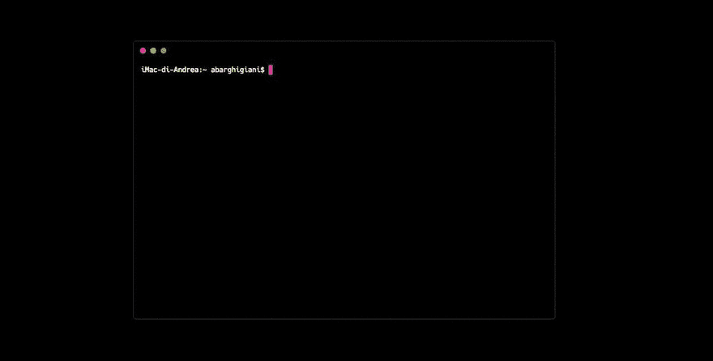
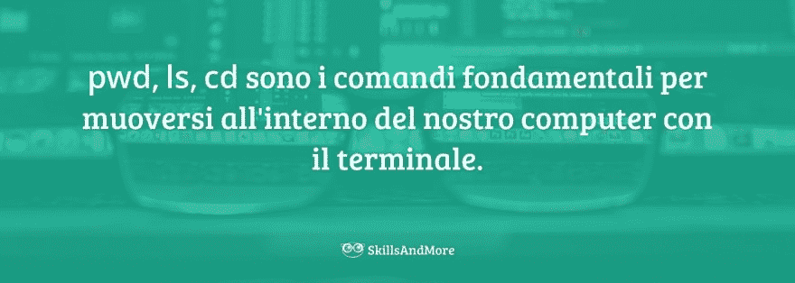
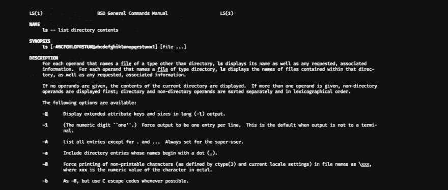
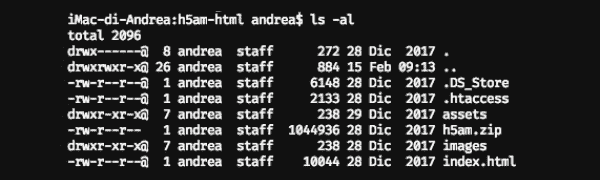

# 在我想要的终端

> [https://dev . to/andreabargaini/l-终端简介-我希望-50f7](https://dev.to/andreabarghigiani/l-introduzione-al-terminale-che-avrei-desiderato-50f7)

[](https://skillsandmore.org/introduzione-terminale/)

能够使用终端**对于任何想要加深知识、加快工作速度的 web 开发人员来说都是必不可少的。**

我相信你是一个很好的开发人员，而且多年来你一直在顺利地创建你的 web 应用程序，但你可能从来没有听说过终端。

在本文中，我的任务将是引导您了解这款功能强大的工具，并帮助您在其中迈出第一步，从而帮助您**加快工作速度，使用市场上功能最强大的工具**。

难道我忘了说我们说的是可以安装在任何操作系统上的‘t1’免费工具吗？！？

好的。我想我刚刚纠正了我的疑虑。

现在是提问的时候了：

## 什么是终端？

要做出响应，您必须返回到连接到屏幕的计算机的早期版本。

我们将忽略与本主题无关的可编程穿孔卡计算机。

当时能够运行像现在这样的图形界面是“T0”太贵了(就资源而言)，还没有人想到要创建一个能够重叠窗口、设置背景图像、双击打开应用程序的*桌面环境。*

不需要任何桌面！

除了资源消耗之外，当时的并没有想到要更好地使用电脑就需要与终端不同的东西。

虽然远不如口袋里的智能手机强大，但当时的电脑能够完成我们认为常见的任务。

他们只是不需要图形用户界面(或 GUI)。

诸如收发电子邮件、编写代码或发送打印文件等任务全部由终端完成。

[](https://res.cloudinary.com/practicaldev/image/fetch/s--mrxFTUPK--/c_limit%2Cf_auto%2Cfl_progressive%2Cq_auto%2Cw_880/https://skillsandmore.org/wp-content/uploads/2019/02/operazioni-terminale.jpg)

尽管成功地将电脑贴近任何人的 GUI，**终端始终安装在我们的操作系统**上，我们可以随时使用。

我认为有几个重要的原因促使我写这篇文章并向你推荐这个强大的工具:

*   通过终端可以做的事情比使用 GUI 多得多–想将本地站点与在线站点同步吗？你想为你的申请安装‘T2’NPM 包？您是否需要使用 Gulp 执行特定的工作流？你可以从终点站做所有这些和更多的事情！在某些情况下，有一些 GUI 可以帮助您完成任务，但没有一个 GUI 可以通过从终端运行命令来提供所有可用的功能。
*   **【终端使最重复的任务实现自动化】**我确信作为开发人员，你也总是在寻找能够帮助你工作的自动化。他学习如何正确地使用终端也会在这方面帮助你！

任何人都可以找到能验证我的论文的其他理由，但我更喜欢**直接切换到**，并告诉你一些最有趣的命令。

学习使用终端有它的学习曲线，我不会隐藏它，但如果你能编程**大部分的努力都已经做到**，你可以从这个工具中获得的好处将有助于你更好地了解你的电脑和托管你网站的在线服务器是如何工作的。

注意:终端类型有多种

我们谈论的是几十年前发明的工具，寻找不同版本和方法是很正常的。我打开这个括号告诉你，**如果有不同的办法，你就不用担心**。

对于我们 web 开发人员来说，终端版本中的这种多样性并不重要，因为基本上它们都了解我们可以在 Bash 终端混沌中使用的语法(最普遍)。

[](https://skillsandmore.org/diventa-uno-skillato/)

## 首个终端命令

如同许多情况一样，我们在任何领域迈出的第一步都可能(有时)枯燥乏味或重复。

从现在起我给你的建议是不要放弃希望，因为这些是**你最常使用的基本命令**，我建议你好好学习。

掌握这些概念还将使您能够了解终端背后的逻辑，通过这些概念，您将能够通过轻松发现其细节来学习如何自然地使用最高级的命令。

第一步是**【不要害怕终端】**，因为即使这个工具没有提供我们已经习惯的所有菜单和图表。

如果我们学会说话就变成真正的*小狗*。

[](https://res.cloudinary.com/practicaldev/image/fetch/s--nI5AqE0N--/c_limit%2Cf_auto%2Cfl_progressive%2Cq_66%2Cw_880/https://skillsandmore.org/wp-content/uploads/2018/12/terminal-basic.gif)

乍一看，它可能看起来像一个非常*的工具。通常，其默认设置会导致背景颜色非常暗(或浅色)，其具有奇怪的字符串，乍一看这些字符串没有任何意义。*

 *上面我试着介绍一下终端提供的主要信息:

*   `iMac-di-Andrea` **我们正在工作的电脑的名称**——这非常有用，因为有了终端，我们可以轻松地在线连接和管理我们的服务器，
*   `~` **我们正在处理的资料夹–**终端机无法显示包含资料夹中档案的视窗，因此快速知道我们在哪里很有用(撷取画面中有字元`~`【波状符号】T5
*   `abarghigiani` **取得的名称─**终端是一种主要在 UNIX 系统上诞生的工具，在最著名的系统中具有操作系统的多用户性。了解*有助于我们执行正确的命令，*
**   `$` **【取得的使用者角色】**虽然这并不是正确的定义，但终端上出现的符号有助于我们了解您取得的使用电脑的权限。`$`(美元)表示普通用户；`#`表示管理员可以做任何事情。*

 *现在您已经了解了终端提供的信息，现在是时候了解一下您可以使用的第一批命令了。

### 在文件和文件夹之间移动

在您可以学习到的最有用的命令中，我们一定会放一些帮助我们了解我们所处位置并帮助我们移动操作系统的命令。

[终端使我们能够轻松地在我们的操作系统中移动，无论是在我们开发的计算机上，还是在运行我们的 web 应用程序的在线服务器上。](https://twitter.com/share?text=Il+%23terminale+ci+consente+di+muoverci+facilmente+all%27interno+del+nostro+sistema+operativo%2C+sia+questo+il+computer+nel+quale+stiamo+sviluppando+o+un+server+online+che+esegue+la+nostra+applicazione+web.&via=skillandmore&url=https://skillsandmore.org/introduzione-terminale/?utm_source=twitter&utm_medium=Social&utm_campaign=SocialWarfare)

这是因为，刚打开的终端“T0”会从使用此应用程序的 home 文件夹“”中查找，但我们并不总是在其中保存我们正在处理的文件。

要使最有用和最有趣，请查找最有趣的命令列表，然后查找一个小段落，其中描述了如何将这些命令一起使用。

准备好做这个实验了吗？

太好了。

让我们从我们将用于此示例的命令列表开始:

*   `pwd` *(打印工作目录)*–终端可以让我们知道我们正在处理的文件夹的名称，但可能会有多个同名文件夹。下面是命令`pwd`可以通过显示唯一标识您的文件的路径来帮助我们。
*   `ls` *(清单目录内容)*—如果不知道包含哪些文件和文件夹，知道我们在哪里是不够的。下面是命令`ls`通过列出包含我们所在文件夹的所有文件和文件夹(包括隐藏的文件和文件夹)来帮助我们。
*   `cd` *(更改目录)*—我们的整个文件系统都是按文件夹组织的，这就是为什么这是最基本的命令之一。键入`cd <nome-cartella>`你就可以进入文件夹，做你想做的事。

上述**并不是终端提供给我们的指令的完整清单**，但肯定是那些能让我们前进的第一步，回答基本问题，例如:

*我在哪里？*

*我有哪些文件？*

*我如何从一个文件夹移到另一个文件夹？*

[](https://res.cloudinary.com/practicaldev/image/fetch/s--4xl_HbO---/c_limit%2Cf_auto%2Cfl_progressive%2Cq_auto%2Cw_880/https://skillsandmore.org/wp-content/uploads/2019/02/comandi-fondamentali-terminale.jpg)

在本文的结尾，我会列举一些其他非常有用的命令，但现在是时候采取实际行动了。

### 案例对终端主指令

下面是一个小例子，它旨在向您介绍一个真实的案例，在这个案例中，终端比任何其他 GUI 应用程序都更适合您使用。

在此示例中，我正在为此门户创建新主题。

工作几个小时后我回到我的终端，看到它们在`skillsandmore`文件夹中。问题是，我的系统上有几个同名的文件夹，我是在保存项目文档的文件夹中还是在 WordPress 中？

为了知道这一点，我所要做的就是输入`pwd`。

终端响应如下路径:`/Users/abarghigiani/Coding/skillsandmore`。由于`Coding/`文件夹是我用于网站开发的文件夹；此时**我知道如何从包含 WordPress** 的文件夹中查找我。

知道我在哪里有用，但我必须继续发展我的主题，名为`sam-2019/`。

如果我不知道 WordPress 的结构，我应该多次发出`ls`指令，找出存在哪些档案与资料夹，然后使用`cd`指令在其中移动。

幸运的是，我很熟悉此结构，WordPress 安装彼此非常相似(除非进行修改)，所以此时我知道包含主题的文件夹位于文件夹“`wp-content/`”内。

我现在要做的就是使用`sam-2019`命令，从我的位置给他相对路径打开`sam-2019`文件夹。

```
$ cd wp-content/themes/sam-2019 
```

Enter fullscreen mode Exit fullscreen mode

我把`cd wp-content/themes/sam-2019`插入终端，游戏就完成了。

你的路线可能不同！

当然，以上(和后续)示例是指我的项目路径。您计算机上的路径可能不同。

如果我有疑问，一旦进入文件夹，我总能运行命令`pwd`，知道我所在位置的完整路径。

现在我有机会用一个简单的`ls`查看我的主题中的所有文件，但如何在其中工作呢？

我需要一个代码编辑器，最棒的是[【多亏了 atom】](https://skillsandmore.org/corso/padroneggia-il-potere-di-atom/)，我可以直接从终端打开这个文件夹，不用找鼠标就能马上开始工作。

我要做的就是键入`atom .`，我的代码编辑器将自动打开，其中包含我终端上的文件夹文件。

## 有用的特殊字符、选项和提示

希望实用能让你更好地了解终端的潜力，虽然目前看起来可能是一种不太直观的方法，但我还是邀请你继续阅读，因为**终端提供了巨大的**力量，能真正帮助你发展！

正如我在本文中多次告诉你的那样，**终端可以帮助我们自动化最重复的任务**，但首先我们需要了解一些使用它的基本概念。

[](https://res.cloudinary.com/practicaldev/image/fetch/s--5iRuSxkR--/c_limit%2Cf_auto%2Cfl_progressive%2Cq_auto%2Cw_880/https://skillsandmore.org/wp-content/uploads/2019/02/segreti-terminale.jpg)

您目前已经在您的终端机上执行了(如果您正在执行的话)所有我根据您的信任提出的指令，但是您知道终端机上有最好的文件，您可以使用这些指令吗？

功能强大的仪器和文献资料相同的仪器，这个终端还不错

您可以在使用“`man`”之前访问任何命令的文档。

例如，如果您在终端中输入`man ls`，然后按 enter 键，您将会看到:

[](https://res.cloudinary.com/practicaldev/image/fetch/s--W1CzbQ24--/c_limit%2Cf_auto%2Cfl_progressive%2Cq_auto%2Cw_880/https://skillsandmore.org/wp-content/uploads/2019/02/man-ls.png)

并不是你能找到的最漂亮的文件，但**是你快速澄清疑虑所需的全部。**。

在我们深入了解里面的信息之前，让我们马上澄清一下**如何退出**文档。

你要做的就是按键盘上的`q`键。

您将在其中找到的主要信息是命令的全名、用于自定义其行为的语法以及“”可使用的所有选项的完整列表。

### 命令的选项

选项可让您变更指令的标准结果。我提醒您，使用“`ls`”我们可以列出一个文件夹中的所有文件，但您注意到它只提供“**”一个名称列表“**”而不区分文件夹和文件吗？

此外，如果您要将这些文件组织成列以便于阅读，您应该做些什么？

这才是真正有趣的选择！

例如，如果在`ls`命令中添加`-al`，终端还会向我显示**隐藏文件以及应用于文件和文件夹的**权限。

[](https://res.cloudinary.com/practicaldev/image/fetch/s--cQEyIwkM--/c_limit%2Cf_auto%2Cfl_progressive%2Cq_auto%2Cw_880/https://skillsandmore.org/wp-content/uploads/2019/02/ls-al.png)

正如你现在看到的，我们有比经典的`ls`更多的信息。使用这些选项，我们可以轻松发现文件夹中隐藏的文件(以“`.`”开头的文件)，以及文件夹和简单文件(通过位于第一列中的“`d`”目录“”)。

还有很多其他有趣的选项，我邀请您通过使用“`man ls`”查阅命令文档来了解，因为现在我想向您介绍另一个重要的终端概念。

### 特殊字符

如果你仔细看看上面列出的项目清单，你会注意到前两个文件是`.`和`..`，但它们是什么？

这些是**使用终端遇到的前两个特殊字符**。点`.`是一条捷径，可让我们参考我们所在的资料夹(这就是`atom .`指令开启视窗的原因所在，其中包含我们的档案)。

字符，`..`这两点是一条捷径，使我们可以参考比我们正在参考的文件夹更高的文件夹。

这是一条不可思议的捷径，因为我可以用单一的`cd ..`移动，但这只是

`..`使我们可以轻松地浏览项目，因为它们可以链接在一起，一次浏览多个文件夹。

但这些并不是你能在终端中传递的唯一特殊字符。让我给你一个最常见的例子:

*   `~`—不管你在系统中所处的位置如何，这个字符总是指向**所实现的**。所以即使在终端上工作，也要回到家(或者只是参考我们构造路径)，也可以使用这个字符。
*   `#`—虽然在编写便于我们生活的脚本时(终端可以编程)使用这种字体最常用，但我们指定单行注释；如前所述，如果显示这种字体的是我们的终端，则表示我们正在使用它作为管理员。
*   `\`—反斜线用作转义字符，这样我们就可以构造复杂的字符串，或者只选择包含空格的文件名或文件夹。你按`TAB`键启动`Documents/File\ Name\ 1\ def.pdf`时经常能看到它在动作

还有很多其他有用的字符你可以用终端，但我写的很多，也许我把你的想法弄糊涂了。

让我们来做一件事，我现在要向大家展示一下**的一些实际用途，在这些用途中，终端机在速度方面胜于任何其他 GUI 工具**(而且在我看来也很容易使用)。

如果你喜欢并且想更好地了解如何最大限度地使用终端，或者[给我写邮件](https://skillsandmore.org/contatti/)，那么我就能清楚地了解这件事背后的利害关系。

## 了解终端有用的小例子

在这最后一节中，我想给大家看一些终端知识简化了我们作为开发者的生活的实际例子。

[](https://res.cloudinary.com/practicaldev/image/fetch/s--0hnuhNPq--/c_limit%2Cf_auto%2Cfl_progressive%2Cq_auto%2Cw_880/https://skillsandmore.org/wp-content/uploads/2019/02/esempi-terminale.jpg)

终端被证明是最好的工具的案例数以千计，在很多情况下是可以使用的工具。

### 创建 Bash 脚本

当然，这不是一个我们大家都感兴趣的话题，但我想先介绍一下，因为有机会编写脚本使我们的工作自动化可能非常方便。

[当我们必须在终端内重复操作时，创建 Bash 脚本会无限地帮助我们。](https://twitter.com/share?text=Creare+degli+script+%23bash+ci+aiuta+infinitamente+quando+dobbiamo+compiere+azioni+ripetitive+all%27interno+del+%23terminale.&via=skillandmore&url=https://skillsandmore.org/introduzione-terminale/?utm_source=twitter&utm_medium=Social&utm_campaign=SocialWarfare)

我相信你知道在本地安装 WordPress 有很多解决方案。

使用 [MAMP](https://skillsandmore.org/mamp-apache-ambiente-sviluppo/) 的人，其他地方则由飞轮驱动，而其他人(如订阅者和 Eugenio)则更喜欢依靠[配置良好的坞站机](https://skillsandmore.org/docker-sviluppo-wordpress/)。

现在，配置多个坞站容器使 WordPress 正常工作，对于不熟悉 web 服务器管理的订阅者来说是一项艰巨的任务，但对于其他用户来说，这是一个幼稚的游戏。

了解服务器和终端使您能够创建一个简单的 Bash 脚本，该脚本还会引导一个*傻瓜坞站*作为预订者，以安装完全正常工作的 WordPress(包括使用诸如 [WordMove](https://dev.to/andreabarghigiani/wordmove-una-gemma-per-il-deploy-wordpress-1lbg-temp-slug-9215735) 等有用工具)。

### 启动 CSS 预处理程序

在“sass 预处理程序(我现在重新发布)课程中，我向您介绍了[prep](https://prepros.io/)，它通过将文件`.scss`编译为经典的`.css`样式表而帮助您进行开发，这是完全可以理解的

当我们进入新的工作流时，使用 GUI 无疑是一个方便的方面，但这些解决方案通常是**性能低下，且配置不良**。

通过控制终端，您可以访问名为“*task automation*”的工具，该工具是在对项目中的文件进行某些更改后运行的规则。

Gulp 是最著名的运行者之一，您可以配置您的开发环境，使其在每次更改或单独启动时执行以下任务:

*   **【影像最佳化】**您可以让影像最佳化，让它们的重量更轻，品质不会降低。
*   **浏览器 live reload–**开发时无比方便！几乎每次更改内容时，浏览器都会自动重新加载，显示您所做的更改！
*   **在 CSS 中编译石头─***也许对任务管理器最重要的事情就是每次将更改保存到构成项目的`.scss`文件中时自动生成文件`.css`。*

 *这些只是通过 Gulp 可以自动启动的部分任务，最美妙的是它的易用性。

开始工作之前，只需从包含项目和游戏的文件夹中写下`gulp`(或`gulp <nome-task>`)∞就可以了！

当然，本节只是一个示例，并未对此解决方案进行实际解释。

[](https://skillsandmore.org/corso-sass)

如果您想知道如何配置您的开发环境以利用 Gulp 评论这篇文章或订阅我们的时事通讯，无论哪种情况，我都会联系您，让您知道我何时将发表关于这一强大任务执行者的文章！

### 连接到远程服务器

终端本身最好的另一个方面是正确的，我们需要连接到远程服务器，并且需要执行一些操作。

我相信您非常清楚，许多主机都为自己的服务器提供了管理面板，Plesk 和 cpanel 是最常见的，这些面板可以帮助您完成许多任务:

*   编辑正在运行的 PHP 版本
*   浏览保存在我们空间中的文件
*   设置和读取电子邮件框
*   …

事实上，这些面板为我们提供了用于执行几乎任何操作的界面，但是，正如我们在 GUI 中所说的那样，由于我们必须打开浏览器并指向正确的位置，登录，进入我们的面板，因此我们通常会慢一些

使用终端**这一切不会发生，因为您只需使用`ssh`命令安全地连接到您的在线服务器，并使用命令将即时更改应用到您的服务器。** 

```
$ ssh <utente>@<server> -p<porta> 
```

Enter fullscreen mode Exit fullscreen mode

以下语法允许您连接到您的在线服务器，前提是您的主机允许您连接。

### 修改 WordPress 数据库

最后，我想提出一个非常有用的命令，您可以在您的本地开发环境和在线服务器上安装(事实上，许多主机，如“[site](https://skillsandmore.org/siteground)”预安装了此命令)。

我所指的工具是 WP CLI，它使我们能够完成 WordPress 让我们能够从其插接板完成的所有工作，而**更是如此！**

当我们在本地开发环境中工作时，我们将立即从 achille 的脚跟开始，该环境将在以后在线移动。

除非您使用虚拟主机技术，否则您在开发环境中使用的域将与您发布站点的域不同，并且由于 WordPress 将此信息保存在数据库**中，因此您需要替换这些引用**。

让我们举一个实际的例子，我使用 docker 来建立我的开发环境，以及用来建立这些环境的命令档来产生 URL `http://0.0.0.0:8080`，让我可以检视开发中的网站。

但是，我的客户希望将其站点发布到域“`https://pianteefiori.it`”并已为 HTTPS 连接安装了自己的安全证书。

*我如何解决这个问题？*

如此博客中多次建议的那样，我可以上载文件和数据库，然后输入此 PHP 脚本以使用 web GUI 修改域，但我们回到速度和即时性问题上…

这就是像`wp search-replace`这样的漂亮命令真正有用的地方！

将文件和数据库上载到联机服务器后，我只需通过 SSH 连接并发出以下命令:

当服务器完成此命令时，它将提供一个方便的表，告诉我字符串更改的数量和位置。

[](https://skillsandmore.org/diventa-uno-skillato/)

## 结论

我们到了这篇文章的结尾，一如既往，如果你到了这一点的话**【衷心感谢】**。我真希望你能更好地了解这一重要工具的力量。

使用终端是非常方便的，因为一旦你放下了使用它的恐惧，一切都成了小孩子的游戏！

我建议您订阅时事通讯，因为终端将来一定会再次被处理，以便更好地向您展示这种工具将如何有益于您的开发者生活。

如果您留下了一些好奇或疑虑，也可以使用下面的评论部分，我将非常乐意帮助您增进理解。*****