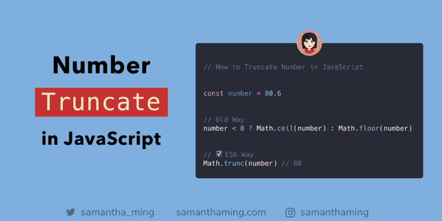

# JavaScript 中的数字截断

> 原文：<https://dev.to/samanthaming/number-truncation-in-javascript-1li>

[](https://res.cloudinary.com/practicaldev/image/fetch/s--qqB9hkW5--/c_limit%2Cf_auto%2Cfl_progressive%2Cq_auto%2Cw_880/https://thepracticaldev.s3.amazonaws.com/i/ysfyefk4v6gaygudtey2.png)

使用`Math.trunc()`截断一个浮点数并返回它的整数部分。这个函数不做任何舍入，它只是删除小数点后的所有数字。现在你有一个整数了，耶🎊

```
const number = 80.6

// Old Way
number < 0 ? Math.ceil(number) : Math.floor(number);
// 80

// ✅ES6 Way
const es6 = Math.trunc(number);
// 80 
```

### 举例

简单地截去它右边的点和数字。不管自变量是正数还是负数。

```
Math.trunc(80.9); // 80
Math.trunc(80.8); // 80
Math.trunc(80.8); // 80
Math.trunc(80.6); // 80
Math.trunc(80.5); // 80
Math.trunc(80.4); // 80
Math.trunc(80.3); // 80
Math.trunc(80.2); // 80
Math.trunc(80.1); // 80

Math.trunc(-80.1); // -80 
```

现在让我们看一些非数字参数的例子:

```
Math.trunc('80.1'); // 80
Math.trunc('hello'); // NaN
Math.trunc(NaN); // NaN
Math.trunc(undefined); // NaN
Math.trunc(); // NaN 
```

## 数字截断使用`parseInt`

使用`parseInt`
可以得到类似的结果

```
parseInt(80.1); // 80
parseInt(-80.1); // -80

parseInt('80.1'); // 80
parseInt('hello'); // NaN
parseInt(undefined); // NaN
parseInt(); // NaN 
```

### `Math.trunc()` vs `parseInt()`

`parseInt`主要用于字符串参数。所以如果你在处理数字，使用`Math.trunc()`会更好。

如果您感兴趣，我写了一篇比较这两个函数的性能测试。

[jsperf:math . trunc vs parse int](https://jsperf.com/math-trunc-vs-parseint)

### 抓到你了`parseInt`

使用`parseInt`时有一个潜在的问题。当您传入一个不是字符串的参数时，在我们的例子中是一个数字，它将首先使用`toString()`抽象操作把值转换成一个字符串。大多数时候，`parseInt`是好的。但是让我们看一个例子，它可能不是。

```
const number = 1000000000000000000000.5;

const result = parseInt(number);

console.log(result); // 1 <-- 😱 
```

☝️So 为什么会这样？？那是因为我们的论点不是一个`string`，所以`parseInt`做的第一件事是，它会把论点转换成一个`string`。

```
const number = 1000000000000000000000.5;

const result = number.toString(); 

console.log(result); // "1e+21" 
```

所以当它试图从`1e+21`获取整数时，它只知道获取`1`的值。所以，使用`parseInt`肯定有它的好处。由于这种边缘情况，您可能想考虑使用`Math`函数👍

## 浏览器支持

大多数现代浏览器都支持`Math.trunc()`。除了网络浏览器。我知道😞因此，如果您需要支持旧的浏览器，请使用旧的方式😕

[浏览器支持:Math.trunc](https://developer.mozilla.org/en-US/docs/Web/JavaScript/Reference/Global_Objects/Math/trunc#Browser_compatibility)

## 社区输入

### 按位运算符解法

**双位非`~~`**

```
console.log(~~80.6); // 80 
```

*感谢:[@ jorg ert 120](https://twitter.com/Jorgert1205/status/1114751512415285248)T3】*

**按位或`|`**

```
console.log(80.6 | 0); // 80 
```

*感谢:[@ MAC _ experts](https://twitter.com/mac_experts/status/1114922942591315968)T3】*

## 资源

[MDN Web Docs:math . trunc](https://developer.mozilla.org/en-US/docs/Web/JavaScript/Reference/Global_Objects/Math/trunc)
[MDN Web Docs:parseInt](https://developer.mozilla.org/en-US/docs/Web/JavaScript/Reference/Global_Objects/parseInt)
[MDN Web Docs:按位运算符](https://developer.mozilla.org/en-US/docs/Web/JavaScript/Reference/Operators/Bitwise_Operators)
[JS 提示:对字符串使用 parse int，而不是对数字使用 parse int](https://gideonpyzer.dev/blog/2017/06/06/js-tip-use-parseint-for-strings-not-for-numbers/)
[2 ality:parse int 并不总是能正确地转换成整数](http://2ality.com/2013/01/parseint.html)

* * *

**感谢阅读❤**
问好！[insta gram](https://www.instagram.com/samanthaming/)|[Twitter](https://twitter.com/samantha_ming)|[脸书](https://www.facebook.com/hisamanthaming) | [媒体](https://medium.com/@samanthaming) | [博客](https://www.samanthaming.com/blog)