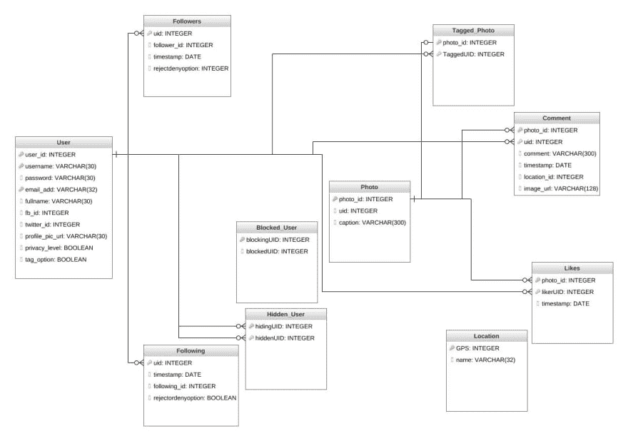

# 面向应用开发的数据库管理系统:关系模型和关系数据库

> 原文：<https://dev.to/leniquenoralez/dbms-for-application-development-relational-model-relational-database-3nl8>

在 [Unsplash](https://unsplash.com) 上由 [Carlos Muza](https://unsplash.com/@kmuza) 拍摄的照片

**数据模型**是一个抽象模型，用于组织你的应用程序数据，并描述你的数据如何与另一个数据以及真实世界的对象相关联。
数据模型有很多种，但最广泛使用的是关系模型，因为它简单。

关系模型在表中表示数据，并被分组到关系中。使用关系模型的数据库称为关系数据库。

关系数据库中的表被赋予一个惟一的名称，这个名称通常描述了表中将要存储的内容。

下图显示了使用关系模型来描述照片共享应用程序中的数据库结构和数据关系。此图显示了数据是如何相关联的，以及如何被划分到不同的表中。在关系数据库中，正确地对数据建模是非常强大的，因为它减少了数据被复制和冗余数据被检索的机会。

上图被称为模式图。模式图是数据库模式的可视化表示，它显示了数据库、表属性、主键和外键中的关系。

**模式**是数据库的逻辑设计，它包括表属性、属性类型以及主键和外键约束。

**主键**是一组一个或多个属性，其值用于唯一标识表中的行。例如，用户表中的*用户名*、*用户名*和*电子邮件*对于表中的每个用户记录都是唯一的，这三个字段用于唯一地标识一个用户。

**外键**是标识另一个表中记录的一组属性，引用表中的外键总是被引用表中的主键。上述数据模型中的外键将是 followers 表中的 *uid* ，它引用 user 表中的*用户*。

构建使用关系数据库的应用程序需要提前进行大量思考，以确保高效地检索数据。

#### 有用的资源

*   [关系模型【YouTube 视频】](https://www.youtube.com/watch?v=kyGVhx5LwXw)