# 实时 GraphQL API，可在任意云中轻松运行无服务器业务逻辑

> 原文：<https://dev.to/moksahero/graphql-api-37lk>

本文翻译了以下 Vladimir Novic 文章。

[](/vladimirnovick) [## 轻松的实时 GraphQL API，无服务器业务逻辑在任何云中运行

### 弗拉基米尔·诺维克 2 月 5 日 1912 分钟阅读

#graphql #serverless #architecture #cloudcomputing](/vladimirnovick/effortless-real-time-graphql-api-with-serverless-business-logic-running-in-anycloud-2j6b)

本文介绍了如何使用无服务器业务逻辑轻松地创建实时 GraphQL API，并将其部署到任何云中。 听起来像钓鱼报道吗？ 轻松是什么意思？ 并不是完全什么都不用做。 如果你熟悉 GraphQL，或者听说过它，并且怀疑怎么开始写 GraphQL 服务器，你可能会认为我们要做你自己的 GraphQL 服务器。 它还将处理云部署、无服务器功能。 听起来很复杂吧。

嗯，这里的关键词是“轻松”。 在现有 Postgres 或其扩展的基础上，在您选择的任何云中设置和运行自己的 GraphQL API 非常简单。 本文不会设置服务器，也不会谈论云的部署。 有一点点吗？ 本文介绍了 Hasura.io 开源引擎的大多数功能集以及如何在不创建自己的服务器的情况下实现实时 GraphQL API。 无论是现有服务器、非 Postgres 数据库还是无服务器功能，都可以使用该功能来提供详细的概述和用例。

## Contents

GraphQL 介绍

*   Hasura GraphQL 引擎说明，开源原因
*   让我们从 Heroku 开始
*   如何在其他云中使用？
*   在现有的 Postgres 上奔跑
*   关于 Postgres 扩展程序( PostGIS，TimescaleDB )
*   不使用 Postgres 时
*   Hasura 引擎控制台概述
*   数据建模、关系和访问控制
*   authentication
*   自定义外部 GraphQL 服务器，也称为远程架构
*   基于事件触发的异步无服务器业务逻辑

## GraphQL

GraphQL 不仅是流行语，而且是与逐渐替换 REST API 的服务器通信的广泛方法。 简而言之，GraphQL 是用于定义 API 和数据的特定类型系统的查询语言。 定义了数据的形状并定义了服务器检索此数据的方式后，客户端甚至可以使用特定的查询格式查询( query )、更改( mutation )或订阅数据更改。 你接收的数据会变成和你要求的完全相同的形式吧。 这篇博客文章不会详细说明什么是 GraphQL，但是如果是第一次使用 GraphQL 的话，我会做免费的 4 天 Bootcamp。
介绍如何在 React、Angular 或 Vue 中使用现有的 GraphQL API，还将学习如何在 NodeJS 中创建自己的 GraphQL API。

> 弗拉迪米尔·诺维克[@弗拉迪米尔诺维克](https://dev.to/vladimirnovick)再过一周我就要教免费的[# graph QL](https://twitter.com/hashtag/GraphQL)[# full stack](https://twitter.com/hashtag/Fullstack)4 天训练营了，所以如果你还没有报名的话，是时候了。您将学习如何在任何 [#Reactjs](https://twitter.com/hashtag/Reactjs) 、 [#Angular](https://twitter.com/hashtag/Angular) 或 [#VueJS](https://twitter.com/hashtag/VueJS) web 应用程序中使用现有的 [#GraphQL](https://twitter.com/hashtag/GraphQL) API，或者如何在[# NodeJS](https://twitter.com/hashtag/NodeJS)
> [tylermcginnis.com/free-graphql-b…](https://t.co/d3tiu97z6x)09:48AM-04 2019 年 2 月[中创建自己的 API](https://twitter.com/intent/tweet?in_reply_to=1092359190994173952)

正如你可以从本文的标题中想象到的那样，这里我将谈谈轻松的实时 GraphQL API。 好像很神奇呢。 但我确实在 hasura.io 开源 GraphQL 引擎中有这种感觉！ 我们从这里跳进来吧！

## 什么是 Hasura GrahphQL 引擎？ 开放源代码的理由

Hasura engine 提供了在 docker 容器中运行的引擎，以层的形式存在于新的或现有的 Postgres 数据库上。

不仅可以从一开始就很容易地创建 GraphQL API，而且可以让引擎在现有的 Postgres 数据库上运行。

因为它运行在 Docker 容器中，所以它基本上可以在 Heroku、Digital Ocean、AWS、Azure、Zeit、GCP 甚至本地环境中的任何位置运行。

Hasura 引擎附带了一个易于使用的 UI，您可以使用 GraphiQL 工具测试 query、mutation 和 subscription。
那么为什么它是开源的呢？ 那就是向[hasura.io](https://hasura.io/) 的共同创立者[Tanmai Gopal](https://twitter.com/tanmaigo) 提问的问题。

> 因为那是你堆栈的一部分。 而且在当今时代，开放源代码组件需要透明和灵活。 通过开放源代码促进社区迁移、安全性增强、扩展灵活性和社区参与。 社区使开放源代码产品能够在不同的环境中运行。 Hasura 是一个在我们社区的帮助下，在自己喜欢的环境中运行并为项目提供信息的多云和多平台。

## 从 Heroku 开始吧

访问 hasura.io 时出现的第一种方法是作为免费选项部署到 Heroku。

[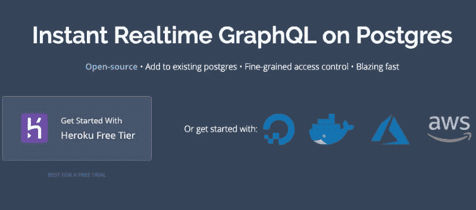](https://res.cloudinary.com/practicaldev/image/fetch/s--8jjaVHrv--/c_limit%2Cf_auto%2Cfl_progressive%2Cq_auto%2Cw_880/https://thepracticaldev.s3.amazonaws.com/i/j3upcmlyzvikbi7g4a3q.png)

虽然这是一种非常快速、非常稳健的安装方法，但对于产品级 APP 应用，您可能需要考虑使用其他云。 正如您所见，您可以从各种云选项中选择，但为了简单起见，我们从 Heroku 免费使用框架的首选项开始。

[](https://res.cloudinary.com/practicaldev/image/fetch/s--Qz1PTit6--/c_limit%2Cf_auto%2Cfl_progressive%2Cq_auto%2Cw_880/https://res.cloudinary.com/practicaldev/image/fetch/s--YeAAfhbB--/c_limit%252Cf_auto%252Cfl_progressive%252Cq_auto%252Cw_880/https://cdn-images-1.medium.com/max/800/1%252AXts79g-89CauVyOgvAvZ1Q.png)

单击部署到 Heroku 按钮可将 Hasura 引擎与 Heroku Postgres 附加模块一起部署到 Heroku 中。

### 这里发生了什么？

Heroku 具有可部署的模板概念。 因此，执行 Heroku 部署时发生的情况是单击了此链接。

[https://heroku.com/deploy？template = https://github . com/hasura/graph QL-engine-heroku](https://heroku.com/deploy?template=https://github.com/hasura/graphql-engine-heroku)

实际上，这里展开的模板如下。

[https://github . com/hasura/graph QL 引擎英雄库](https://github.com/hasura/graphql-engine-heroku)

## 更详细的说明

检查此模板的 app.json 文件(定义了 Heroku 设置的文件)。

[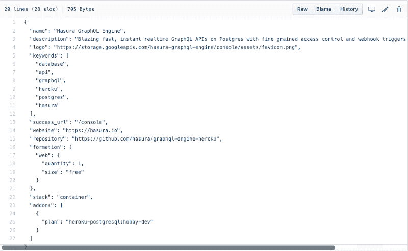](https://res.cloudinary.com/practicaldev/image/fetch/s--ePTNHR3F--/c_limit%2Cf_auto%2Cfl_progressive%2Cq_auto%2Cw_880/https://res.cloudinary.com/practicaldev/image/fetch/s--hILCpg41--/c_limit%252Cf_auto%252Cfl_progressive%252Cq_auto%252Cw_880/https://cdn-images-1.medium.com/max/800/1%252AjiT6Hg_gOxonE2YP-WYNog.png)

此 json 文件告诉 Heroku 使用 Postgres 附加模块在免费计划中部署 Web 层。

和 app.json 一起还有 heroku.yml。

[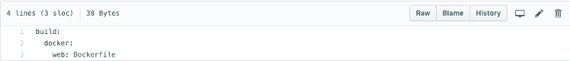](https://res.cloudinary.com/practicaldev/image/fetch/s--byeLXWtV--/c_limit%2Cf_auto%2Cfl_progressive%2Cq_auto%2Cw_880/https://res.cloudinary.com/practicaldev/image/fetch/s--9fwtsqVw--/c_limit%252Cf_auto%252Cfl_progressive%252Cq_auto%252Cw_880/https://cdn-images-1.medium.com/max/800/1%252Aw7w-cVyoJIL9J-zhHp0oPw.png)

## Docker 会全部做好！

正如您所见，指定了要执行的文档文件。 因此，部署到 Heroku 基本上是将 docker 容器部署到 Heroku 时的语法问题。 对于 Digital Ocean，一键部署略有不同，但遵循的是相同的思路。

Digital Ocean 映像只是已经设置了 Ubuntu + docker + Postgres。

AWS 和 Azure 的设定有点复杂，但想法是一样的。 在文档容器中运行引擎，并将其连接到 Postgres db。

## 其他云呢？

正如你大概想到的那样，启动[hasura.io](https://hasura.io/) 引擎在你能启动 Docker 和 Postgres 的任何地方都是可能的。 无论是 AWS、Azure、Zeit 还是 GCP。

例如，假设您将 Hasura 设置为本地环境。

### preconditions

在本地安装引擎之前，需要 Docker 和 Docker Compose。 可以从这里安装。

*   [码头工人](https://docs.docker.com/install/)
*   [坞站组成](https://docs.docker.com/compose/install/)

### 取得宣言

现在，我们从以下存储库中检索 docker-compose 文件:

[https://github . com/hasura/graph QL-engine/tree/master/install-manifests](https://github.com/hasura/graphql-engine/tree/master/install-manifests)

此资料档案库包含在任何地方部署 Hasura 所需的各种安装清单。

要获取它，请创建一个新目录并运行它。

```
wget https://raw.githubusercontent.com/hasura/graphql-engine/master/install-manifests/docker-compose/docker-compose.yaml 
```

### 码头工人 containerの実行

```
docker-compose up -d 
```

在此处验证容器是否正在运行。

```
docker ps 
```

应该可以确认这样的输出

[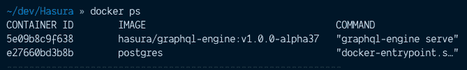](https://res.cloudinary.com/practicaldev/image/fetch/s--N0q-mdDT--/c_limit%2Cf_auto%2Cfl_progressive%2Cq_auto%2Cw_880/https://res.cloudinary.com/practicaldev/image/fetch/s--cmeyVX1q--/c_limit%252Cf_auto%252Cfl_progressive%252Cq_auto%252Cw_880/https://cdn-images-1.medium.com/max/800/1%252AXSk0VOUZ1La3UVMPcXX3Eg.png)

如您所见，引擎实例正在与 Postgres db 一起运行。

这样就可以从[http://localhost:8080/](http://localhost:8080/) 去控制台了。

[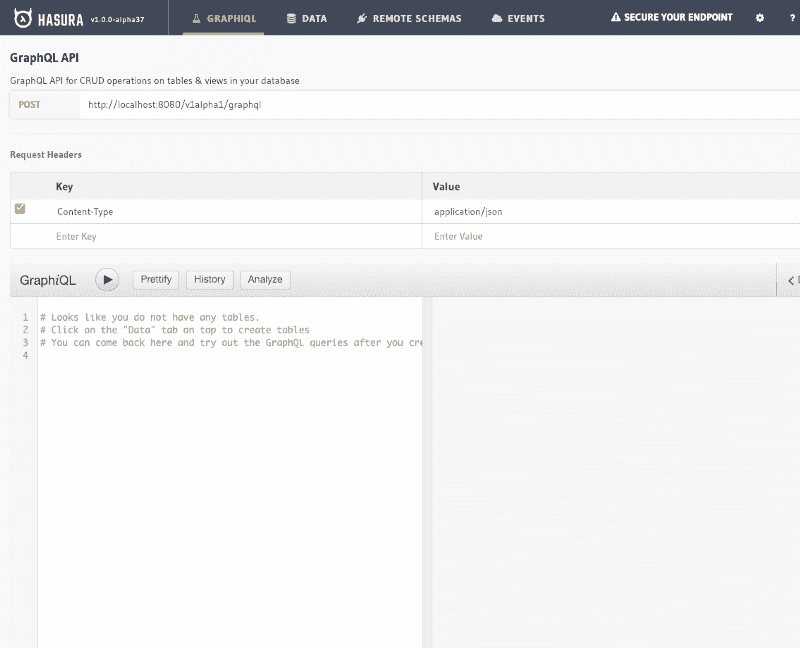](https://res.cloudinary.com/practicaldev/image/fetch/s--CF3NnjgP--/c_limit%2Cf_auto%2Cfl_progressive%2Cq_auto%2Cw_880/https://res.cloudinary.com/practicaldev/image/fetch/s--QT6Jm-wL--/c_limit%252Cf_auto%252Cfl_progressive%252Cq_auto%252Cw_880/https://cdn-images-1.medium.com/max/800/1%252A6-Qz7FD6O4winhcfGegKzg.png)

## 在现有的 Postgres 上奔跑

也可以在现有 Postgres 数据库上运行 Hasura 引擎。 为此，请从[install-manifests](https://github.com/hasura/graphql-engine/tree/master/install-manifests) 系统信息库中获取 docker-run.sh 脚本，然后编辑`HASURA_GRAPHQL_DATABASE_URL`变量，而不是像以前那样获取 docker-compose。 [从这里可以读取](https://docs.hasura.io/1.0/graphql/manual/deployment/docker/index.html)详细内容。

## 关于 Postgres 扩展

完全可以运作。 像这样，关于在 Hasura 中使用 PostGIS(Postgres 用的空间数据库扩展)的[有几个很棒的博客投稿](https://blog.hasura.io/graphql-and-geo-location-on-postgres-using-hasura-562e7bd47a2f/)。

或者，[您可以在 TimeScaleDB (具有完整 SQL 支持的开源时间序列数据库)中使用 Hasura，如这篇博客文章](https://blog.hasura.io/using-timescaledb-with-hasura-graphql-d05f030c4b10/)中所述。

## 不使用 Postgres 时

您在使用 Firebase 吗？ 有一个从 firebase 迁移的工具:[firebase2graphql](https://github.com/hasura/graphql-engine/tree/master/community/tools/firebase2graphql) 。 您是否在使用 mongo 或其他 NoSQL 数据库？ 您可以使用[json2graphql](https://github.com/hasura/graphql-engine/tree/master/community/tools/json2graphql) 工具导出 JSON 转储并将数据通过 Hasura 引擎导入 Postgres 数据库。 您在使用 MySQL 吗？ 没问题。 [使用 https://www.symmetric ds.org /](https://www.symmetricds.org/)从 MySQL 迁移到 Postgres 也是为了使 Postgres 成为 MySQL 中数据的代理

## Hasura 引擎控制台概述 h

现在，您不仅可以在 Postgres 数据库上运行引擎，还可以在 PostGIS 等 Postgres 扩展和 TimeScaleDB 等开源数据库上运行引擎。 但是，我们还没有谈到发动机的功能。 现在，让我们回到在本地运行引擎时看到的控制台。
控制台有 4 个主选项卡

### 图 QL

#### Endpoint 和标题

在此页面的顶部，有客户端访问 GraphQL API 时必须安装的请求头和 API 的结尾。

[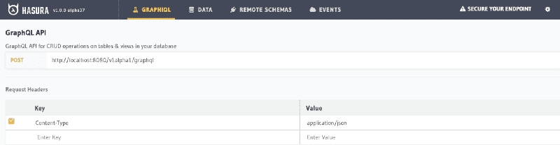](https://res.cloudinary.com/practicaldev/image/fetch/s--OvpAmKHL--/c_limit%2Cf_auto%2Cfl_progressive%2Cq_auto%2Cw_880/https://res.cloudinary.com/practicaldev/image/fetch/s--UvkbDOJt--/c_limit%252Cf_auto%252Cfl_progressive%252Cq_auto%252Cw_880/https://cdn-images-1.medium.com/max/800/1%252A9bQps8vAjxbfixptH-jzcA.png)

如新创建的示例所示，只有 Content-Type 标头。 这实际上是不安全的，因为每个人都可以访问我们的 API。 你会把关于那个的通知引导到说明如何保护你端点的文档吧，会在右上角引导到你的端点吧。
表示具有安全访问的 API 的另一个例子。

正如您在新创建的示例中看到的那样，只有 Content-Type 标头[https://RES.cloudinary.com/practical dev/image/fetch/s---uname c _ limit % 2cf _ auto %2CFL _ progressive % 2cq _ auto % 2cw _ 880/https://cdn-images-1.medium.com/max 这实际上是不安全的，因为每个人都可以访问我们的 API。 可以从画面右上角的“Secure](https://res.cloudinary.com/practicaldev/image/fetch/s--UvkbDOJt--/c_limit%2Cf_auto%2Cfl_progressive%2Cq_auto%2Cw_880/https://cdn-images-1.medium.com/max/800/1%2A9bQps8vAjxbfixptH-jzcA.png%E3%80%82%E3%81%93%E3%82%8C%E3%81%AF%E3%80%81%E8%AA%B0%E3%82%82%E3%81%8C%E7%A7%81%E3%81%9F%E3%81%A1%E3%81%AEAPI%E3%81%AB%E3%82%A2%E3%82%AF%E3%82%BB%E3%82%B9%E3%81%A7%E3%81%8D%E3%82%8B%E3%81%9F%E3%82%81%E3%80%81%E5%AE%9F%E9%9A%9B%E3%81%AB%E3%81%AF%E5%AE%89%E5%85%A8%E3%81%A7%E3%81%AF%E3%81%82%E3%82%8A%E3%81%BE%E3%81%9B%E3%82%93%E3%80%82%E7%94%BB%E9%9D%A2%E3%81%AE%E5%8F%B3%E4%B8%8A%E3%81%AB%E3%81%82%E3%82%8B%E3%80%8CSecure) your end point”中确认详细情况。
这是更安全的访问 API 的另一个例子。

[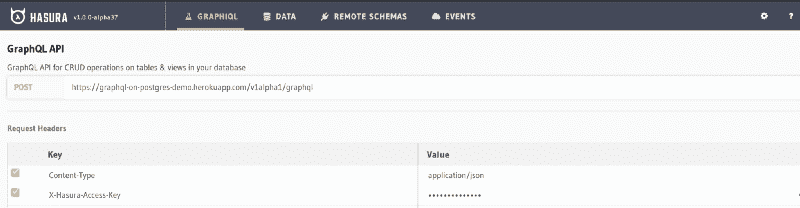](https://res.cloudinary.com/practicaldev/image/fetch/s--XCZm8V-B--/c_limit%2Cf_auto%2Cfl_progressive%2Cq_auto%2Cw_880/https://res.cloudinary.com/practicaldev/image/fetch/s--8n2vGpkJ--/c_limit%252Cf_auto%252Cfl_progressive%252Cq_auto%252Cw_880/https://cdn-images-1.medium.com/max/800/1%252ApzOCoy5SnCiHTijXu4Migw.png)

在这里，您可以看到有一个 X-Hasura-Access-Key 标头来保护端点。 对控制台的访问也受到保护。

### GraphiQL 的 IDE 扩展程序

GraphiQL 选项卡包含[GraphiQL](https://github.com/graphql/graphiql) IDE。 这允许您运行 query、mutation 和 subscription 以通过浏览器测试 GraphQL API。 您还可以检查 GraphQL 架构文档，以了解数据的形状以及可以执行的 query、mutation 和 subscription。 Hasura 引擎在 GraphiQL 之上添加其他功能。

[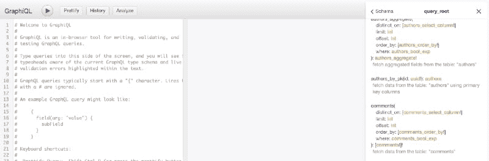](https://res.cloudinary.com/practicaldev/image/fetch/s--TCqdyPDF--/c_limit%2Cf_auto%2Cfl_progressive%2Cq_auto%2Cw_880/https://res.cloudinary.com/practicaldev/image/fetch/s--KcoOqk5V--/c_limit%252Cf_auto%252Cfl_progressive%252Cq_auto%252Cw_880/https://cdn-images-1.medium.com/max/800/1%252A6VtgDlPsRre2f1U9gYqqZA.png)

*   **Prettify** -在左侧面板中优化 GraphQL 语法
*   **History** -显示上次执行的 query，mutation
*   **Analyze** -这真是一个很棒的工具。 Hasura 引擎实际上将 GraphQL 查询编译为 SQL 查询，而不是运行解析器来检索数据。 单击[Analyze]按钮可了解如何编译。

请看以下的 query

```
{
  posts {
    author {
      user {
        name
      }
    }
  }
} 
```

点击 Analyze 按钮，将显示以下画面

[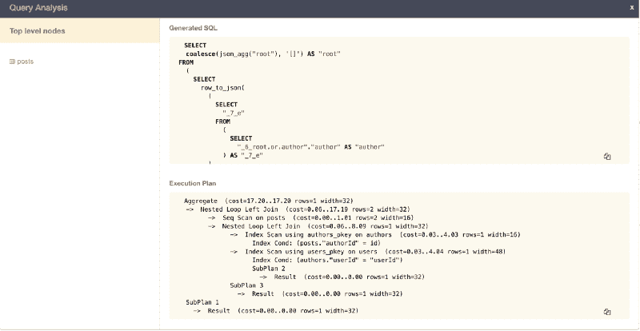](https://res.cloudinary.com/practicaldev/image/fetch/s--VWbECiFy--/c_limit%2Cf_auto%2Cfl_progressive%2Cq_auto%2Cw_880/https://res.cloudinary.com/practicaldev/image/fetch/s--lsrqmSLR--/c_limit%252Cf_auto%252Cfl_progressive%252Cq_auto%252Cw_880/https://cdn-images-1.medium.com/max/800/1%252AkgUTU0XQARt-XZblRm0hPg.png)

在这里，您可以分析查询对数据库的执行方式，并让您和 DBA 讨论数据库关系的效率更高。

### 数据

该选项卡就像你的 Postgres 数据库管理员一样。 您可以在此定义您的模式结构、表关系、角色和权限设置，还可以运行自定义 SQL。 下一部分介绍数据建模。

### 远程模式

[Remote Schema]选项卡用于为自定义业务逻辑指定**自定义 GraphQL 服务器**的 URL。

[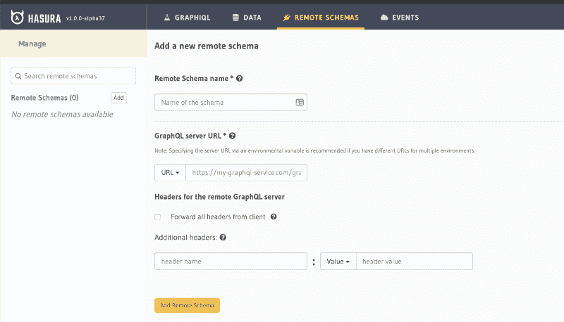](https://res.cloudinary.com/practicaldev/image/fetch/s--qoPI_fxn--/c_limit%2Cf_auto%2Cfl_progressive%2Cq_auto%2Cw_880/https://res.cloudinary.com/practicaldev/image/fetch/s--6N92PK8f--/c_limit%252Cf_auto%252Cfl_progressive%252Cq_auto%252Cw_880/https://cdn-images-1.medium.com/max/800/1%252AYXKM1scMRGbq21cvm3qm5g.png)

Hasura 引擎将会在你的 hasura GraphQL API 和你的定制 GraphQL 服务器之间进行模式匹配。 例如，如果要在将任何内容添加到数据库之前运行自定义业务逻辑，请在您自己的 GraphQL 服务器上编写转换，然后在包含服务器 URL 的 hasura 引擎中添加安全标头。

### 活动

Hasura 引擎拥有强大的事件系统。 每当数据库中插入、更新或删除了内容时，都可以触发事件。 建议将事件与无服务器功能相关联。 在以下部分详细说明。

## 表格的创建和更新

访问[Data]选项卡时，您可以选择创建表。 创建表时，必须指定其列和类型。

[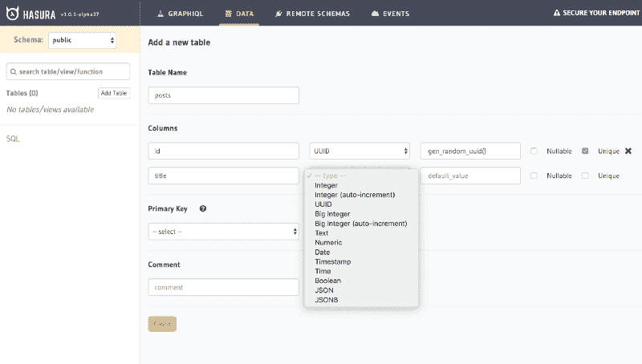](https://res.cloudinary.com/practicaldev/image/fetch/s--Xq8HPf-7--/c_limit%2Cf_auto%2Cfl_progressive%2Cq_auto%2Cw_880/https://res.cloudinary.com/practicaldev/image/fetch/s--1DNggI9H--/c_limit%252Cf_auto%252Cfl_progressive%252Cq_auto%252Cw_880/https://cdn-images-1.medium.com/max/800/1%252A873xA1dBG0gG3MUYWxhDLw.png)

Hasura 还为你提供辅助功能。 对于我们来说，这是用于自动生成 post id 主键的唯一标识符的`gen_random_uuid()`。 在此，必须选择主键列或多列。

与其他数据库管理一样，可以在不同的表中设置外键映射。 以下示例将`posts`表中的`authorId`映射到`authors`表的 id 列。

[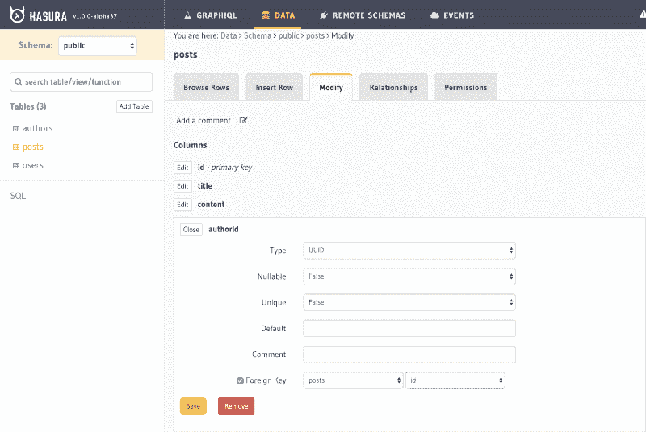](https://res.cloudinary.com/practicaldev/image/fetch/s--VyHuKVo6--/c_limit%2Cf_auto%2Cfl_progressive%2Cq_auto%2Cw_880/https://res.cloudinary.com/practicaldev/image/fetch/s--c3s6CHdB--/c_limit%252Cf_auto%252Cfl_progressive%252Cq_auto%252Cw_880/https://cdn-images-1.medium.com/max/800/1%252A9LFU3gBFWD9HUhhAITjX3A.png)

如本示例所示，如果已经有表，则可以随时修改表、引用行、插入行或添加关系。

### 查询的自动生成

Hasura 的优点是，每次添加表时，都可以访问表中的以下 query 和 subscription :

[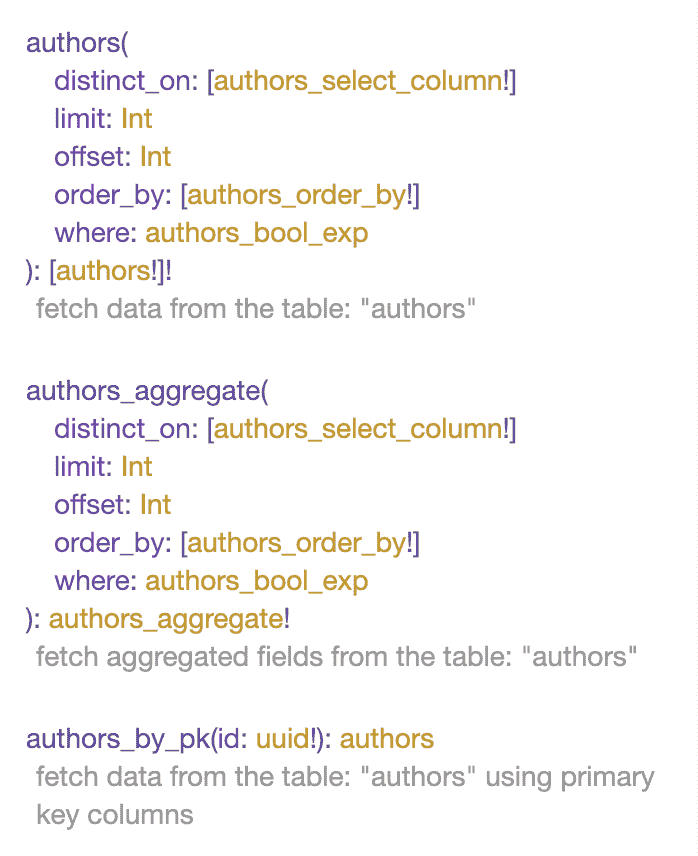](https://res.cloudinary.com/practicaldev/image/fetch/s--PyoTRIwa--/c_limit%2Cf_auto%2Cfl_progressive%2Cq_auto%2Cw_880/https://res.cloudinary.com/practicaldev/image/fetch/s--KxEmz5xz--/c_limit%252Cf_auto%252Cfl_progressive%252Cq_auto%252Cw_880/https://cdn-images-1.medium.com/max/800/1%252AkSlc7sSqo8CqJfQ2u_73Wg.png)

正如你所见，它们是相当强大的东西。 不仅可以查询和订阅数据，还可以进行过滤处理。 然后当然可以由 query、mutation、subscriptio 来执行。

### 关系生成器

通过访问[Relationship]选项卡，可以在表之间建立两种类型的关系。

*   对象关系
*   数组关系

例如，如果用例的`posts`表的`authorId`列设置了指向`authors`表的`id`的外键，则可以对`posts`进行查询，但可以从`authors`表中用 GraphQL 进行嵌套解码 为此，必须设置对象关系。

[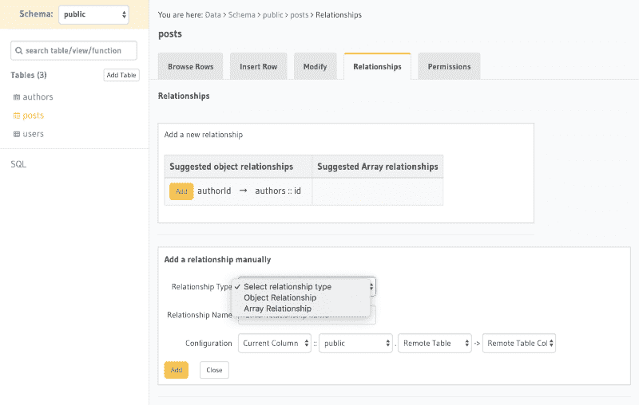](https://res.cloudinary.com/practicaldev/image/fetch/s--I3Y459w9--/c_limit%2Cf_auto%2Cfl_progressive%2Cq_auto%2Cw_880/https://res.cloudinary.com/practicaldev/image/fetch/s--2j7L-EQI--/c_limit%252Cf_auto%252Cfl_progressive%252Cq_auto%252Cw_880/https://cdn-images-1.medium.com/max/800/1%252Abe-XbotmHFwmE7GfmWEYAw.png)

在 UI 的不同部分提出了制作 Object Relationship 的方案。 因此，在*提议的对象关系*中，可以点击[Add]或手动创建关系。
每次这样做的时候，你都可以执行这样的查询吧:

```
{
  posts {
    id
    author {
      bio
    }
  }
} 
```

## 权限

Hasura 引擎允许您定义角色和权限，并非常精细地设置权限。 例如，只有在满足特定规则时，才能授予对特定列的访问权限。 您还可以从自定义身份验证 Web 挂接中传递变量，并据此定义自定义访问。 在控制台上，您将看到:

[](https://res.cloudinary.com/practicaldev/image/fetch/s--leGcEwbz--/c_limit%2Cf_auto%2Cfl_progressive%2Cq_auto%2Cw_880/https://res.cloudinary.com/practicaldev/image/fetch/s--GY65gVsP--/c_limit%252Cf_auto%252Cfl_progressive%252Cq_auto%252Cw_880/https://cdn-images-1.medium.com/max/800/1%252AoRL24h62QYlByPRZi4Klag.png)

在本例中，检查是否提供了`X-HASURA-USER-ID`。

## certification

Hasura 引擎支持多种类型的身份验证。 可以使用 JWT 令牌、自定义令牌或 Hasura-access-key。 内部发生的情况如下:认证层检查私钥令牌/ JWT 设置或 webhook 设置。

让我们看看 Heroku 的例子。

[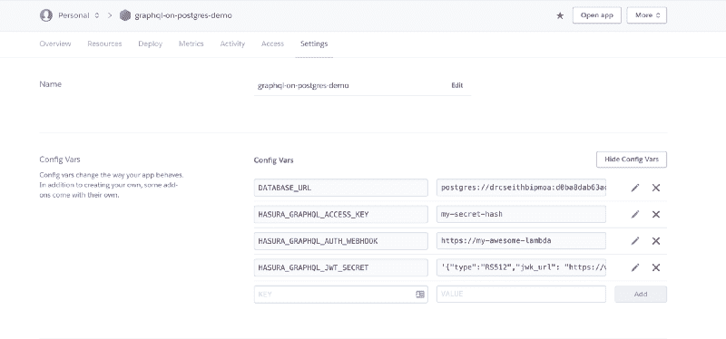](https://res.cloudinary.com/practicaldev/image/fetch/s--6G9UUaMa--/c_limit%2Cf_auto%2Cfl_progressive%2Cq_auto%2Cw_880/https://res.cloudinary.com/practicaldev/image/fetch/s--fatTNINR--/c_limit%252Cf_auto%252Cfl_progressive%252Cq_auto%252Cw_880/https://cdn-images-1.medium.com/max/800/1%252ATWWlRidIqSvqfHtXMAHnag.png)

现在您已经知道了在 Heroku 仪表板上设置的环境变量。

*   `HASURA_GRAPHQL_ACCESS_KEY`-私钥令牌
*   `HASURA_GRAPHQL_AUTH_WEBHOOK`-自定义身份验证提供程序的 URL
*   `HASURA_GRAPHQL_JWT_SECRET`- JWT 的设定

例如，使用`HASURA_GRAPHQL_ACCESS_KEY`时，需要提供`X-Hasura-Access-Key`以便可以访问 API 或控制台。

[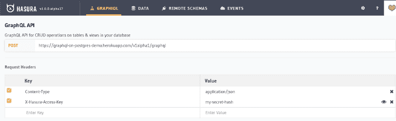](https://res.cloudinary.com/practicaldev/image/fetch/s--cPQEuA0j--/c_limit%2Cf_auto%2Cfl_progressive%2Cq_auto%2Cw_880/https://res.cloudinary.com/practicaldev/image/fetch/s--GeFZJbZL--/c_limit%252Cf_auto%252Cfl_progressive%252Cq_auto%252Cw_880/https://cdn-images-1.medium.com/max/800/1%252ABpXF9lOs61yNhyHq12RCIA.png)

你可以在这里阅读更多关于不同认证选项的内容。

## 自定义外部 GraphQL 服务器，也被称为远程模式

那么，您要使用远程模式做什么？ 请考虑以下例子。 假设您要基于某些自定义服务器验证在数据库中插入行，但仍要订阅数据库中的更改。 在这种情况下，您可以自己创建远程架构，也可以使用[hasura 锅炉板](https://github.com/hasura/graphql-engine/tree/master/community/boilerplates/remote-schemas)创建远程架构，然后指定并连接到自定义服务器的 Graphql 端点 URL。

[](https://res.cloudinary.com/practicaldev/image/fetch/s--qoPI_fxn--/c_limit%2Cf_auto%2Cfl_progressive%2Cq_auto%2Cw_880/https://res.cloudinary.com/practicaldev/image/fetch/s--6N92PK8f--/c_limit%252Cf_auto%252Cfl_progressive%252Cq_auto%252Cw_880/https://cdn-images-1.medium.com/max/800/1%252AYXKM1scMRGbq21cvm3qm5g.png)

假设您的服务器上有一个 mutation，该 mutation 将解析器定义为在 hasura 引擎所连接的同一数据库中插入行之前执行自定义逻辑。 那么，当数据被插入时会怎么样呢？ 来自 hasura 引擎的 GraphQL subscription 将按预期执行。

## 利用事件触发的异步无服务器业务逻辑

如上所述，hasura 具有事件的强大概念。 不仅在表操作中，而且在更改列时也可能发生事件。 每次触发事件时，事件数据都会传递到 webhook URL。 建议这些 Web 挂接是无服务器功能。 为了创建无服务器功能，可以检查这些[锅炉板](https://github.com/hasura/graphql-engine/tree/master/community/boilerplates/event-triggers)。

[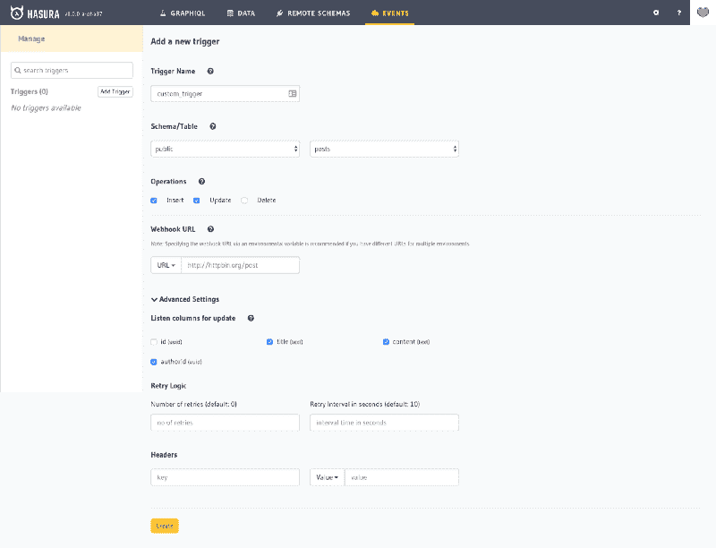](https://res.cloudinary.com/practicaldev/image/fetch/s--YlxVgVSm--/c_limit%2Cf_auto%2Cfl_progressive%2Cq_auto%2Cw_880/https://res.cloudinary.com/practicaldev/image/fetch/s--zvxn1VDF--/c_limit%252Cf_auto%252Cfl_progressive%252Cq_auto%252Cw_880/https://cdn-images-1.medium.com/max/800/1%252ArDAPtPK_PRfYdpmCc-RfcQ.png)

## 总结

从本概述中可以看出，[hasura.io](https://hasura.io/) 平台非常灵活，几乎可以在任何地方运行，并且具有许多功能，可以帮助您以所有级别的复杂性轻松创建 GraphQL API。 另外，Hasura 是[开源](https://github.com/hasura)，用 Haskell 和 JavaScript 写，所以所有的贡献都非常欢迎。 另外，也可以通过[Discord](https://discordapp.com/invite/vBPpJkS) 加入 Hasura，或者通过[Twitter](https://twitter.com/hasurahq) 进行关注。