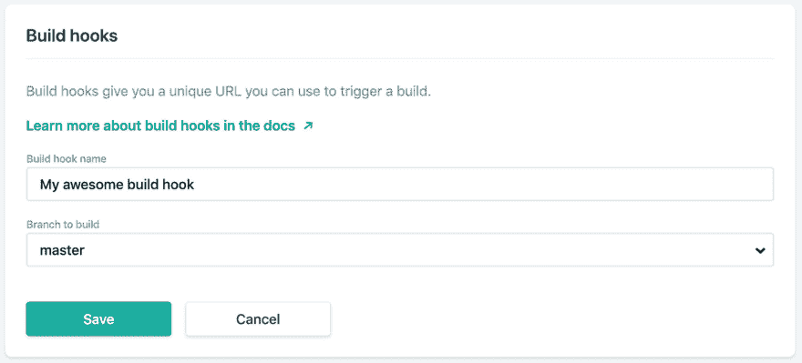
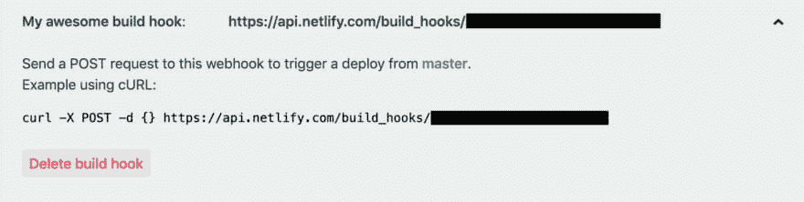

# 使用 JAMstack 在 Netlify 和 CircleCI 2.0 计划作业上自动发布未来的帖子

> 原文：<https://dev.to/hugo__df/auto-publish-future-posts-with-jamstack-on-netlify-and-circleci-2-0-scheduled-jobs-1jmk>

静态站点生成器，如雨果、T2、杰基尔、T4、赫索、盖茨比或其他替代者都是运行你的博客的好选择。

您将遇到的最早也可能是最痛苦的问题之一是“我如何安排以后发布的内容？”。

在传统的数据库支持的博客网站中，例如使用 WordPress 或 Ghost。文章是在 access 上检索的(用计算机科学的话说，是在运行时)。要让一篇文章在某个日期之后才开始出现，就像拥有一个带有“发布日期”日期的字段，以及一些检查该字段是在当前日期之前还是之后的代码一样简单。

进入 JAMstack。它不使用由关系或非关系数据库支持的经典 PHP/Node.js/Python/Rails 服务器端组件运行。

> JAMstack:基于客户端 JavaScript、可重用 API 和预建标记的现代 web 开发架构。
> 
> 参见[jamstack.org](https://jamstack.org/)和 [jamstack.wtf](https://jamstack.wtf)

相反，JAMstack 在**构建时**完成大部分处理工作(相对于**运行时**)。这往往有很多好处，如提高缓存能力，更好地利用 CDN(内容交付网络),所有这些都有助于更快的体验。

这种提前计算网站上所有页面的缺点是，没有一种明显的方式来“预定”帖子。要让帖子出现，您需要在“发布日期”之后重新构建网站，以便它包含在构建页面中。

这篇文章讲述了如何使用现代工具来实现这一点。即 CircleCI 2.0 和 Netlify(这是一个专注于 JAMstack 网站的托管平台)。

目录:

## 启用 Netlify 构建钩子

先决条件:您的站点必须使用 Netlify 部署

转到`https://app.netlify.com/sites/{{your_site_name}}/settings/deploys#build-hooks`创建一个构建钩子

[](https://res.cloudinary.com/practicaldev/image/fetch/s--YraAvW_9--/c_limit%2Cf_auto%2Cfl_progressive%2Cq_auto%2Cw_880/https://codewithhugo.com/img/netlify-webhook.jpg)

一旦您点击“Save ”,您现在就有了一个新的 deploy webhook，您可以打开它并复制`curl -X POST -d {} https://api.netlify.com/build_hooks/{{your_hook_id}}`。

[](https://res.cloudinary.com/practicaldev/image/fetch/s--BSSyxOJx--/c_limit%2Cf_auto%2Cfl_progressive%2Cq_auto%2Cw_880/https://codewithhugo.com/img/netlify-hook-created.jpg)

## 创建一个预定的 CircleCI 作业来重新部署您的站点

先决条件:您的网站必须设置 CircleCI，您可以按照[官方“入门”指南](https://circleci.com/docs/2.0/getting-started/)进行设置

我们将添加一个作业来触发 Netlify 构建，并通过修改您的`.circleci/config.yml`(参见最终的 config.yml)来调度它

### 从 CircleCI 触发网络部署

> 完整查看 config.yml

在`jobs`部分，添加一个使用任意 CircleCI 映像的`deploy`或`trigger_deploy`作业(所有 CircleCI docker 映像都包含`curl`，我们将使用它来触发构建)。在配置语言中，这是一个包含例如`- image: circleci/node:latest`的`docker`键。

就`deploy`作业的`steps`而言，我们需要的只是我们之前复制的`curl`命令。那就是`- run: curl -X POST -d {} https://api.netlify.com/build_hooks/{{your_build_hook_id}}`。

### 安排 CircleCI 作业每日执行

> 完整查看 config.yml

要安排 CircleCI 作业，我们需要查看`.circleci/config.yml`的`workflows`部分。

在这一节中，我们应该添加一个`autopublish`工作流，将`triggers`设置为`schedule`，带有一个 cron 表达式和一个分支过滤器，将`job`设置为`- deploy`(或者我们在上一节中使用的任何其他名称):

```
 triggers:
      - schedule:
          cron: "00 7 * * *"
          filters:
            branches:
              only:
                - master
    jobs:
      - deploy 
```

以下是完整的工作流程:

```
workflows:
  version: 2
  autopublish:
    triggers:
      - schedule:
          cron: "00 7 * * *"
          filters:
            branches:
              only:
                - master
    jobs:
      - deploy 
```

CircleCI 在 UTC 时间运行，所以 CRON 作业将在 UTC 时间早上 7 点运行，这对我很好，因为我在英国，我们总是与 UTC 相差几个小时。对于美国人来说，你可能希望自己的时间是早上 7 点或 8 点，也就是美国东部时间晚上 12 点左右。

您可以在 [crontab.guru](https://crontab.guru) 使用 CRON 表达式，但是对于日常自动发布，您应该只使用表达式的`00 7`部分。如果你想每小时部署一次，你可以去掉`7`,因为它代表小时，用类似`00 * * * *`的东西。

### 全`.circleci/config.yml`

```
version: 2
jobs:
  deploy:
    docker:
      - image: circleci/node:latest
    steps:
      - run: curl -X POST -d {} https://api.netlify.com/build_hooks/{{your_build_hook_id}}

workflows:
  version: 2
  autopublish:
    triggers:
      - schedule:
          cron: "00 7 * * *"
          filters:
            branches:
              only:
                - master
    jobs:
      - deploy 
```

[无刷标志
是 Janssens](https://unsplash.com/@esteejanssens?utm_medium=referral&utm_campaign=photographer-credit&utm_content=creditBadge)