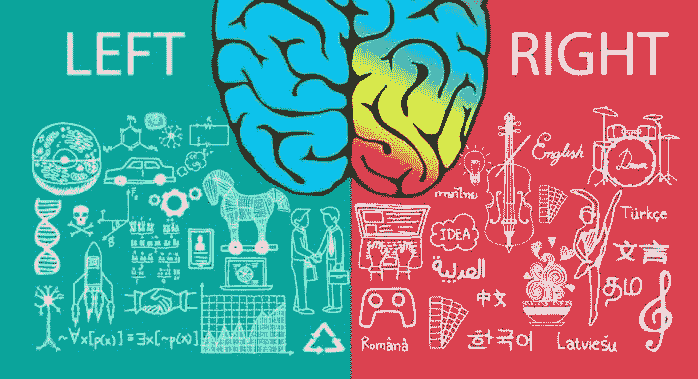

# “非技术”不是个东西。

> 原文：<https://dev.to/seanpryan/non-technical-is-not-a-thing-39k6>

TL；博士:“非技术”是一个错误的和限制性的标签，它阻止人们发现有价值的东西。

* * *

在我生命的大部分时间里，我认为自己是右脑思考、以阅读和写作为导向的人俱乐部的持卡会员。我一生都在演奏音乐，我在一所文理学院主修历史，没有上过一门数学或科学课。

从大学开始，我所有的职业经历都是在营销和传播的保护伞下。当我搬到纽约时，我的第一份工作是在一家公关公司，在那里我给记者写垃圾邮件。不喜欢那样，(非常保守的说法)，大约六个月后，我又开始四处找工作，最终开始在一家市场研究公司工作。

在过去的三年里，我一直在一个主要为研究和学术计算机科学家服务的专业协会领导数字营销，正是在这里，我意识到一件对我整个右脑生活来说似乎完全不可能的事情:我喜欢编码。

开始的时候很天真。当我更新我们的网站内容时，我必须润色一点 HTML，有一天在这样做的时候，我想我应该挖得更深一点。我开始在 Team Treehouse 上做一些前端的 web 开发教程，就迷上了。我继续调查。在过去一年左右的时间里，我参与了一些项目，参加了一些关于前端开发的 Udemy 课程，参加了一些在纽约的 JavaScript 聚会。

我已经能够自己建立一个良好的知识基础，但最近我意识到我想要更多的结构和责任，所以在研究了几个在线训练营选项(辞职去全职并不在考虑范围内)后，我决定选择 Bloc。

我想成为一名网络开发人员。我想以制造伟大的产品和不断学习新技术和技能为职业，我想周围的人也喜欢这种工作。在我开始 Bloc 之前，我就在理智上知道这一点，但现在感觉更真实、更可行。

我开始意识到，技术行业，更具体地说是其中的 web 开发社区，并不充满孤独、孤立的怪人，他们更喜欢盯着自己的计算机屏幕，而不是与其他人在一起。这里充满了富有创造力和支持力的人，他们喜欢学习和建造东西，并帮助其他人做同样的事情。

我花了这么长时间才明白这一点的原因之一是，人类理解世界的方式存在局限性。事情很复杂，所以很自然地，人们采取一些捷径来帮助理解这一切。其中一个捷径是将人和事物分类，这些分类通常被一个巨大的楔子从中间分开。这适用于我们如何谈论生活中其他人可能擅长或不擅长的追求，以及我们如何将“技术”或“创造性”等词用于擅长编程、写作或演奏音乐的人。

对于拥有教育和职业影响力的人来说，重要的是要思考一下，将学生和员工分成不同的群体，会如何阻止双方的人发现丰富和有益的经历。当教育工作者和政策制定者考虑如何缩小技术领域的技能差距时，仅仅将更多的 STEM 项目引入学校是不够的——我们需要考虑如何以一种方式谈论科学，让他们对那些已经被告知他们的天赋在别处的人不那么冷漠和疏远。

对于那些坚定地站在“创造性”阵营的人来说:坐下来看看关于前端 web 开发的教程，看看你的想法。你可能会像我一样，发现这很令人兴奋，也很有收获。对于那些生活在技术城的人来说:拿起一件乐器，写一个剧本，或者做一些折纸。我们的学校和工作并不经常鼓励我们去探索大脑的另一面，所以我们必须积极主动。