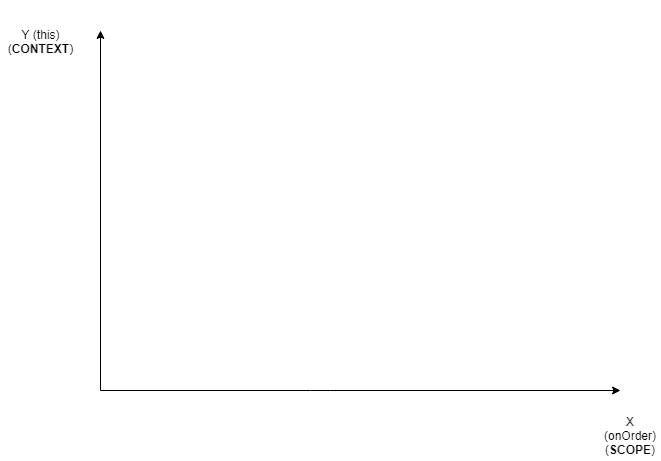
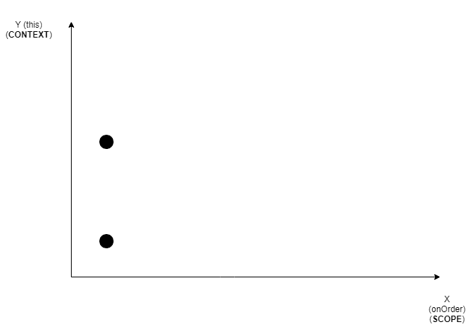
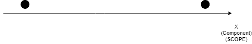

# React 挂钩重新介绍

> 原文：<https://dev.to/hayk94/react-hooks-re-intro-77m>

# React 钩子重新介绍

原帖在这个回购

里，每个分支都有一个 readme.md 解释代码。

这个库是用来介绍 React 钩子的。

它由几个编号的分支组成。

在每个分支的自述文件中讲述了代码，

解释了优点和注意事项。

在主分支这里是一个普通的 [CRA](https://facebook.github.io/create-react-app/) 应用。

使用[eslint-config-fbjs](https://www.npmjs.com/package/eslint-config-fbjs)

搭配[eslint-plugin-react-hooks](https://www.npmjs.com/package/eslint-plugin-react-hooks)还有一些额外的配置。
更漂亮的配置。

**免责声明**

这个报告和帖子中的大部分内容都已经讨论过了，

由 react 团队在文档中讨论，由丹·阿布拉莫夫在他的惊人的演讲和博客中讨论，

和其他人讨论。

这个回购只是总结了我目前为止收集的关于钩子的知识。只是用我自己的话来表达。

###### 资源

[https://dev.to/dan_abramov/making-sense-of-react-hooks-2eib](https://dev.to/dan_abramov/making-sense-of-react-hooks-2eib)

[https://overreacted.io/react-as-a-ui-runtime/](https://overreacted.io/react-as-a-ui-runtime/)

[https://overreated . io/making-setinterval-declarative-with-react-hooks/](https://overreacted.io/making-setinterval-declarative-with-react-hooks/)

[https://overreated . io/how-are-function-components-different-from-classes/](https://overreacted.io/how-are-function-components-different-from-classes/)

[https://overreacted.io/a-complete-guide-to-useeffect/](https://overreacted.io/a-complete-guide-to-useeffect/)

[https://overreacted.io/writing-resilient-components/](https://overreacted.io/writing-resilient-components/)

## App 简介

假设我们正在编写一个咖啡店菜单应用程序。

用户可以选择自己想要的产品并订购。

#### 老班好

首先我们制作一个`Menu.js`组件。

```
import React, {Component} from 'react';

class Menu extends Component {
  render() {
    return (
      <div>
        Menu
      </div>
    );
  }
}

export default Menu; 
```

并让它呈现在我们的`App.js`组件中。

```
import React, { Component } from 'react';
import './App.css';
import Menu from './Menu';

class App extends Component {
  render() {
    return (
      <div className="App">
        <section>
          <Menu/>
        </section>
      </div>
    );
  }
}

export default App; 
```

然后我们在我们的菜单应用程序中添加一个`select`，上面有一些产品。

添加订购按钮。

```
import React, {Component} from 'react';

class Menu extends Component {
  render() {
      return (
        <div>
          <b>Order: </b>
          <select>
            <option value="Purple Haze">Purple Haze</option>
            <option value="Amnesia">Amnesia</option>
            <option value="GoGreen">GoGreen</option>
          </select>
          <div>
            <button>Order</button>
          </div>
        </div>
      );
    }
}

export default Menu; 
```

显然这是他们在咖啡店卖的，不是吗？

现在我们需要所选产品的一些状态。

```
import React, {Component} from 'react';

class Menu extends Component {
  constructor(props) {
      super(props);
      this.state = {
        selected: 'Purple Haze',
      };
  }

  render() {
      return (
        <div>
          <b>Order: </b>
          <select>
            <option value="Purple Haze">Purple Haze</option>
            <option value="Amnesia">Amnesia</option>
            <option value="GoGreen">GoGreen</option>
          </select>
          <div>
            <button>Order</button>
          </div>
        </div>
      );
    }
}

export default Menu; 
```

最后，我们需要选择和订购产品的方法。

```
import React, {Component} from 'react';

class Menu extends Component {
  constructor(props) {
    super(props);
    this.state = {
      selected: 'Purple Haze',
    };
  }

  onChange(e) {
    this.setState({selected: e.target.value});
  }

  onOrder() {
    alert(`You ordered ${this.state.selected}`);
  }
  render() {
    return (
      <div>
        <b>Order: </b>
        <select onChange={this.onChange}>
          <option value="Purple Haze">Purple Haze</option>
          <option value="Amnesia">Amnesia</option>
          <option value="GoGreen">GoGreen</option>
        </select>
        <div>
          <button onClick={this.onOrder}>Order</button>
        </div>
      </div>
    );
  }
}

export default Menu; 
```

在这里，我们制作了我们的应用程序。现在我们去点餐吧。

和...

哎哟...

对吧...

我们得到一个很大很好的错误消息，你猜怎么着？

转向下一个分支...

## 还有现在这个！

所以现在我们有一个错误！或者说是错误...

你知道吗？

让我们修理它！

```
import React, {Component} from 'react';

class Menu extends Component {
  constructor(props) {
    super(props);
    this.state = {
      selected: 'Purple Haze',
    };
    this.onChange = this.onChange.bind(this);
    this.onOrder = this.onOrder.bind(this);
  }

  onChange(e) {
    this.setState({selected: e.target.value});
  }

  onOrder() {
    alert(`You ordered ${this.state.selected}`);
  }
  render() {
    return (
      <div>
        <b>Order: </b>
        <select onChange={this.onChange}>
          <option value="Purple Haze">Purple Haze</option>
          <option value="Amnesia">Amnesia</option>
          <option value="GoGreen">GoGreen</option>
        </select>
        <div>
          <button onClick={this.onOrder}>Order</button>
        </div>
      </div>
    );
  }
}

export default Menu; 
```

我们需要`bind` `this`。

### 新要求

突然，我们从客户那里得到了新的要求...

他们希望页面标题是用户选择的项目。

所以我们需要这样的东西。

```
import React, {Component} from 'react';

class Menu extends Component {
  constructor(props) {
    super(props);
    this.state = {
      selected: 'Purple Haze',
    };
    this.onChange = this.onChange.bind(this);
    this.onOrder = this.onOrder.bind(this);
  }

  componentDidUpdate() {
    document.title = `Selected - ${this.state.selected}`;
  }

  onChange(e) {
    this.setState({selected: e.target.value});
  }

  onOrder() {
    alert(`You ordered ${this.state.selected}`);
  }
  render() {
    return (
      <div>
        <b>Order: </b>
        <select onChange={this.onChange}>
          <option value="Purple Haze">Purple Haze</option>
          <option value="Amnesia">Amnesia</option>
          <option value="GoGreen">GoGreen</option>
        </select>
        <div>
          <button onClick={this.onOrder}>Order</button>
        </div>
      </div>
    );
  }
}

export default Menu; 
```

生命周期方法耶！

现在我们知道了，一旦用户选择了一个项目，文档标题就会相应地改变。

### 还有一个要求

现在，根据新的要求，我们又有了新的任务。用户应该能够告诉我们他们想要订购多少产品。

很简单，对吧？

```
import React, {Component} from 'react';

class Menu extends Component {
  constructor(props) {
    super(props);
    this.state = {
      selected: 'Purple Haze',
      count: 0,
    };

    this.onProductChange = this.onProductChange.bind(this);
    this.onOrder = this.onOrder.bind(this);
    this.onCountChange = this.onCountChange.bind(this);
  }

  componentDidUpdate() {
    document.title = `Selected - ${this.state.selected}`;
  }

  onProductChange(e) {
    this.setState({selected: e.target.value});
  }

  onOrder() {
    alert(`You ordered ${this.state.count} ${this.state.selected}`);
  }

  onCountChange(e) {
    this.setState({count: e.target.value});
  }

  render() {
    return (
      <div>
        <div>
          <b>Product: </b>
          <select onChange={this.onProductChange}>
            <option value="Purple Haze">Purple Haze</option>
            <option value="Amnesia">Amnesia</option>
            <option value="GoGreen">GoGreen</option>
          </select>
        </div>
        <div>
          <b>Count: </b>
          <input
            type="number"
            min={0}
            value={this.state.count}
            onChange={this.onCountChange}
          />
        </div>
        <div>
          <button onClick={this.onOrder}>Order</button>
        </div>
      </div>
    );
  }
}

export default Menu; 
```

我们在状态中添加一个数字`input`、`count`和一个`onCountChange`方法。

哦对了，我们需要`bind` `this`。

太好了，我们今天完成了很多，感到自豪。

### 哦，不，刚刚报告了一个错误

哎哟...我们刚刚勉强完成了之前的任务，

然而我们之前的功能报告了一个 bug。

他们说当用户第一次进入页面时，页面标题不会显示所选的产品。

但不是 bug！用户尚未选择任何产品！

哦真的吗？这是一个错误，你应该修复它！

不管怎样，这件事必须做。

所以想了一会儿，最好的地方应该是`componentDidMount`。

耶另一个生命周期法来拯救！

```
import React, {Component} from 'react';

class Menu extends Component {
  constructor(props) {
    super(props);
    this.state = {
      selected: 'Purple Haze',
      count: 0,
    };

    this.onProductChange = this.onProductChange.bind(this);
    this.onOrder = this.onOrder.bind(this);
    this.onCountChange = this.onCountChange.bind(this);
  }

  componentDidMount() {
    document.title = `Selected - ${this.state.selected}`;
  }

  componentDidUpdate() {
    document.title = `Selected - ${this.state.selected}`;
  }

  onProductChange(e) {
    this.setState({selected: e.target.value});
  }

  onOrder() {
    alert(`You ordered ${this.state.count} ${this.state.selected}`);
  }

  onCountChange(e) {
    this.setState({count: e.target.value});
  }

  render() {
    return (
      <div>
        <div>
          <b>Product: </b>
          <select onChange={this.onProductChange}>
            <option value="Purple Haze">Purple Haze</option>
            <option value="Amnesia">Amnesia</option>
            <option value="GoGreen">GoGreen</option>
          </select>
        </div>
        <div>
          <b>Count: </b>
          <input
            type="number"
            min={0}
            value={this.state.count}
            onChange={this.onCountChange}
          />
        </div>
        <div>
          <button onClick={this.onOrder}>Order</button>
        </div>
      </div>
    );
  }
}

export default Menu; 
```

咳...这是艰难的一天，但我们成功了！万岁！

转向下一个分支...

### App 成长！性能问题出现了！

随着我们的应用程序的增长，我们到处都遇到了一些性能问题。

为了识别它们，我们开始使用一些调试工具。

所以你决定在你的`Menu.js`中放一些伐木工。

```
import React, {Component} from 'react';

class Menu extends Component {
  constructor(props) {
    super(props);
    this.state = {
      selected: 'Purple Haze',
      count: 0,
    };

    this.onProductChange = this.onProductChange.bind(this);
    this.onOrder = this.onOrder.bind(this);
    this.onCountChange = this.onCountChange.bind(this);
  }

  componentDidMount() {
    // eslint-disable-next-line
    console.log('logger', this.state, this.props);
    document.title = `Selected - ${this.state.selected}`;
  }

  componentDidUpdate() {
    // eslint-disable-next-line
    console.log('logger', this.state, this.props);
    document.title = `Selected - ${this.state.selected}`;
  }

  onProductChange(e) {
    this.setState({selected: e.target.value});
  }

  onOrder() {
    alert(`You ordered ${this.state.count} ${this.state.selected}`);
  }

  onCountChange(e) {
    this.setState({count: e.target.value});
  }

  render() {
    return (
      <div>
        <div>
          <b>Product: </b>
          <select onChange={this.onProductChange}>
            <option value="Purple Haze">Purple Haze</option>
            <option value="Amnesia">Amnesia</option>
            <option value="GoGreen">GoGreen</option>
          </select>
        </div>
        <div>
          <b>Count: </b>
          <input
            type="number"
            min={0}
            value={this.state.count}
            onChange={this.onCountChange}
          />
        </div>
        <div>
          <button onClick={this.onOrder}>Order</button>
        </div>
      </div>
    );
  }
}

export default Menu; 
```

所以我们把记录器放在`componentDidUpdate`和`componentDidMount`中。

现在你可以看到`componentDidMount`后的正确日志。

你选择了一个产品，并在`componentDidUpdate`中看到正确的日志，带有新的状态和道具。

你改变产品数量，看到`componentDidUpdate`记录的新状态和道具。

但是等一下...

这难道不意味着`document.title = newTitle`代码在每次更新时执行，

即使选择的产品没有改变？

我们需要解决这个问题。这个日志工具真的很有帮助，我们应该在我们的应用程序中为其他组件实现它。

所以也许我们可以通过`if`检查来解决这个问题。并为记录器做一个`HOC`。

当您正在考虑解决方案时，一个新的高优先级需求出现了。

转向下一个分支...

### 有大量异步材料的新需求

所以突然一个新的要求来了。为了实现它，你添加了很多异步的东西到你的 on order 函数中，所以现在看起来像这样。

```
import React, {Component} from 'react';

class Menu extends Component {
  constructor(props) {
    super(props);
    this.state = {
      selected: 'Purple Haze',
      count: 0,
    };

    this.onProductChange = this.onProductChange.bind(this);
    this.onOrder = this.onOrder.bind(this);
    this.onCountChange = this.onCountChange.bind(this);
  }

  componentDidMount() {
    // eslint-disable-next-line
    console.log('logger', this.state, this.props);
    document.title = `Selected - ${this.state.selected}`;
  }

  componentDidUpdate() {
    // eslint-disable-next-line
    console.log('logger', this.state, this.props);
    document.title = `Selected - ${this.state.selected}`;
  }

  onProductChange(e) {
    this.setState({selected: e.target.value});
  }

  onOrder() {
    setTimeout(() => {
      alert(`You ordered ${this.state.count} ${this.state.selected}`);
    }, 3000);
  }

  onCountChange(e) {
    this.setState({count: e.target.value});
  }

  render() {
    return (
      <div>
        <div>
          <b>Product: </b>
          <select onChange={this.onProductChange}>
            <option value="Purple Haze">Purple Haze</option>
            <option value="Amnesia">Amnesia</option>
            <option value="GoGreen">GoGreen</option>
          </select>
        </div>
        <div>
          <b>Count: </b>
          <input
            type="number"
            min={0}
            value={this.state.count}
            onChange={this.onCountChange}
          />
        </div>
        <div>
          <button onClick={this.onOrder}>Order</button>
        </div>
      </div>
    );
  }
}

export default Menu; 
```

一切看起来都很好，但是你得到了一个错误报告。

有时会订购错误的商品。

尝试重现一段时间后，你就发现问题了！

当您订购了一种产品，然后在订单消息出现之前选择了另一种产品，

您在出现的消息中得到一种错误的产品。

嗯...
为什么会这样？我们的代码似乎没有问题。

转向下一个分支...

### 唉又不是这个！

那么为什么会出现这种错误呢？

给你一个提示，让我们先看看解决方案。

```
import React, {Component} from 'react';

class Menu extends Component {
  constructor(props) {
    super(props);
    this.state = {
      selected: 'Purple Haze',
      count: 0,
    };

    this.onProductChange = this.onProductChange.bind(this);
    this.onOrder = this.onOrder.bind(this);
    this.onCountChange = this.onCountChange.bind(this);
  }

  componentDidMount() {
    // eslint-disable-next-line
    console.log('logger', this.state, this.props);
    document.title = `Selected - ${this.state.selected}`;
  }

  componentDidUpdate() {
    // eslint-disable-next-line
    console.log('logger', this.state, this.props);
    document.title = `Selected - ${this.state.selected}`;
  }

  onProductChange(e) {
    this.setState({selected: e.target.value});
  }

  onOrder() {
    const {count, selected} = this.state;
    setTimeout(() => {
      alert(`You ordered ${count} ${selected}`);
    }, 3000);
  }

  onCountChange(e) {
    this.setState({count: e.target.value});
  }

  render() {
    return (
      <div>
        <div>
          <b>Product: </b>
          <select onChange={this.onProductChange}>
            <option value="Purple Haze">Purple Haze</option>
            <option value="Amnesia">Amnesia</option>
            <option value="GoGreen">GoGreen</option>
          </select>
        </div>
        <div>
          <b>Count: </b>
          <input
            type="number"
            min={0}
            value={this.state.count}
            onChange={this.onCountChange}
          />
        </div>
        <div>
          <button onClick={this.onOrder}>Order</button>
        </div>
      </div>
    );
  }
}

export default Menu; 
```

所以我们只换了这一块。

```
 onOrder() {
    const {count, selected} = this.state;
    setTimeout(() => {
      alert(`You ordered ${count}  ${selected}`);
    }, 3000);
  } 
```

仅仅一行代码就解决了我们的问题。

让我们深入了解一下这里发生了什么。

#### 这个“本”是可变的

```
 onOrder() {
    setTimeout(() => {
      alert(`You ordered ${this.state.count}  ${this.state.selected}`);
    }, 3000);
  } 
```

让我们先来看看这段错误代码。

我们选择了一个产品——“绿色”。它的状态发生变化。组件重新呈现。

`this.state.selected === "GoGreen"`

点击订单按钮。触发`onOrder`方法。

`setTimeout`开工。3 秒过去了。执行回调。

我们读`this.state.selected`得到“GoGreen”。

这里一切都很好。现在让我们来看看错误是如何发生的。

我们选择了一种产品——“健忘症”。它的状态发生变化。组件重新呈现。

`this.state.selected === "Amnesia"`

点击订单按钮。触发`onOrder`方法。

`setTimeout`开工。**在** 3 秒过去之前，我们选择了另一个产品——“go green”。

状态变化来的。组件重新呈现。

`this.state.selected === "GoGreen"`

3 秒过去。`setTimeout`回调运行。我们读`this.state.selected`，得到“GoGreen”。

不过，这次我们选择了“失忆”产品，并点击了订购按钮。

这里的问题是`this`。它在`onOrder`的范围内变化。

##### 解

现在我们来看看解决方案。

```
 onOrder() {
     const {count, selected} = this.state;
     setTimeout(() => {
       alert(`You ordered ${count}  ${selected}`);
     }, 3000);
   } 
```

我们选择了一种产品——“健忘症”。它的状态发生变化。组件重新呈现。

`this.state.selected === "Amnesia"`

点击订单按钮。触发`onOrder`方法。
我们读取`this.state.selected`，并将其赋给函数作用域中的新变量`selected`。

`selected === "Amnesia"`
`setTimeout`开工。**在** 3 秒过去之前，我们选择了另一个产品——“go green”。

国家对它的变化。组件重新呈现。

`this.state.selected === "GoGreen"`

3 秒过去。`setTimeout`回调运行。我们不是从`this`中读出函数作用域的`selected`。还得了“失忆症”。

`this`发生了变化/变异，但其中的函数范围和变量不变。

于是我们用函数作用域解决了`this`问题。

#### 二维度

我发现一种很容易理解`this`和函数范围的方法，就是把它们想象成维度。

[](https://res.cloudinary.com/practicaldev/image/fetch/s--dD8Py-90--/c_limit%2Cf_auto%2Cfl_progressive%2Cq_auto%2Cw_880/https://i.imgur.com/M3HJ0lY.png)

我们有这两个维度来存储我们的数据。

`this`可以在范围内改变。

[](https://res.cloudinary.com/practicaldev/image/fetch/s--QsdibuL3--/c_limit%2Cf_auto%2Cfl_progressive%2Cq_auto%2Cw_880/https://i.imgur.com/gFhXEH1.png)

所以你需要知道我们的数据存在的二维空间。以及它们如何相互作用。

### 他妈的已经带上钩子了！

好吧。很好...

你听说了下一个热门话题，叫做钩子。

现在你想重构你的`Menu.js`组件来使用钩子。

因为分支 3 中的性能问题，你无论如何都要重构它，所以让我们直接重构钩子。

创建一个新的简单功能组件`MenuFC.js`。

```
import React from 'react';

const MenuFc = () => {
  return (
    <div>
      <div>
        <b>Product: </b>
        <select>
          <option value="Purple Haze">Purple Haze</option>
          <option value="Amnesia">Amnesia</option>
          <option value="GoGreen">GoGreen</option>
        </select>
      </div>
      <div>
        <button>Order</button>
      </div>
    </div>
  );
};

export default MenuFc; 
```

如此平淡而美丽。返回一些 jsx 的简单函数。

现在你怎么想，如果我们能这样做不是很好吗？

```
import React from 'react';

const MenuFc = () => {
  const state = 'Purple Haze';

  return (
    <div>
      <div>
        <b>Product: </b>
        <select value={state}>
          <option value="Purple Haze">Purple Haze</option>
          <option value="Amnesia">Amnesia</option>
          <option value="GoGreen">GoGreen</option>
        </select>
      </div>
      <div>
        <button>Order</button>
      </div>
    </div>
  );
};

export default MenuFc; 
```

哇，我们的状态是一个函数范围内的简单变量。那是疯子！

但是我们需要设法改变它，对吗？否则它就没有用了。

想象一下，如果我们有`setState`作为作用域中的简单函数。

```
<select onChange={setState} value={state}>
  <option value="Purple Haze">Purple Haze</option>
  <option value="Amnesia">Amnesia</option>
  <option value="GoGreen">GoGreen</option>
</select> 
```

你怎么想呢?它是如此漂亮和干净。那么我们如何用钩子来完成这个呢？

```
import React, {useState} from 'react';

const MenuFc = () => {
  const [selected, setSelected] = useState('Purple Haze');
  const onProductChange = (e) => {
    setSelected(e.target.value);
  };

  return (
    <div>
      <div>
        <b>Product: </b>
        <select onChange={onProductChange}>
          <option value="Purple Haze">Purple Haze</option>
          <option value="Amnesia">Amnesia</option>
          <option value="GoGreen">GoGreen</option>
        </select>
      </div>
      <div>
        <button>Order</button>
      </div>
    </div>
  );
};

export default MenuFc; 
```

我知道你在想什么。“一开始喜欢你，现在呢，这是什么妖术？”

```
const [selected, setSelected] = useState('Purple Haze'); 
```

请给我一点时间。这是一个简单的 [ES6 数组析构](https://developer.mozilla.org/en-US/docs/Web/JavaScript/Reference/Operators/Destructuring_assignment#Array_destructuring)。

你学了又大又冗长的类语法，想必这个小小的语法不会伤害你。

#### 现在我们来看看好处

我们的`selected`和`setSelected`只是我们函数范围内的普通变量。

从`react`导入的`useState`函数得到一个参数——初始状态。
它返回一个数组。

第一个要素是本州的价值。

第二个是改变值的函数。

我们使用该函数创建一个回调函数，在用户选择不同产品时执行。

所以再看一眼这美景吧。

```
import React, {useState} from 'react';

const MenuFc = () => {
  const [selected, setSelected] = useState('Purple Haze');
  const onProductChange = (e) => {
    setSelected(e.target.value);
  };

  return (
    <div>
      <div>
        <b>Product: </b>
        <select value={selected} onChange={onProductChange}>
          <option value="Purple Haze">Purple Haze</option>
          <option value="Amnesia">Amnesia</option>
          <option value="GoGreen">GoGreen</option>
        </select>
      </div>
      <div>
        <button>Order</button>
      </div>
    </div>
  );
};

export default MenuFc; 
```

"但是你在每次渲染时都创建了一个新的回调函数，这对性能不好！"。有些人可能会说。

原来如此...[号](https://reactjs.org/docs/hooks-faq.html#are-hooks-slow-because-of-creating-functions-in-render)

这是 react 官方文件对此的说法。

> 不。在现代浏览器中，闭包的原始性能与类相比没有太大的不同，除非在极端的情况下

而且

> 钩子避免了类所需的大量开销，比如创建类实例和在构造函数中绑定事件处理程序的开销。

所以如果我们把政治从这些句子中分离出来，原始意思严格来说等于

*由于 React 组件类做了太多的事情，如果我们把它们扔掉并使用函数，

与在大多数情况下每次渲染都创建一个新的回调函数相比，我们获得了很多性能优势*

您可以在那里找到一些性能提示和技巧。我们稍后将深入探讨这些问题。

现在让我们添加订购功能。

```
import React, {useState} from 'react';

const MenuFc = () => {
  const [selected, setSelected] = useState('Purple Haze');
  const onProductChange = (e) => {
    setSelected(e.target.value);
  };

  const onOrder = () => {
      setTimeout(() => {
        alert(`You ordered ${count} ${selected}`);
      }, 3000);
    };

  return (
    <div>
      <div>
        <b>Product: </b>
        <select value={selected} onChange={onProductChange}>
          <option value="Purple Haze">Purple Haze</option>
          <option value="Amnesia">Amnesia</option>
          <option value="GoGreen">GoGreen</option>
        </select>
      </div>
      <div>
        <button onClick={onOrder}>Order</button>
      </div>
    </div>
  );
};

export default MenuFc; 
```

又来了。就这么简单，只是一个普通的函数。

注意在这种情况下我们不需要把`onOrder`放在组件范围内。

我们可以在外部声明它，并通过传递参数在组件内部使用它。

```
const onOrder = (count, selected) => {
  setTimeout(() => {
    alert(`You ordered ${count}  ${selected}`);
  }, 3000);
}; 
```

这是钩子的另一个优点。你想要多少就有多少。

让我们实现计数。

```
import React, {useState} from 'react';

const MenuFc = () => {
  const [selected, setSelected] = useState('Purple Haze');
  const onProductChange = (e) => {
    setSelected(e.target.value);
  };

  const [count, setCount] = useState(0);
  const onCountChange = (e) => {
    setCount(e.target.value);
  };

  const onOrder = () => {
    setTimeout(() => {
      alert(`You ordered ${count} ${selected}`);
    }, 3000);
  };

  return (
    <div>
      <div>
        <b>Product: </b>
        <select onChange={onProductChange}>
          <option value="Purple Haze">Purple Haze</option>
          <option value="Amnesia">Amnesia</option>
          <option value="GoGreen">GoGreen</option>
        </select>
      </div>
      <div>
        <b>Count: </b>
        <input
          type="number"
          min={0}
          value={count}
          onChange={onCountChange}
        />
      </div>
      <div>
        <button onClick={onOrder}>Order</button>
      </div>
    </div>
  );
};

export default MenuFc; 
```

多美啊！我们没有任何问题。

没有绑定！没有异步错误！现在只是一个普通的函数，只有一个作用域。

[](https://res.cloudinary.com/practicaldev/image/fetch/s--U3HEePUU--/c_limit%2Cf_auto%2Cfl_progressive%2Cq_auto%2Cw_880/https://i.imgur.com/aqY05Tz.png)

现在让我们熟悉下一个钩子。转向下一个分支。

### 副作用！

我们在类组件的什么地方执行了副作用？

生命周期方法。

为了在功能组件中执行副作用，我们现在有了`useEffect`。

在我们的`Menu.js`类组件中，我们有一个改变文档标题的副作用。

下面是我们在`MenuFC.js`中的做法

```
import React, {useState, useEffect} from 'react';

const MenuFc = () => {
  const [selected, setSelected] = useState('Purple Haze');
  const onProductChange = e => {
    setSelected(e.target.value);
  };

  const [count, setCount] = useState(0);
  const onCountChange = e => {
    setCount(e.target.value);
  };

  const onOrder = () => {
    setTimeout(() => {
      alert(`You ordered ${count} ${selected}`);
    }, 3000);
  };

  useEffect(() => {
    document.title = `Selected - ${selected}`;
  });

  return (
    <div>
      <div>
        <b>Product: </b>
        <select onChange={onProductChange}>
          <option value="Purple Haze">Purple Haze</option>
          <option value="Amnesia">Amnesia</option>
          <option value="GoGreen">GoGreen</option>
        </select>
      </div>
      <div>
        <b>Count: </b>
        <input type="number" min={0} value={count} onChange={onCountChange} />
      </div>
      <div>
        <button onClick={onOrder}>Order</button>
      </div>
    </div>
  );
};

export default MenuFc; 
```

接受函数作为参数。

我们在那里表演我们的副作用。

它运行在每一个渲染上。
它表现得

> componentDidMount、componentDidUpdate 和 componentWillUnmount 组合在一起。

[https://reactjs.org/docs/hooks-effect.html](https://reactjs.org/docs/hooks-effect.html)

我们的类组件中也有一个日志记录器。补充一下吧。

```
import React, {useState, useEffect} from 'react';

const MenuFc = () => {
  const [selected, setSelected] = useState('Purple Haze');
  const onProductChange = e => {
    setSelected(e.target.value);
  };

  const [count, setCount] = useState(0);
  const onCountChange = e => {
    setCount(e.target.value);
  };

  const onOrder = () => {
    setTimeout(() => {
      alert(`You ordered ${count} ${selected}`);
    }, 3000);
  };

  useEffect(() => {
    // eslint-disable-next-line
    console.log('logger', selected, count);
    document.title = `Selected - ${selected}`;
  });

  return (
    <div>
      <div>
        <b>Product: </b>
        <select onChange={onProductChange}>
          <option value="Purple Haze">Purple Haze</option>
          <option value="Amnesia">Amnesia</option>
          <option value="GoGreen">GoGreen</option>
        </select>
      </div>
      <div>
        <b>Count: </b>
        <input type="number" min={0} value={count} onChange={onCountChange} />
      </div>
      <div>
        <button onClick={onOrder}>Order</button>
      </div>
    </div>
  );
};

export default MenuFc; 
```

一切看起来都很好，对吗？在我们深入之前，有一件事...

### 使用效果是一个全新的概念

不要认为`useEffect`是一种新的生命周期方法。

这是一个全新的概念。

这不是一个生命周期方法，它的行为与它们相似。

`useEffect`时机不同。

[https://react js . org/docs/hooks-reference . html #作用时间](https://reactjs.org/docs/hooks-reference.html#timing-of-effects)

##### 老问题

在我们的类组件中，我们有一些问题。

随着状态的改变我们的组件重新呈现。

`componentDidUpdate`火了，`document.title = this.state.selected`跑了，

虽然我们只换了伯爵而没换爵位。对于类，我们会添加一些 if 检查。

此外，我们希望使我们的日志功能可重用。上课的时候我们会临时安排。

我们的`useEffect`钩子现在也有同样的问题。

此刻它和生命周期方法一样糟糕。

让我们看看它实际上如何更好。

转到下一个分支。

### 是使用效果不是效果

看一下这段代码。

```
useEffect(() => {
    // eslint-disable-next-line
    console.log('logger', selected, count);
    document.title = `Selected - ${selected}`;
}); 
```

虽然这看起来没问题，但从概念上来说，这是不对的。

在回调函数中，这两行代码有不同的关注点。他们做着互不相干的事情。

我们需要更好的分离顾虑。

所以事实上这要好得多。

```
import React, {useState, useEffect} from 'react';

const MenuFc = () => {
  const [selected, setSelected] = useState('Purple Haze');
  const onProductChange = e => {
    setSelected(e.target.value);
  };

  const [count, setCount] = useState(0);
  const onCountChange = e => {
    setCount(e.target.value);
  };

  const onOrder = () => {
    setTimeout(() => {
      alert(`You ordered ${count} ${selected}`);
    }, 3000);
  };

  useEffect(() => {
    document.title = `Selected - ${selected}`;
  });

  useEffect(() => {
    // eslint-disable-next-line
    console.log('logger', selected, count);
  });

  return (
    <div>
      <div>
        <b>Product: </b>
        <select onChange={onProductChange}>
          <option value="Purple Haze">Purple Haze</option>
          <option value="Amnesia">Amnesia</option>
          <option value="GoGreen">GoGreen</option>
        </select>
      </div>
      <div>
        <b>Count: </b>
        <input type="number" min={0} value={count} onChange={onCountChange} />
      </div>
      <div>
        <button onClick={onOrder}>Order</button>
      </div>
    </div>
  );
};

export default MenuFc; 
```

### 自

现在我们需要我们的`document.title`效果只在`selected`状态改变时运行。

在平常的`componentDidUpdate`你会做一些`prevProps`的比较等等。

你猜怎么着？`useEffect`现在就去办吧！你只需要告诉它需要检查什么。

我们怎么告诉它要检查哪些变量呢？只需向它传递第二个参数。

```
import React, {useState, useEffect} from 'react';

const MenuFc = () => {
  const [selected, setSelected] = useState('Purple Haze');
  const onProductChange = e => {
    setSelected(e.target.value);
  };

  const [count, setCount] = useState(0);
  const onCountChange = e => {
    setCount(e.target.value);
  };

  const onOrder = () => {
    setTimeout(() => {
      alert(`You ordered ${count} ${selected}`);
    }, 3000);
  };

  useEffect(() => {
    document.title = `Selected - ${selected}`;
  });

  useEffect(() => {
    // eslint-disable-next-line
    console.log('logger', selected, count);
  });

  return (
    <div>
      <div>
        <b>Product: </b>
        <select onChange={onProductChange}>
          <option value="Purple Haze">Purple Haze</option>
          <option value="Amnesia">Amnesia</option>
          <option value="GoGreen">GoGreen</option>
        </select>
      </div>
      <div>
        <b>Count: </b>
        <input type="number" min={0} value={count} onChange={onCountChange} />
      </div>
      <div>
        <button onClick={onOrder}>Order</button>
      </div>
    </div>
  );
};

export default MenuFc; 
```

是的，就这么简单。`useEffect`得到第二个参数。这是一个数组。

在数组中你放入任何一个变量，它的变化会触发效果。

以防那些变数不变。效果不会运行。

只需添加另一个`console.log`就可以了，你会看到它现在只在`selected`改变时运行。

### 可重复使用的挂钩

让我们直接进入编码。

我们创建一个新的`hooker.js`文件。

```
import {useEffect} from 'react';

// updateDocumentTitle name is bad the custom hook name should start with "use"
export const useDocumentTittle = title => {
  useEffect(() => {
    document.title = title;
  }, [title]);
};

export const useLogger = (...args) => {
  useEffect(() => {
    // eslint-disable-next-line
    console.log('logger', ...args);
  });
}; 
```

然后我们在`MenuFC.js`中这样做

```
import React, {useState} from 'react';
import {useDocumentTittle, useLogger} from './hooker';

const MenuFc = () => {
  const [selected, setSelected] = useState('Purple Haze');
  const onProductChange = e => {
    setSelected(e.target.value);
  };

  const [count, setCount] = useState(0);
  const onCountChange = e => {
    setCount(e.target.value);
  };

  const onOrder = () => {
    setTimeout(() => {
      alert(`You ordered ${count} ${selected}`);
    }, 3000);
  };

  useDocumentTittle(`Selected - ${selected}`);
  useLogger(selected, count);

  return (
    <div>
      <div>
        <b>Product: </b>
        <select onChange={onProductChange}>
          <option value="Purple Haze">Purple Haze</option>
          <option value="Amnesia">Amnesia</option>
          <option value="GoGreen">GoGreen</option>
        </select>
      </div>
      <div>
        <b>Count: </b>
        <input type="number" min={0} value={count} onChange={onCountChange} />
      </div>
      <div>
        <button onClick={onOrder}>Order</button>
      </div>
    </div>
  );
};

export default MenuFc; 
```

没错！现在我们可以在任何 **React 功能组件**中使用这些钩子。

分享逻辑可以这么简单。

### 钩子的一些通用规则

记住自定义钩子应该被命名为本地钩子。**用的**字应该是**用的**。

钩子不能在条件中。但是你可以在你的`useEffect`回调中有条件

等等...你绝对应该检查一下[eslint-plugin-react-hooks](https://www.npmjs.com/package/eslint-plugin-react-hooks)

### 未完待续...

这就是钩子介绍！不久，我将深入探讨更具体的案例...

所以跟上我！
后会有期！