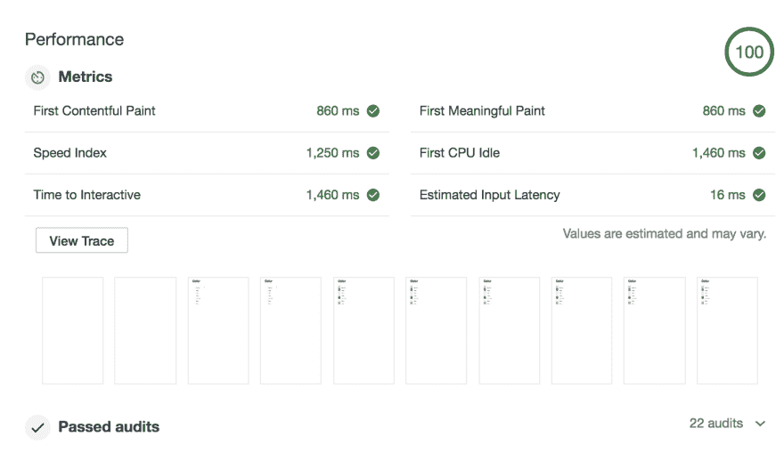
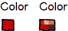
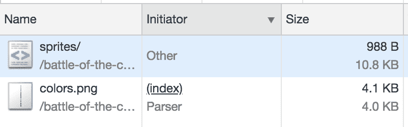
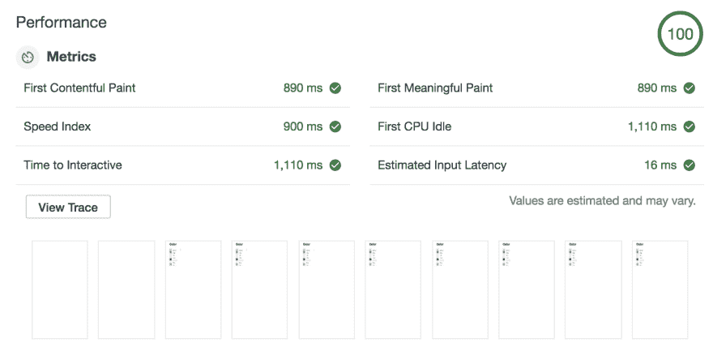
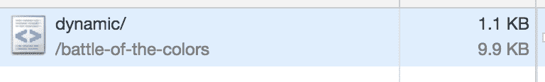
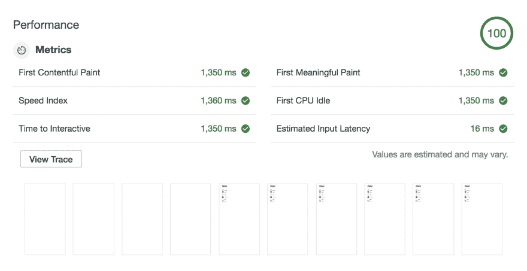
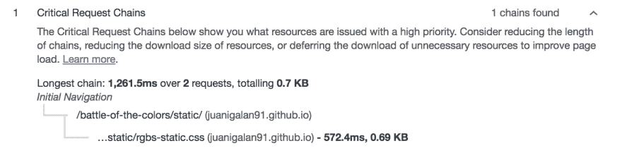
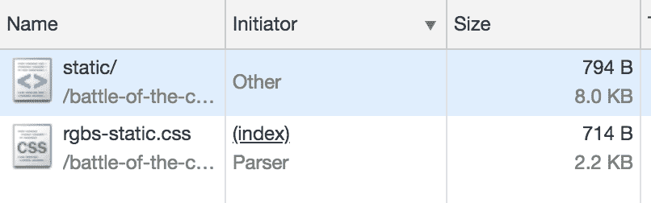

# 颜色之战

> 原文：<https://dev.to/juanigalan91/battle-of-the-colors-1m0n>

搜索过滤器是电子商务网站最重要的方面之一，让我们的客户能够提炼他们的结果，找到他们真正想要的东西。为了做到这一点，我们通常会尽可能地让这些过滤器有用和可用，因为我们希望它们真的有用，并为我们的客户提供良好的体验。从前端技术的角度来看，过滤器设计可能会变成一个需要解决的复杂问题，这会影响搜索结果页面的可用性、可维护性和性能。

## 我们的参赛者

在通过最受欢迎的电子商务网站做了一些研究后，我能够将这些实施分为以下几组:

*   具有动态样式的精灵:图像用于显示颜色，这些颜色位于精灵上，之后呈现的每种颜色都有一个内嵌样式，将背景位置设置为相应的颜色。
*   内嵌样式:每个选项的背景颜色都是通过内嵌样式设置的，带有对应的十六进制或 RGB 颜色的背景颜色属性
*   基于 Css 类:css 类是为每种特定的颜色定义的，有特定的命名约定。在渲染时，该类被添加到每个颜色过滤器选项，然后链接到 css 类，以及它们各自的 RGB 或十六进制颜色。

一旦我得到了最流行的实现，我决定在一个简单的环境中重新创建它们，并对以下内容进行评估:

*   性能:每个选项如何影响页面的每个依赖项的大小，以及页面完成加载的时间，特别关注关键的呈现路径
*   可维护性和可伸缩性:我们需要考虑将来实现会如何影响我们，以防我们需要以任何方式编辑颜色，或者可能改变整个过滤器
*   用户体验:非常重要的是，我们要考虑最终版本如何影响我们的用户，他们将如何使用我们的过滤器，以及与该过滤器的交互如何提高转化率和回报率。

对于实现本身，我想创建一个免费的外部依赖场景，以便有一个网站，只有 html，css 和图像依赖，没有客户端的 js。为了实现这一点，我创建了三个单独的 html 文件，每个文件都可以替换。

为了测试这一点，我用这三个 html 文件在 GitHub 上创建了一个[存储库，并通过 GitHub 页面访问它们:](https://github.com/juanigalan91/battle-of-the-colors)

*   [动态替代](https://juanigalan91.github.io/battle-of-the-colors/dynamic/)
*   [小妖精们的另类](https://juanigalan91.github.io/battle-of-the-colors/sprites/)
*   [静态替代](https://juanigalan91.github.io/battle-of-the-colors/static/)

此外，为了评估所有这些方面并尝试确定备选方案之间的差异，我使用了 Lighthouse Audits，并使用了来自 Google Developer Tools 的 Throttling Applied Fast 3G、4X CPU 减速来评估每个实现的性能和成本。

## 战斗集锦

没有进一步的延迟，这里是每个选项的结果。

### 小精灵

所以在渲染方面，sprites 替代方案花费了 860 毫秒在浏览器上渲染第一个内容。在这种情况下，它将是每种颜色的文本以及标题。由于我们使用图像显示这些颜色，检索该图像的请求不会阻碍我们的呈现，因此浏览器可以在显示带有该颜色的实际块之前显示每种颜色的名称。

这实际上是一件好事，因为这种方法允许我们向用户呈现一些有意义的东西(就像审计所说的那样)，最终增强他们的体验。看下面的例子，你认为哪一个包括你正在寻找的红色？

另外，有了图像，你可以提供一个更详细、更精确的过滤器，代表他们真正搜索的内容。想象一下，你正在寻找一件红色的衬衫，但是你不确定你想要哪种特定色调的红色。也许一个显示红色调色板的图像会让你作为一个用户更有信心，你要找的东西就在那个区域。

另一方面，我们显然需要获取包含每种颜色的所有图像的 sprite，这增加了加载时间和成本。这将影响 load 事件的触发，因为直到图像被下载后才会发生这种情况，这最终会使您在浏览器选项卡上看到的(每个用户都会看到并担心的)疯狂的旋转器旋转得更长一些。这就是为什么速度指数(页面可见的速度)和交互时间(页面完全交互的时间)发生在第一次内容丰富的绘制后 400 毫秒，因为页面尚未完全加载。但是，在下一次请求时，您的浏览器会缓存该图像。

此外，采用这种方法而不考虑在搜索特定类别或过滤列表时真正显示的颜色会导致向前端发送非常大的 sprite，并且可能最终使用其中的 2 或 3 种颜色，因为您正在显示的项目并不具有 sprite 上的所有颜色。

另外，如果不同的状态(悬停、选中)有不同的图像，这个 sprite 的大小会重复，这将增加应用程序的总大小。你当然可以为不同的场景创建几个精灵(也许是按类别)，但是这需要一些操作时间，而且这种场景的可维护性将是一项艰巨的工作。

### 动态样式

使用动态样式，我们可以看到第一个内容丰富的绘制和使用精灵花费的时间差不多。然而，当我们显示用户内容时，我们会自动显示每种颜色的名称及其对应的 RGB。我们可以通过分析速度指数和交互式 ms 的时间来了解这一点，它们比 sprite 场景更快。这意味着网站可以被认为更具交互性，因为浏览器显示页面全部内容的时间更快，我们允许用户在更短的时间内与之交互。

对于这种选择，HTML 的大小稍微小一点，因为设置背景位置所需的 css 比设置背景颜色所需的 CSS 要长。但是这里的差别不到 1KB，所以影响不会很大。另外，因为你只把你要用的颜色放在前端，过滤器越具体，你节省的字节就越多，因为颜色列表可能会越来越小。然而，当你的网站上有几个颜色过滤器时，比如原色和二次色，这种方法就不适用。这是因为每个过滤器都将使用自己的内联 css 进行渲染，这将使一些 css 重复出现。

### 静态样式

正如我们所看到的，所有的度量都比精灵和动态风格花费更多的时间。这是因为样式表的存在，它阻止页面的呈现，直到它被加载。我们甚至收到了 Lighthouse 关于样式表说明:

在这种情况下，我们不仅要下载 HTML 来呈现页面，还要等待 css 被下载，这样它们才能被处理和呈现。此外，所使用的样式表可能具有您需要的所有颜色，这将导致浏览器不使用该文件的一部分，因为不是所有的颜色都存在。另一方面，文件会被浏览器缓存，所以下一个请求会顺利得多。此外，如果您的网站上有几个颜色过滤器，将所有颜色集中在一个文件中会很有用。

从可维护性的角度来看，添加新的或更改颜色将导致生成新的样式表和部署，以及添加或更改我们创建的用于将颜色映射到 RGB 的类。此外，这产生了一个新的依赖关系，因为我们必须通过命名约定将颜色与它们的 RGB 相关联，这通常以颜色的 ID 结束。如果 ID 也发生了变化，我们也需要更新样式表。

## 获胜者是……

看一看选项，我们可以说，实际上没有赢家，而是一种更适合特定场景的方法。

如果你非常关注用户如何看待你的网站，并且想要提供一个非常个性化的体验，根据你所看到的内容使用不同的颜色和图案，那么使用精灵绝对是你的选择。但是请注意，你需要考虑到创建这些精灵和 css 来设置背景位置可能需要一些时间！

如果您的网站主要面向移动设备，并且您希望向最终用户交付尽可能少的内容，那么动态样式肯定适合您的情况。它将允许您只下载需要的内容，这将节省处理和加载时间，以及您的应用程序的总成本。你也可以利用这种可能性，在你的过滤器上显示一小组颜色，也许是最流行的颜色，然后让用户看到更多。一旦发生这种情况，您可以执行 AJAX 请求来检索完整的颜色列表，这将直接出现在 HTML 中。

最后，如果您有一个简单的场景，您只想显示一个没有自定义逻辑或不同风格的简单滤色器，那么使用静态选项就足够了。在构建单页应用程序时，您也可以利用这种技术，因为样式只需下载一次，在用户浏览应用程序的整个过程中都很有用。但是，要考虑到，如果您的应用程序在未来增长，这种替代方案可能会带来一些麻烦。

希望你喜欢这篇文章！如果你喜欢它，留下掌声或评论，我很乐意听到一些反馈！

如果你想了解更多关于关键渲染路径的知识，建议你看看 Udacity 关于 [Web 性能优化](https://www.udacity.com/course/website-performance-optimization--ud884)的免费课程。我认为这篇文章有更多的背景，我喜欢它！