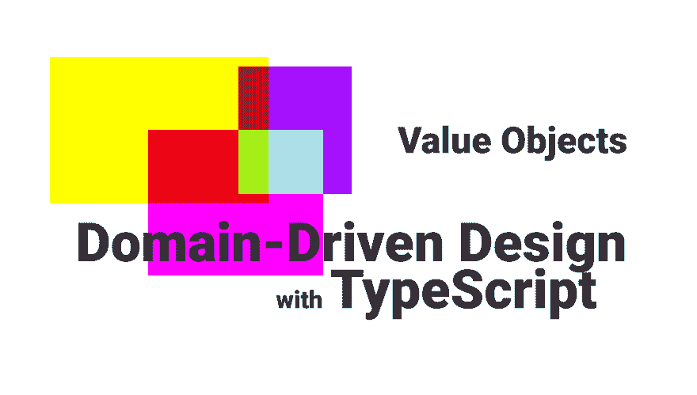

# 值对象-带类型脚本的 DDD

> 原文：<https://dev.to/stemmlerjs/value-objects-ddd-w-typescript-1g6e>

[](https://res.cloudinary.com/practicaldev/image/fetch/s--yU8Td0Pd--/c_limit%2Cf_auto%2Cfl_progressive%2Cq_auto%2Cw_880/https://thepracticaldev.s3.amazonaws.com/i/us0ww43xj3oqhe0qzy8m.png)

[原帖@ khalilstemmler.com](https://khalilstemmler.com/articles/typescript-value-object/)

在领域驱动设计中，值对象是帮助我们创建丰富和封装的领域模型的两个基本概念之一。

这两个概念是**实体**和**值对象**。

*值对象*最好通过理解它与实体的不同来理解。它们的主要区别在于我们如何确定两个值对象之间的**身份**，以及我们如何确定两个实体之间的**身份**。

### 实体标识

当我们关心模型的**身份**并且能够将该身份与模型的其他实例区分开来时，我们使用一个实体来建模一个领域概念。

我们确定身份的方式帮助我们确定它是一个实体还是一个值对象。

一个常见的例子是为用户建模。

在这个例子中，我们说一个`User`是一个实体，因为我们通过它的**唯一标识符**来确定一个`User`的两个不同实例之间的差异。

我们在这里使用的唯一标识符是一个随机生成的 UUID 或者一个自动增加的 SQL id，它变成了一个主键，我们可以用它从一些持久性技术中进行查找。

* * *

### 值对象

对于值对象，我们通过两个实例的**结构相等**来建立身份。

#### 结构相等

结构相等意味着两个对象具有相同的内容。这不同于**指称相等/相同**，这意味着两个对象*是相同的*。

为了区分两个值对象，我们查看对象的实际内容，并在此基础上进行比较。

例如，在`User`实体上可能有一个`Name`属性。

我们如何判断两个`Name`是否相同？

这很像比较两个字符串，对吗？

```
"Nick Cave" === "Nick Cave" // true

"Kim Gordon" === "Nick Cave" // false 
```

这很简单。

我们的`User`可以是这样的:

```
 interface IUser {
  readonly name: string
}

class User extends Entity<IUser> {
  public readonly name: string;

  constructor (props: IUser) {
    super(props);
    this.name = props.name;
  }
} 
```

这很好，但还可以更好。让我问一个问题:

> 如果我们想限制用户名的长度会怎么样？假设可以不超过 100 个字符，至少要 2 个字符。

一种简单的方法是在我们创建这个用户的实例之前编写一些验证逻辑，可能是在服务中。

```
class CreateUserService {
  public static createUser (name: string) : User{
    if (name === undefined || name === null || name.length <= 2 || name.length > 100) {
      throw new Error('User must be greater than 2 chars and less than 100.')
    } else {
      return new User(name)
    }
  }
} 
```

这并不理想。如果我们想处理编辑用户名的问题呢？

```
class EditUserService {
  public static editUserName (user: User, name: string) : void {
    if (name === undefined || name === null || name.length <= 2 || name.length > 100) {
      throw new Error('User must be greater than 2 chars and less than 100.')
    } else {
      user.name = name;
      // save
    }
  }
} 
```

1.  这里真的不适合做这个。
2.  我们只是重复了相同的验证逻辑。

这实际上是很多项目开始脱离范围的原因。我们最终在服务中放入了太多的领域逻辑和验证，而模型本身并没有准确地封装领域逻辑。

我们称之为**贫血领域模型**。

我们引入值对象类来封装验证应该在哪里发生，并满足我们模型的**不变量**(验证&域规则)。

### 值对象

我们以前有过这个，我们的实体的一个基本类。

```
interface IUser {
  readonly name: string
}

class User extends Entity<IUser> {
  public readonly name: string;

  constructor (props: IUser) {
    super(props);
    this.name = props.name;
  }
} 
```

如果我们要为`name`属性创建一个类，我们可以将`name`的所有验证逻辑放在这个类中。

我们还将使`constuctor`私有，并使用一个`static factory method`来执行必须满足的前提条件，以便使用`constructor`创建一个有效的`name`。

```
interface IName {
  value: string
}

class Name extends ValueObject<IName> {
  private constuctor (props: IName) {
    super(props);
  }

  public static create (name: string) : Name {
    if (name === undefined || name === null || name.length <= 2 || name.length > 100) {
      throw new Error('User must be greater than 2 chars and less than 100.')
    } else {
      return new User(name)
    }
  }
} 
```

然后更改`User`类，要求使用`IName`而不是字符串。

这里我们也将使用一个`static factory method`。

```
interface IUser {
  readonly name: Name;
}

class User extends Entity<IUser> {
  public readonly name: Name;

  private constructor (props: IUser) {
    super(props);
    this.name = props.name;
  }

  public static create (props: IUser) {
    if (props.name === null || props.name === undefined) {
      throw new Error('Must provide a name for the user');
    } else {
      return new User(props);
    }
  }
} 
```

## 值对象类

这是一个值对象类的例子。

```
 import { shallowEqual } from "shallow-equal-object";

interface ValueObjectProps {
  [index: string]: any;
}

/**
 * @desc ValueObjects are objects that we determine their
 * equality through their structrual property.
 */

export abstract class ValueObject<T extends ValueObjectProps> {
  public readonly props: T;

  constructor (props: T) {
    this.props = Object.freeze(props);
  }

  public equals (vo?: ValueObject<T>) : boolean {
    if (vo === null || vo === undefined) {
      return false;
    }
    if (vo.props === undefined) {
      return false;
    }
    return shallowEqual(this.props, vo.props)
  }
} 
```

查看`equals`方法。注意，我们使用`shallowEquals`来确定等式。这是实现`structural equality`的一种方式。

如果有意义的话，这个**值对象**基类的子类也可以扩展为包含像`greaterThan(vo?: ValueObject<T>)`或`lessThan(vo?: ValueObject<T>)`这样方便的方法。在这个例子中这是没有意义的，但是如果我们谈论的是像`LoggingLevel` s 或者`BusinessRating` s 这样的东西，这可能是有意义的

* * *

在以后的文章中，我们将讨论:

*   实体设计
*   更好的对象创建错误处理技术
*   将缺乏活力的代码从服务中转移到领域模型中
*   编写 dto 以创建数据协定

这是 TypeScript 系列的域驱动设计的一部分。如果这对你有用，请在评论中告诉我&订阅 newletter，以便在新文章发布时得到通知。干杯！

[学习企业打字稿-简讯](https://khalilstemmler.com/learn)