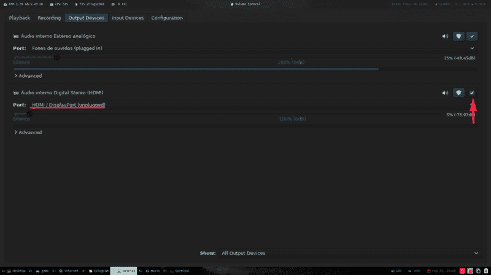

# usando pulse 音频无 HDMI

> 原文：<https://dev.to/tiagodanin/usando-pulseaudio-no-hdmi-c3f>

# Usando pulse 音频无 HDMI

迁移到手腕后，我尝试使用笔记本电脑的 HDMI 时遇到问题。HDMI 输出没有播放游戏、视频和音乐。

## 解决

Instalar o pavucontrol。

```
$ pacman -S pavucontrol 
```

Enter fullscreen mode Exit fullscreen mode

然后，我们可以打开 pavucontrol，导航到您的 HDMI 设备所在的位置，然后单击〖t0〗按钮。

[](https://res.cloudinary.com/practicaldev/image/fetch/s--XZer8mF2--/c_limit%2Cf_auto%2Cfl_progressive%2Cq_auto%2Cw_880/https://thepracticaldev.s3.amazonaws.com/i/4u3hu20aaa0iwg8rzq3j.png)

现在它是默认的音频输出设备。:)