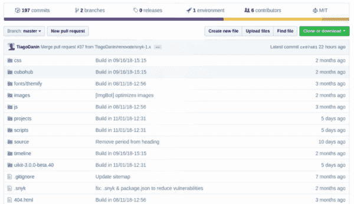

# GitHub 上的完美档案

> [https://dev . to/tiagodanin/o-profile-perfect-no-github-5co](https://dev.to/tiagodanin/o-perfil-perfeito-no-github-5cco)

我将提供一些技巧，说明如何在 GitHub 上创建可呈现的配置文件。

*   加入开源社区并为其做出贡献。最好的贡献项目是您正在使用或已经熟悉工具、软件包、应用程序甚至游戏的项目。
*   有组织的存储库。
*   我不会为两个不同的项目使用相同的存储库。
*   创建自述文件，其中应包含软件说明和安装说明以及如何使用这些说明。
*   在您的自述文件中具有通用的主题组织模式(您将在其他项目中使用这些主题作为起点)。
*   对于包含 package.json 文件的存储库，建议您使用 Json-to-Readme 或 Gen-README 程序包作为自述文件的起点。
*   作出承诺，描述所做的修改(没有“Update X.js”或“up”)。
*   选择许可证，网站选择 com . br 可以帮助您。
*   请勿将许多文件放在根目录中，最好使用子目录来组织文件。
*   使用“徽章”显示项目状态。神盾局. io 网站上有几个这样的网站
*   尽可能创建测试。
*   使用 CI(继续集成)工具构建并运行测试。我建议使用 Travis CI 他和 GitHub 的集成非常完美而且他还有徽章
*   为您的项目设置一个站点，这样在 GitHub 之外更容易找到它。如果您不想从头开始创建，请使用 GitHub Pages。
*   将您的 forks 分隔成一个组织。提示:您可以使用 bot [Pull](https://github.com/apps/pull) 使它们始终保持最新状态。
*   别搞砸了，记住，每个人都会看到你的代码。
*   避免响应问题或拉请求花费很长时间。
*   有可展示的个人资料照片和快速说明。

[github . com/training-center/forum/issues/23](https://github.com/training-center/forum/issues/23)上的其他建议。