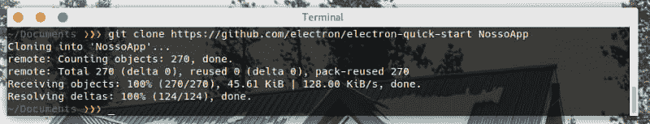
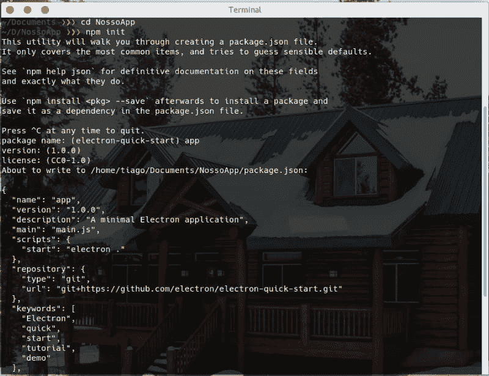
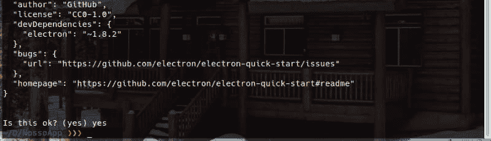
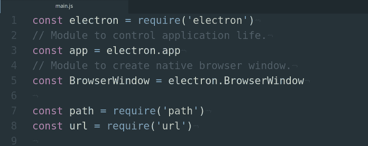
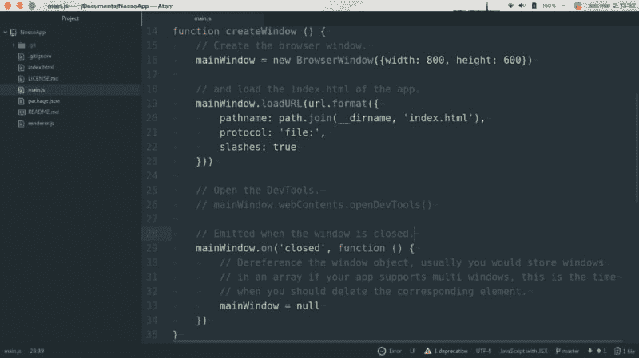
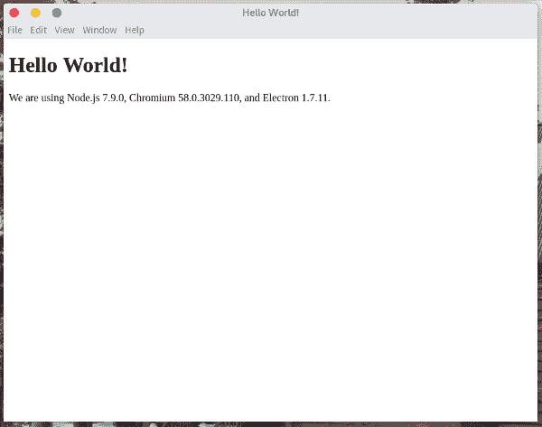
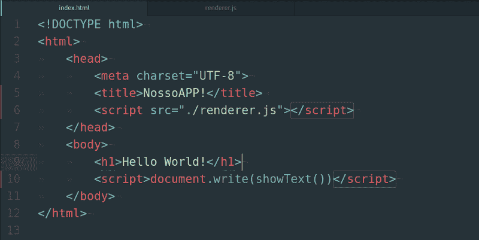
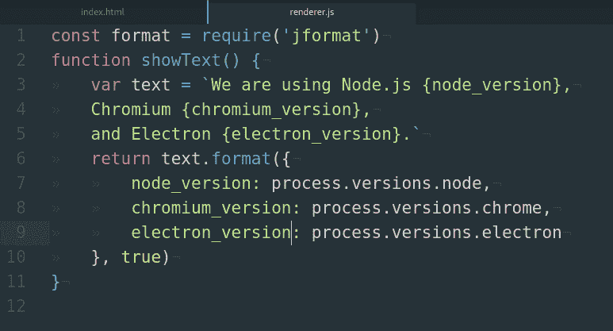

# 使用 electron 创建您的第一个应用程序

> [https://dev . to/tiagodanin/create-your-first-app-com-electron-14 o 6](https://dev.to/tiagodanin/crie-seu-primeiro-aplicativo-com-electron-14o6)应用程序

# 用电子创建自己的第一个应用程序

## 历史做电子

电子最初被称为 Atom Shell，因为它是 Github 开发的 Atom(代码编辑器)的“核心”，始于 2013 年 4 月。其源代码于 2014 年 5 月发布，2015 年 4 月更名为 Electron，这是一个很好的名称选择。

## 电子动力

*   利用 V8 引擎和 NodeJS 引擎。
*   支持主流操作系统(macOS、Linux、Windows)。
*   能够使用本机系统功能，如查看通知。
*   像 Spotify、微软和 Docker 这样的大企业。
*   您可以在 Microsoft Stote、Mac App Store 和 Ubuntu Store 等商店发布应用程序。

## Instalado o 电子

1.  首先，我们将为应用程序创建一个文件夹。

[](https://res.cloudinary.com/practicaldev/image/fetch/s--j_p7qCOP--/c_limit%2Cf_auto%2Cfl_progressive%2Cq_auto%2Cw_880/https://thepracticaldev.s3.amazonaws.com/i/lc101u4e1uaggm9l4oi6.png)T3】

```
$ git clone https://github.com/electron/electron-quick-start NossoApp 
```

Enter fullscreen mode Exit fullscreen mode

1.  并随后安装 NodeJS 和 NPM [参见此处](https://docs.npmjs.com/downloading-and-installing-node-js-and-npm)。

2.  Vamos editar o package.json。

[](https://res.cloudinary.com/practicaldev/image/fetch/s--c8q5AsYV--/c_limit%2Cf_auto%2Cfl_progressive%2Cq_auto%2Cw_880/https://thepracticaldev.s3.amazonaws.com/i/9ash95rifg3ue72f7bgf.png)
[T6】](https://res.cloudinary.com/practicaldev/image/fetch/s--vn1V2e29--/c_limit%2Cf_auto%2Cfl_progressive%2Cq_auto%2Cw_880/https://thepracticaldev.s3.amazonaws.com/i/ksyjcf8m6rh2g476wz5x.png)

1.  通过 npm 安装 o 电子。

```
$ npm install
# ou no modo global
$ npm install -g electron 
```

Enter fullscreen mode Exit fullscreen mode

1.  以您最喜欢的编辑器开启专案(我的是 Atom)

## 开始创建自己的应用程序

让我们看看‘t0’。
[](https://res.cloudinary.com/practicaldev/image/fetch/s--IavVdmR2--/c_limit%2Cf_auto%2Cfl_progressive%2Cq_auto%2Cw_880/https://thepracticaldev.s3.amazonaws.com/i/cksp8paykvbltehlwgw9.png)
[](https://res.cloudinary.com/practicaldev/image/fetch/s--klavUmMX--/c_limit%2Cf_auto%2Cfl_progressive%2Cq_auto%2Cw_880/https://thepracticaldev.s3.amazonaws.com/i/anuxvrtb5r5a3yk4zv6i.png)
以上功能创建 800x600 大小的窗口并加载我们的 index.html。

如果在`NossoAPP`文件夹中运行 electron 命令。

```
$ electron . 
```

Enter fullscreen mode Exit fullscreen mode

将加载一个包含 index.html 内容的窗口，该窗口与站点的工作方式非常相似-我...。

[](https://res.cloudinary.com/practicaldev/image/fetch/s--bj7_SPhb--/c_limit%2Cf_auto%2Cfl_progressive%2Cq_auto%2Cw_880/https://thepracticaldev.s3.amazonaws.com/i/0vjbfu8pgxtgpbxkommm.png)

**注:**index . html 提出`renderer.js`的请求。很快，同样的事情也会被电子处理。

现在让我们用一个为 NodeJS 制作的软件包来重构。在这个例子中，我将使用我的一个 jformat。

```
$ npm install jformat 
```

Enter fullscreen mode Exit fullscreen mode

编辑 index.js 和 renderer.js。

[](https://res.cloudinary.com/practicaldev/image/fetch/s--EsVcnJr---/c_limit%2Cf_auto%2Cfl_progressive%2Cq_auto%2Cw_880/https://thepracticaldev.s3.amazonaws.com/i/6zdfjd14vym6eugv3bbr.png)
[T6】](https://res.cloudinary.com/practicaldev/image/fetch/s--LMZRwRy8--/c_limit%2Cf_auto%2Cfl_progressive%2Cq_auto%2Cw_880/https://thepracticaldev.s3.amazonaws.com/i/wrtde1ojcod2siq797g0.png)

你看，我这样做是为了得到与我们第一次处决相同的结果，但我们现在使用的是 NodeJS 的力量。

在前端，我通常使用其中的一些框架:

*   温泉 UI
*   WinJS
*   UIKit

## 提示

JQuery 没有电子。

如果您在 electron app 中打开开发终端并键入“$”，则会得到这样的结果:
解决方法:使用窗口导入 jQuery。$

窗户。$ = require("。/jquery-3.min.js")

1.  重命名窗口。HTML 中的标签可以更改名称，但有另一种方法可以使用 nodejs:require(' electron ')app . set name(' my app name ')documentation electron documentation 非常详细，并且已翻译成其他语言。见 electronjs.org/docs