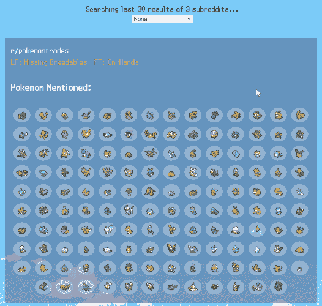
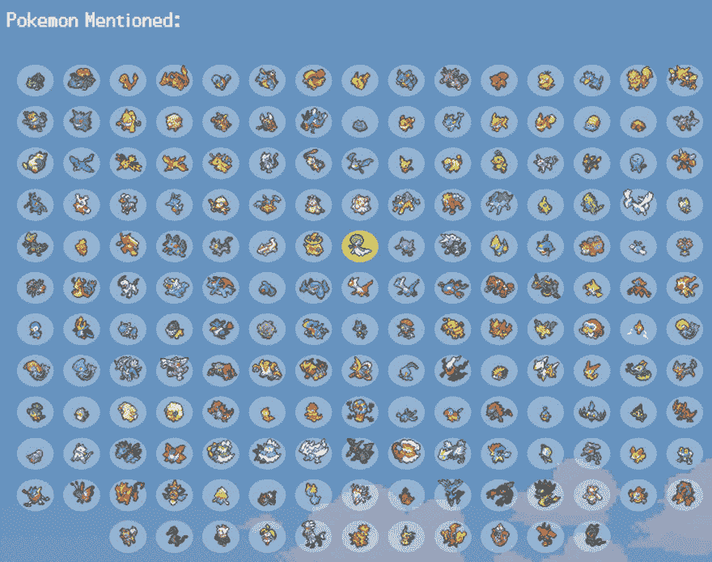

# 使用 Reddit 的 API 查找口袋妖怪交易

> 原文：<https://dev.to/misnina/using-reddit-s-api-to-find-pokemon-trades-2dlo>

项目[在这里](https://misnina.github.io/reddit-pokemon-trade-search/)

[](https://res.cloudinary.com/practicaldev/image/fetch/s--AeX6RXkd--/c_limit%2Cf_auto%2Cfl_progressive%2Cq_66%2Cw_880/https://thepracticaldev.s3.amazonaws.com/i/yqw7e7hb54gyfqjxixqc.gif)

从开始 React 以来，我几乎所有的项目不是基于口袋妖怪就是使用口袋妖怪艺术。？

我通过编码发现了一件奇怪的事情:整理数据很有趣？碰巧口袋妖怪包含了许多有趣的数据，可以进行分类，并与其他东西相匹配。所以我又一次带着 API 和一些口袋妖怪回来了，但是这次我们用的是 **Reddit 的 API** 。

## 目标

*   从各种子数据中获取数据
*   了解 Reddit 的 api 术语是什么
*   显示标题和帖子中提到的口袋妖怪
*   通过口袋妖怪的交易进行搜索

我们都拿到了吗？让我们看看发生了什么。

## Reddit 吗？

Reddit 是互联网上的一个地方，由用户运行的子编辑组成。每件事都有一个子编辑，事实上，每件事可能都有多个不同的规则。对于这个项目，我想要专门用于口袋妖怪交易的子编辑，经常更新，并使用类似的预修复。对于我选择的三个子条目，他们在大多数查找中都使用 LF *(寻找)*和 FT *(交易)*。现在我们继续讨论如何使用 reddit 的 api。让我们来分析一下我的第一个电话。

```
 axios.get(`https://www.reddit.com/r/pokemontrades/search.json?q=LF&q=FT&limit=30&restrict_sr=1&sort=new`) 
```

Enter fullscreen mode Exit fullscreen mode

好家伙，真长。简单部分:

```
 `https://www.reddit.com/r/pokemontrades/search.json?` 
```

Enter fullscreen mode Exit fullscreen mode

我们通过 reddit，然后我们指定 subreddit，然后开始搜索，得到一个包含所有信息的. json 文件。

```
 `/search.json?q=LF&q=FT` 
```

Enter fullscreen mode Exit fullscreen mode

我们问了搜索的两个问题。它含有 LF 吗？含有 FT 吗？如果真的很棒。我们也不能查询并获得所有的帖子，但我们希望剔除那些没有按照格式提问或更新的内容。

```
 `limit=30&restrict_sr=1` 
```

Enter fullscreen mode Exit fullscreen mode

有一个更严格的限制，100，但我真的不希望人们通过 300 个条目，所以我们只打算拉 30 个子编辑，总共 90 个列表。限制的好处是这都是一个 api 调用！下一部分，我们将搜索限制在我们定义的特定子编辑中。为什么？我不知道。如果你不这样做，它会在所有的子记录中查找，这是我们真的不需要的。

```
 `&sort=new` 
```

Enter fullscreen mode Exit fullscreen mode

如果你熟悉 reddit，这个很简单。Reddit 有多种模式，可以按历史排名、当前热门、最新等等进行排序。我们想要尽可能最新的交易，所以我们不是通过相关性，而是最新的交易来得到它们。

## 这个数据里有什么？

很多。不幸的是，还不够。我们可以浏览数据，进入被请求的 30 个孩子，得到大量的数据！我们可以得到文章标题，正文，flairs，mod 动作，以及...

不是日期？

当发出请求时，创建字段的日期为*。因为我刚刚请求了它，所以这是创建的日期，或创建的 utc。根据我的研究*，api* 的帖子没有时间戳。这打乱了我的计划。*

## 原计划

我打算使用查询来查找口袋妖怪相关的条目！因此，与普通的查询不同，我们会有这样的查询:

```
axios.get(`https://www.reddit.com/r/pokemontrades/search.json?q=Vulpix&limit=30&restrict_sr=1&sort=new`) 
```

Enter fullscreen mode Exit fullscreen mode

而那个**做**的工作。它将在这个子编辑中收集所有能找到的关于 vulpix 的帖子，最多 30 个。其中一些已经有*个月*大了。虽然我有过简单地提供数据的实践，但作为一种更静态的资源，我希望这至少有点用处。当然，我可以搜索特定的口袋妖怪，但没有办法有一个截止日期，这只是白噪声，使它看起来更强大，然后有用。

## 新的计划

缓存数据！不像本地浏览器中的缓存，因为一旦我们的内容是动态的，但采取我们的原始调用和使用数据。因此，你不用去找一堆关于某个口袋妖怪的旧东西，而是去看看哪个口袋妖怪在最新的 90 个帖子里被提到了。

```
return general.map((listing, i) => {
        let post = listing.data;
        let pkmnMentioned = this.getPKMNMentioned(post);
        if (pkmnMentioned.includes(pokemon, i)) {
          return <Entry
            key={post.title + i}
            subName={post.subreddit_name_prefixed}
            title={post.title}
            url={post.url}
            text={post.selftext}
            searchPokemon={this.state.searchPokemon}
            setSpecificAndPokemon={this.setSpecificAndPokemon}
          />;
        } else {
          return "";
        }
      }); 
```

Enter fullscreen mode Exit fullscreen mode

[](https://res.cloudinary.com/practicaldev/image/fetch/s--e6gXQjDO--/c_limit%2Cf_auto%2Cfl_progressive%2Cq_auto%2Cw_880/https://thepracticaldev.s3.amazonaws.com/i/2hk9fv91qxy06rjrwln8.PNG)

关键是要使用一个唯一的标识符，事实证明标题本身是*而不是*，因为在测试过程中有人重复发布，这真的打乱了我的渲染。吸取教训。searchPokemon 是一个状态变量，它保存了我们当前正在搜索的 Pokemon，因此我们可以传递它并突出显示我们正在寻找的精灵。我们也传递了设置状态和 bool 的能力，不管我们是否在搜索一个特定的口袋妖怪。

我最初让入口组件决定哪个口袋妖怪被提及，但是看起来 React 的情况是这样，你通常会找到一个理由将你的处理提升一个级别。上面提到的 getpkmnarray 只是运行 pokemonArray *(所有 pokemon 的数组，真的很长)*并搜索标题和自我文本*(正文)*以查看 pokemon 是否出现在它的数据中。Search 返回数据所在位置的编号，如果不在那里，则返回-1，所以我们只需查看该编号是否大于-1，以将其推送到 pokmemon 提到的数组中。因为大部分的提及都是在主体中进行的，所以我决定先这样做，如果主体没有返回特定的口袋妖怪，它就会在标题中搜索口袋妖怪，这样我们就不会重复和掩盖我们的基础。

```
{this.state.general[89] ? listings : "Loading..."} 
```

Enter fullscreen mode Exit fullscreen mode

简单地说，因为我们知道我们只搜索 90 个条目，所以我们可以用它来判断我们是否加载完了三个调用。我喜欢这个 api。注意，我实际上并没有为所有东西都写 this.state.value，我只是在文章代码中有它，所以你可以看到发生了什么。我应该做一个更复杂的加载动画的工作，但是与实际需要的加载时间相比，这似乎太微不足道了。

## 录入组件

因为我们从我们的条目*中取出了对口袋妖怪的搜索(或者更确切地说，在写这篇文章的时候我忘了把它取出来，感谢审查代码！)*比较稀疏。最重要的部分是，我们的图像名称去掉了特殊字符，并将其非大写，因此我们必须使用一点正则表达式的魔法来实现这一点。一点额外的魔法来转动什么是&amp；在自我文本中重新变成一个&。

```
import React from 'react';
import Sprite from './Sprite';

export default function Entry(props) {
  props.pkmnMentioned.forEach(pokemon => {
    let spriteName = pokemon
      .replace(/\s+/g, '-')
      .replace(/[.,':\s]/g, "")
      .replace(/♀/g, "-f")
      .replace(/♂/g, "-m")
      .toLowerCase();
    spritesMentioned.push(
      <Sprite
        key={pokemon}
        fullName={pokemon}
        name={spriteName}
        isSearched={pokemon === props.searchPokemon}
        setSpecificAndPokemon={props.setSpecificAndPokemon}
      />
    );
  })

  return (
    <div className="entry">
      <div className="subname">{props.subName}</div>
      <a
        href={props.url}
        target="_blank"
        rel="noopener noreferrer"
        className="title"
      >
        {props.title.replace(/(&amp;)/g, "&")}
      </a>
      <div className="sprites-container">
        <h3>Pokemon Mentioned:</h3>
        <div className="sprites">
          {spritesMentioned.length ? spritesMentioned : "None"}
        </div>
      </div>
    </div>
  );
} 
```

Enter fullscreen mode Exit fullscreen mode

### rel="noopener noreferrer "

让我们花一分钟，承认我做的事情，因为如果我不这样做，反应会对我大喊大叫。如果我在一个空白的目标中打开，React 告诉我，不使用 rel="noopener noreferrer "打开会有安全风险。让我谷歌一下，也许我们都会学到一些新东西。

"我们链接到的页面通过 window.opener 对象获得链接页面的部分访问权限。"。因此，有可能在 hover 上看似合法的链接上插入 javascript 来重定向到一个坏网站。那篇文章最有趣的部分是，谷歌只是接受了这一点作为*“这是当前网络浏览器设计所固有的，不能被任何一个网站有意义地减轻”*。

## 精灵组件

比条目更小的是 Sprite 组件。有可能只是将它插入到条目中，而不是它自己的组件，但是我觉得 Sprite 显示是一个足够重要的工作来保证它自己的组件。

```
import React from 'react';

export default function Sprite(props) {
  return (
    <div
      className={`circle ${props.isSearched ? 'highlight' : ""}`}
      key={props.name}
      onClick={() => props.setSpecificAndPokemon(true, props.fullName)}
    >
      
    </div>
  );
} 
```

Enter fullscreen mode Exit fullscreen mode

在完整版中，你可以通过下拉菜单选择要搜索的口袋妖怪，但我也希望能够点击精灵来搜索更多的口袋妖怪。我们保留了替代文本的全名，标题*(这样，如果你忘记了口袋妖怪的名字，但知道它看起来像什么，你可以悬停在上面)*，最重要的是，当我们改变搜索条件时，我们使用口袋妖怪的正确名称。circle 类和 highlight 类给出了我在它们周围放置的圆圈的外观，以及那个口袋妖怪是否是当前正在搜索的那个。

[](https://res.cloudinary.com/practicaldev/image/fetch/s--bZdvzeVj--/c_limit%2Cf_auto%2Cfl_progressive%2Cq_auto%2Cw_880/https://thepracticaldev.s3.amazonaws.com/i/sowdusy3fvqc04on2zxu.PNG)T3】

```
 circle {
      background-color: rgba(white, 0.3);
      border-radius: 50%;
      margin: 5px;
      cursor: pointer;
    }

    .highlight {
      background-color: rgba($link-color, 1);
    } 
```

Enter fullscreen mode Exit fullscreen mode

## 小回报 vs .膨胀

我开始做一件事，但我不确定这件事好不好？我想在我的渲染小返回语句。

```
 return (
      <div id="app">
        {this.state.specific ? lookSpecific : all}
        {searchAll}
        <div id="listing-container">
          {this.state.general[89] ? listings : "Loading..."}
        </div>
      </div> 
```

Enter fullscreen mode Exit fullscreen mode

真好。然而，它的前面是:

```
 const { general, specific, searchPokemon } = this.state;
    let listings = this.listings(specific, searchPokemon) || 0;
    const all = <header>Searching last 30 results of 3 subreddits...</header>;
    const lookSpecific = <header>Searching last 90 results for trades containing {searchPokemon}...</header>;
    let cantFind = listings.length ? "" : "Couldn't find any trades!"
    const lookups = pokemonArray.map((pokemon, i) => {
      return (
        <option
          key={pokemon + ` option`}
          value={pokemon}
        >
          {`${pokemon} #${i + 1}`}
        </option>
      );
    });
    const searchAll =
      <select
        onChange={e => this.setSpecificAndPokemon(true, e.target.value)}
      >
        <option
          key='none'
          value={null}
          onClick={() => this.setSpecificAndPokemon(false, null)}
        >
          None
        </option>
        {lookups}
      </select> 
```

Enter fullscreen mode Exit fullscreen mode

另一种方法是在 return 语句中定义它，但是你会得到这样的结果:在我看来这很难理解。

```
 const { general, specific, searchPokemon } = this.state;
    let listings = this.listings(specific, searchPokemon) || 0;

    return (
      <div id="app">
        {this.state.specific ?
          <header>Searching last 90 results for trades containing {searchPokemon}...</header>
          : <header>Searching last 30 results of 3 subreddits...</header>}
        <select
          onChange={e => this.setSpecificAndPokemon(true, e.target.value)}
        >
          <option
            key='none'
            value={null}
            onClick={() => this.setSpecificAndPokemon(false, null)}
          >
            None
    </option>
          {pokemonArray.map((pokemon, i) => {
            return (
              <option
                key={pokemon + ` option`}
                value={pokemon}
              >
                {`${pokemon} #${i + 1}`}
              </option>
            )
          })}
        </select>
        <div id="listing-container">
          {this.state.general[89] ? this.listings(specific, searchPokemon) || 0 : "Loading..."}
        </div>
      </div >
    );
  } 
```

Enter fullscreen mode Exit fullscreen mode

像这样把它们分开是错的吗，还是 render 语句就应该按照里面的内容顺序读？对 if 语句使用立即返回函数非常难看，但使用非常长的三元运算符也很难看。

```
 {(() => {
     if (ugly) {
       return <div> Man this is {`ugly`}.. </div>
     } else {
       return <div> But it's more informative? </div>
     }
   })()} 
```

Enter fullscreen mode Exit fullscreen mode

## 最后的想法

我觉得我已经对同一个项目做了三次修改，但是每次我都学到了一些东西。至少对我来说，想出我力所能及的好主意是很难的。由于朋友的帮助，我对一些游戏有了一些想法，但我不太愿意为了游戏的目的而投入 React，尽管我认为它会对我的 React 技能有很大帮助。我想这个想法有点太大了，所以我需要找到一个小游戏的想法。或者停止做 React，为特定的体验制作 Wordpress 主题，但那只是*没有那么有趣*。也许，只是也许，下次我会做一些**而不是**口袋妖怪相关的事情。