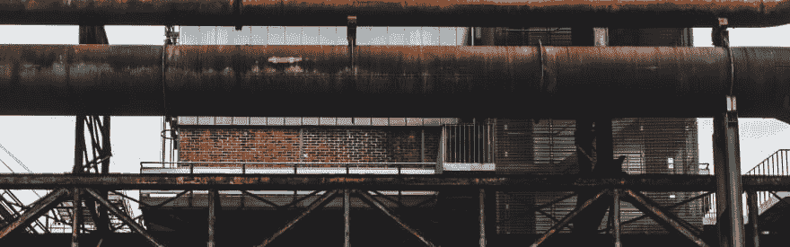

# 使用无人机 CI 更快地构建 Docker 映像，但不那么激烈

> 原文：<https://dev.to/pvsune/building-docker-images-with-drone-ci-faster-but-less-furious-5chl>

如果你正在寻找一个简单但可扩展的开源 CI 平台，你现在可以停止寻找，转到 [https://drone.io](https://drone.io) 。无人机 CI 是一个相当新的平台，为您的持续交付工作流提供动力。它是开源的，容器原生的，可以用预制的插件扩展，并且非常容易设置。事实上，在安装完成后，有一件事会让你非常恼火，那就是 Docker 层缓存。

Drone 中的缓存不是本地处理的，而是可以通过自定义插件来实现。AWS S3 (plugins/s3-cache)、GCP 云存储(homerovalle/drone-gcs-cache)、主机卷(drillster/drone-volume-cache)，甚至通过 SFTP 与外部服务器(appleboy/drone-sftp-cache)都有缓存神器的插件。当您想要构建一个映像并使用 DinD (Docker 中的 Docker)将其推送到 registry 时，问题就出现了。例如，要在 AWS ECR 中构建和推送图像，您将使用在内部使用 DinD 的 plugins/ecr。因为它在 docker-ception 内部，所以在构建步骤中创建的工件不容易获得。可用的是 Docker 层，你可以使用插件来缓存，但我不认为这是一个好主意。还好有更好的办法！从 Docker 1.13 开始，docker build 命令可以接受- cache-from 参数，该参数将标记的图像指定为缓存源。这将提取指定缓存源的图像，并且仅从底部构建层，直到构建结束时有所不同。你可能会想这太棒了。确实是。但是要注意一些注意事项:
因为它将提取缓存源图像，所以要确保它的字节数很少。你可能会对拉它的时间感到愤怒。
如果您最终更改了导致底层更新的内容，那么指定缓存源可能没有任何影响。

此外，您还可以更改 DinD 使用的存储驱动程序，以减少 I/O 开销。Docker 中的存储驱动程序管理各层如何读/写文件。选择 DinD 使用的存储驱动程序的最佳方法是将其与主机相匹配。您可以通过主机中的 docker 信息进行检查。很可能它与 DinD 的默认值 vfs 不匹配。vfs 存储驱动程序做了一些开销，因为它将文件从 Docker 层深拷贝到可写层；但是这样做可以使它兼容大多数环境(例如 Windows、Linux、Mac)。对于 Linux 机器，通常使用 overlay2。

现在，您可能正在查看您的. drone.yml 文件，并且想知道“我到底如何指定缓存源映像和存储驱动程序？”。不要那么愤怒。如果您正在推送至 Docker Hub 并使用 plugins/docker，您可以指定 storage_driver 设置，然后将环境变量 PLUGIN_CACHE_FROM 设置为您的缓存源映像。另一方面，如果您正在推送到 AWS ECR 或其他注册表，可能没有 storage_driver 设置；相反，您必须设置 PLUGIN_STORAGE_DRIVER 环境变量。无人机 CI 相当新，这些东西还没有记录在案。但是它是开源的，检查它是一个很好的实践。:)

本文的其余部分展示了示例配置和构建前后的时间。祝你愉快！