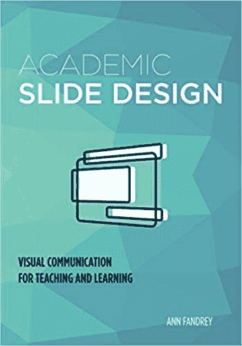

# 书评:学术幻灯片设计

> 原文：<https://dev.to/wiredferret/book-review-academic-slide-design-by-ann-e-fandrey-4j9h>

这本书是“学术性”的，但对于写技术/软件演示文稿的人来说，它也是一个极好的资源。我们经常面临的问题是，试图以一种既服务于主要听我们讲话的人，也服务于阅读幻灯片的人的方式传达真正重要的概念，要么是因为他们说的不是同一种语言，要么是因为这是他们吸收信息的最佳方式。

这本书充满了可操作的、清晰的、基于研究的建议，告诉你如何设计既清晰又有影响力的幻灯片。我强烈推荐给其他试图设计演讲台或网上研讨会材料的人。

> 学生越快理解幻灯片的意思，他们就能越快将注意力转移到你身上。

阅读 if:你想要比“这是我的 TED 演讲的样子”更科学一点的东西。

跳过如果:你觉得你已经很好的掌握了视觉信息设计，你不喜欢学习新的东西。