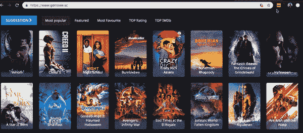

# 鼠标悬停时的 IMDB 评级- II

> 原文：<https://dev.to/dhilipkmr/imdb-rating-on-mouse-hover-ii-2oa5>

[](https://res.cloudinary.com/practicaldev/image/fetch/s--qYIlCb6X--/c_limit%2Cf_auto%2Cfl_progressive%2Cq_auto%2Cw_880/https://thepracticaldev.s3.amazonaws.com/i/a4txwrjzdxt3lvq1xzyw.png)

请阅读第一部分[此处](https://dev.to/dhilipkmr/imdb-rating-on-mouse-hover-1ij6)了解连续性。

### 第四步:通过 content.js 在 DOM 中启动监听器

```
/* Mouse over Event handler */
function listenToMouseover() {
  loadCssToHead();
  window._imdb_minWaitfBeforeExecute = undefined;
  document.body.addEventListener("mouseover", function(e) {
    var x, y;
    e = e || window.event;
    x = e.clientX;
    y = e.clientY;

    /* Avoid Recognizing words inside callout || _imdb_calloutElt => callout Element */
    var calloutPositions = typeof(window._imdb_calloutElt) !== 'undefined' ? window._imdb_calloutElt.getBoundingClientRect(): {};
    if (typeof(window._imdb_calloutElt) !== 'undefined' && x <= (calloutPositions.width + calloutPositions.left) && x >= calloutPositions.left && y <= (calloutPositions.top + calloutPositions.height) && y >= calloutPositions.top) {
      return;
    }
    /* Debounce Start */
    clearTimeout(_imdb_minWaitfBeforeExecute);
    _imdb_minWaitfBeforeExecute = setTimeout(findIMDB.bind(this, x, y), 250);
    /* Debounce End */
  });
} 
```

当用户点击扩展时，我们调用`listenToMouseover()`函数。

*   将 css 附加到头部。把这当作一个练习。(我们在这里这样做是因为当用户不打算激活我们的扩展时，它不会加载我们的 CSS)
    **此外，请确保您设置的元素的类名是唯一的，并且不会与网页的现有类名重叠。**

*   我们在文档体上为`mouseover`添加了一个事件监听器。

*   当用户移动指针时，通过`e.clientX`和`e.clientY`获取鼠标指针坐标

*   我们将打开一个成功弹出窗口。我们不希望我们的扩展识别弹出窗口中的文本。所以，我们增加了避免它的逻辑。我们通过计算我们的调用所在的坐标来做到这一点，并不认为它是有效的文本悬停。

*   `mouseover`是一个昂贵的事件，就像`scroll`一样，即使是一个小小的动作也会被解雇无数次。因此，为了避免这种情况，我们在开始寻找 IMDb 之前，检查鼠标是否至少在坐标上停留了 250 毫秒。点击这里，阅读 javascript [中的去抖技术。](https://codeburst.io/throttling-and-debouncing-in-javascript-b01cad5c8edf)

*   当用户在一个坐标上超过 250 毫秒时，我们通过传递坐标作为参数，尝试通过`findIMDB()`函数找到 IMDb。

### 第五步:找到悬停元素内的文本

```
function findIMDB(x, y) {
  var element = document.elementFromPoint(x,y);
  var text = '';
  // NETFLIX Specific changes
  if (window.location.href.includes('netflix.com/browse') && element.classList.value === "bob-play-hitzone") {
    text = element.parentElement.children[2].getElementsByClassName('bob-title')[0].innerText.trim();
  } else {
    text = (element && element.innerText) ? element.innerText.trim() : '';
  }

  /* Check if Previous text found is not equal to Current Text found and Text length less than 35 to avoid big sentences from Recognizing */
  if (text && window._imdb_finderText !== text && text.length < 35) {
    window._imdb_finderText = text;
    chrome.runtime.sendMessage({
      type: 'callAPI',
      text: text
    });
    window._imdb_posx = x;
    window._imdb_posy = y;
    console.log("Message Sent: " , text);
  }
} 
```

`document.elementFromPoint(x, y)`帮助我们在给定的 x 和 y 坐标中找到 DOM 元素。

*   第 5 行和第 6 行包含特定于网飞的更改，其中元素变量由于覆盖而没有给出实际的文本。
*   一旦我们得到了元素，我们就找到了`innerText`并将它存储到一个变量中。
*   如果用户停留在一个长句子上，我们会进行不必要的 API 调用，所以我们将文本限制为 35 个。如果电影名称超过 35 :P，它会中断
*   如果我们得到一个文本，那么我们使用“chrome.runtime.sendMessage”向`background.js`发送一条消息来调用 API 并得到响应。我们也可以在 content.js 中调用，但我选择在后台脚本中进行，如果在 Chrome 网络瀑布中看到，它不会干扰树中的其他 nw 调用。
*   为调用的 x 和 y 值设置窗口变量。这样我们就可以在那里添加弹出窗口(_imdb_posx && _imdb_posy)来获得响应。[我们很快会谈到这一点]

### 第六步:从 background.js 调用 IMDb API

```
chrome.runtime.onMessage.addListener(function(request, sender, sendResponse) {
  if (request.type == "callAPI") {
    getIMDBRating(request.text).then(function(response) {
      data = JSON.parse(response);
      if (!data.Error) {
        data.type = 'ratingResponse'
        chrome.tabs.query({active: true, currentWindow: true}, function(tabs) {
          chrome.tabs.sendMessage(tabs[0].id, data)
        });
      } else {
        console.log('No movie Found');
      }
    });
    return true;
  }
});

function getIMDBRating(text) {
  return new Promise(function(resolve, reject) {
    var xhttp = new XMLHttpRequest();
    xhttp.onreadystatechange = function() {
      if (this.readyState == 4 && this.status == 200) {
       return resolve(this.responseText);
      }
    };
    var urlParam = text.split("  ").join('+');
    xhttp.open("GET", _imdb_api_url + urlParam + _imdb_apikey, true);
    xhttp.send();
  });
} 
```

[](https://i.giphy.com/media/a5viI92PAF89q/giphy.gif)

我们在 background.js 中有一个消息监听器，它在接收到来自 content.js 的消息时被执行

*   类型是我们从 content.js 传递的`callApi`
*   `getIMDBRating()`函数进行 API 调用并得到响应。
*   顺便说一下，API URL 和 API 键是隐藏的。你可以在[这里](http://www.omdbapi.com/)给自己买一个。
*   将响应作为消息发送给将消息发送给后台 js 的选项卡，以使用 **chrome.tabs.query** 进行 API 调用

### 第七步:加载弹出窗口

```
function hasGotMessage(response, sender, sendResponse) {
  switch (response.type) {
    case 'clickResponse':
      window.sessionStorage.setItem('_imdbRaterEnabled', "1");
      listenToMouseover();
      break;
    case 'ratingResponse':
      loadCallout(response);
      break;
  }
}

function loadCallout(data) {
   if (window._imdb_calloutShown) {
    removeCallouts();
  }
  /* Popup rendering Start */
  var innerComponents = getInnerComponentHTML(data);
  /* parent div start*/
  var imdbElement = document.createElement('div');
  imdbElement.style.position = "relative";
  imdbElement.className = "_imdbClass";
  imdbElement.innerHTML = innerComponents.absElt + innerComponents.title + innerComponents.plot +
                          innerComponents.genre + innerComponents.awards+ innerComponents.line1 + innerComponents.rottenTomatoes +
                          innerComponents.metacritic + innerComponents.readMore +'</div>';
  /* parent div end */
  var childElt = imdbElement.children[0];
  findRefinedXandYcoordinates();
  childElt.style = 'position: fixed;top: ' + _imdb_posy + 'px; height: ' + 250 + 'px; left: ' + _imdb_posx + 'px;display: flex;flex-direction: column;justify-content: space-around;';
  document.body.append(imdbElement);
  /* Render Callouts End */
  window._imdb_calloutShown = true;
  window._imdb_calloutElt = childElt;
  window.onscroll = removeCallouts;
} 
```

在将响应作为消息发送给 content.js 时，我们识别类型并调用`loadcallout()`函数。

我们删除现有的弹出窗口，如果有的话。同样在卷轴上我们将删除它。通过 callout 元素的父类名或 id 来标识它们。[尝试将此作为练习]
将响应传递给`getInnerComponentHTML`，它将把所需的 HTML 模板作为字符串，并将响应数据放在适当的位置。然后通过将元素直接附加到主体并使其**固定来将元素加载到 DOM 中，并赋予 top 和 bottom 与 API 调用时光标所在的位置相同的值。**

> ***注:*** *我们把它固定，直接追加到身体上。有助于避免重叠。*

*   如果电影名称显示在角落，则`findRefinedXandYcoordinates()`有助于计算新坐标。(可以通过将 x 或 y 的坐标减少弹出窗口的宽度来实现)。

如果你已经做到这一步，你应该有一个悬停扩展工作 IMDb:)

[扩展的链接](https://chrome.google.com/webstore/detail/imdb-ratings/aodmmndimojddogmhmpaemocbibnimkl?authuser=1)

[](https://res.cloudinary.com/practicaldev/image/fetch/s--JzvX_GFd--/c_limit%2Cf_auto%2Cfl_progressive%2Cq_66%2Cw_880/https://thepracticaldev.s3.amazonaws.com/i/uuhmi5khh4aax881zj51.gif)

关注我获取您订阅源中的有趣内容:)
[](https://i.giphy.com/media/4GLrlgJAl9JHq/giphy.gif)

## 那都是乡亲:)