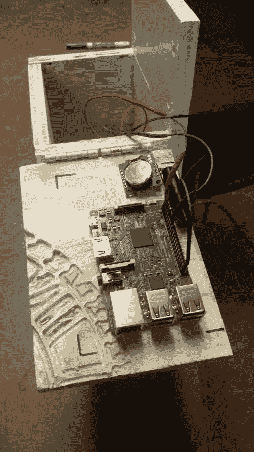

# 树莓码头气象站与安全的煤斗

> 原文：<https://dev.to/rickcarlino/raspberry-pi-weather-station-with-secure-scuttlebutt-39f3>

# 一个安全的小道消息气象站

[Secure catgobutt](https://scuttlebot.io/more/protocols/secure-scuttlebutt.html)是一个复制的点对点日志数据库。

它是独一无二的，因为理论上可以创建一个没有互联网接入的复制节点的网格。信息是通过本地 WiFi“八卦”的。当用户在 wifi 网络之间移动时,“八卦”也随之移动，使得朋友(以及朋友的朋友)能够通过社交网络传递数据。(参见:[单边带协议指南](https://ssbc.github.io/scuttlebutt-protocol-guide/))

目前，SSB 用于围绕聊天、微博和文件共享的社交应用。最受欢迎的应用是 [Patchwork](https://github.com/ssbc/patchwork) (桌面)和 [Manyverse](https://www.manyver.se/) (移动)，它们可以被认为是点对点的 Twitter 类似物。SSB 的八卦让它非常适合这类应用。

我还没有看到 SSB 用于远程传感器网络，鉴于该协议的延迟容限和存储不可变日志数据的能力，我认为这是一个很好的用例。

本月的项目创建了一个气象站，使用单边带作为互联网连接的替代品。天气日志通过数据骡传输，直到它们最终到达具有互联网连接的对等点，在这一点上，天气数据到达互联网上 SSB 用户的全球网格。

用更实际的话来说:

1.  远程位置的一个始终脱机的盒子收集数据。
2.  一个数据骡子连接到气象站的内部 wifi 网络，而 Manyverse(移动 SSB 客户端)在数据骡子的移动电话上是打开的。网络只是一个局域网，远程站点没有互联网接入。
3.  几秒钟之内，气象站执行 UDP 对等点发现并交换八卦消息。
4.  数据骡子回家了。
5.  当数据骡连接到家中支持互联网的 wifi 网络时，数据就会被传到更广泛的 SSB 社区(被称为“Scuttleverse”)。

# 见其行动

如果你想亲自查看天气日志，你可以在 Scuttlverse 上关注它的身份:

```
@siAx0bQUNVIS3IH2d++o44atOzn8h7BuoULySDiKrHc=.ed25519 
```

Enter fullscreen mode Exit fullscreen mode

[](https://res.cloudinary.com/practicaldev/image/fetch/s--MhPI8GGf--/c_limit%2Cf_auto%2Cfl_progressive%2Cq_auto%2Cw_880/https://rickcarlino.cimg/2019/weather_station/patchwork.png)

[](https://res.cloudinary.com/practicaldev/image/fetch/s--ZqZaVU2P--/c_limit%2Cf_auto%2Cfl_progressive%2Cq_auto%2Cw_880/https://rickcarlino.cimg/2019/weather_station/enclosure.jpg)

# 我们如何建造它

这是一个[自定义 NodeJS 应用程序](https://github.com/FoxDotBuild/WeatherStation),有一些依赖关系:

*   `node-dht-sensor`:用于读取连接的温度传感器。
*   `ssb-client`:用于写入只附加的 SSB 提要。

应用程序每天以及在启动时读取一次温度。该读数被写入机器的 SSB 日志，以便以后可以传播和复制。

### 零件清单

*   木箱(定制)
*   DHT-22
*   实时时钟
*   树莓 Pi 3(pi0 太慢)
*   [RaspAP-GUI](https://github.com/billz/raspap-webgui) (为 UDP 对等点发现创建一个 WiFi LAN)
*   USB 电池组

### 操作

启动时，`systemd`启动两项服务:

*   `ssb-server`，它提供了一个基于 HTTP 的 API，用于读写 SSB 提要。
*   上一节详细介绍的自定义节点应用程序。

这些服务在后台运行，并在启动时和每 24 小时轮询一次温度更新。

完整的源代码可以在 Github 上找到[。](https://github.com/FoxDotBuild/WeatherStation)

### 改进

这是一个业余爱好项目。像所有爱好项目一样，它既不完美，也不适合真实世界的条件。如果我们在这个项目上花更多的时间(我们可能不会)，我会:

*   使用深度睡眠来保存电池
*   添加一个太阳能电池，以获得更好的离网支持(我们把它放在一个有电网供电的地方)
*   自动化构建过程(目前，设置是一个手动过程)
*   构建一个查看器应用程序，而不是以`"type": "post"`的形式发布消息。一些用户认为天气预报是拼凑起来的“噪音”。