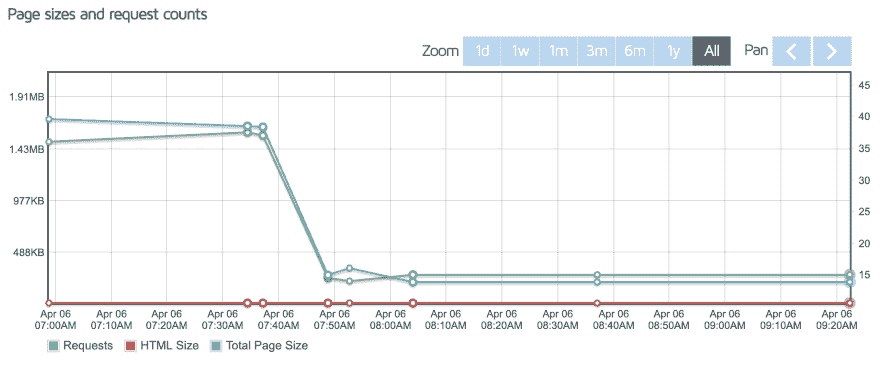
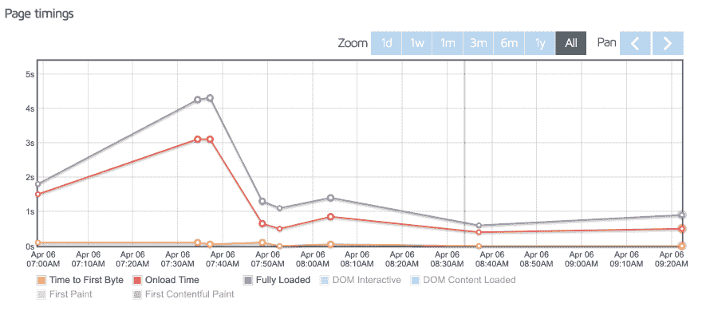

# 我如何用 Cloudflare 和 CircleCI 让 MrPowerScripts.com 网站在 GitHub 页面上快速运行

> 原文：<https://dev.to/mrpowerscripts/how-i-made-the-mrpowerscripts-com-website-fast-on-github-pages-with-cloudflare-and-circleci-4cpi>

我的网站最近表现不佳。在 Google PageSpeed Insights 上，我得到了大约 99 分。我最近看了一下，它跌到了 44。44!这篇博客的全部目的是[了解更多关于 SEO 的知识](https://www.youtube.com/watch?v=5YsFoEY7Ulo&list=PLqpaLALjc1lwz6nHCgsP98xYX_Ykawh3J)。谷歌页面排名和一般 SEO 排名最重要的指标之一就是你网站的速度。44 是不可接受的。我需要快速改变一些东西，使网站快速。我甚至有图表来显示速度有多快。等着看结果吧！

由于网站[是通过 GitHub Pages](https://github.com/MrPowerScripts/MrPowerScripts.com) 托管的开源回购，我无法控制服务器端的托管决策。比如缓存设置，以及其他各种有助于提高网站性能的技术。你知道什么对改善网络资产的交付是真正伟大的吗？CDNs。内容交付网络。

Cloudflare 是网络上最大的 cdn 之一。老实说，我并没有尽全力去解决这个问题。他们发布了自己的[伟大的博客文章](https://blog.cloudflare.com/secure-and-fast-github-pages-with-cloudflare/)，讲述如何在 GitHub 页面前建立他们的服务来缓存所有的东西。一旦我使用免费计划在他们的服务上配置了 MrPowerScripts.com，我所要做的就是在 NameCheap 中更新我的域名服务器来使用他们提供给我的。从那里，Cloudflare 处理所有的缓存和对站点的请求。极大地减少了页面大小和加载时间。亲自检查结果:

首先，页面下载的大小要小得多。它从大约 1.5MB 增加到大约 205KB。那是巨大的。整个网站的大小减少了 1MB 以上。此外，查看渲染站点所需的请求数量。它从大约 38 个请求增加到大约 15 个。是的，它减少了一半以上的请求数量。太神奇了！所有这些导致了下面的图表。

以前，加载整个网站需要 4 秒多的时间。这并不意味着 4 秒钟就能看到页面上的内容。这只是意味着整个网站完成加载。包括各种后台请求。现在，整个网站加载不到一秒钟。这些都是惊人的结果！Cloudflare 允许我缓存所有站点资产，并将其缓存长达 8 天。然后，缓存将被清除。

这就产生了一个问题。如果我更新网站呢？Cloudflare 将提供他们存储的缓存网站，而不是我推送到 GitHub 页面的最新更新。不过，Cloudflare 有一个很好的 API，所以我将 CircleCI 连接到我的 GitHub 存储库，以便在每次推送提交时运行一个作业。该作业向 Cloudflare 发送一个 API 请求，告诉它清除缓存。下一个访问该网站的人将看到它的最新版本，Cloudflare 将重建缓存。您可以在这里看到[circle ci 配置文件](https://github.com/MrPowerScripts/MrPowerScripts.com/blob/f41b5b2a8d51b5f80f4d7da9bab33368d3b602c3/.circleci/config.yml)和执行缓存清除的 api 调用。CircleCI 有一个慷慨的开源计划(是免费的。那是相当慷慨的)。这并不完美。它可以被优化为只清除某些页面的缓存，但它对我的简单的小博客有效。

所有这些都没有花费我任何钱，因为我使用了每个应用程序的免费层，现在我的网站又一次超快了。

如果你想看到更多关于网站改进的统计数据，你可以[查看我从](https://gtmetrix.com/reports/mrpowerscripts.com)得到的实时结果。