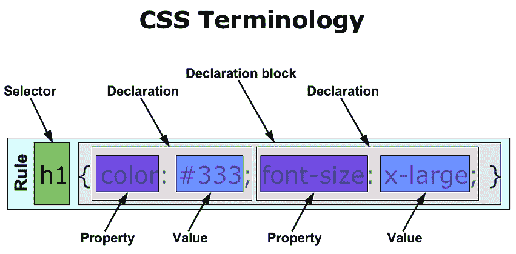
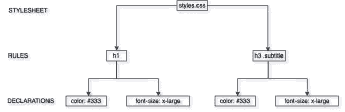

# 解析开源:Tailwind CSS

> 原文：<https://dev.to/mariowhowrites/parsing-open-source-tailwind-css-39j7>

也许没有一个工具像 Tailwind CSS 那样在发布后立即进入我的开发人员工作流程。我一直是 CSS 的超级粉丝。我第一次涉足 web 开发是为了修改我的 WordPress 博客的侧边栏，那时候我还不知道 CSS 是什么，也不知道它是如何工作的。

然而，自从我热爱 CSS 作为一种语言以来，我一直在努力在我的项目中扩展 CSS。无论我如何组织我的样式表，我总是在我的代码中到达一个点，在那里我太害怕接触任何东西。我的样式表被安排得像一座纸牌搭建的房子，一有定制的迹象，就随时会分崩离析。

正是因为这个原因，我采用了 Tailwind CSS 的基于实用程序的方法。然而，我总觉得它有点像黑匣子:我编辑一个 JavaScript 文件，在我的`package.json`中添加一行，然后砰！CSS。因此，在解析开源的这些章节中，我将深入探究 Tailwind CSS 的内部工作原理。

这第一章将涵盖对 Tailwind CSS 代码库的顶级概述。这既包括 Tailwind 架构的细节，也包括它如何与 PostCSS 交互，PostCSS 是构建 Tailwind 的框架。第二章将研究更具体的实现细节；包括所有细节的这个专栏的原始草案既长又吓人，这与我在这个系列中的意图相反。

我这个系列的目标有两个:第一，帮助揭开检查开源代码过程的神秘面纱；第二，帮助提高我自己对大型 JavaScript 项目是如何组织和实现的理解。

## 顺风顺水

最终，Tailwind CSS 是一个 PostCSS 插件。所以为了理解 TailwindCSS 的工作原理，理解 PostCSS 的工作原理是有帮助的。

PostCSS 是一个强大的库，有一个看似简单的 API。本质上，它做两件事:

1.  将 CSS 文件转换成 JS。
2.  将 JS 文件转换成 CSS。

为什么要把 CSS 转换成 JS，反之亦然？

CSS 是一种非常强大的语言，但是它缺少许多定义图灵完全语言的脚本特性。它没有循环、递归等。，并且不提供以编程方式生成自身的简单方法。

这些特性在 JavaScript 中都有。通过将 CSS 转换为 JavaScript，开发人员可以使用 JavaScript 等脚本语言的所有编程能力来修改 CSS、添加新规则等。

然后，一旦 JavaScript“样式表”被定制成开发人员喜欢的样子，PostCSS 就提供一个 API 将 JavaScript 转换回 CSS 文件，准备在互联网上的每个网站上使用。

用一个科学术语“2deep4me”来描述 PostCSS 是如何实现这一点的。然而，了解 postscs 如何处理与 JavaScript 之间的转换是很重要的，因为这些细节在整个 Tailwind 中使用的 PostCSS API 中公开。

基本上，当 PostCSS 将 CSS 转换为 JavaScript 时，它选择将样式表信息存储在一个名为**抽象语法树(AST)的数据结构中。ASTs 是那些听起来比实际复杂得多的计算机科学概念之一。**

在继续之前，让我们快速复习一些 CSS 术语。这是我在网上找到的一个图表，它详细分析了一个给定的 CSS 规则:

[](https://res.cloudinary.com/practicaldev/image/fetch/s--S3akhzVR--/c_limit%2Cf_auto%2Cfl_progressive%2Cq_auto%2Cw_880/https://i.imgur.com/RIW7J2A.png)

来源:[https://ryanbroome . WordPress . com/2011/10/13/CSS-cascading-style-sheet/](https://ryanbroome.wordpress.com/2011/10/13/css-cascading-style-sheet/)

正如您所看到的，从`h1`选择器到右括号的一切组成了一个独特的 CSS **规则。**在规则中，可以有任意数量的**声明**。在上图中，有两个声明。一个声明颜色是十六进制值`#333`，而另一个声明字体大小是值`x-large`。

如果我们把这个规则想象成一棵树，我们可以说规则本身是根，或者说是父规则，而每个声明是一片叶子，或者说是子规则。这是我为了说明这一点而制作的一个粗制滥造的图表:

[](https://res.cloudinary.com/practicaldev/image/fetch/s--2Vruv-UM--/c_limit%2Cf_auto%2Cfl_progressive%2Cq_auto%2Cw_880/https://i.imgur.com/tw9qxxG.png)

走出一个层次，我们也可以将同样的思路应用于整个样式表。将样式表作为父样式表，我们可以认为样式表中的每个规则都是父样式表的子样式表。

[](https://res.cloudinary.com/practicaldev/image/fetch/s--xfpBtRRQ--/c_limit%2Cf_auto%2Cfl_progressive%2Cq_auto%2Cw_880/https://i.imgur.com/bCgoRnE.png)

基本上，PostCSS 所做的是将 CSS 转换成类似于上图的树。您的样式表是根节点，每个规则是文档根的一个叶，每个单独的声明是定义它的规则的一个叶。一旦构建了整个树，任何 PostCSS 插件都可以通过遍历每个规则来“遍历”样式表，然后重复这个过程来“遍历”规则到每个声明。有了给定的规则或声明，插件可以利用 PostCSS API 对样式表进行任何必要的修改。

了解了这一点，让我们来看一个示例 PostCSS 插件，摘自 [Dockyard 关于如何编写插件的教程](https://dockyard.com/blog/2018/02/01/writing-your-first-postcss-plugin) :

```
 var postcss = require('postcss');
    module.exports = postcss.plugin('postcss-test-plugin', function() {
      return function(root) {
        root.walkRules(function(rule) {
          rule.walkDecls(/^overflow-?/, function(decl) {
            if (decl.value === 'scroll') {
              var hasTouch = rule.some(function(i) {
                return i.prop === '-webkit-overflow-scrolling';
              });
              if (!hasTouch) {
                rule.append({
                  prop: '-webkit-overflow-scrolling',
                  value: 'touch'
                });
              }
            }
          });
        });
      };
    }); 
```

Enter fullscreen mode Exit fullscreen mode

知道了 PostCSS 的工作原理，我们可以说这个插件做了以下事情:

1.  接受电子表格作为顶级函数的`root`参数。
2.  浏览电子表格的每个规则。
3.  在每个规则中，遍历与 RegEx 模式`/^overflow-?/`匹配的每个声明。换句话说，查找以短语`overflow-`开头的每个声明。
4.  如果声明的值为`scroll`，则检查规则中的任何其他声明是否定义了属性`-webkit-overflow-scrolling`。
5.  如果没有，将这样的声明添加到规则中，并赋予其值`touch`。

希望这个例子能让我们一窥 PostCSS 的威力。如果我们只是使用 CSS，那么以编程方式编辑 CSS 是不可能的。相反，通过将 CSS 翻译成 JavaScript AST，我们可以使用 JavaScript 中的全套工具遍历树并编辑样式表。

如果我们想变得更专业，在这个例子中导航树的方法是**深度优先遍历**，因为我们在移动到下一个规则之前完全检查规则的每个单独的声明。这并不是理解顺风如何工作的严格必要条件，但我总是喜欢尽可能将理论概念与现实世界的场景结合起来，这样理论看起来就不那么抽象了。

现在我们对 TailwindCSS 运行的上下文有了更多的了解，让我们开始看一些代码吧！

## 顺风 API

在解析开源存储库时，我喜欢从两个地方开始。第一个是公共 API——ie。当开发人员在他们自己的项目中调用存储库时会发生什么。第二个是测试覆盖率——即。给定的回购程序编写了哪些测试来确保其代码按预期运行。本着这种精神，看看 Tailwind 文档和测试，我们可以从下面两个代码片段开始。第一个取自使用`postcss.config.js`文件的 Webpack 设置指令，而第二个取自包含在顺风回购的`__tests__`目录中的`sanity.test.js`文件:

```
 var tailwindcss = require('tailwindcss');

    module.exports = {
      plugins: [
        // ...
        tailwindcss('./path/to/your/tailwind.js'),
        require('autoprefixer'),
        // ...
      ]
    } 
```

Enter fullscreen mode Exit fullscreen mode

```
 import tailwind from '../src/index'

    it('generates the right CSS', () => {
      const inputPath = path.resolve(`${__dirname}/fixtures/tailwind-input.css`)
      const input = fs.readFileSync(inputPath, 'utf8')

      return postcss([tailwind()])
        .process(input, { from: inputPath })
        .then(result => {
          const expected = fs.readFileSync(
            path.resolve(`${__dirname}/fixtures/tailwind-output.css`),
            'utf8'
          )

          expect(result.css).toBe(expected)
        })
    }) 
```

Enter fullscreen mode Exit fullscreen mode

虽然这两个代码片段表面上实现了相同的目标，但我们可以看到这两个实现有很大的不同。这些差异主要归结为这些代码片段运行的两种不同的环境。Webpack 示例旨在用作综合项目的一部分，而 Jest 代码示例旨在完全模拟与 PostCSS 的交互，在第一个示例中，post CSS 将由 Webpack 处理。

让我们关注一下相似之处:两个代码示例都调用了一个`tailwind`函数，尽管在第一个示例中该函数被称为`tailwindcss`以匹配 NPM 包的名称。我们看到，尽管 Webpack 示例假设您的项目使用自己的配置文件，但使用 Tailwind 并不一定需要自定义配置，因为使用的是后备默认配置。

此外，尽管 CSS 文件没有在`postcss.config.js`文件中定义，但是我们通过查看文档和 [webpack-starter](https://github.com/tailwindcss/webpack-starter) 项目知道，真实世界和测试示例都将 CSS 样式表作为必需的参数。在 Jest 示例中，CSS 输入文件从 tests 文件夹中的`fixtures`目录中获取，并使用 NodeJS 自带的`path`和`fs`模块加载到 JavaScript 中。

检查`tailwind-input`文件，我们看到它与顺风文档中的示例设置非常相似:

```
 @tailwind base;

    @tailwind components;

    @tailwind utilities;

    @responsive {
      .example {
        @apply .font-bold;
        color: theme('colors.red.500');
      }
    } 
```

Enter fullscreen mode Exit fullscreen mode

这个文件是使用`process`方法通过 PostCSS 运行的，它产生一个 CSS 文件的字符串表示。然后将这个输出与一个`tailwind-output.css`文件进行比较，这个文件包括所有默认的顺风风格加上下面的`example`风格:

```
 .example {
      font-weight: 700;
      color: #f56565;
    }

    ...

    .sm\:example {
        font-weight: 700;
        color: #f56565;
      }

    ...

    .md\:example {
        font-weight: 700;
        color: #f56565;
      }

    /* other responsive classes below */ 
```

Enter fullscreen mode Exit fullscreen mode

如果从 PostCSS 的`process`函数返回的 CSS 与这个文件的输出相匹配，那么测试就通过了——截止到本文发布时，测试确实通过了。

## 实施顺风

我们现在知道 Tailwind 的主要输出是一个 PostCSS 插件。我们还知道它是一个接受单个参数的函数:一个顺风配置文件的(可选)路径。记住这一点，让我们看看`tailwind`函数是如何导出的。我们可以在 TailwindCSS repo:
中的`src/index.js`文件中找到它

```
 const plugin = postcss.plugin('tailwind', config => {
      const plugins = []
      const resolvedConfigPath = resolveConfigPath(config)

      if (!_.isUndefined(resolvedConfigPath)) {
        plugins.push(registerConfigAsDependency(resolvedConfigPath))
      }

      return postcss([
        ...plugins,
        processTailwindFeatures(getConfigFunction(resolvedConfigPath || config)),
        perfectionist({
          cascade: true,
          colorShorthand: true,
          indentSize: 2,
          maxSelectorLength: 1,
          maxValueLength: false,
          trimLeadingZero: true,
          trimTrailingZeros: true,
          zeroLengthNoUnit: false,
        }),
      ])
    }) 
```

Enter fullscreen mode Exit fullscreen mode

从顶层角度来看，我们可以看到这个插件中发生了以下事情:

*   配置文件是从`tailwindcss()`的路径参数中解析出来的。
*   作为依赖项添加的已解析配置。据我所知，这仅用于构建过程中的 Webpack 推送通知，但有人请让我知道它是否以我不知道的方式使用。
*   发生以下步骤时，将返回一个 PostCSS 插件:
    *   依赖关系已注册。
    *   顺风特征使用从解析的配置路径构建的配置函数进行处理。
    *   使用`perfectionist` PostCSS 插件清理生成的 CSS。

`resolveConfigPath`函数相当简单:

```
 function resolveConfigPath(filePath) {
      if (_.isObject(filePath)) {
        return undefined
      }

      if (!_.isUndefined(filePath)) {
        return path.resolve(filePath)
      }

      try {
        const defaultConfigPath = path.resolve(defaultConfigFile)
        fs.accessSync(defaultConfigPath)
        return defaultConfigPath
      } catch (err) {
        return undefined
      }
    } 
```

Enter fullscreen mode Exit fullscreen mode

这里我们看到了`lodash`的一些最初用法，它是一个非常受欢迎的 [JavaScript 实用程序库](https://lodash.com/)。Lodash 在整个 Tailwind 存储库中使用，我在编写这个分析时经常打开 Lodash 文档来研究一些更复杂的逻辑。

该功能允许以下可能的结果:

*   文件路径是一个对象—配置已经加载，所以不返回任何内容。
*   文件路径存在，并且不是一个对象—它是一个字符串，所以尝试使用 NodeJS 的`path`模块来解析它。
*   文件路径不存在—加载默认配置，但如果必要的文件权限不允许访问默认配置，则不返回任何内容。

这个函数证实了我们早先的结论；运行 TailwindCSS 不需要配置文件，因为如果路径未定义，它将使用默认配置。

让我们简单看一下`getConfigFunction`，另一个直接在`index.js`中定义的函数:

```
 const getConfigFunction = config => () => {
      if (_.isUndefined(config) && !_.isObject(config)) {
        return resolveConfig([defaultConfig])
      }

      if (!_.isObject(config)) {
        delete require.cache[require.resolve(config)]
      }

      return resolveConfig([_.isObject(config) ? config : require(config), defaultConfig])
    } 
```

Enter fullscreen mode Exit fullscreen mode

该功能涵盖以下可能性:

*   配置未定义且不是对象—使用默认值解析配置。
*   配置不是一个对象，而是一个字符串。删除配置的缓存版本，然后使用传入的配置和默认配置解析配置。

这个函数中看起来有点奇怪的部分是以`delete require.cache`开头的那一行。这个方法与 NodeJS 的`require`函数的工作方式有关。当您用 NodeJS`require`某个东西时，结果会被加载并存储在缓存中。当您再次`require`那个文件时，NodeJS 首先查看缓存。如果它找到您请求的文件，它将从缓存中加载该文件，而不是重新提取整个库。

在大多数情况下，这是理想的行为。例如，如果您在代码中的 20 个地方使用了 Lodash，您不希望加载 Lodash 20 次，因为那会显著降低代码的速度。

然而，在这种情况下，我们在配置文件中使用了`require`。因为我们的配置可能会改变，所以我们希望确保我们最终加载的配置是代码运行时的有效配置。因此，在加载新缓存之前，我们必须先删除旧缓存。

我将把`resolveConfig`函数的细节留到下一章，因为它有点令人眼花缭乱。现在可以说，这个函数的主要职责是将任何用户提供的配置与默认配置合并，在必要时覆盖默认配置。这里是来自`resolveConfig.test.js`的第一个测试，它提供了一个函数如何工作的基本例子:

```
 test('prefix key overrides default prefix', () => {
      const userConfig = {
        prefix: 'tw-',
      }

      const defaultConfig = {
        prefix: '',
        important: false,
        separator: ':',
        theme: {
          screens: {
            mobile: '400px',
          },
        },
        variants: {
          appearance: ['responsive'],
          borderCollapse: [],
          borderColors: ['responsive', 'hover', 'focus'],
        },
      }

      const result = resolveConfig([userConfig, defaultConfig])

      expect(result).toEqual({
        prefix: 'tw-',
        important: false,
        separator: ':',
        theme: {
          screens: {
            mobile: '400px',
          },
        },
        variants: {
          appearance: ['responsive'],
          borderCollapse: [],
          borderColors: ['responsive', 'hover', 'focus'],
        },
      })
    }) 
```

Enter fullscreen mode Exit fullscreen mode

您可以看到用户提供的`prefix`键覆盖了默认的`prefix`，但是所有其他的默认值都保留在最终结果中。

最后，`getConfigFunction`返回的是一个函数，它将根据用户提供的和默认的设置，创建合适的配置文件供 Tailwind 使用。

至此，我们已经介绍了 Tailwind 中创建 PostCSS 插件可以存在的上下文的部分。现在，有了`processTailwindFeatures`函数，我们来看看存储库的“肉和土豆”。

## 加工顺风特性

`processTailwindFeatures`函数是结合样式和配置创建样式表的地方。因为`perfectionist`插件接受一个样式表作为它的输入，我们知道从`processTailwindFeatures`返回的是一个 PostCSS 插件，它返回一个包含 CSS 规则的字符串。

现在让我们来看看那个函数:

```
 export default function(getConfig) {
      return function(css) {
        const config = getConfig()
        const processedPlugins = processPlugins([...corePlugins(config), ...config.plugins], config)

        return postcss([
          substituteTailwindAtRules(config, processedPlugins),
          evaluateTailwindFunctions(config),
          substituteVariantsAtRules(config, processedPlugins),
          substituteResponsiveAtRules(config),
          substituteScreenAtRules(config),
          substituteClassApplyAtRules(config, processedPlugins.utilities),
        ]).process(css, { from: _.get(css, 'source.input.file') })
      }
    } 
```

Enter fullscreen mode Exit fullscreen mode

一眼看去，我们可以概括出这里发生的四个主要步骤:

1.  使用传递给`processTailwindFeatures`的参数(即。`getConfigFunction`)检索配置文件。
2.  有了配置，使用`processPlugins`函数将核心的顺风插件与任何用户定义的插件结合起来，创建一个顺风风格的 PostCSS AST。
3.  然后，这个 AST 被传递到一个 PostCSS 插件链中。这个链中的每一步都使用 config 和 AST 来逐步创建一个完全格式化的 CSS 输出，包括用 Tailwind 的`@apply`指令构建的响应规则、变体和组件。
4.  最后，使用`process`方法处理 PostCSS 插件链的输出，并将其作为 CSS 文件返回。

我们已经介绍了第 1 步的基础知识，所以我们在这里不再重复，除了提醒我们自己,`getConfig`的返回值是一个包含我们最终配置的对象。

第二步是事情开始变得有趣的地方。这里有两个函数需要考虑。`corePlugins`处理所有 Tailwind 默认插件的加载，而`processPlugins`将所有核心和用户定义的插件转换成 PostCSS AST，以便在 PostCSS 插件链中使用。

先来看`corePlugins`:

```
 export default function({ corePlugins: corePluginConfig }) {
      return configurePlugins(corePluginConfig, {
        preflight,
        container,
        appearance,
        backgroundAttachment,
            // ... the rest of Tailwind core here
        zIndex,
      })
    } 
```

Enter fullscreen mode Exit fullscreen mode

我们可以看到`corePlugins`做了两件事:

1.  它从`plugins`目录加载所有核心插件。
2.  它应用我们配置中的`corePlugins`属性来使用`configurePlugins`配置每个核心插件。

`configurePlugins`方法也很简单:

```
 export default function(pluginConfig, plugins) {
      return Object.keys(plugins)
        .filter(pluginName => {
          return pluginConfig[pluginName] !== false
        })
        .map(pluginName => {
          return plugins[pluginName]()
        })
    } 
```

Enter fullscreen mode Exit fullscreen mode

基本上，这样做是为了移除用户在配置中明确禁止的任何核心插件。因此，如果我决定在最终的 Tailwind CSS 文件中不包含任何填充样式，我可以在我的配置中添加如下内容:

```
 {
        corePlugins: {
            padding: false
        }
    } 
```

Enter fullscreen mode Exit fullscreen mode

请记住，比较是使用严格的等式完成的，即。`!==` vs `!=`。因为`undefined !== false`，这意味着没有插件会被排除，除非在用户配置中明确排除。默认情况下，所有插件都包括在内，因为配置`corePlugins`属性默认为一个空对象。

接下来，我们转向`processPlugins`函数:

```
 export default function(plugins, config) {
      const pluginBaseStyles = []
      const pluginComponents = []
      const pluginUtilities = []
      const pluginVariantGenerators = {}

      const applyConfiguredPrefix = selector => {
        return prefixSelector(config.prefix, selector)
      }

      plugins.forEach(plugin => {
        plugin({
          postcss,
          config: (path, defaultValue) => _.get(config, path, defaultValue),
          e: escapeClassName,
          prefix: applyConfiguredPrefix,
          addUtilities: (utilities, options) => {
            const defaultOptions = { variants: [], respectPrefix: true, respectImportant: true }

            options = Array.isArray(options)
              ? Object.assign({}, defaultOptions, { variants: options })
              : _.defaults(options, defaultOptions)

            const styles = postcss.root({ nodes: parseStyles(utilities) })

            styles.walkRules(rule => {
              if (options.respectPrefix) {
                rule.selector = applyConfiguredPrefix(rule.selector)
              }

              if (options.respectImportant && _.get(config, 'important')) {
                rule.walkDecls(decl => (decl.important = true))
              }
            })

            pluginUtilities.push(wrapWithVariants(styles.nodes, options.variants))
          },
          addComponents: (components, options) => {
            options = Object.assign({ respectPrefix: true }, options)

            const styles = postcss.root({ nodes: parseStyles(components) })

            styles.walkRules(rule => {
              if (options.respectPrefix) {
                rule.selector = applyConfiguredPrefix(rule.selector)
              }
            })

            pluginComponents.push(...styles.nodes)
          },
          addBase: baseStyles => {
            pluginBaseStyles.push(...parseStyles(baseStyles))
          },
          addVariant: (name, generator) => {
            pluginVariantGenerators[name] = generateVariantFunction(generator)
          },
        })
      })

      return {
        base: pluginBaseStyles,
        components: pluginComponents,
        utilities: pluginUtilities,
        variantGenerators: pluginVariantGenerators,
      }
    } 
```

Enter fullscreen mode Exit fullscreen mode

现在，虽然这个功能可能看起来很棒，但实际上并没有看起来那么糟糕。更重要的是，为什么所有的东西都放在一个函数中，而不是分成单独的函数，这是有原因的。

我们一会儿会谈到`plugins.forEach`循环，但是为了理解为什么这个循环是这样构造的，让我们快速看一下`applyConfiguredPrefix`函数:

```
 const applyConfiguredPrefix = selector => {
        return prefixSelector(config.prefix, selector)
    } 
```

Enter fullscreen mode Exit fullscreen mode

这里有两件事需要注意，它们一起有助于解释下面的`plugins.forEach`循环。首先，使用正式定义，`applyConfiguredPrefix`是一个**函数表达式**，而不是一个**函数声明。**不太正式的说法是，该功能采用
的形式

```
 const functionExpression = function() {
        // your function here
    } 
```

Enter fullscreen mode Exit fullscreen mode

而不是形式:

```
 function functionDeclaration() {
        // your function here
    } 
```

Enter fullscreen mode Exit fullscreen mode

如果您是 JavaScript 新手，或者来自另一种编程语言，这种区别可能会显得武断和混乱。虽然我同意语法可能会更清楚一点，但这种区别有一个特定的原因，它与我们应该注意的关于`applyConfiguredPrefix`的第二件事有关。具体来说，我们应该注意到，虽然函数使用了`config.prefix`，但是函数接受的唯一参数是`selector`。函数内部没有定义`config`,但是我们仍然可以使用它。这是为什么呢？

答案与 JavaScript 引擎在执行时解释 JavaScript 代码的方式有关。本质上，两件事依次发生:

1.  所有的函数声明都是“提升”的，使它们对代码的其余部分可用。这意味着您可以在代码的末尾声明一个函数，并在代码的开头使用它，而不会有任何问题。
2.  所有剩余的代码都是从上到下执行的，包括函数表达式。

这在上下文中意味着，因为`applyConfiguredPrefix`是在`processPlugins`中定义的函数表达式，所以在定义`applyConfiguredPrefix`时`processPlugins`可以访问的任何变量在`applyConfiguredPrefix`中也可以访问。因为我们的 config 是作为参数传入`processPlugins`的，所以不需要专门传入`applyConfiguredPrefix`就可以使用。

相比之下，如果使用函数声明，函数应该是这样的:

```
 function applyConfiguredPrefix(selector) { // because config is not passed in explicitly...
        return prefixSelector(config.prefix, selector) // this would have thrown an error!
    } 
```

Enter fullscreen mode Exit fullscreen mode

因为这个函数已经被“提升”了，除非我们明确地将它定义为一个参数，否则我们无法访问`config`。

迷惑？我知道当我开始的时候是为了我。这是 JavaScript 特性之一，虽然功能强大，但即使对于有经验的开发人员来说也有点难以解析。我从 PHP 开始了我的 web 开发之旅，虽然这种语言确实有它的缺点，但我个人认为它更直接地处理了这种情况。PHP 中的这样一个函数应该是这样的:

```
 function applyConfiguredPrefix($selector) use ($config) {
        return prefixSelector($config->prefix, $selector);
    } 
```

Enter fullscreen mode Exit fullscreen mode

你可以明确地看到这个函数依赖于哪些变量，因为它们是在`use`子句中定义的，这对我来说更容易理解。但是，我跑题了。

为了理解为什么表达式和声明之间的区别如此重要，让我们回到我们的`plugins.forEach`循环。

从表面上看，Tailwind 中的每个插件，无论是在核心中定义的还是由用户定义的，都是用同一个参数调用的:一个包含插件可以使用的各种方法的对象。

我们看到，在这个参数上定义的几乎所有方法都是函数表达式，比如`config`方法:

```
 {
        // previous methods
        config: (path, defaultValue) => _.get(config, path, defaultValue),
        // ... the rest of the plugin methods
    } 
```

Enter fullscreen mode Exit fullscreen mode

这里，冒号表示这是一个函数表达式。如果它是一个函数声明，它应该被这样定义:

```
 {
        config(path, defaultValue) { 
            return _.get(config, path, defaultValue) // error: config is undefined
        },
    } 
```

Enter fullscreen mode Exit fullscreen mode

因为使用了表达式而不是声明，`config`可以像在`applyConfiguredPrefix`中一样被引用。

现在，在这一点上你可能想知道:为什么要这么麻烦地避免传入另一个参数？将`config`显式传递给这个方法不是更容易吗？

在这种情况下，由于我们只是从`config`开始读取，而不是编辑它，这可能是真的。但是，要看到函数表达式的真正效用，我们来看看其中的另一种方法:`addUtilities`。

```
 const pluginUtilities = []
    // ... within plugin.forEach loop:
    {
        addUtilities: (utilities, options) => {
        const defaultOptions = { variants: [], respectPrefix: true, respectImportant: true }

        options = Array.isArray(options)
          ? Object.assign({}, defaultOptions, { variants: options })
          : _.defaults(options, defaultOptions)

        const styles = postcss.root({ nodes: parseStyles(utilities) })

        styles.walkRules(rule => {
          if (options.respectPrefix) {
            rule.selector = applyConfiguredPrefix(rule.selector)
          }

          if (options.respectImportant && _.get(config, 'important')) {
            rule.walkDecls(decl => (decl.important = true))
          }
        })

        pluginUtilities.push(wrapWithVariants(styles.nodes, options.variants))
      },
    } 
```

Enter fullscreen mode Exit fullscreen mode

在解析方法的其余部分之前，让我们看一下最后一行，在这里方法的结果被推入`pluginUtilities`。记住`pluginUtilities`数组是在插件循环之前**定义的。因为`addUtilities`是在`pluginUtilities`被定义后出现的函数表达式，所以它可以访问`pluginUtilities`数组。重要的是，这意味着它也可以改变`pluginUtilities`的值。**

如果将`pluginUtilities`作为参数传入，那么以这种方式改变数组是不可能的。因为所有的函数声明都有自己的作用域，所以当方法停止执行时，在`addUtilities`中对数组所做的任何更改都将被丢弃，从而保持原来的数组不变。

咻！现在，让我们来看看函数本身，好吗？

我们看到以下行为正在发生:

1.  创建默认选项的对象。
2.  我们检查传递给方法的用户提供的选项。选项是数组吗？
    1.  如果是这样，options 参数就是一组受支持的变量。用我们的默认选项创建一个新对象，并用用户提供的变量数组替换默认变量。
    2.  否则，该参数就是一个完整的选项对象。使用 Lodash 的`defaults`函数将该对象与默认值合并。
3.  使用 PostCSS 的`root`方法，我们从将`parseStyles`函数应用于所提供的实用程序的结果中创建一个 PostCSS AST。
4.  我们浏览了新创建的 PostCSS AST 的规则，根据需要应用前缀并添加重要的声明。
5.  如前所述，我们将生成的 AST 推送到 options 对象中指定的任何变量旁边的`pluginUtilities`数组中。

总之，传递给`addUtilities`的任何实用程序都用 PostCSS 解析，并由默认选项以及插件本身传递的任何选项修改。

为了进一步理解这个方法，让我们看看核心插件是如何使用它的。我们将选择`display`插件，因为它是一个定义广泛使用的 CSS 样式的简单插件:

```
 export default function() {
      return function({ addUtilities, config }) {
        addUtilities(
          {
            '.block': {
              display: 'block',
            },
            '.inline-block': {
              display: 'inline-block',
            },
            '.inline': {
              display: 'inline',
            },
            '.flex': {
              display: 'flex',
            },
            '.inline-flex': {
              display: 'inline-flex',
            },
            '.table': {
              display: 'table',
            },
            '.table-row': {
              display: 'table-row',
            },
            '.table-cell': {
              display: 'table-cell',
            },
            '.hidden': {
              display: 'none',
            },
          },
          config('variants.display')
        )
      }
    } 
```

Enter fullscreen mode Exit fullscreen mode

插件本身不包含太多逻辑，而是委托给`processPlugins`方法来处理它的大部分功能。

用两个参数调用`addUtilities`方法。第一个是包含键/值对的对象，表示应该作为插件的一部分添加的所有样式。第二个是 options 对象，在本例中，它是直接从配置键`variants.display`中提取的。

您可能已经注意到了我对 PostCSS 的描述与它在本例中的用法之间的矛盾。最初描述 PostCSS 时，我说过它接受一个 CSS 样式表，并将该样式表转换为 JavaScript AST。然而，我们在这里看到传递给`addUtilities`的第一个参数(使用 PostCSS 的`process`方法转换成 AST)不是样式表而是对象。怎么回事？我是否在暗自窃笑，津津乐道于我长期以来的欺骗最终又回到了原点？

亲爱的读者，不要害怕。我不会把你带到兔子洞这么远的地方只是为了迷惑你。如果我在偷笑，那只是因为当我写这篇文章的时候，我的猫刚刚抓住了我毫无防备的迷你 Daschund，就像一个安全桩打了一个外接球手。

答案就在`parseStyles`方法中，该方法最终委托给了`parseObjectStyles`函数:

```
 import _ from 'lodash'
    import postcss from 'postcss'
    import postcssNested from 'postcss-nested'
    import postcssJs from 'postcss-js'

    export default function parseObjectStyles(styles) {
      if (!Array.isArray(styles)) {
        return parseObjectStyles([styles])
      }

      return _.flatMap(
        styles,
        style => postcss([postcssNested]).process(style, { parser: postcssJs }).root.nodes
      )
    } 
```

Enter fullscreen mode Exit fullscreen mode

特别是最后一行是我们感兴趣的。我们以前见过 PostCSS 的`process`方法，但是我们没有见过第二个参数，一个选项对象，它在这里指定了一个定制的解析器:`postcssJs`。有了从 NPM 下载并在我们的处理器中配置的解析器，我们可以将一个 JavaScript 对象格式化为类似于`display`插件中的对象，并将其转换为 PostCSS AST，就像它是一个样式表一样。

当一切都结束后，`processPlugins`函数返回一个包含四个 PostCSS ASTs 的对象:

*   基础
*   成分
*   公用事业
*   变量生成器

这些 ASTS 然后被用在 PostCSS 插件链中。由此产生的 ASTs 被组合和编译成一个样式表，由完美主义者清理，并写入你的项目的 CSS 文件，准备好帮助你制作漂亮的语义网站。

## 总结:顺风的模式和结构

在这次分析中，我们已经涉及了很多领域。我们很有希望学到了一些关于 Tailwind 和 PostCSS 的知识，也许在这个过程中我们也学到了一些关于 JavaScript 的知识。

在这个分析中，我忽略了几个函数。特别是，`resolveConfig`和整个`processTailwindFunctions` PostCSS 插件链仍未解析，core 中包含的一些更复杂的 Tailwind 插件也是如此。

但是，即使把这些松散的部分留到下一章，我们仍然设法揭示了一些在整个 TailwindCSS 中使用的更普遍的模式。现在让我们来看看其中的一些:

### PostCSS

虽然你可能已经知道 TailwindCSS 是一个 PostCSS 插件，但你可能会惊讶地发现 PostCSS 是如何被集成到插件中的。实际上，在每个深度，PostCSS 函数都用于创建和编写插件，以及解析和导航 ast。相应地，TailwindCSS 大量使用 PostCSS 创建的树结构，以确定在哪里以及如何构建样式表输出。

### 功能编程

我们没有讨论的一个模式是在整个 TailwindCSS 中使用函数式编程。您会注意到代码库不包含类和继承，无论是基于类的还是原型的。相反，为了与 PostCSS API 保持一致，它非常强调基于函数的代码结构，实际上 Tailwind 的所有功能都封装在函数中。此外，Lodash 是一个通过使用函数链和常见的高阶函数来强调函数式编程的实用程序库，它的使用巩固了 TailwindCSS 对函数式编程风格的坚持。

然而，值得注意的是，Tailwind 中使用的函数并不完全是纯函数，原因我们将在下一节讨论。

### 函数表达式

我们注意到了一些用函数表达式代替函数声明的例子。函数表达式是在高层次维护状态的同时利用函数能力的好方法。通过将顶级变量绑定到本地化函数中，TailwindCSS 能够完成诸如插件处理循环之类的事情，其中许多插件以函数的方式处理，而不需要求助于命令性的、有时很笨拙的`for`循环。

如上所述，这确实意味着 Tailwind 的函数式编程在严格意义上并不“纯粹”。纯函数式编程简单地说就是函数只接受输入并返回输出。值得注意的是，纯函数式编程不允许使用“副作用”，或者修改不返回的状态。我们看到插件处理循环打破了这一规则，因为顶级数组是在循环之外定义的，并在循环内定义的函数中进行了修改。

总的来说，这不是一件坏事，JavaScript 的主要优势之一是它能够用一种语言支持多种不同风格的编程。非纯函数的主要缺点是程序员需要格外小心，以确保状态不会被意外地修改。假设做到了这一点，并且我在代码库中看到的一切都向我保证了这一点，那么在现实世界中，关于功能纯度的争论更多的是学术性的，而不是结果性的。

## 注销

解析开源这一章到此为止！TailwindCSS 的第 2 章即将推出。我计划接下来讨论 GatsbyJS 和 Laravel，但是请务必让我知道是否有您希望看到分析的开源库。我主要写 PHP 和 JavaScript，但我喜欢有机会深入新的语言和 repos。我在这里，在推特上。

但是不要用 Python 请求任何东西。缩进作为语法是邪恶的，我不会支持它。不要@我。