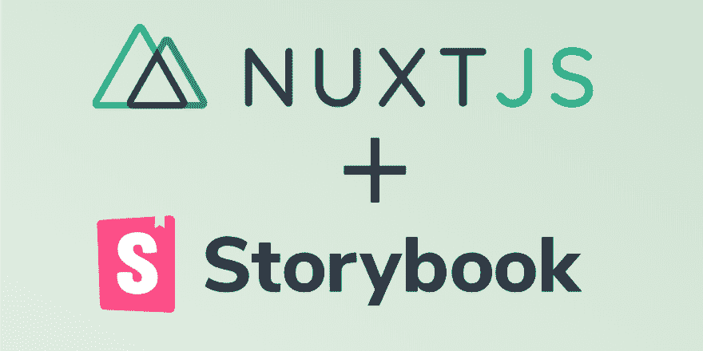
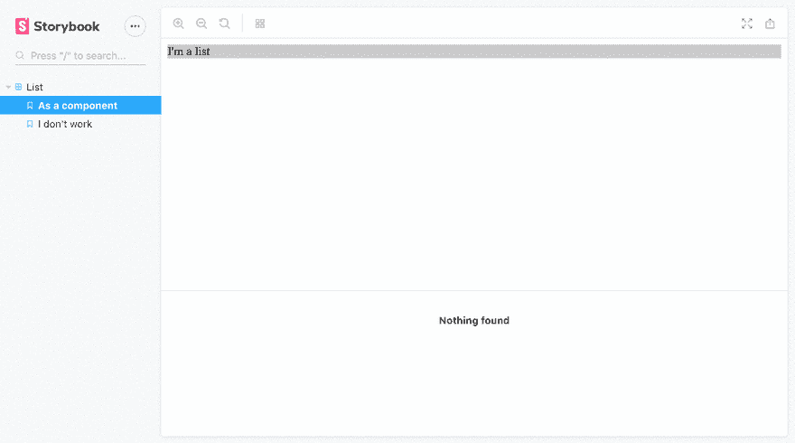
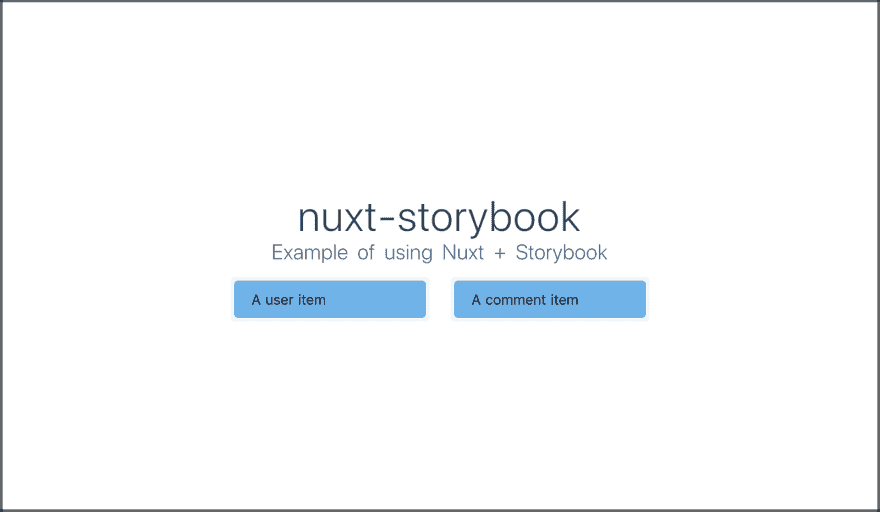
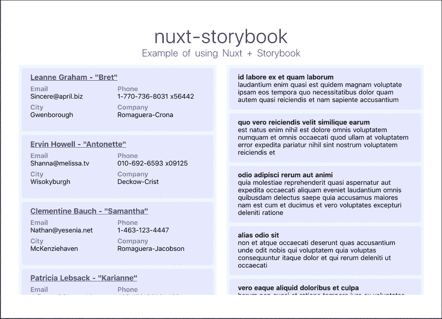
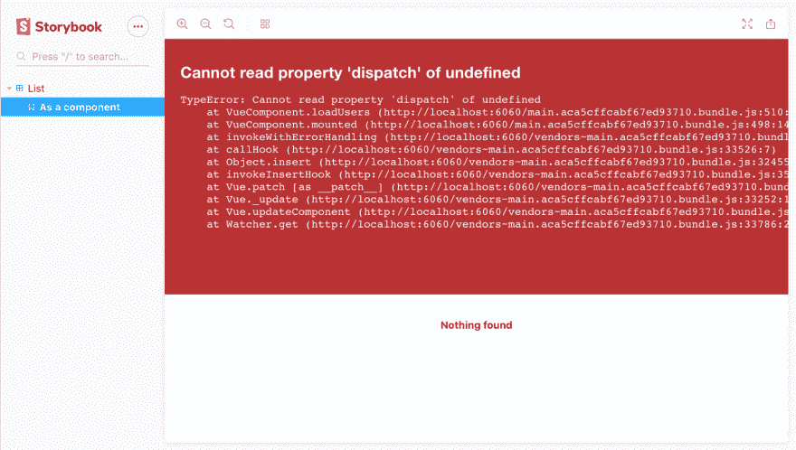
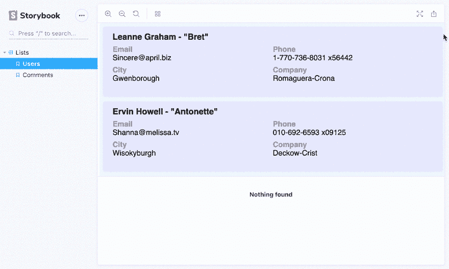
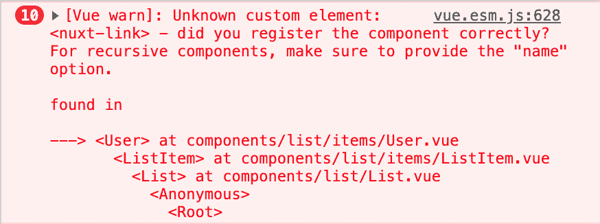
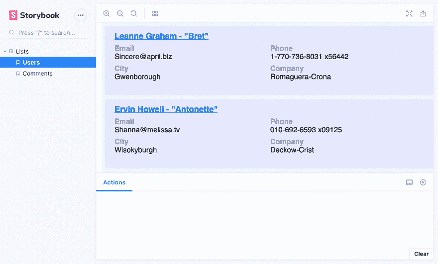
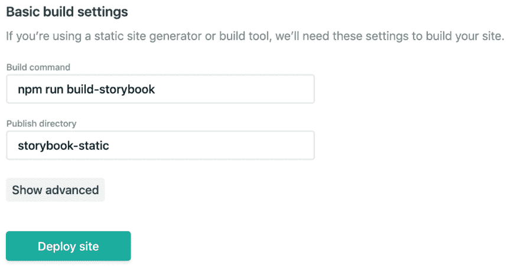

# 关于使用故事书和 Nuxt.js 的(几乎)全面的指南

> 原文：<https://dev.to/mstrlaw/an-almost-comprehensive-guide-on-using-storybook-with-nuxt-js-4e00>

[](https://res.cloudinary.com/practicaldev/image/fetch/s--dwuDtsFP--/c_limit%2Cf_auto%2Cfl_progressive%2Cq_auto%2Cw_880/https://thepracticaldev.s3.amazonaws.com/i/d2kbupccm8bbennxrwzc.png)

我一直想在我的 Nuxt.js 项目中实现 Storybook。

对于那些不知道的人来说，Storybook 是一个孤立开发 UI 组件的开源工具。查看它的用例。

在普通 Vue.js 上使用 Storybook 并不麻烦，但在 Nuxt 上就另当别论了，因为它不能开箱即用。那里的信息是分散的，我不得不挖掘其他人的回复和例子，让它与 Nuxt 一起工作，包括我通常如何利用商店。

我想我应该把它写下来，为那些想开始使用 Storyboook 和 Nuxt 的人创建一个更健壮的示例库。

* * *

我通常的项目设置包括使用 Vuex 商店、Nuxt 的 Axios 模块、TailwindCSS 和自定义 SCSS。

这大概是我希望看到的与 Storybook 一起工作，而不需要改变太多我通常如何使用 Nuxt。

在这个例子的最后，我们将有一个 List 组件，它从 [JSONPlaceholder](https://jsonplaceholder.typicode.com/) 外部加载数据。

看看这里的会是什么样子。

这是一个广泛的指南，所以请随意直接跳到您正在寻找的部分。你可以在这里抓取所有这些代码[。](https://github.com/mstrlaw/nuxt-storybook)

* * *

## 初始设置

因为本指南是从头开始的，所以我们使用 *create-nuxt-app* 从一个全新的 Nuxt 项目开始:

`npx create-nuxt-app nuxt-storybook`

此外，我们将把 Nuxt 更新到它的最新稳定版本 2.5.1:

`npm rm nuxt && npm i -S nuxt`

### 构建错误？

在撰写本文时，升级到 Nuxt 2.5 导致构建时出错:

```
ERROR  Failed to compile with 1 errors                                                                                                                                          friendly-errors 13:29:07
[...]
Module parse failed: Unexpected token (7:24)                                                                                                                                     friendly-errors 13:29:07
[...]
| 
| var _0c687956 = function _0c687956() {
>   return interopDefault(import('../pages/index.vue'
|   /* webpackChunkName: "pages/index" */
|   )); 
```

如果情况仍然如此，基于[这个变通办法](https://github.com/nuxt/nuxt.js/issues/4839#issuecomment-458666603) :
，下面的代码在我的机器(macOS)上运行

```
rm -rf node_modules package-lock.json
npm i -D webpack@4.28.4
npm i 
```

运行`npm run dev`现在应该显示默认的 Nuxt 欢迎页面。

## 添加故事书

我们将根据他们针对 Vue 的[指南手动安装故事书和必要的依赖项。由于 Nuxt，大多数依赖项已经存在，只有 *babel-preset-vue* 缺失。](https://storybook.js.org/docs/guides/guide-vue/) 

```
// Add Storybook & dependencies
npm i -D @storybook/vue babel-preset-vue 
```

现在创建一个名为*的文件夹。故事书*并在其中添加文件 *config.js* 。

*Config.js* 被用作“入口点”来告诉 Storybook 在哪里寻找和加载故事，以及导入和使用其他必要的插件或附加组件来使用故事。

按照 Vue 的指导方针， *config.js* 最初应该是这样的:

```
// /.storybook/config.js
import { configure } from '@storybook/vue';
function loadStories() {
  const req = require.context('../stories', true, /\.stories\.js$/);
  req.keys().forEach(filename => req(filename));
}
configure(loadStories, module); 
```

它所做的是迭代文件夹 stories 中每个以. stories.js 结尾的文件。因为我喜欢将我的故事放在组件附近，而不是全部放在 Stories 文件夹中，所以我简单地将文件夹更改为 Components，并让函数遍历其中的每个文件夹。

我们稍后将回到 *config.js* 中。现在，让我们确保 Storybook 能够加载一个简单的故事并显示它。

## 添加我们的第一个故事

在组件目录中，创建一个名为 list 的新文件夹，并在其中创建一个名为 List.vue 的文件，代码如下。我们将使用它来构建我们的最终组件。

```
// /components/list/List.vue

<template>
  <div class="list">
    I'm a list
  </div>
</template>

<script>
  export default {
    name: 'List'
  }
</script>

<style scoped>
  .list {
    background: #CCC;
  }
</style> 
```

没什么，只是一些展示我们故事的东西。现在在同一个文件夹中添加一个名为 *List.stories.js* 的文件，其中包含以下代码:

```
// /components/list/List.stories.js
import Vue from 'vue'
import { storiesOf } from '@storybook/vue'
import List from './List'

storiesOf('List', module)
  .add('As a component', () => ({
    components: { List },
    template: '<List />'
  }))
  .add('I don\'t work', () => '<List />') 
```

现在要启动 Storybook，我们需要将运行脚本添加到 *package.json* (要在不同的端口上运行，添加`-p <port-number>` )

```
“storybook”: “start-storybook” 
```

在你的终端输入`npm run storybook`，你的浏览器会打开一个新标签:
[](https://res.cloudinary.com/practicaldev/image/fetch/s--dxuSQdPF--/c_limit%2Cf_auto%2Cfl_progressive%2Cq_66%2Cw_880/https://cdn-images-1.medium.com/max/1600/1%2Ad6cv2jSy9nbStyQBMiq6qQ.gif)

这是故事书运行。因为它使用热重装，你将能够看到你的变化立即反映出来。

注意到第二个故事不起作用了吗？这是因为我们没有像第一个故事那样告诉 Storybook 使用我们的 *List* 组件(打开浏览器控制台会显示这些错误)。

我们可以将 List 注册为一个全局组件，就像我们使用 Nuxt 的插件注册它们一样，只是在 *config.js* 中，所以它看起来像:

```
// /.storybook/config.js
import { configure } from '@storybook/vue';
import Vue from 'vue'
import List from '../components/list/List.vue'

Vue.component('List', List)

function loadStories() {
  const req = require.context('../components', true, /\.stories\.js$/);
  req.keys().forEach(filename => req(filename));
}

configure(loadStories, module); 
```

现在第二个故事起作用了。这只是给你一个想法，你的一些组件可能会使用其他组件。为了避免总是导入它们，我们可以像以前一样对它们进行全局定义(剩下的例子不会用到它，所以您可以删除它)。

现在你有了一个使用 Nuxt 的 Storybook 的普通设置。但这还算不上什么故事。

## 增强我们的列表组件&添加商店

首先，我们将为我们的*列表*组件增加一些复杂性，并担心 Storybook 稍后抛出的错误。

该列表应:

*   一旦挂载——使用 JSONPlaceholder 获取[假用户](https://jsonplaceholder.typicode.com/users)或[假评论](https://jsonplaceholder.typicode.com/comments)；
*   迭代每个用户/评论，并使用 ListItem 组件呈现它；
*   利用 Vuex 来调度我们的 API 调用；
*   看起来更漂亮，使用 TailwindCSS &一些自定义样式；

### 样式

对于样式，我们将使用一些 [TailwindCSS](https://tailwindcss.com) 实用程序类以及一些自定义样式来举例说明它在 Storybook 中的用法。我使用 SCSS，所以我们需要添加通常的`node-sass` & `sass-loader`:

`npm i -D node-sass sass-loader`

列表*将接受属性*源*，这样它就知道我们想要获取哪个数据源。我们还将让它准备好调用适当的存储操作，以便在构建好这些操作后执行 API 调用。*

*列表*组件现在应该看起来像:

```
// /components/list/List.vue

<template>
  <div class="list p-5 rounded">
    I'm a {{ source }} list
  </div>
</template>

<script>
  export default {
    name: 'List',
    props: {
      source: {
        type: String,
        default: 'users'
      }
    },
    data() {
      return {
        entities: []
      }
    },
    mounted() {
      switch (this.source) {
        default:
        case 'users':
          this.loadUsers()
          break
        case 'comments':
          this.loadComments()
          break
      }
    },
    methods: {
      loadUsers() {
        //  Will call store action
        console.log('load users')
      },
      loadComments() {
        //  Will call store action
        console.log('load comments')
      },
    }
  }
</script>

<style lang="scss" scoped>
  $background: #EFF8FF;
  .list {
    background: $background;
  }
</style> 
```

### 添加商店& API 调用

我通常将我的 API 调用保存在商店的动作中，这样我就可以使用 *this 轻松地调用它们。$store.dispatch* 。

**。env** :我们会把端点放在一个*里。env* 文件，所以为了获得这些值，我们将安装 [@nuxtjs/dotenv](https://www.npmjs.com/package/@nuxtjs/dotenv) 模块`npm i -S @nuxtjs/dotenv`并将其添加到 out *nuxt.config.js* 模块中。

创建一个*。env 项目的根文件中的*并添加:

```
USERS_ENDPOINT=https://jsonplaceholder.typicode.com/users
COMMENTS_ENDPOINT=https://jsonplaceholder.typicode.com/comments 
```

添加存储操作来检索用户和评论。在现有的商店目录下添加一个 *actions.js* 文件，代码如下:

```
// /store/actions.js
export default {
  async GET_USERS({ }) {
    return await this.$axios.$get(`${ process.env.USERS_ENDPOINT }`)
  },
  async GET_COMMENTS({ }) {
    return await this.$axios.$get(`${ process.env.COMMENTS_ENDPOINT }`)
  },
} 
```

我们现在可以修改我们的*列表*组件的方法，以便在挂载时调用这些动作，最终看起来像:

```
// /components/list/List.vue

<template>
  <div class="list p-5 rounded">
    I'm a {{ source }} list
  </div>
</template>

<script>
  export default {
    name: 'List',
    props: {
      source: {
        type: String,
        default: 'users'
      }
    },
    data() {
      return {
        entities: []
      }
    },
    mounted() {
      switch (this.source) {
        default:
        case 'users':
          this.loadUsers()
          break
        case 'comments':
          this.loadUsers()
          break
      }
    },
    methods: {
      loadUsers() {
        this.$store.dispatch('GET_USERS')
        .then(res => {
          console.log(res)
        })
        .catch(err => {
          console.log('API error')
          console.log(err)
        })
      },
      loadComments() {
        this.$store.dispatch('GET_COMMENTS')
        .then(res => {
          console.log(res)
        })
        .catch(err => {
          console.log('API error')
          console.log(err)
        })
      },
    }
  }
</script>

<style lang="scss" scoped>
  // Pointless. Just for the sake of the example
  $background: #EFF8FF;
  .list {
    background: $background;
  }
</style> 
```

我们现在获得了从每个端点返回的数据数组。让我们展示它们。

### 添加 ListItem 组件

根据我们列出的是用户还是评论，我们将显示一个 *ListItem* 组件的变体。每种变化也有它自己的组成部分。

在名为 items 的列表下创建一个文件夹，并创建一个名为 *ListItem.vue* 的文件。下面是添加到它的代码:

```
// /components/list/items/ListItem.vue

<template>
  <div class="list-item rounded bg-blue-light px-5 py-3">
    <div v-if="itemType === 'users'">
      A user item
    </div>
    <div v-else>
      A comment item
    </div>
  </div>
</template>

<script>
  export default {
    name: 'ListItem',
    props: {
      itemType: {
        type: String,
        default: 'user'
      },
      data: {
        type: Object,
        default: () => {
          return {}
        }
      }
    }
  }
</script> 
```

现在没什么，我们一会儿会改变它。与此同时，我设计了主页的样式，这样我们就可以并排看到两个列表:
[](https://res.cloudinary.com/practicaldev/image/fetch/s--LSDXmTdY--/c_limit%2Cf_auto%2Cfl_progressive%2Cq_auto%2Cw_880/https://cdn-images-1.medium.com/max/1600/1%2A0bTjReOwpB6HG6O0J9ikhw.png) 
现在让我们实际使用我们的 *ListItem* 组件来迭代由我们的 API 返回的每个实体，并相应地设计它的样式。

### 添加用户&评论组件

我们将根据以下数据结构为每个实体创建一个组件:

```
//  User  {  "id":  1,  "name":  "Leanne Graham",  "username":  "Bret",  "email":  "Sincere@april.biz",  "address":  {  "street":  "Kulas Light",  "suite":  "Apt. 556",  "city":  "Gwenborough",  "zipcode":  "92998-3874",  "geo":  {  "lat":  "-37.3159",  "lng":  "81.1496"  }  },  "phone":  "1-770-736-8031 x56442",  "website":  "hildegard.org",  "company":  {  "name":  "Romaguera-Crona",  "catchPhrase":  "Multi-layered client-server neural-net",  "bs":  "harness real-time e-markets"  }  },  //  Comment  {  "postId":  1,  "id":  1,  "name":  "id labore ex et quam laborum",  "email":  "Eliseo@gardner.biz",  "body":  "laudantium enim quasi est quidem magnam voluptate ipsam eos\ntempora quo necessitatibus\ndolor quam autem quasi\nreiciendis et nam sapiente accusantium"  } 
```

在 */components/list/items/* 中添加一个 *Comment.vue* 文件，代码:

```
// /components/list/items/Comment.vue

<template>
  <div>
    <b>{{ name }}</b>
    <p>{{ body }}</p>
  </div>
</template>

<script>
  export default {
    name: 'Comment',
    props: {
      name: {
        type: String,
        default: ''
      },
      body: {
        type: String,
        default: ''
      }
    }
  }
</script> 
```

在 */components/list/items/* 中添加一个 *User.vue* 文件，代码:

```
// /components/list/items/User.vue

<template>
  <div>
   <nuxt-link
      :to="{ name:'user' }"
      class="text-lg"
    >
      {{ name }} - "{{ username }}"
    </nuxt-link>
    <div class="flex flex-wrap justify-start my-2">
      <div class="w-1/2 mb-2">
        <span class="text-grey-dark font-bold">Email</span>
        <p class="p-0 m-0">{{ email }}</p>
      </div>
      <div class="w-1/2 mb-2">
        <span class="text-grey-dark font-bold">Phone</span>
        <p class="p-0 m-0">{{ phone }}</p>
      </div>
      <div class="w-1/2 mb-2">
        <span class="text-grey-dark font-bold">City</span>
        <p class="p-0 m-0">{{ address.city }}</p>
      </div>
      <div class="w-1/2 mb-2">
        <span class="text-grey-dark font-bold">Company</span>
        <p class="p-0 m-0">{{ company.name }}</p>
      </div>
    </div>
  </div>
</template>

<script>
  export default {
    name: 'User',
    props: {
      name: {
        type: String,
        default: ''
      },
      username: {
        type: String,
        default: ''
      },
      email: {
        type: String,
        default: ''
      },
      phone: {
        type: String,
        default: ''
      },
      address: {
        type: Object,
        default: () => {
          return {}
        }
      },
      company: {
        type: Object,
        default: () => {
          return {}
        }
      }
    }
  }
</script> 
```

***注意*** :为了这个例子，我增加了一个 *nuxt-link* 。为此，我们还添加了各自的页面 */pages/user/index.vue* 。里面什么都没有，只是为了让 nuxt-link 链接到某个地方。

让我们更改我们的 *ListItem* 组件来使用这些新组件:

```
// /components/list/items/ListItem.vue

<template>
  <div class="list-item rounded bg-indigo-lightest shadow px-5 py-3 mb-3">
    <div v-if="itemType === 'users'">
      <User
        :name="data.name"
        :username="data.username"
        :email="data.email"
        :phone="data.phone"
        :address="data.address"
        :company="data.company"
      />
    </div>
    <div v-else>
      <Comment
        :name="data.name"
        :body="data.body"
      />
    </div>
  </div>
</template>

<script>
  import User from '@/components/list/items/User'
  import Comment from '@/components/list/items/Comment'

  export default {
    name: 'ListItem',
    components: {
      User,
      Comment
    },
    props: {
      itemType: {
        type: String,
        default: 'user'
      },
      data: {
        type: Object,
        default: () => {
          return {}
        }
      }
    }
  }
</script> 
```

最后，我们需要更改 *List.vue* ，这样我们实际上将 API 调用的响应作为 props 传递，而不仅仅是记录它。改变方法，使它看起来像:

```
// /components/list/List.vue
[...]
methods: {
  loadUsers() {
    this.$store.dispatch('GET_USERS')
    .then(res => {
      this.entities = res.data
    })
    .catch(err => {
      console.log('API error')
      console.log(err)
    })
  },
  loadComments() {
    this.$store.dispatch('GET_COMMENTS')
    .then(res => {
      this.entities = res.data
    })
    .catch(err => {
      console.log('API error')
      console.log(err)
    })
  },
}
[...] 
```

经过一些小的风格调整，这是它现在应该看起来的样子:
[](https://res.cloudinary.com/practicaldev/image/fetch/s--pIOzYE7v--/c_limit%2Cf_auto%2Cfl_progressive%2Cq_66%2Cw_880/https://cdn-images-1.medium.com/max/1600/1%2A4HBbxw-SXLK8jDRN4cXdqQ.gif)

我们现在准备好进入故事书，看看会发生什么。

* * *

## 解决故事书的抱怨

我们现在将解决运行 Storybook 时出现的每个问题，第一个问题是:

### 未找到  模块

```
Error: Can’t resolve ‘@/components/list/items/ListItem’ 
```

如果你看看 Storybook 的例子，你会看到它使用相对路径引用组件。这是我们使用 Nuxt 的一个问题，因为框架使用了@ alias。

我们现在需要到处使用相对路径吗？幸运的是没有。还记得我们之前安装的 *babel-preset-vue* 吗？此外，使用 webpack 的别名允许我们解决这个问题。

首先，在*中创建一个文件。名为*的故事书*文件夹。babelrc* 与以下:

```
// /.storybook/.babelrc
{
  "presets": [
    "@babel/preset-env",
    "babel-preset-vue"
  ]
} 
```

在*中创建另一个名为 *webpack.config.js* 的文件。故事书*文件夹中有以下内容:

```
// /.storybook/.webpack.config.js

const path = require('path')

module.exports = {
  resolve: {
    alias: {
      '@': path.dirname(path.resolve(__dirname))
    }
  }
} 
```

现在，您应该能够继续使用@ alias 来导入您的组件。

为了拥有简洁的代码，我们现在可以将我们在故事中导入*列表*组件的方式从`import List from './List'`更改为`import List from '@/components/list/List'`。

### 模块解析失败:处理 SCSS

故事书现在抛出:

```
Module parse failed: Unexpected character ‘#’ (69:13)
You may need an appropriate loader to handle this file type. 
```

那是因为我们还没有指定如何加载这些。我们可以通过为 CSS/SCSS 添加一个模块规则来解决这个问题，使我们的文件看起来像这样:

```
// /.storybook/.webpack.config.js

const path = require('path')

module.exports = {
  module: {
    rules: [
      {
        test: /\.s?css$/,
        loaders: ['style-loader', 'css-loader', 'postcss-loader', 'sass-loader'],
        include: path.resolve(__dirname, '../')
      }
    ]
  },
  resolve: {
    alias: {
      '@': path.dirname(path.resolve(__dirname))
    }
  }
} 
```

我们还必须将`import '@/assets/css/tailwind.css`加到*上。storybook/config.js* 这样我们就可以使用 Tailwind 的实用程序类。

再次启动 Storybook，这一次你应该让浏览器打开一个新的标签，最好的标签是:
[](https://res.cloudinary.com/practicaldev/image/fetch/s--1VOsIy7A--/c_limit%2Cf_auto%2Cfl_progressive%2Cq_auto%2Cw_880/https://cdn-images-1.medium.com/max/1600/1%2A_lISfM-0ETI8g-UYQdJLEg.png)

## 使用 Vuex 与故事书

如果您在本演练之前遵循了 Storybook 的 Vue 指南，那么您应该已经在 config.js 中导入和使用 Vuex 了。

如果没有，现在应该是这样的:

```
// /.storybook/config.js

import Vue from 'vue'
import Vuex from 'vuex'
import { configure } from '@storybook/vue'
import '@/assets/css/tailwind.css'

Vue.use(Vuex)

function loadStories() {
  const req = require.context('../components', true, /\.stories\.js$/)
  req.keys().forEach(filename => req(filename))
}

configure(loadStories, module) 
```

但仅仅这样是不够的。

Nuxt 组件引用存储为 *this。$store* 而我们的故事并不知道这一点，因此我们需要创建一个新的 store 并将其传递给我们的组件。

但是我们需要重建整个商店吗？谢天谢地，没有。我们确实会创建一个存储，但重用所有现有的行动，getters，突变或我们现有的存储状态。

为此，我们将在*中创建一个名为 *store.js* 的文件。故事书*目录，代码如下:

```
// /.storybook/store.js

import Vue from 'vue'
import Vuex from 'vuex'
import axios from 'axios'

// You can do the same for getters, mutations and states
import actions from '@/store/actions'

let store = new Vuex.Store({
  actions: actions
})

/*
  Bind Axios to Store as we don't have access to Nuxt's $axios instance here
*/
store.$axios = axios

/*
Remap Axios's methods to make use of $ symbol within the 
Store's actions so we don't re-write our Axios' calls
*/

store.$axios.$get = store.$axios.get
store.$axios.$post = store.$axios.post

export default store 
```

我们现在可以将这个商店导入并传递给我们的故事。

目前，我们只有一个列出用户的故事，作为默认来源。让我们添加另一个故事来列出评论，并重命名每个评论:

```
// /components/list/List.stories.js

import Vue from 'vue'
import { storiesOf } from '@storybook/vue'

import List from '@/components/list/List'

import store from '@/.storybook/store'

storiesOf('Lists', module)
  .add('Users', () => ({
    components: { List },
    store: store,
    template: '<List />'
  }))
  .add('Comments', () => ({
    components: { List },
    store: store,
    template: `<List :source="'comments'" />`
  })) 
```

> **API 响应警告**
> 
> 这些攻击并不是 100%可靠的，这取决于你使用的 API 如何响应。要小心，因为你可能会以成功的故事结束，却破坏了实际的应用程序。
> 
> 在这个例子中，我们需要改变我们的 List.vue 方法，以使应用程序保持正确运行，以及组件的故事:

```
// /components/list/List.vue
[...]
if ('data' in res) {
  this.entities = res.data
} else {
  this.entities = res
}
[...] 
```

> 虽然有点粗糙，但这是我们代码中的一个小变化。例如，在使用 Thoro 的情况下，我可以继续正常使用 res.data，所以不需要修改我的代码。如果你知道更好的方法，请在评论中分享！

完成上述步骤后，我们现在应该可以看到列表组件的两个故事:
[](https://res.cloudinary.com/practicaldev/image/fetch/s--1JX3qPpq--/c_limit%2Cf_auto%2Cfl_progressive%2Cq_66%2Cw_880/https://cdn-images-1.medium.com/max/1600/1%2APujMumU0V6bP2JFv-ExAcg.gif)

### 处理 *nuxt-link*

我们终于可以看到一些东西了！但是我们的链接不见了..

[](https://res.cloudinary.com/practicaldev/image/fetch/s--7hajkbTe--/c_limit%2Cf_auto%2Cfl_progressive%2Cq_auto%2Cw_880/https://cdn-images-1.medium.com/max/1200/1%2Ay1B1swYEHPFGfMd_jt-gAw.png)

如果你在 Storybook 的选项卡上打开浏览器控制台，你会看到它不知道什么是 *nuxt-link* (而且，如果事情不能正常工作，你可以随时查看潜在的错误)。

为了让故事书正常工作，需要对其进行最后的调整。

为此，我们需要安装 *@storybook/addon-actions* 依赖:`npm i -D @storybook/addon-actions`，并通过在*中创建文件 *addons.js* 将它们添加到 storybook 中。故事书*目录与行:

```
// /.storybook/addons.js
import '@storybook/addon-actions'
import '@storybook/addon-actions/register' 
```

最后，我们需要在 config.js 中注册一个调整过的 nuxt-link 组件到 Vue。我们的 *config.js* 文件现在应该看起来像:

```
// /.storybook/config.js

import Vue from 'vue'
import Vuex from 'vuex'
import { configure } from '@storybook/vue'

import { action } from '@storybook/addon-actions'

import '@/assets/css/tailwind.css'

Vue.use(Vuex)

Vue.component('nuxt-link', {
  props:   ['to'],
  methods: {
    log() {
      action('link target')(this.to)
    },
  },
  template: '<a href="#" @click.prevent="log()"><slot>NuxtLink</slot></a>',
})

function loadStories() {
  const req = require.context('../components', true, /\.stories\.js$/)
  req.keys().forEach(filename => req(filename))
}

configure(loadStories, module) 
```

这用一个常规的锚元素替换了 *< nuxt-link >* 的所有实例，并设置了一个 log 方法，当单击它时显示 lint 的路径。

之后，我们在浏览器的控制台上不会再看到任何错误，并且在我们的用户名上有实际的可点击链接:
[](https://res.cloudinary.com/practicaldev/image/fetch/s--4J4g77F1--/c_limit%2Cf_auto%2Cfl_progressive%2Cq_66%2Cw_880/https://cdn-images-1.medium.com/max/1600/1%2AFuyLvhnts56H_ohnfNmkBw.gif)

## 故事书与 Nuxt 合作！

这花了一段时间，但我们已经设法让 Storybook 在一个 Nuxt.js 项目中很好地与 Vue.js 组件一起工作。

这不是一个完全成熟的指南，因为我们遗漏了测试和 Nuxt 的关键方面，如 *< no-ssr >* 标签(我也想知道 asyncData 和 Storybook 最终如何一起工作)。

### 奖励:将故事书部署到 Netlify

当运行 Storybook 时，你会得到一个 IP 地址，你可以与本地网络中的其他人共享，如果你在同一个 WiFi 上，这很酷。但是，如果您想与您的客户分享它，以便他们可以给你关于上周迭代的反馈呢？

在这种情况下，在 [Netlify](https://netlify.com) 上托管它。只需将下面的脚本添加到您的 *package.json* 文件中，这将在 storybook-static 目录:
中生成一个静态故事书

```
"build-storybook": "build-storybook -c .storybook" 
```

然后访问 Netlify 并选择您的存储库。将构建命令定义为`npm run build-storybook`，将发布目录定义为`storybook-static`。

[](https://res.cloudinary.com/practicaldev/image/fetch/s--IBV0gvNE--/c_limit%2Cf_auto%2Cfl_progressive%2Cq_auto%2Cw_880/https://cdn-images-1.medium.com/max/1200/1%2AlgA8GYXJJphIbHVc6klhmA.png)

然后你应该有你的故事书，并在你每次推送/合并到你的主分支时更新。[来看看](https://pensive-lichterman-edd576.netlify.com/?path=/story/lists--users)！

## 最终回购&资源

请随意在 Github[https://github.com/mstrlaw/nuxt-storybook](https://github.com/mstrlaw/nuxt-storybook)上获取[代码，并查看这些阅读材料和其他对构建本指南有用的回复:](https://github.com/mstrlaw/nuxt-storybook)

*   [故事书的 Vue 指南](https://storybook.js.org/docs/guides/guide-vue/)；
*   [learnstorybook.com](https://www.learnstorybook.com/vue/en/get-started/)(Vue 指南)；
*   本[博文](https://ithelp.ithome.com.tw/articles/10201352)(中文)[本回购](https://github.com/hunterliu1003/blog/tree/007-storybook-and-nuxt)；
*   [大卫·沃什](https://twitter.com/davidwalshblog)的[博客帖子](https://davidwalsh.name/storybook-nuxt)使用 Jest 深入实际测试；
*   [这个问题](https://github.com/storybooks/storybook/issues/2934#issuecomment-373789025)；

* * *

加入进来，在下面的评论中留下你的想法和建议。

* * *

最初发布于[媒体](https://medium.com/@mstrlaw/a-guide-on-using-storybook-with-nuxt-js-1e0018ec51c9)