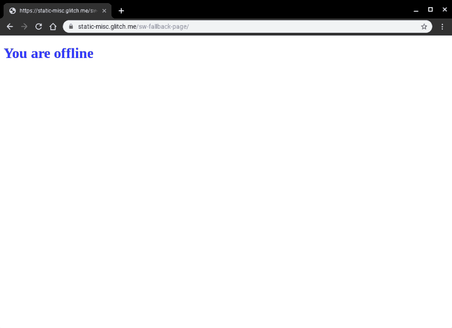

# 服务人员的离线回退页面

> 原文：<https://dev.to/chromiumdev/offline-fallback-page-with-service-worker-1jfe>

几年前，我对本地应用程序如何应对网络连接的缺乏做了一些研究。虽然我已经失去了分析的链接(我可以发誓是在 Google+上)，但最重要的是，许多原生应用程序与互联网密不可分，它们直接拒绝运行。听起来像很多网络应用程序，但它们与网络的区别在于体验仍然是“品牌化的”，巴特·辛普森会告诉你需要在线(例如)，但对于绝大多数网络体验来说，你得到的是“Dino”(参见 chrome://dino)。

我们已经在服务人员上工作了很长时间，虽然我们看到越来越多的网站有由服务人员控制的页面，但绝大多数网站甚至没有在网络不可用时的基本回退体验。

我问我的好朋友杰克，如果你不想创建一个完全离线优先的体验，我们有没有关于如何建立一个通用的备用页面的 guindance，不到 10 分钟，他就创建好了。[来看看](https://glitch.com/edit/#!/static-misc?path=sw-fallback-page/sw.js:6:9)。

为了简洁起见，我将代码粘贴在下面，因为它只有大约 20 行长。它缓存离线资产，然后对于每次“导航”提取，它将查看是否有错误(因为网络)，然后呈现离线页面来代替原始内容。

```
addEventListener('install', (event) => ; {
  event.waitUntil(async function() {
    const cache = await caches.open('static-v1');
    await cache.addAll(['offline.html', 'styles.css']);
  }());
});

addEventListener('fetch', (event) => {
  const { request } = event;

  // Always bypass for range requests, due to browser bugs
  if (request.headers.has('range')) return;
  event.respondWith(async function() {
    // Try to get from the cache:
    const cachedResponse = await caches.match(request);
    if (cachedResponse) return cachedResponse;

    try {
      // Otherwise, get from the network
      return await fetch(request);
    } catch (err) {
      // If this was a navigation, show the offline page:
      if (request.mode === 'navigate') {
        return caches.match('offline.html');
      }

      // Otherwise throw
      throw err;
    }
  }());
}); 
```

仅此而已。当用户在线时，他们将看到默认的体验。

[](https://res.cloudinary.com/practicaldev/image/fetch/s--sfDNx_Gn--/c_limit%2Cf_auto%2Cfl_progressive%2Cq_auto%2Cw_880/https://paul.kinlan.img/2019-04-05-offline-fallback-page-with-service-woker.jpeg)

当用户离线时，他们将获得回退页面。

[](https://res.cloudinary.com/practicaldev/image/fetch/s--2REK6b6W--/c_limit%2Cf_auto%2Cfl_progressive%2Cq_auto%2Cw_880/https://paul.kinlan.img/2019-04-05-offline-fallback-page-with-service-worker-1.jpeg)

我发现这个简单的脚本非常强大，是的，虽然它仍然可以改进，但我确实相信，当网络出现问题时，即使只是简单地改变我们与用户交流的方式，也有能力从根本上改善全球用户对网络的看法。