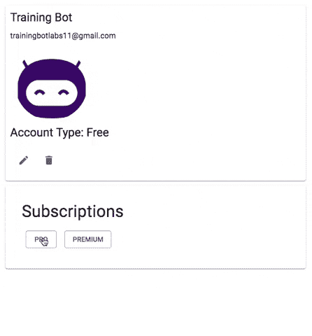
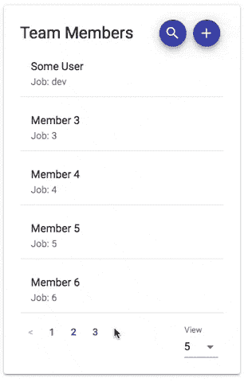

# 实验第 3 周:回顾

> 原文：<https://dev.to/mlanders/labs-week-3-a-review-4kcb>

这一周致力于最终确定我们的应用程序的功能，并使其反应灵敏。我的主要成就是将 Stripe 集成到 redux 中，这样在订阅计划时可以获得更好的用户体验。这包括采用我已经构建的 Stripe 集成，并通过 redux 对其进行重构，以实现更好的状态管理。如果让我再做一次，我会更希望我们的团队早点决定 redux，但最终这并不太糟糕。

我面临的一个大挑战是如何创建一个使用 stripe 的用户，并在我们的数据库中添加 stripe 客户 id，然后在我们的系统中进行第一次支付时将相同的客户 id 发送回 Stripe。

在周中的 UI/UX 会议之后，我们意识到我们的主仪表板不能很好地处理大量数据。我们需要一种方法在一个页面上显示所有内容，而不需要一个很长的列表或者使用无限滚动。我们作为一个团队决定使用分页。由于对分页没有什么经验，我决定自己承担这项任务。

做了一点研究后，我找到了一个不错的 npm 包， [Material UI Flat Pagination](https://www.npmjs.com/package/material-ui-flat-pagination) 。在快速阅读文档后，我能够相对容易地将其添加到我们的项目中。

这一周我们的团队工作得非常好，为了让我们的用户体验更好，他们迅速做出了重大决定。从移除模态并使它们成为完整的页面，到允许每个人对他们正在处理的部分做出自己的设计决定。当每个团队成员在组件上工作时，他们都开始组合成一个有凝聚力的应用程序。我想说，我们团队作为一个整体面临的唯一真正的挑战是在我们的 UI/UX 会议之后。它揭示了我们的一些设计决策以及它们是如何不起作用的。我们能够克服这一点，方法是在会后立即开会，听取反馈意见，并将其放入我们的 Trello 板，以便在本周的剩余时间内完成。

准备好迎接第 4 周

如果你已经设法做到这一步，请务必在 Twitter 上查看我的实验室团队！

[内特](https://twitter.com/nateboyette) | [利-安](https://twitter.com/lafriedel) | [布兰登](https://twitter.com/BrandonLent17) | [亚历克斯](https://twitter.com/_alex_ak)