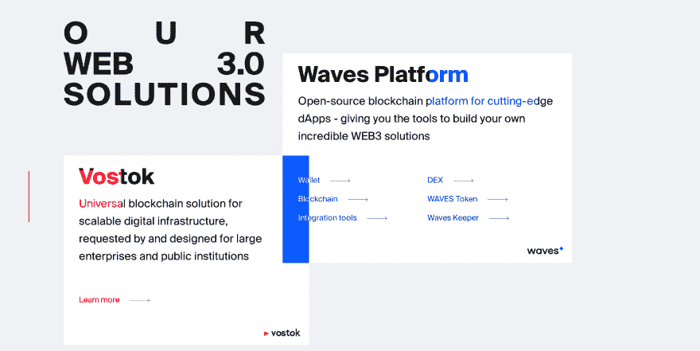
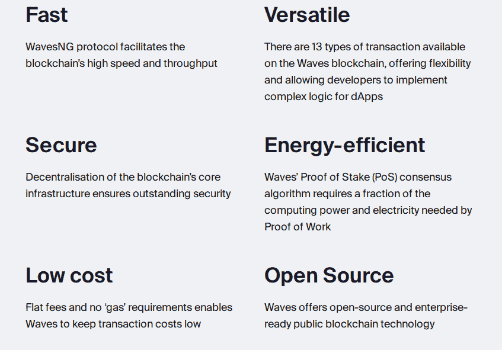

# Waves 技术评论

> 原文：<https://dev.to/meyer9/waves-technical-review-3596>

这只是对我的博客的一个简单介绍。我将每周(每周五)在这里发布一次关于某些加密货币的技术文章，这些货币通常排名前 100。

你可以在这里订阅我的时事通讯[，我将在我的网站](https://buttondown.email/meyer9)上发送独家内容以及[的新博客文章。](https://juliancrypto.com/2019/04/04/Top-100-Reviews-Waves.html)

我决定从 Waves 开始，因为我以前没有使用过这个平台，我只是勉强知道它是用来做什么的，而且我根本不知道它背后的技术。我将回顾技术、安全和信任含义、编码标准等。这篇文章是对 Waves 平台的全面的技术回顾。

乍一看，Waves 的网站华而不实，看起来像是一个以设计为中心的产品。该网站似乎在风格上有点问题，绝对不是传达信息的最佳选择。当我向下滚动主页时，我看到的两大产品是:东方，一个通用的区块链解决方案...专为大型企业和 Waves 设计的开源公共区块链。

他们的网站主要关注 Web 3.0，这是一个加密术语，意思是他们的区块链运行 dApps。Waves 是赌注的证明，意味着矿工将他们的硬币赌在下一个街区，而不是赌采矿能力。不同平台之间的利害关系证明的类型差异很大，所以我肯定会首先研究这个问题。

# 波浪桩凭证(LPoS)

## 术语和概念问题

Waves 使用一种叫做“租赁股权证明”的系统。在我阅读这篇文章时，他们提出的一个重要观点让我印象深刻，那就是下面的陈述:

> 通常情况下，在 PoS 系统中，没有块奖励，所以，矿工采取交易费。这就是为什么矿工通常被称为块伪造或发电机，而不是，图 1。

这是对利害关系证明的误解。下注者没有理由不能获得整体奖励。几乎在每一个股权证明系统中，大宗交易提议者都会获得硬币奖励。Waves 的 ICO 为 1600 万美元，因此开发者和领导者受到激励，保持低通胀以保持高份额。如果交易费用太低，这可能是一个安全问题。

后来，在同一页上，他们做出这样的声明:

> 股权证明通过使拥有加密货币 51%股权的矿商攻击网络变得不利，避免了这种“悲剧”。

虽然这通常是正确的，但同样适用于工作证明。比特币矿工不想攻击网络，因为这会使他们开采的货币和他们的设备贬值。由于没有“外部”因素抑制矿工攻击网络，贿赂攻击就像贿赂矿工攻击网络比他们从被攻击的网络中损失更多一样简单。

同样，他们用不同的术语陈述同一件事:

> 一个拥有硬币 51%股份的矿工不会为了自己的最大利益去攻击一个他拥有多数股份的网络

然而，他们没有考虑到攻击者不需要拥有硬币就可以简单地通过贿赂赌注者和提供额外收入来攻击网络的可能性。

## LPoS 比 PoS 差

由于对攻击模型的这种基本误解，Waves 继续解释了他们的赌注系统的真正问题:

> 用户将有能力从钱包中租赁波给不同的承包商，他们可以支付一定比例的报酬

这是一面大红旗。

让我用一个例子来说明为什么这是一个坏主意。

假设 Alice 和 Bob 是 Waves 网络中的赌注者。他们各自握着`25%`的波浪。爱丽丝经营一个完整的节点，因为他真的支持这项任务，但鲍勃只是想赚快钱。Eve 想攻击网络。Alice 用她的硬币下注，Bob 也付钱给 Alice `5%`用 LPoS 下注。

Bob 和 Alice 知道如果 Eve 攻击网络，他们的硬币会贬值`30%`。

Eve 攻击网络的代价是:`C = B/0.7 = 1.42B`其中 B 是 Bob 的硬币的价值。这意味着 Eve 只需要支付 Bob 大约比 Bob 在网络(`25% * 140% = 35%`)中的股份多`40%`就可以获得网络电力的`50%`控制权。

Bob 很高兴，因为他得到了比下注更多的钱。Alice 很高兴，因为 Bob 在赌她的硬币，她不必运行完整的节点。Eve 很高兴，因为她可以以低于 50%的成本攻击网络。

在股权证明系统中委托股权总是会降低安全性。

## 鼓励用户降低网络安全真的不好

他们的系统甚至强烈鼓励用户这样做:

> 节点的平衡可以是空的，直到有足够多的人希望通过一起达到 1000 个波的平衡来租借给它，并一起创造一个池子。

小股东不能入股区块。只有大型泳池可以。这不仅会导致安全性严重下降，还会导致强大的集中化，因为较大的池更受信任，并且比较小的池增长得更快。

这在他们的[区块探索者](https://dev.pywaves.org/generators-monthly/)中看得很清楚，在那里，前 6 名矿工控制了 57%的赌注权力(截至本文撰写时)。

# Waves 源代码

Waves 源代码是干净的，并且使用了良好的实践。代码注释良好，易于阅读。他们使用强大的加密库和函数。当有疑问时，他们会坚持使用经过验证的比特币功能。

## Scala 是个不错的选择

Waves 是用一种叫做 Scala 的编程语言编写的，Scala 是一种建立在 JVM (Java 虚拟机)之上的函数式语言。这让他们可以在许多平台上用非常相似的代码部署 Waves 版本。JVM 是高度优化的，但是对于像加密这样的低级操作来说不是很好。

在内部，Waves 为 Ed25519 曲线使用了 [Scrypto](https://github.com/input-output-hk/scrypto) 库。Waves 使用 Blake2b256 散列函数进行快速散列，使用`Keccak(Blake2b256(m))`进行安全散列。Ed25519 是一个强有力的选择，因为它的速度，安全性，并证明没有后门。精心选择参数，使插入后门变得棘手。

该代码使用类似于比特币的结构。

Waves 使用 LevelDB 作为其块数据库，这与比特币中使用的数据库相同。

代码总体上看起来组织得非常好。它们包括 800 多项测试，都在我的电脑上通过，检查 RPC 命令，DEX 系统，转移测试，股权租赁，交易，脚本，区块链，新功能的激活码，以及状态转换测试。所有这些都提高了网络和协议的安全性。

## 文档

Waves 还包括大量的开发者文档，提供关于共识系统、RPC、智能契约开发、oracles 等的信息。这是一个非常好的迹象，因为这意味着开发者将被鼓励使用 Waves 来开发 dApps。

Waves 架构的每一个变化都记录在他们的开发者文档中。它给出了关于如何进行变更的具体信息，包括详细的规范。

Waves 在其提案中包括了一项有趣的功能，名为“赞助交易”,让用户无需使用 Waves 令牌，而是使用 Waves 区块链上的资产进行网络交易。对于那些不想在允许用户转移令牌和使用 dApps 方面增加额外摩擦的 ico 来说，这是一个巨大的功能。

## DEX

他们推出了分散式交易所，进行 Waves/_TC 对交易。这从两个方面改善了他们的生态系统。

首先，它为矿商提供了一个额外的交易费收入来源。这一点很重要，因为网络的安全性高度依赖于矿商的收入，如果没有整体奖励，矿商需要交易费来保护网络。

第二，它增加了 Waves 转移资产的采用，并使用其类似于 ERC 的资产管理平台。Waves 上构建的代币用户越多，意味着网络价值越高。

界面看起来很好，一切都在链上进行，所以这绝对是 Waves 的一大优势。

## Web 3

Waves 大力宣传他们的 Web 3 特性，主要集中在 dApps 上。

Waves 在这方面绝对是出类拔萃的，它提供了一个通过浏览器访问 dApps 和管理私钥的浏览器扩展。这一点很重要，因为它让用户的入职流程更加顺畅。

他们编写了自己的智能合同语言，名为“RIDE”。RIDE 是强类型的，“懒惰的”，基于表达式的。RIDE 包括一些功能特性，如模式匹配。然而，最终的合约非常像比特币剧本，只是多了一些额外的功能。不支持循环、函数调用和跳转，所以语言是**非图灵完成**。

语言似乎是真正的 dApps 在波浪上存在的唯一一块拼图。由于智能合约语言的限制，许多复杂的 dApps 将无法在 Waves 上构建。这种语言似乎专注于简单性和正确性，但对于大多数“Web 3”应用程序来说是不够的，正如它们所宣传的那样。

# 结论

总的来说，Waves 是一种强大的加密货币，开发者和团队知道他们在说什么。小的安全问题不会掩盖他们更大的目标。智能契约语言虽然是基本的，但会比 solidity 更安全，更不容易出错。DEX 是增加采用率和矿工费用的好方法。它实现得很好，没有集中化(一切都在链上)。

Waves 是一种有趣的加密货币，从头开始编码，建立在坚实的基础上。他们通常做出合理的技术选择，并专注于有用的技术。