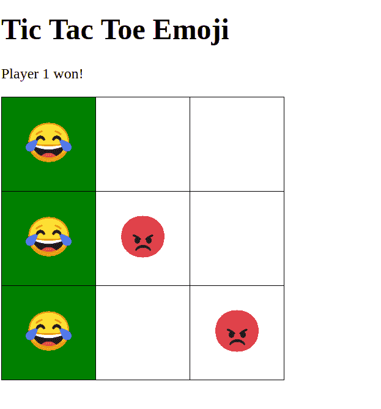

# 我的第一个 JQuery Only 应用:井字游戏表情符号！

> 原文：<https://dev.to/charleswritescode/my-first-jquery-only-app-tic-tac-toe-emoji-1fgf>

大家好！！

我叫查尔斯，我很兴奋，因为这是我在 Dev.to 上的第一篇帖子！几千年来我一直在寻找可以写的东西，现在我终于有了！！

简单介绍一下我，我是一名 23 岁的程序员，来自非洲的科特迪瓦，2015 年来到美国攻读计算机信息系统的副学士学位。我于 2018 年 5 月毕业，现已在特拉华理工社区学院(我的学校)工作约 2 年，担任计算机信息系统导师。

现在来说说好东西:**井字游戏**

这个项目之所以存在，是因为我一直试图用 Jquery 构建一些东西，但是太害怕了，不敢开始(为什么？你告诉我)。在过去的 5 年里，我一直在努力提高自己作为程序员的技能，首先是学习 Android，但在过去的一年里，我决定提高自己在前端和后端开发方面的技能。我第一次体验 web 开发是在 Vue，我从一开始就爱上了它。我总是回避 Jquery，因为它看起来令人生畏，但我知道我必须学习如何在没有“框架”的情况下制作 web 应用。框架来来去去，但 HTML、JS 和 CSS 不会，Jquery 作为普通 JavaScript 的首选库也不会。

这就是为什么我决定构建一些简单的东西，不需要太多的工作，但会帮助我更好地使用 Jquery

这是一个基本的井字游戏应用程序，我昨天晚上做的。我们对玩家 1 使用笑表情符号，对玩家 2 使用怒表情符号。第一个获得一行的玩家获胜

我计划用 CSS 让它看起来更好，并重新组织一些代码，但现在它对我来说是有效的。

该项目可在 Github 上获得，而一个现场版本可在 T2 这里获得

随便看看，给我点反馈:)

谢谢，玩得开心:)