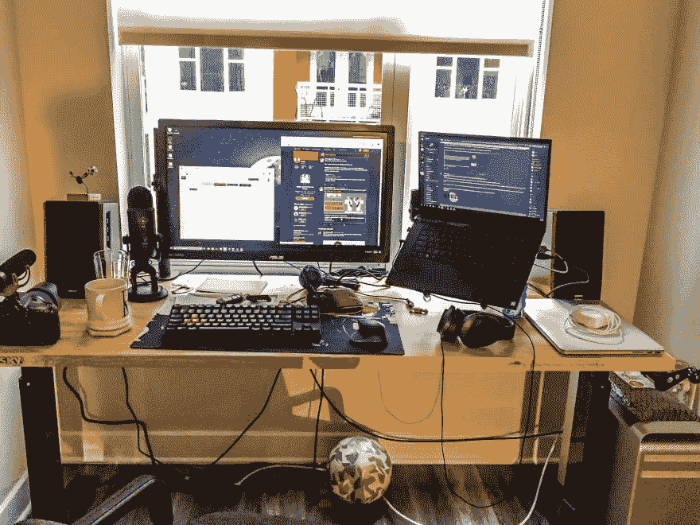
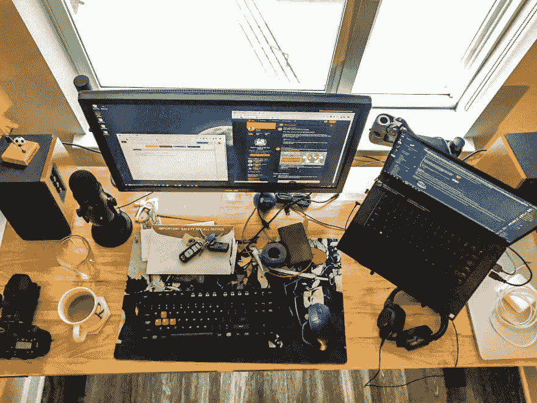

# 我的工作安排，你的呢？

> 原文：<https://dev.to/rleija_/my-work-setup-what-s-yours-54e2>

我觉得你可以从一个人的办公桌上看出很多东西。

*   我喜欢足球
*   我喜欢咖啡
*   我的键盘显示游戏玩家，但我的鼠标显示生产力？？
*   我信教(这是我要说的)
*   水是必须的
*   我喜欢摄影
*   我经常使用 Twitter。有点过了。
*   罗塞塔石碑湿软的球来分散注意力
*   我既是 Windows 用户，也是 Mac 用户。
*   我脑子有点乱
*   我在 dev.to 上，所以这一定意味着我是一个有点代码呆子:)
*   我右边有一个空气清新剂，所以我喜欢好闻的地方
*   我有口香糖，所以好的口气是必须的

很有趣，你的办公桌说明了你什么？