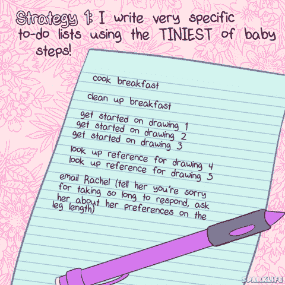

# 初学者最佳开发人员帖子:2019 年 3 月 31 日这一周

> 原文：<https://dev.to/desi/best-dev-to-posts-for-beginners-week-of-march-31-2019-4ngg>

相比其他平台，我更喜欢 DEV.to 的原因之一是这里聚集了非常令人鼓舞和有帮助的社区。最初，我觉得它更像是一个我坐下来观看的地方，而不是写作和贡献的地方，但我很高兴不仅找到了我理解的有用的文章和教程，而且新的程序员和开发人员的投入也很受欢迎。

我认为每周为我们这些仍然认为自己是#代码新手的人编辑一些最好的帖子会很不错！

(因为这是第一周，所以我在开始和结束日期上稍微放松了一下。原谅我！)

 [## 学习计划如何帮助我成长。

### 艾米威廉姆斯 1919 年 4 月 1 日 2 分钟阅读

#webdev #career #productivity #javascript](/csamywilliams_0/how-a-learning-plan-has-helped-me-grow-1app)

这篇关于制定学习计划的文章对我来说来的真是时候。我已经为#100DaysofCode 制定了自己的个人代码课程有一段时间了，我的工作主管刚刚提到也要写一个。Amy 的学习计划非常简单，易于遵循，她也发布了自己的模板来分享。

 [## 告诉我你搞砸的一次

### Ben Hal pern 1914 年 4 月 1 日 1 分钟阅读

#discuss](/ben/tell-me-about-a-time-you-messed-up-47an)

本试图在愚人节制造一个有趣的恶作剧，结果不小心烧掉了那所众所周知的房子。令人鼓舞的是，即使是我们所仰视的人也会时不时地把事情搞砸——真的没有人是完美的。

 [## 一个绝对的初学者学习反应

### 安德鲁(他/他)4 月 2 日 195 分钟阅读

#javascript #react #beginners #tutorial](/awwsmm/an-absolute-beginner-learns-react-2j0f)

安德鲁分享他的想法，而学习反应一无所知。我正在经历本质上和他一样的思考过程，但是在我这边，是盖茨比和诺德，所以我绝对感同身受！

 [## 如果你是一个#学习 JavaScript 的代码新手，这是你今天应该学习的！

### 梅达·巴图尔👩‍💻3 月 28 日 191 分钟读取

#javascript #json #codenewbie #womenwhocode](/maedahbatool/if-you-re-a-codenewbie-learning-javascript-this-is-what-you-should-learn-19m1)

Maedah 发布了一个很棒的快速视频，分解了一些 JavaScript 和 JSON 概念。

 [## 我的通过使用 AWS 学习 AWS 的课程已经有一年了🎉

### 凯尔·加尔布雷斯 1919 年 4 月 4 日 3 分钟阅读

#aws #showdev #news #personalnews](/kylegalbraith/my-course-learn-aws-by-using-it-is-1-year-old-2e87)

对 AWS 感兴趣？Kyle Galbraith 今天一岁了，他不仅提供折扣，还提供有趣的衬衫！

 
我们得到了这个！