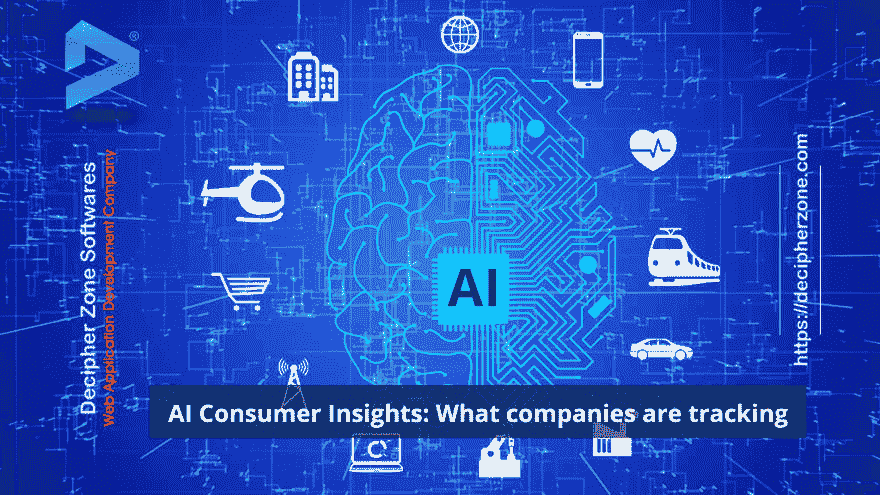

# 人工智能消费者洞察:跟踪哪些公司？

> 原文：<https://dev.to/decipherzonesoft/ai-consumer-insights-what-companies-are-tracking-556m>

人工智能是一个正在发展的趋势，它被大肆宣传，但人们的看法是积极的，也是消极的。人们非常怀疑人工智能会对人类及其隐私构成威胁，这实际上取决于我们如何使用人工智能。事实上，公司正在跟踪人们的活动，以创建更多 ROI(投资回报)的定向广告，这不会对我们的隐私构成任何威胁，因为数据是以隐藏身份共享的。所以，让我们来讨论一下如何、为什么以及哪些公司在追踪我们。

点击此处阅读全文: