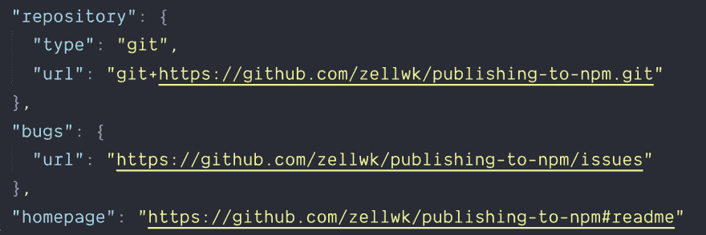
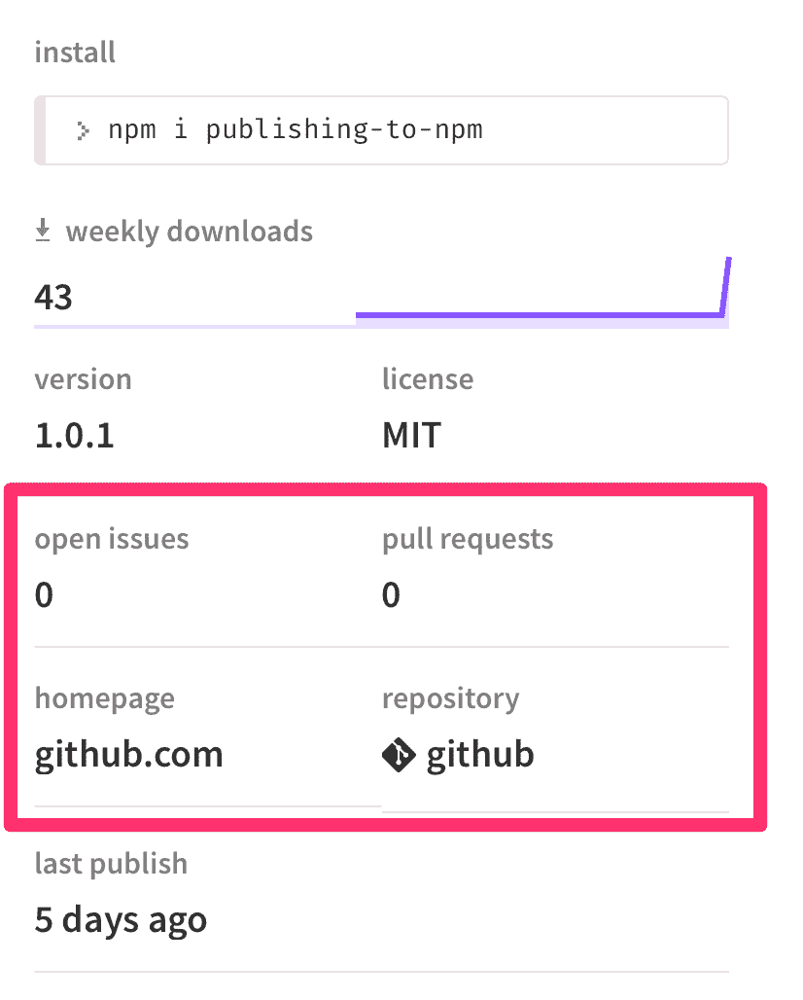

# npm 初始化的最佳时间

> 原文：<https://dev.to/zellwk/the-best-time-to-npm-init-58po>

你应该在什么时候？

大多数开发人员在创建并导航到一个新项目后马上运行`npm init`。

在项目开始时对`npm init`有意义，因为我们使用 npm 来下载依赖项。一旦我们`npm init`，我们就可以开始下载(并保存)我们的依赖项。

对于大多数项目来说，这种工作流程是可行的。

但是如果你正在创建一个开源项目，最好的时机是稍微晚一点。如果您在创建并导航到项目后立即开始工作，您将会错过一些东西。

## NPM 初始化的最佳时间

(对于一个开源项目来说)最好的时机是在你给你的项目添加了一个 Git remote 之后。换句话说，您应该在完成以下命令后才执行`npm init`:

1.  `git init`
2.  `git remote add origin`

如果您在添加 Git remote 之后`npm init`，npm 将在您的`package.json`文件中生成三个额外的东西。它们是:

1.  一个链接到您的远程回购的`repository`属性
2.  一个带有问题页面链接的`bugs`属性。
3.  链接到`readme.md`文件的`homepage`属性。

这三个属性将作为元数据显示在项目的 npm 页面的右侧。

这些元数据是链接。他们让人们很容易地从 npm 页面转移到你的项目的 Github 页面。您会希望这些链接更容易被发现。

## 第二好的 npm 初始化时间

npm 初始化的第二个最佳时间是现在。如果现在运行`npm init`，就会生成我上面提到的三个属性。

在运行`npm init`之前，确保将原来的`package.json`文件重命名为其他名称。这样，您可以从原始的`package.json`文件向新生成的文件复制粘贴您所做的依赖项和其他更改。

## 包装完毕

最好的时机是在你将 Git remote 添加到你的项目之后。第二好的时间？随时恭候！

* * *

感谢阅读。这篇文章最初发表在我的博客上。如果你想要更多的文章来帮助你成为一个更好的前端开发者，请注册[我的时事通讯](https://zellwk.com)。