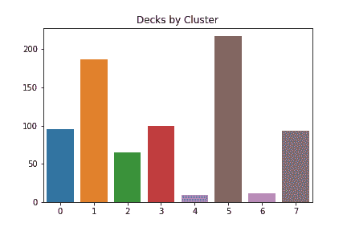

# 魔术:聚会遇上数据科学

> 原文：<https://dev.to/strikingloo/magic-the-gathering-meets-data-science-7il>

魔术:多年来，聚会一直是我的爱好之一。其庞大的卡库和悠久的历史使其非常适合数据分析和机器学习。

如果你错过了我的前一篇文章，我将 K-Means 聚类(一种无监督学习技术)应用于一个魔术:收集我从 [mtgtop8 收集的数据集。](https://mtgtop8.com)那篇文章解释了技术方面的问题，但没有涉及结果，因为我认为我的读者不会感兴趣。

由于许多人已经站起来表达他们的不同意见，我现在将向你们展示算法学到的一些东西。

这不会是我第一次也不会是最后一次说，无监督学习可能会对它所学的一切感到毛骨悚然，即使你知道它是如何工作的。

## 数据

我在这个项目中使用的数据集只包含了去年现代格式的专业套牌。我没有在这个分析中包括侧板。在这个 [GitHub](https://github.com/StrikingLoo/MtGRecommender/) 项目中，除了代码之外，我用于训练和可视化的所有工具都是可用的。

如果你知道任何好的休闲套牌数据集，我很乐意在评论中知道。不然以后可能会刮一个。

在这个分析中，我看了 777 副不同的牌，总共包含 642 张不同的牌(算上地)。

## 结果

首先，我强烈建议您打开资源库，亲自尝试 Jupyter 笔记本，因为可能会有一些您感兴趣的见解，而我可能会遗漏。

也就是说，如果你想知道关于一张特定卡片的数据(假设它是竞争元的一部分，我们已经看到它足够小了)，如果你在这里没有看到它，请在评论中问我！

现在，我们要问自己的第一个问题是…

### 各魔:聚簇长什么样？

请记住，我们聚集了一副牌，而不是一张牌，所以我们希望每一组能大致代表一个原型，特别是在现代元中看到的一个。

首先:这里是每个集群的计数。也就是说，每张牌有多少张。

<figure>[](https://res.cloudinary.com/practicaldev/image/fetch/s--_Hl3yxaP--/c_limit%2Cf_auto%2Cfl_progressive%2Cq_auto%2Cw_880/http://www.datastuff.tech/wp-content/uploads/2019/04/figure_1.png) 

<figcaption>应用 K-Means 聚类后落在每个聚类上的牌组数量。</figcaption>

</figure>

我们可以马上看到有两个特别小的集群，每个集群不到 30 副牌。让我们仔细看看。

### 每簇上的牌

对于第 4 组，我得到了每副牌中出现次数最多的一组 40 张牌，然后找出它们的交集，看看它们有什么共同点。我对第 6 组重复了这一过程。

```
Cluster number 4:
{'Devoted Druid', 'Horizon Canopy', 'Ezuri, Renegade Leader', 'Forest', 'Elvish Archdruid', 'Pendelhaven', "Dwynen\\'s Elite", 'Llanowar Elves', 'Collected Company', 'Windswept Heath', 'Temple Garden', 'Westvale Abbey', 'Razorverge Thicket', 'Heritage Druid', 'Elvish Mystic', 'Nettle Sentinel','Eternal Witness', 'Cavern of Souls', 'Chord of Calling', 'Vizier of Remedies', 'Selfless Spirit'}
Cluster number 6:
{'Funeral Charm', 'Liliana of the Veil', "Raven\\'s Crime", 'Fatal Push', 'Thoughtseize', 'Wrench Mind', 'Bloodstained Mire', 'Smallpox', 'Inquisition of Kozilek', 'Mutavault', 'Urborg, Tomb of Yawgmoth','Infernal Tutor', 'Swamp', 'The Rack', "Bontu\\'s Last Reckoning", 'Shrieking Affliction'} 
```

Enter fullscreen mode Exit fullscreen mode

看起来他们中的一个在玩绿色牌组，使用精灵和绿色土地，而另一个结合了碾磨和丢弃，像 Liliana 和 Kozilek 的宗教裁判。

这是上一个算法对所有集群的结果，看看你能否分辨出每个集群属于哪个原型。这也告诉我们当我得到数据时元的分布情况。