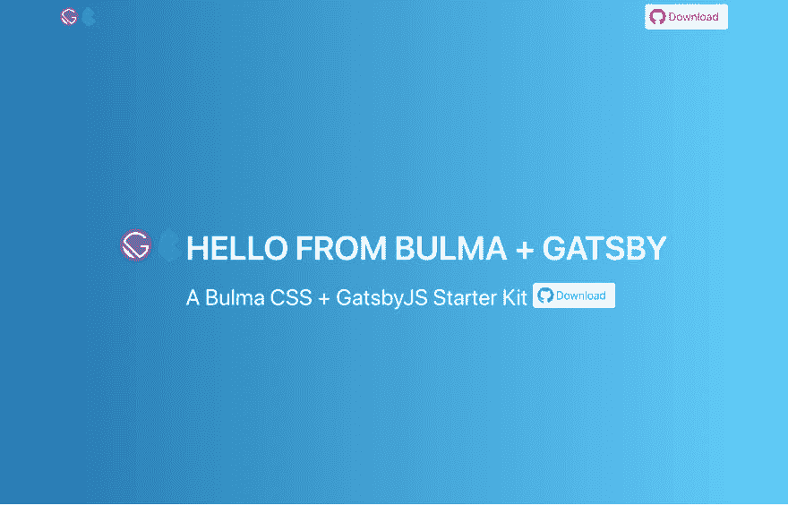
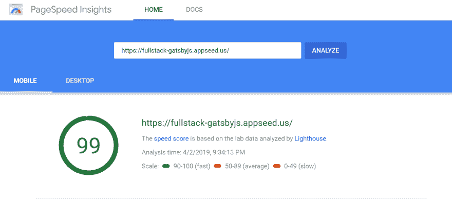

# 为 React 寻找“可爱”的全栈？试试盖茨比/布尔玛

> 原文：<https://dev.to/sm0ke/2019-the-perfect-react-full-stack-imho-44k7>

各位编码员好，

在使用了多年 jQuery / Bootstrap 和 Flask(后端)之后，我决定稍微改变一下盖茨比和布尔玛的 CSS。

[](https://res.cloudinary.com/practicaldev/image/fetch/s--ZTXIIXB---/c_limit%2Cf_auto%2Cfl_progressive%2Cq_auto%2Cw_880/https://static.appseed.us/misc/thumb-gatsby-bulma.png)

如今，开发人员可以使用许多工具快速搭建 web 应用程序..等等)但我们应该考虑到使用盖茨比连同布尔玛有一些很好的理由:

第一个是速度:)

[](https://res.cloudinary.com/practicaldev/image/fetch/s--Df2SeyLl--/c_limit%2Cf_auto%2Cfl_progressive%2Cq_auto%2Cw_880/https://static.appseed.us/misc/fullstack-gatsby-seo-score.png)

其次，由于 JAM Stack 的实现，Gatsby 变得非常受欢迎。它周围有一个巨大的社区，并在 Netlify 上实现了自动化部署。它很稳定，有很好的文档记录，并且为站点地图、认证、开发工具和 GraphQL 提供了“开箱即用”的模块，顺便说一句，这太棒了。

最后，布尔玛的 CSS 框架也是有据可查的，它有可爱的 CSS 标记，比如“is-primary”/“is-large”，用于按钮和自动单元格对齐。所有这些使得使用和集成变得非常容易。我还必须提到，布尔玛是用 Flexbox 制造的。

通过使用这个堆栈，开发人员可以使用几个基本命令轻松创建新的 web 应用:

```
npm install -g gatsby-cli // install gatsby console globally
gatsby new gatsby-bulma https://github.com/rosoftdeveloper/fullstack-gatsbyjs.git // clone the sample starter
cd gatsby-bulma
npm install // intall deps
gatsby develop // edit your code with LIVE update in browser
gatsby build // prepare for production
npm run deploy // live deploy (please edit deploy.js first) 
```

基本上，上述命令将为 Gatsby 工具和演示启动程序提供一个基本的设置。包含实时[部署脚本【T1:)](https://github.com/rosoftdeveloper/fullstack-gatsbyjs/blob/master/deploy.js)

此入门产品的后续步骤:

*   添加身份验证(基本、OAuth、2fAuth)
*   集成条纹
*   少了点什么？请建议:)

资源:

*   演示:[全栈 GatsbyJS](https://fullstack-gatsbyjs.appseed.us/)
*   来源:Github，当然是麻省理工学院的许可
*   [GatsbyJS 框架](https://www.gatsbyjs.org/)
*   Bulma.io - [CSS 框架](https://bulma.io/)