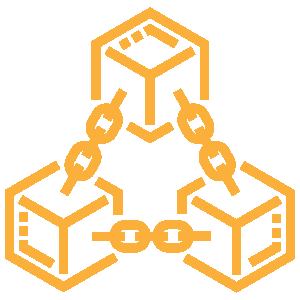
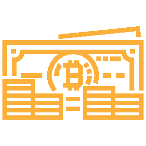
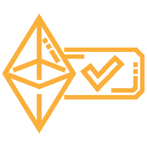

# 基于 Ethereum 的块链是什么？

> [https://dev . to/x37ts 52/what-is-an-ethereum 基上的单块链-58bo](https://dev.to/x37ts52/was-ist-eine-blockchain-auf-ethereum-basis-58bo)

# 指标:

1.  前言
2.  区块链
3.  块和链结构
4.  信任和社区
5.  操纵安全
6.  透明的
7.  数据所有权和成本
8.  Daseinsberechtigung
9.  以太坊
10.  结论和意见

# 1 序言

基于 Ethereum 的块状链，这是什么？你应该知道这种技术还是马上就忘了？根据许多技术人员的说法，这项技术将改变我们的互联网，我们知道它将改变我们的合同和银行世界。但她真的可以吗？所以在博客条目里，我想告诉你什么是块链，你可以用它做什么。我会尽量简单些，不会太详细。

# 2 -区块链

很多人以前听过 buzzwords blockchain 和 Ethereum，也许读过一些。粗略地说，块链是对等网络。它存储事务和 ggfs。数字合同(Smart Contracts)在一个按时间顺序排列的线性数据库(链结构)中永久存在且不可更改。

好吧，这也容易吗？事实上，这并不复杂。你只需要解释一次。你肯定知道开化珍珠项链长什么样子吧？珍珠一串接一串地粘在一起。这样你就可以想象一个区块链的构造。有一个开始，这就是所谓的创世记块。他也知道他是第一个街区。下面的块知道自己和前面的块。这两者形成了一个顺序。对于每个新附着的块，将重复此过程。新块知道它自己和它以前的块。

# 3 块和链结构

但是，现在什么是最棒的，块形成了一个链条？链结构中的每个块都具有属性。这些特性(包括块编号、预散列值、货币值、文件内容等)将转换为唯一散列值。哈希可以想象成一个家庭地址。

如果您现在想要变更图块的任何属性，它的杂凑也会随之变更。下一个块不再识别上一个块，从而断开了链。

我怎么能想象呢？让我们回到珍珠项链。链中的珍珠都按字母顺序排列。举个例子。珍珠 a 排在前面，然后是珍珠 b、珍珠 c 等等。现在让我们把珍珠 b 的字母换成 BB。这是一个特点。但珍珠 c 只知道珍珠 b 而珍珠 b 不知道珍珠 c 失去了联系。链条断了。

# 4 -信任和社区

不变的链结构旨在在用户之间建立信任和透明度。希望用户感到安全，知道什么都不能操纵。说起来，外来用户和所有多个外来用户相互作用之前，应该共同拥有信任基础。这就是区块链的核心所在。

漂亮又好。一个你无法改变的链条结构。但是，用户如何知道是否有人操纵链，然后一切都不再正确？这就是对等网络技术的作用所在。

在一个分散的组织结构 P2P 网络中，所有相关用户平等地协作。用户可以直接连接在一起，无需使用中央服务器即可自主操作。参与者可以是 P2P 网络中的功能、资源、服务和文件的提供者和/或消费者。你可以把科技想像成一种档案分享。只有区块链会被分割。这样，一个用户可以直接与另一个用户交换。完全不需要一个中心位置来传达。你可以这样想，而不是用智能手机打电话，那里的一切都是通过电话服务提供商进行的，你可以使用对讲机。

# 5 -防篡改

对于每个用户，块链都是计算机上的映像。如果一个用户想要操纵一个块，那么他就需要在超过 50%的其他用户中更改块链的映像。因此，操纵用户必须能够控制块链的很大一部分。他需要大量的计算能力。因为它需要同时改变 50%的用户的数据块链图像。

# 6 - Transparenz

等等，上面不是有透明的东西吗？你想让我把我的交易和 Smart Contracts 或者其他东西存储在一个透明的技术里，让每个人都能看到我在做什么？别担心，听起来比那更糟。

让我们再拿回这些积木。块透明地存储要保存的文件的所有属性，以形成链结构。与以前一样，它们被转换为散列值。但你可以很容易地把它转换回来。再说一遍，任何用户都可以真正看到任何东西。因此，您可以使用多达 512 位 AES 算法加密数据内容、事务和 Smart Contracts。

如果希望每个用户都可以访问存储的内容，则会从块的创建者/所有者处获得公钥。此所有者必须事先了解用户，并以不同的方式进行操作。在未事先了解的情况下，公钥交换不起作用。然后可以使用该公钥访问文件的内容。

再一次简化。你可以把它伪装成这样。你们在海边有个度假屋，全世界都知道，知道在哪里。但是，您无法访问它。现在你想让你认识的其他人进入这个度假屋。你抄下你的房门钥匙，把它传给别人。这样就可以看到公钥的过程。

# 7 -数据座椅和成本

这和互联网、合同和银行有什么关系？哪里有增值？你就不能拿一个可能已经存在的数据库，然后把它构建成一个不能被篡改的数据库吗？你可以的这就是科技过时的原因。

那你为什么要用块链来解释你对她做了这么长时间的解释呢？then why would you use a block chain and then why would you explain so long to her？很简单.数据库是一个中心构造。也就是说，任何人都必须拥有、操作和等待这些资源。操作者通过拥有数据库，还拥有对所存储数据准确性的控制权。你必须信任第三方。相反，块链的基本思想起作用。块链的所有用户都拥有对其中文件的控制权，并确保这些文件不会被篡改。

不知何故，你的论点并没有让我如此信服。在第三种情况下，中间商一词又出现了什么问题？如果为监测合同和交易而付给中间商的钱是正确的，那么中间商一词又会出现什么问题呢？你可以的再一次，区块链技术已经过时了。

但先停下来！中间人是什么意思？到目前为止我们知道他是个中间人。中间人是指两个用户之间的一个人(Bsp: Notar)或机构(Bsp: Bank)，根据两个用户协商和关闭的规则进行监视。因此，该中介机构要求对其服务收取一次或一次以上的费用。

为了简化它，你可以这样看。和足球比赛一样，必须有一个人在队员中确保公平比赛和规则态度。这就是为什么你创造了裁判。分块链中的中间商和用户可与仲裁员进行比较。

这是一个关于中间人的想法。第三个实例总是花费金钱，而且通常是稳定的，视具体情况而定。这意味着用户的固定成本。分块链绕过这些固定成本，使其成为可变成本。可变成本的产生是因为只有在实际发生投资时才需要进行投资。

可变成本听起来这么好听吗？现在不能说是一笔总付。想象一下，你是一个乘公共交通工具上下班的多师，那么买一张月票对你来说很划算，固定成本也很高。但是，如果你现在是一个临时教师，每月只乘坐公共交通工具一次，那么买一张单程票对你来说是值得的，说说可变成本吧。你需要分析你的商业逻辑，质疑，看看技术是否有意义。

啊，现在我们有了！分块链也要花钱。没有什么是免费的。不要害怕。不要那么贵。首先，区块链是免费的。你不需要支付月费或注册费。你只需要区分两件事。从区块链读取并写入区块链。读书是免费的，写作是交易费。费用取决于存储在块链中的块或数据的大小。但它仍然坚持在美分的范围内，用欧元兑换。

# 8 - Daseinsberechtigung

现在，你们已经听说了一些关于块状链的事情，还有一些优缺点。现在，让我们达成共识，让我们自己来决定是否要使用区块链。

在块链中，您可以连续、可跟踪、透明、可靠和持久地存储数据。所有参与用户都确保准确性和信任。这就产生了这样一个问题，即是否需要对交易或合同的中间人进行认证？不，那你就不需要这个了！这就是我们的决定。不幸的是，这并不完全正确。你几乎不需要它了。因为仍然需要遵守各国的现行法律。新技术仍然取代不适用的法律！

# 9 -以太坊

哇，现在我说了这么多，还没提到以太网。很多人不知道或不明白的是以太网是一个协议！该协议在 P2P 网络中运行，并使其成为采用分块链技术的加密货币平台。比特币的不同之处在于 Ethereum 还允许数字合同(Smart Contracts)和数字双胞胎(Digital Twins)。

Smart Contracts 是数字显示的合同，与现实世界中的合同相同。规则和法律是在一个 if-then 结构中编写和自动执行的。他们不是女巫的作品，甚至很简单。

数位双胞胎是真实世界物件的影像。从意义上讲，它们在块链中应该是唯一的，以便多个用户始终唯一地引用同一个真实对象。

举个例子。一辆公共汽车正在建造一辆新车。从中，他可以在块链中创建一个独特的数字双联。然后，它可以传递汽车的属性，并获取更多信息。几乎是整个历史。您也可以将多个 Smart Contracts 指派给 Digital Twin。Smart Contract 除其他外，可以是检验或维修单，记录执行情况、部件和价格。任何车主，甚至巴士司机，都可以随时跟踪那辆车，以及它发生了什么事。

# 10 -结论和意见

现在你写了这么多。你不能简单地告诉我块链技术，从你个人的观点来看，什么时候才有意义，对我的商业逻辑来说是什么东西？没什么比这更容易的了！

*块链技术只有在交易、数字双联和智能合同要持久、可靠、不可更改的情况下才有意义。在一个场景中，多个用户相互作用。还应放弃中介机构和/或以自动程序取代。*

了解。**只有交易、数字双胞胎和智能合同才会进入区块链。**虽然还有其他一些事情，但目前我们坚持三个问题！其他的都没有意义！对于大型文件，块链具有扩展名。inter planetary file system(IPF)，但我们在另一个博客条目中对此进行了说明。

我希望我能给你足够的信息关于"什么是基于 Ethereum 的块链？“并帮助你决定是支持还是反对这项技术。

在其他博客文章中，我们将一起讨论块链技术背后的技术，以及如何为 Ethereum 编写智能合同协议、数字双联和分散应用程序(DApps)。所以大家都很兴奋 so everybody ' s excited .