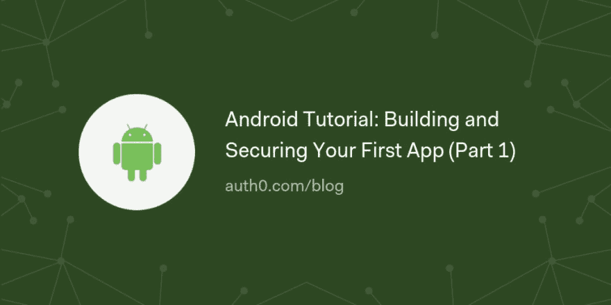

# Android 教程:构建和保护您的第一个应用程序(第 1 部分)

> 原文：<https://dev.to/auth0/android-tutorial-building-and-securing-your-first-app-part-1-5149>

在教程的这一部分，你将学习如何从头开始开发一个简单的待办事项列表 Android 应用。在这里，您将在 Android Studio 的帮助下搭建您的应用程序。之后，您将构建一个列表来显示待办事项，并创建一个表单让用户能够更新这个列表。最后，您还将了解如何使用 Auth0 保护您的待办事项应用程序。

[读下去🤖](https://auth0.com/blog/android-tutorial-building-and-securing-your-first-app-part-1/?utm_source=dev&utm_medium=sc&utm_campaign=androidtut_app)

