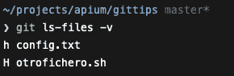
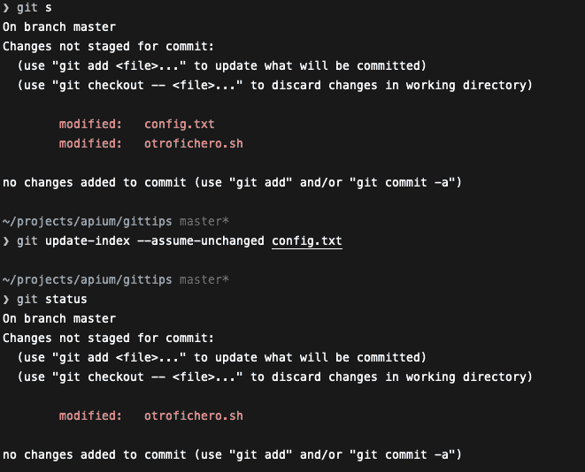

# 提示:跳过工作树

> 原文：<https://dev.to/apium_hub/gittip-skip-worktree-38jl>

GitTip:跳过工作树。这个技巧简单而强大，我们想要实现的是修改一个本地文件，尽管已经被跟踪，但 git 无法识别它是否被修改。

## 提示:跳过工作树

对于这个例子，我有一个文件“config.txt”，内容是“secret”。这个文件在所有环境下都能很好地工作，但是在本地环境下，我需要修改它来进行测试。没问题，修改了，做了相关测试，还原了，上传了。

当出于各种需要，必须在您的本地环境中修改该文件并且该文件必须工作时，问题就来了，为了不影响其他人，我们不应该上传该文件，我们该如何做呢？

我的同事(库多斯·Á·阿尔瓦罗@阿尔瓦罗比兹)告诉我这个命令:“git update-index-assume-unchanged”，我必须说它满足了我的需要，它允许我在本地环境中修改文件，git 没有“检测”它，我可以继续在其他文件中进行更改，并使用我最喜欢的“git add”提交文件什么都不用担心。

在下图中，我们可以看到“git status”如何向我们显示两个文件，config.txt 和 otrofichero.sh。正如我们所说，我们不想上传 config.txt，这是本地环境中的一个变化，我们不想担心它。在以下命令“update-index”之后，文件 config.txt 从工作区消失。

该文件仍然存在，git 不会刷新它，除非发生以下两件事:

*   手动禁用我们标记该文件的位(假设不变)
*   拉，那个文件已经通过上游修改了←危险！

在最后一个场景之前，我们担心的是文件，我们必须用命令“git ls-files -v”检查每个 pull 是否被删除

这里我们看到 config.txt 用小写的“H”标记，而 otrofichero.sh 用大写的“H”标记。这个字母是区分 git 缓存的文件和非 git 缓存的文件的位的表示。

简而言之，这个命令不适用于我们的用例，阅读文档，这个命令用于将大文件标记为未缓存，并提高我们使用 git 的性能。如果我们要找的是 git 不应该检查任何特定的文件，我们要找的选项是–skip-work tree:

我不会再深入讨论这个问题了，最后一个选项类似于*假设更改*，但是它会在拉动之前保留标记。Assume-change 应该用于 git 跟踪的大文件，如 SDK 等，而 skip-worktree 更适合本地环境测试的配置更改，以便不用担心将它们上传到我们的远程存储库。

说到这里，我给你一些与文章相关的非常有用的 git 别名。别名本身的名称定义了它所执行的操作:

[别名]

hide = update-index–skip-work tree

unhide = update-index–no-skip-work tree

unhide-all = ls-files-v | grep-IS| cut-C3-| xargs git update-index

–不跳过工作树

隐藏=！git ls-files-v | grep 'S '| cut-C3-

如果你想了解更多关于 GitTip: Skip WorkTree 的信息，请订阅我们的[月刊](http://eepurl.com/cC96MY)。

帖子 [GitTip:跳过工作树](https://apiumhub.com/tech-blog-barcelona/gittip-skip-worktree/)最早出现在 [Apiumhub](https://apiumhub.com) 上。