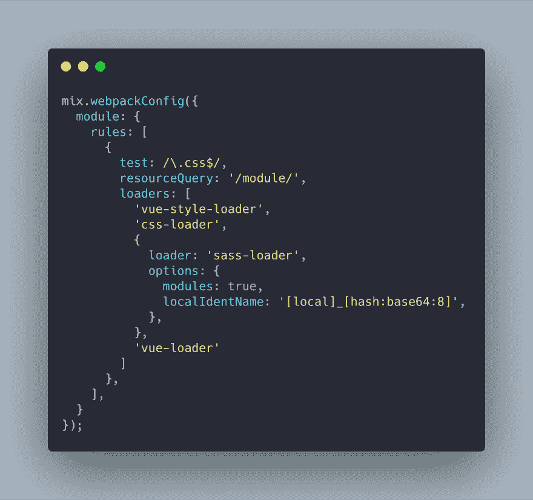

# 将 Vue Loader 15 的 SCSS 模块与 Laravel-mix 一起使用

> 原文：<https://dev.to/oroalej/using-vue-loader-15-s-scss-modules-with-laravel-mix-400b>

嗨伙计们，

你们有任何配置的 laravel-mix 用于 vue loader 的 SCSS 模块吗？

我试着按照网站上的说明去做，但是好像没用。

这是我的网络包配置。

非常感谢你的帮助。