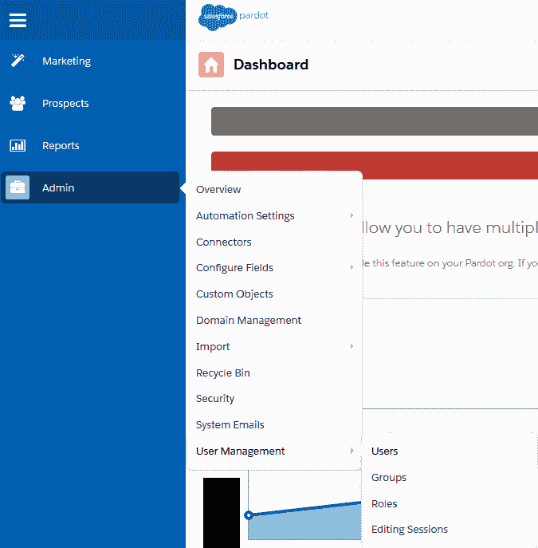
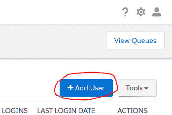
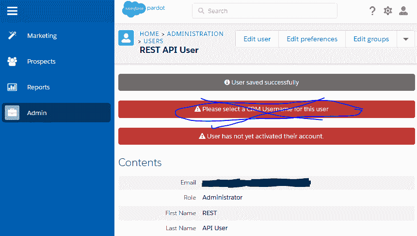
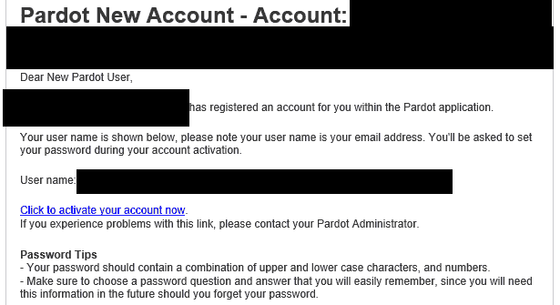
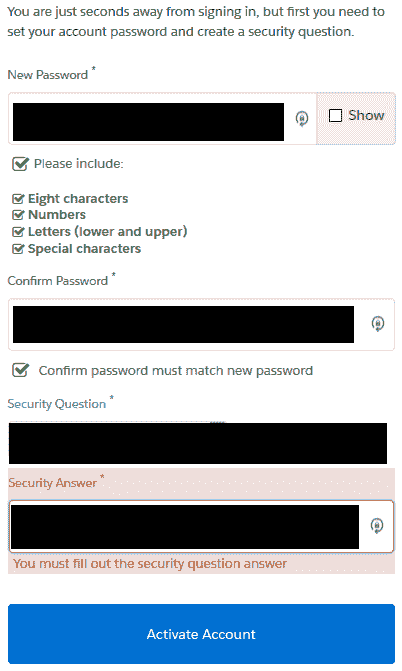
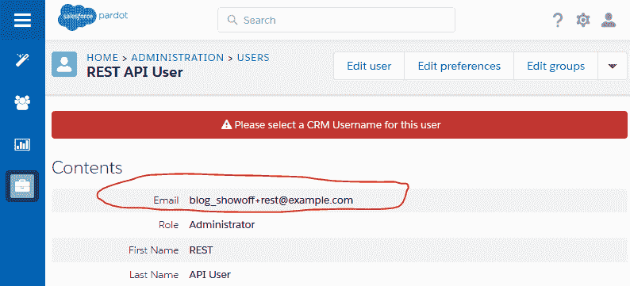
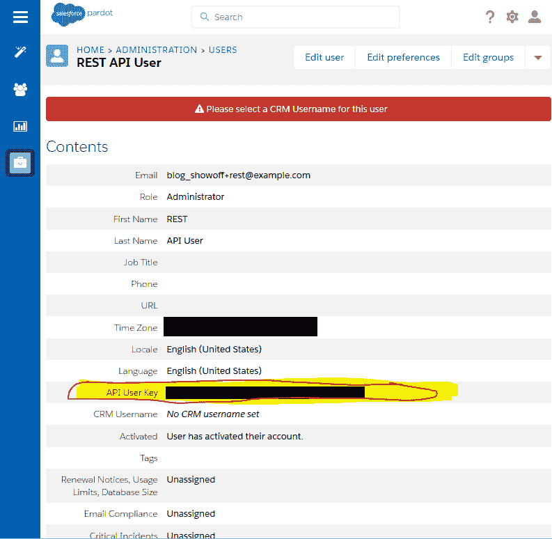
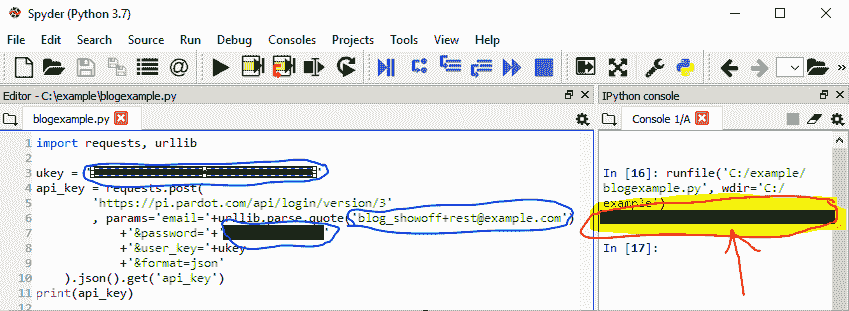
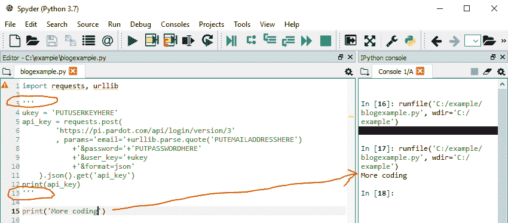

# 登录到 Salesforce 的 Pardot API(带 Python)

> 原文：<https://dev.to/katiekodes/logging-into-salesforce-s-pardot-api-w-python-4b23>

登录 Pardot 的 API 比[登录 MarketingCloud 的 API](https://dev.to/katiekodes/logging-into-salesforces-marketing-cloud-api-w-python-52mo) 要容易得多。

我用的是 Python，但是大部分步骤和代码无关。

任何可以做 HTTPS 帖子请求的语言都可以。

## 背景

我喜欢通过对 Pardot 的 API 编程来“自动化枯燥的东西”。

我经常做的两件事是:

1.  一次向前景表中添加大量自定义字段
2.  [一次清理大量不良数据](https://katiekodes.com/python-pardot-null-clean/)

## 密码注意事项

要让这个代码工作，你必须输入你的密码和“用户密钥”。这可不是什么好事。任何截获此信息的人都可以在 Pardot 中模仿你。

1.  仅在您信任的计算机上运行此代码。
2.  仅通过您信任的网络连接运行此代码。
3.  如果您将此 Python 脚本保存在一个文件中，请在文件名的开头键入“包含密码”,这样您就会记住这是一个在关闭它之前必须清除密码的文件。
4.  如果你在一个 IDE 中工作，它把随后的“运行”按钮点击当作一个大的会话*(并且缓存从“运行”到“运行”的变量值)*，利用它来帮助你记住从你的文件中清除你的密码。运行几行代码，将其余的注释掉，以获取一个“API key”并将其保存到一个名为`api_key`的变量中。然后注释掉“获取”代码，在密码上退格，键入单词“`PASSWORDGOESHERE`”，保存您的脚本。对您的电子邮件地址和用户密钥进行同样的操作。哒哒！现在，您可以不用担心是否在脚本内容中留下了明文密码。
5.  如果您需要存储这个脚本并以任何自动化的方式运行它，您将不得不寻求专家的建议。将您的密码输入到脚本本身的主体中，然后将它留在那里，这根本不是一个选项。

## 1:管理员- >用户管理- >用户

以系统管理员身份登录 [Pardot 的 web 控制台](https://pi.pardot.com/)。

如果左侧导航菜单尚未展开，请单击其顶部的导航“汉堡”*(带有三条水平线的图标)*。

将鼠标悬停在“管理”上，然后悬停在“用户管理”上，然后点按“用户”

[](https://res.cloudinary.com/practicaldev/image/fetch/s--uMKs99cB--/c_limit%2Cf_auto%2Cfl_progressive%2Cq_auto%2Cw_880/https://katiekodes.cimg/screenshot-pardot-login-01-users.png)

你也可以通过访问[https://pi.pardot.com/user](https://pi.pardot.com/user)直接进入这个屏幕。

## 2:创建新用户

我喜欢创建一个致力于外部集成的新用户，而不是使用我自己的凭证。

~~此外，如果您已设置 Pardot 通过 Salesforce 凭据利用单点登录，您甚至无法在没有专用 Pardot 用户的情况下进入 API，该用户的“电子邮件地址”不是您已连接到 Pardot 的 Salesforce 组织中用户的用户名。~~

> **2020 年夏季新增**:连接到 Salesforce SSO 帐户的 Pardot 用户*也拥有 API 密钥*!
> 
> 如果您愿意，您可以[跳到“5:获取用户密钥”](#5-get-the-user-key),尽管我个人仍然建议让整个 Salesforce 用户致力于数据集成，而不是使用真人的凭证。

如果您的公司通过用户名带有“`+Something`”的电子邮件发送到“`+`”之前的用户名，这特别简单——只需在“`@`”之前添加类似“`+rest`”的内容

所以，比如说，`your_name+rest@your_company.com`

否则，从您控制的电子邮件地址开始，但该地址不是您与 Pardot 连接的 Salesforce 组织中的用户。

*(注意:设置好新用户的密码后，您可以将其电子邮件地址更改为一个假的电子邮件地址，但您必须从一个真实的电子邮件地址开始，这样您才能获得激活电子邮件。)*

在“用户”页面的右上角，单击“添加用户”按钮。

[](https://res.cloudinary.com/practicaldev/image/fetch/s--R3JqKL5s--/c_limit%2Cf_auto%2Cfl_progressive%2Cq_auto%2Cw_880/https://katiekodes.cimg/screenshot-pardot-login-02-newuser.png)

给用户一个描述性的名字和姓氏。我喜欢“REST”作为名字，“API User”作为姓氏。

给用户一个可以接收电子邮件的电子邮件地址。如果您将 Pardot 设置为允许您使用 Salesforce 凭据登录，请确保电子邮件地址是用作您连接到 Pardot 的任何组织的 Salesforce 用户名的**而不是**。

给用户一个“管理员”的角色*(警告:它现在可以做一些非常强大的事情——小心它的密码！)*。

取消选中“电子邮件首选项”中的所有复选框

单击“创建用户”按钮。

[](https://res.cloudinary.com/practicaldev/image/fetch/s--efcYX-to--/c_limit%2Cf_auto%2Cfl_progressive%2Cq_auto%2Cw_880/https://katiekodes.cimg/screenshot-pardot-login-03-donotsync.png)

如果您启用了 Salesforce sign-on，**忽略来自 Pardot 的所有提示，为您刚刚创建的用户选择“CRM 用户名”。**

## 3:设置密码

检查你的电子邮件。在新的匿名窗口或不同的浏览器中打开“激活”链接。

[](https://res.cloudinary.com/practicaldev/image/fetch/s--g8bAvofM--/c_limit%2Cf_auto%2Cfl_progressive%2Cq_auto%2Cw_880/https://katiekodes.cimg/screenshot-pardot-login-04-activemail.png)

为新用户设置密码和安全问题+答案。

将这些储存在安全的密码管理器中。

[使用新凭证在同一个“匿名”标签或浏览器中登录 Pardot](https://pi.pardot.com/) ,确保它们正常工作。

注销 Pardot 并关闭浏览器窗口。您再也不需要使用这些特殊凭证登录 Pardot 的 web 控制台。

[](https://res.cloudinary.com/practicaldev/image/fetch/s--fKbEMBJ9--/c_limit%2Cf_auto%2Cfl_progressive%2Cq_auto%2Cw_880/https://katiekodes.cimg/screenshot-pardot-login-05-setpassword.png)

## 4:可选:更改电子邮件地址

如果您认为有一天您可能希望使用您之前选择的电子邮件地址作为 Salesforce 用户的用户名，请现在更改 Pardot 用户的电子邮件地址。

新的电子邮件地址不必经过验证就可以成为 Pardot 用户的新用户名，因此您可以使用一个不真实的电子邮件地址。

**然而**，确保你把它改成你知道永远不会意外发送给**其他任何人**的东西，因为这是“密码重置”电子邮件会去的地方。

***不要*** 像我在截图中做的那样使用`@example.com`。这是一个巨大的安全漏洞。*(我一截图完就把用户从 Pardot 上删除了。)*

例如，你可以把它改成`your_name+rest@your_company.com`。

要做到这一点，请回到您以自己的身份登录的 Pardot 会话，单击您刚刚创建的用户的用户详细信息页面右上角的“编辑用户”按钮。

[](https://res.cloudinary.com/practicaldev/image/fetch/s--NOdhY83---/c_limit%2Cf_auto%2Cfl_progressive%2Cq_auto%2Cw_880/https://katiekodes.cimg/screenshot-pardot-login-06-changeemail.png)

将电子邮件地址编辑为智能的，并在页面底部点击“保存用户”

哒哒！电子邮件地址已更改。尽管您可能无法在您选择的电子邮件地址收到密码重置邮件，但您总是可以临时将电子邮件地址改回您可以接收电子邮件的地址。

*(如果您启用了单点登录，请确保它没有被用作您已连接到的 Salesforce 组织中的用户名。)*

[](https://res.cloudinary.com/practicaldev/image/fetch/s--O4IJV2QW--/c_limit%2Cf_auto%2Cfl_progressive%2Cq_auto%2Cw_880/https://katiekodes.cimg/screenshot-pardot-login-07-emailchanged.png)

## 5:获取用户密钥

不管是好是坏，当你以任何系统管理员的身份登录 Pardot 时，你可以看到每个用户的“API 用户密钥”

(这就是为什么你不需要以新用户的身份登录 Pardot web 控制台。)

查看您刚刚创建的用户的用户详细信息页面，向下滚动详细信息并找到“API 用户密钥”旁边的文本

您需要这个“用户密钥”通过 API 登录 Pardot。

如果您真的信任密码管理器，您可以将用户密钥与帐户的用户名和密码一起添加到密码管理器中。

否则，您可以以自己的身份登录 Pardot，并在每次想要使用该 API 时查找这些信息。

[](https://res.cloudinary.com/practicaldev/image/fetch/s--X7akE-nf--/c_limit%2Cf_auto%2Cfl_progressive%2Cq_auto%2Cw_880/https://katiekodes.cimg/screenshot-pardot-login-08-apikey.png)

## 【6:秘密】>【python】>就这样！

作为给定用户，您需要使用代码登录 Pardot API 的 3 个关键信息是**电子邮件地址** *(作为用户名)*、**密码**和 **API 用户密钥**。

打开一个 IDE，您可以在其中执行 Python 并运行以下脚本，对“`PUTUSERKEYHERE`”、“`PUTEMAILADDRESSHERE`”和“`PUTPASSWORDHERE`”进行适当的替换

```
import requests, urllib

ukey = 'PUTUSERKEYHERE'
api_key = requests.post(
        'https://pi.pardot.com/api/login/version/3'
        , params='email='+urllib.parse.quote('PUTEMAILADDRESSHERE')
            +'&password='+'PUTPASSWORDHERE'
            +'&user_key='+ukey
            +'&format=json'
    ).json().get('api_key')
print(api_key) 
```

如果一切顺利，`print(api_key)`应该会显示您刚刚生成的令牌。

[](https://res.cloudinary.com/practicaldev/image/fetch/s--CFY2B5kH--/c_limit%2Cf_auto%2Cfl_progressive%2Cq_auto%2Cw_880/https://katiekodes.cimg/screenshot-pardot-login-09-pythonsuccess.png)

在接下来的 60 分钟里，您将通过将这个"**会话令牌**值(存储在"`api_key`"中)以及用户密钥(存储在"`ukey`"中)和各种其他命令传递给一个做有用事情的 [Pardot API](http://developer.pardot.com/) "端点"，来证明您的身份。

[这是关于《HTTPS 邮报》的官方文档，用于验证 Salesforce Pardot](http://developer.pardot.com/#authentication) 的“API 版本 3”，上面的代码就是这么登录的。

* * *

**注意:**如果您正在使用一个 IDE 保存从一个脚本运行到下一个脚本运行的变量的内容，那么您现在可以[注释掉整个“认证”代码块](https://dbader.org/blog/python-multiline-comment) *(在代码块前用“`'''`”包围它，在代码块后再用“*”包围它)，并将内容翻转回“`PUTUSERKEYHERE`、“【T2”和“`PUTPASSWORDHERE`”

*   问:你为什么要这么做？
*   A: 出于同样的原因，做饭时打扫厨房也是个好主意。“密码”这个想法在你脑海中记忆犹新。现在是确保您不会意外地将带有密码的代码保存到您的硬盘驱动器的最佳时机。

提示:不要意外地第二次执行你的代码，直到你注释掉了`ukey = 'PUTUSERKEYHERE'` …你将需要存储在`ukey`中的真正的用户密钥用于随后的 API 调用。

[](https://res.cloudinary.com/practicaldev/image/fetch/s--Hgtypix2--/c_limit%2Cf_auto%2Cfl_progressive%2Cq_auto%2Cw_880/https://katiekodes.cimg/screenshot-pardot-login-10-pythonmore.png)

就这样——享受对抗 Pardot 的编程。

## 参考文献

*   [Pardot API 的官方文档](http://developer.pardot.com/)
*   [Python“请求”模块的官方文档](http://docs.python-requests.org/en/master/)