# 如何用 Wordpress 和 Gatsby.js 创建博客——第 3 部分

> 原文：<https://dev.to/iam_timsmith/how-to-build-a-blog-with-wordpress-and-gatsby-js-part-3-2mp2>

> 注意:这是关于 Gatsby.js 和 WordPress 系列文章的第三部分。你可以在这里找到[第一部，在这里](https://www.iamtimsmith.com/blog/how-to-build-a-blog-with-wordpress-and-gatsby-part-1)找到[第二部。](https://www.iamtimsmith.com/blog/how-to-build-a-blog-with-wordpress-and-gatsby-part-2)

在本系列关于 WordPress 和 Gatsby js 的第三部分中，我们将使用模板和组件创建页面，这些模板和组件使用来自 WordPress 的数据。

到目前为止，我们已经讨论了 WordPress 后端应该使用什么主题和插件，以及为什么。我们还创建了一个新的 Gatsby js 站点，并设置它以编程方式为我们的博客文章创建路由。我们将在这篇文章中使用相同的技巧，因为我们可能希望静态页面有一个默认的模板。然后，我们将在`/pages`目录中创建 React js 组件，它将替换所需页面的默认模板，在本例中是我们的主页。

## 创建页面模板

正如您在上一篇文章中回忆的那样，我们应该在将`createPages` api 添加到 gatsby-node.js 文件之前创建一个页面模板，这样它就有东西可以调用了。为此，我们将使用下面的代码在 pages 目录中创建一个名为 PageTemplate.js 的文件:

[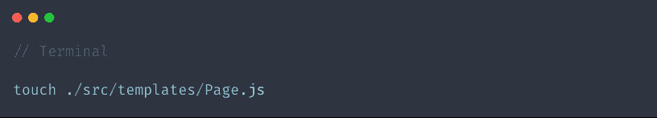](https://res.cloudinary.com/practicaldev/image/fetch/s--F3kKLIUm--/c_limit%2Cf_auto%2Cfl_progressive%2Cq_auto%2Cw_880/https://thepracticaldev.s3.amazonaws.com/i/kvx29s01mx8xrqe6w0k2.png)

就像博客文章模板一样，我们可能只需要使用一个无状态功能组件就可以了。像以前一样，我们不会在本文中讨论如何创建组件，但是你可以在这里阅读[创建 react js 组件](https://www.iamtimsmith.com/blog/how-to-create-a-component/)。

我们将继续从一个通用模板开始，然后我们将在以后用适当的数据填充它。下面的代码将为我们创建一个简单的模板，暂时用于页面:

[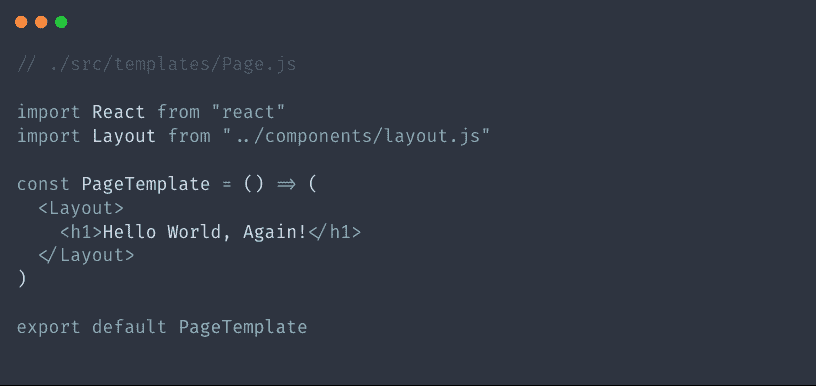](https://res.cloudinary.com/practicaldev/image/fetch/s--NMirYIEO--/c_limit%2Cf_auto%2Cfl_progressive%2Cq_auto%2Cw_880/https://thepracticaldev.s3.amazonaws.com/i/9ea6u3x7jat1gvvxl2kl.png)

## 向 gatsby-node.js 添加页面

厉害！现在我们已经创建了页面模板，可以很容易地向 gatsby-node.js 文件添加页面了。首先，我们将像导入 BlogPostTemplate 一样导入模板。然后我们将把 allWordpressPage 片段添加到 graphql 查询中。最后，我们将使用`createPage` api 基于从 graphql 查询中检索到的信息创建页面，并使用页面模板自动构建页面。下面是我们完成的 gatsby-node.js 文件。看看你能否找出我在文章中提到的东西。

[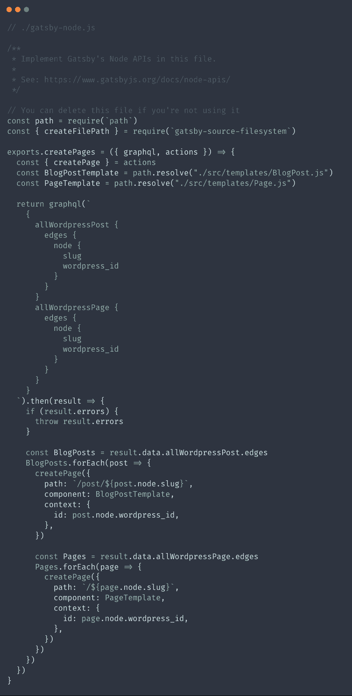](https://res.cloudinary.com/practicaldev/image/fetch/s--JljFFb5e--/c_limit%2Cf_auto%2Cfl_progressive%2Cq_auto%2Cw_880/https://thepracticaldev.s3.amazonaws.com/i/kufxnpeh8au6uxekyy69.png)

就像之前一样，我们可以通过启动我们的开发服务器并访问 [localhost:8000/stuff](http://localhost:8000/stuff) 并获得所有可用页面的列表来测试以确保页面是按预期创建的。同样，这仅在开发环境中可用，因为实时站点将显示不同的 404 页面。我们应该在那里看到一个`/about`页面和一个`/sample-page`页面。如果是这样，我们的 gatsby-node.js 文件就工作了，我们可以更新模板来显示我们想要的数据。

[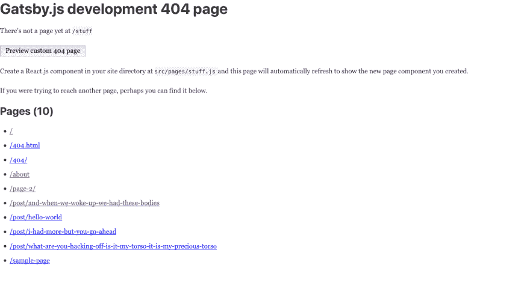](https://res.cloudinary.com/practicaldev/image/fetch/s--PokVLoiU--/c_limit%2Cf_auto%2Cfl_progressive%2Cq_auto%2Cw_880/https://thepracticaldev.s3.amazonaws.com/i/cqd4owoovx0uwbf7h18a.png)

## 更新页面模板

既然我们已经设置了页面路由，我们就可以开始添加模板了。这看起来与 BlogPost.js 文件非常相似，只有一些不同。在我们的博客中，我们不会为静态页面提供特色图片，所以我们可以将这部分排除在查询之外。我们也不需要页面的日期或作者，因为它们不会改变。本质上，我们需要的只是一个标题和内容以及 SEO 组件的摘录。

最终结果是一个非常简单的组件，如下所示:

[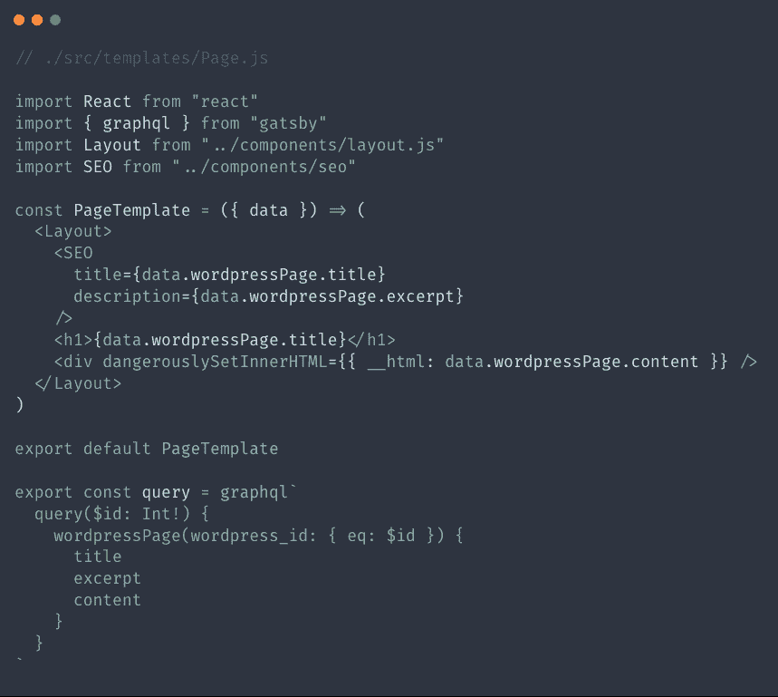](https://res.cloudinary.com/practicaldev/image/fetch/s--FaWQU8JF--/c_limit%2Cf_auto%2Cfl_progressive%2Cq_auto%2Cw_880/https://thepracticaldev.s3.amazonaws.com/i/gonrlfvx3yx8rbj2rtpo.png)

我在第二部分的最后提到，配置 gatsby-node.js 文件可能是整个事情中最困难的部分。既然我们已经完成了，并且理解了它是如何工作的，那么设置另一个内容类型就是小菜一碟，对吗？

现在，如果我们访问位于[http://localhost:8000/about](http://localhost:8000/about)的 about 页面，我们可以看到来自 WordPress 的数据。如果我们检查页面并查看头部，我们还可以看到标题和 meta 标签正在头部更新，因为 SEO 组件！

## 在页面目录中创建页面

Gatsby js 提供了一些非常棒的开箱即用路由。我们在`/pages`目录中创建的任何东西都会自动为我们创建一条路线。例如，如果我们要创建一个名为`gatsby-is-awesome.js`的文件，Gatsby js 会发现并创建一个名为[的路由 http://localhost:8000/Gatsby-is-awesome](http://localhost:8000/gatsby-is-awesome)。

我们还可以看到，starter default 已经在`/pages`目录中提供了几页。当用户访问 [http://localhost:8000/](http://localhost:8000/) 时，索引页面就会显示出来。还有一个名为 page-2.js 的文件，它只是一个简单的页面，展示了链接是如何工作的。最后，有一个 404.js 可用，它是显示我们的 gatsby js 站点何时可用的 404 页面。

因为我们希望我们的博客显示在主页上，所以我们可以编辑名为`index.js`的文件来做到这一点。在进行任何更改之前，让我们先看看这个文件:

[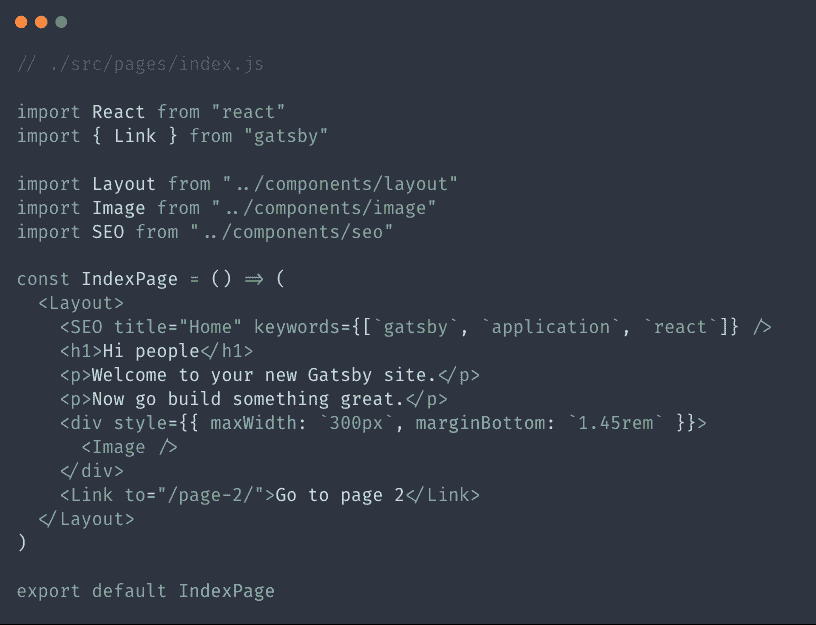](https://res.cloudinary.com/practicaldev/image/fetch/s--zkUanRG3--/c_limit%2Cf_auto%2Cfl_progressive%2Cq_auto%2Cw_880/https://thepracticaldev.s3.amazonaws.com/i/ioh97f8ctulsxyk2mkex.png)

我们将删除 SEO 标签之后但在结束布局标签之前的所有内容，并替换为我们自己的内容。除了内容部分，我们还可以使用与博客文章模板非常相似的查询。我们可以使用 WordPress API 提供的摘录。

为了简单起见，我们将创建一个包含图片、标题、作者、日期和摘录的最近博客文章列表。列表中的每一项都应该链接到读者的个人博客文章。下面是创建这个布局的代码。它非常简单，看起来非常类似于我们的博客文章模板，除了 map 函数迭代数组中的条目。

[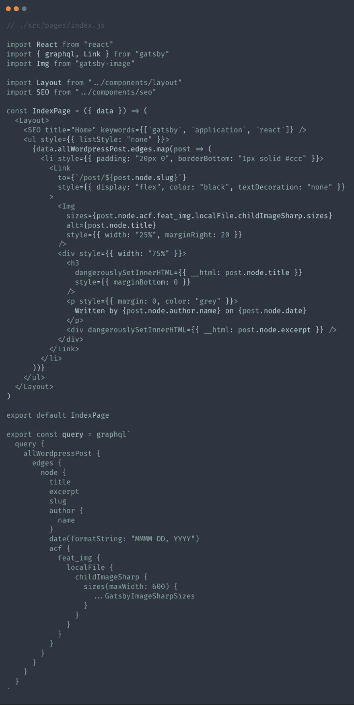](https://res.cloudinary.com/practicaldev/image/fetch/s--kC5Pc0hB--/c_limit%2Cf_auto%2Cfl_progressive%2Cq_auto%2Cw_880/https://thepracticaldev.s3.amazonaws.com/i/1bfrcypfsoexdsv85ivz.png)

这是我们访问博客主页时的样子:

[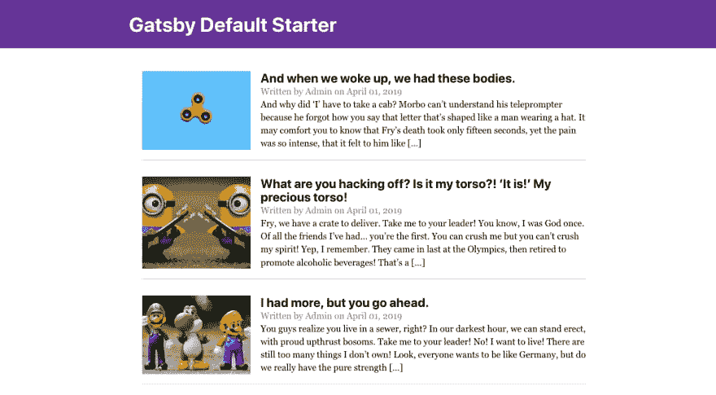](https://res.cloudinary.com/practicaldev/image/fetch/s--hPH3wnOP--/c_limit%2Cf_auto%2Cfl_progressive%2Cq_auto%2Cw_880/https://thepracticaldev.s3.amazonaws.com/i/iaqaitzt93vqntc9m4j0.png)

目前看起来还不错。我们很快就要完成了，我们还有一些事情要改变，我们已经准备好开始写博客了！

## 改变表头组件

关于上图中的博客，我首先注意到的是标题。看起来不坏，但我们可能不希望自己的博客上写着“盖茨比默认首发”。有几种方法可以改变这种情况，我们很快就会看到。

### 在 Gatsby-Config.js 文件中

在 gatsby-config.js 文件中，我们可以在顶部看到一个名为`siteMetaData`的片段，带有标题、描述和作者。这是保存 SEO 组件和网站名称的一些基本信息的地方。

[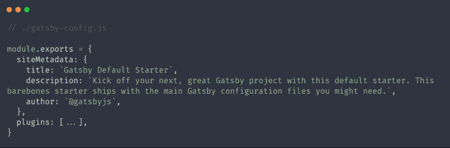](https://res.cloudinary.com/practicaldev/image/fetch/s--xZeOsbQu--/c_limit%2Cf_auto%2Cfl_progressive%2Cq_auto%2Cw_880/https://thepracticaldev.s3.amazonaws.com/i/akh0kmhcd2w1uecduu37.png)

我们在标题中看到的标题来自这里列出的标题。我们可以把它改成任何我们喜欢的网站名称。通常当我建立一个 WordPress 网站时，我从 WordPress 获得我所有的数据，但是如果一个网站使用 markdown 或其他不同的东西，我们可能想使用这里的东西。

### [表头组件中的](#in-the-header-component)

由于我们正在使用 WordPress 创建博客，并且希望我们的用户能够完全控制数据，我们应该从 WordPress 获取我们的网站名称，这样如果它发生变化，用户就可以更新它。幸运的是，WordPress 通过 API 让我们可以使用它，所以我们可以像这样在 graphql 中查询它:

[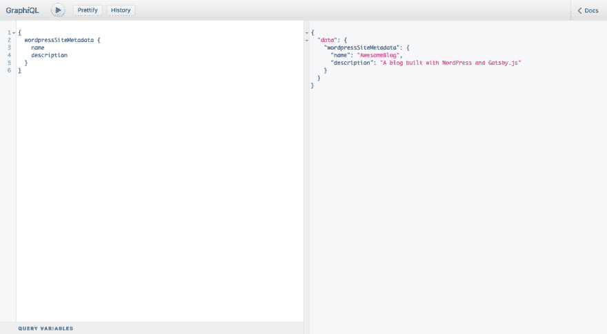](https://res.cloudinary.com/practicaldev/image/fetch/s--D3OKbQDl--/c_limit%2Cf_auto%2Cfl_progressive%2Cq_auto%2Cw_880/https://thepracticaldev.s3.amazonaws.com/i/x1yqda4hi69lcwsxpk9b.png)

在组件内部使用查询的方式有所不同。我们不只是编写一个将数据放入页面或模板的查询，而是必须使用一个名为`StaticQuery`的新组件，它是专门为在组件内部使用查询而设计的。

[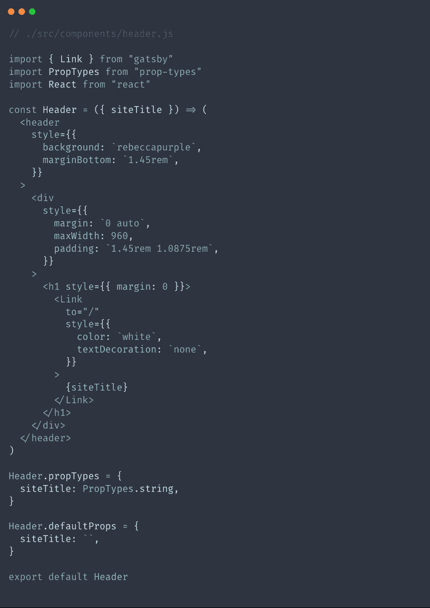](https://res.cloudinary.com/practicaldev/image/fetch/s--le57TMCA--/c_limit%2Cf_auto%2Cfl_progressive%2Cq_auto%2Cw_880/https://thepracticaldev.s3.amazonaws.com/i/k43eyid9q0v93x52y9k1.png)

如果我们快速看一下现有的 header 组件，我们会看到一个 site-title 作为一个属性被传入，然后用来在 header 中显示来自`gatsby-config.js`的站点标题。我们要做的是使用 gatsby 提供的`StaticQuery`组件，并使用一个查询属性来运行我们的查询，然后使用一个呈现属性来像平常一样呈现我们的组件。你可以在下面的代码中看到我们是如何做到的:

[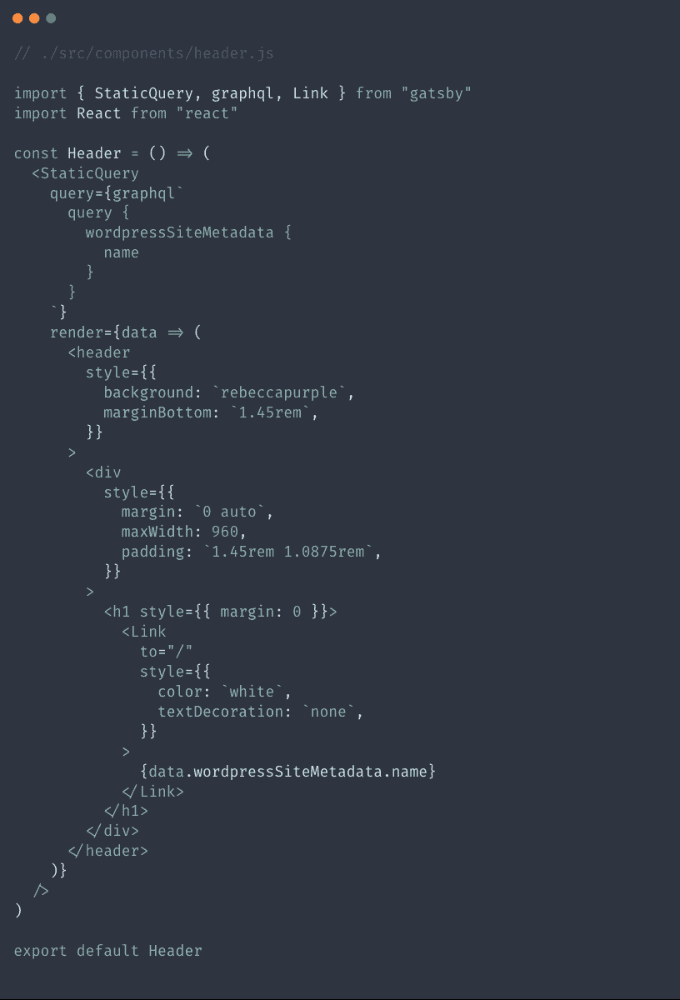](https://res.cloudinary.com/practicaldev/image/fetch/s--qlo_MAxg--/c_limit%2Cf_auto%2Cfl_progressive%2Cq_auto%2Cw_880/https://thepracticaldev.s3.amazonaws.com/i/frewpsq9juczyou34a5m.png)

上面的 header 组件看起来和它最初的样子有一点不同，但是当我们开始深入研究它的时候，我们可以看到它并没有太大的变化。我们本质上只是将我们的头包装在 StaticQuery 组件中，然后在该组件中运行我们的查询，以给头提供必要的数据。简单吧？

[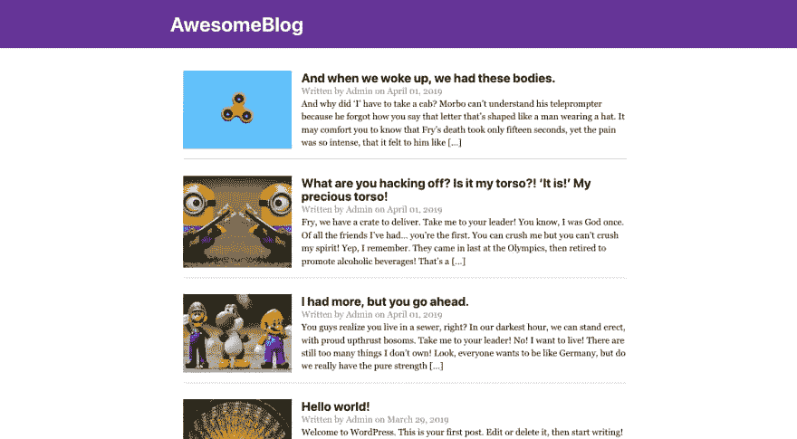](https://res.cloudinary.com/practicaldev/image/fetch/s--cY1REox9--/c_limit%2Cf_auto%2Cfl_progressive%2Cq_auto%2Cw_880/https://thepracticaldev.s3.amazonaws.com/i/0vlneuwiqwli99jv1o8q.png)

### 给表头添加菜单

让我们更进一步，假设我们的用户想要一个可以从 WordPress 更新的标题菜单。如果你还记得在本系列第一部分的[中，我提到了一个叫做 WP API Menus 的插件，它将使我们的菜单在 Rest API 中可用。](https://www.iamtimsmith.com/blog/how-to-build-a-blog-with-wordpress-and-gatsby-part-1)

当我们在系列文章的第二部分[中设置 gatsby-config.js 文件时，我们只是坚持使用 gatsby-source-wordpress 文档中提供的默认路线。WP API Menus 插件为这些端点创建了一些新的路由，所以我们需要做的第一件事是将这些端点添加到 gatsby-config.js 文件中。](https://www.iamtimsmith.com/blog/how-to-build-a-blog-with-wordpress-and-gatsby-part-2)

[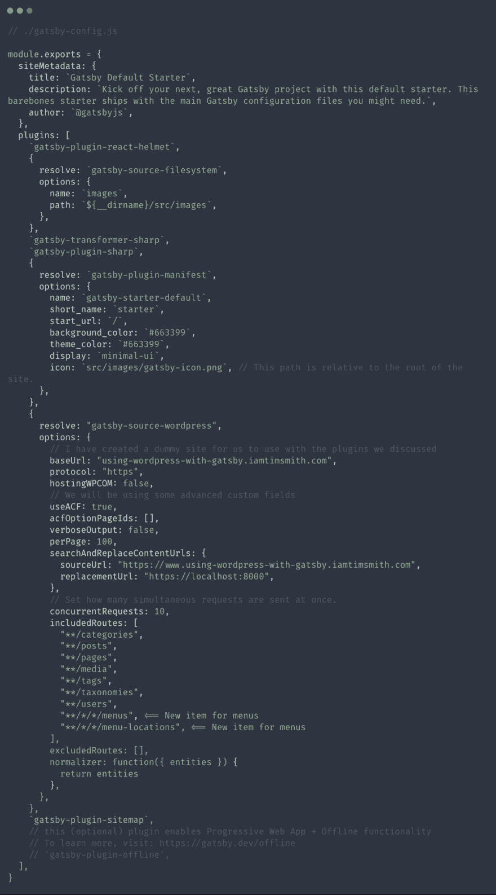](https://res.cloudinary.com/practicaldev/image/fetch/s--rWNvJV4q--/c_limit%2Cf_auto%2Cfl_progressive%2Cq_auto%2Cw_880/https://thepracticaldev.s3.amazonaws.com/i/c4l9u8s5ptp6c6odi6ix.png)

如果你看上面的代码，你会注意到我们给 gatsby-source-wordpress 添加了两条新的路由。这些路线是由 WordPress 内部的插件自动创建的，不需要任何额外的配置。记住，在对 src 文件夹之外的文件进行更改之后，我们需要通过运行`gatsby develop`来重启我们的开发服务器。重启后我们可以访问[http://localhost:8000/_ _ _ graph QL](http://localhost:8000/___graphql)，查询菜单信息，会喜欢下面的截图。

[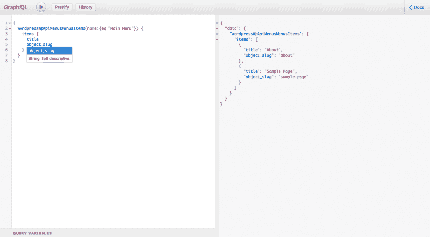](https://res.cloudinary.com/practicaldev/image/fetch/s--o8FZBhkt--/c_limit%2Cf_auto%2Cfl_progressive%2Cq_auto%2Cw_880/https://thepracticaldev.s3.amazonaws.com/i/4xijgq8khes0r66virfz.png)

最后一步是将这个查询添加到静态查询中，并在 header 组件中创建菜单本身。我们可以把它放在 wordpressSiteMetadata 条目下。一旦我们将它添加到查询中，我们可以使用一个`map()`函数迭代菜单项并动态创建它，允许用户通过 WordPress 更新它。这样做确实需要我们指定我们想要的菜单，所以我们需要在 WordPress 中设置的菜单名称。在这种情况下，我们的菜单称为主菜单，所以我们将在查询中使用它。

[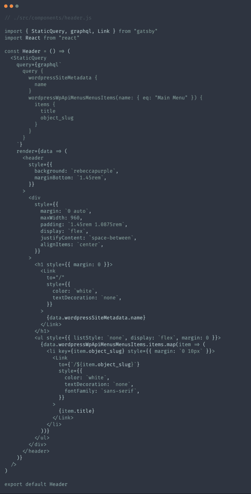](https://res.cloudinary.com/practicaldev/image/fetch/s--LbciwOCh--/c_limit%2Cf_auto%2Cfl_progressive%2Cq_auto%2Cw_880/https://thepracticaldev.s3.amazonaws.com/i/cj3a5zvm459z1fsrrry8.png)

这是一个很好看的组件！让我们看看当我们访问该网站时它是什么样子的:

[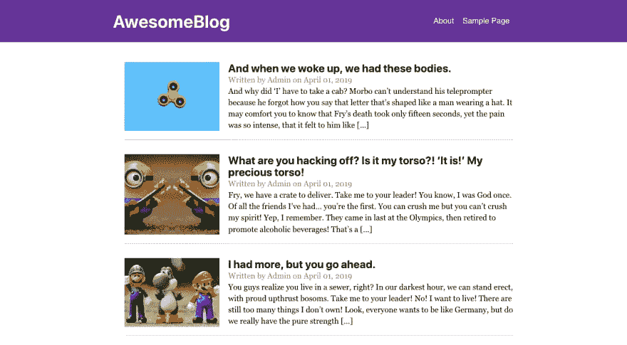](https://res.cloudinary.com/practicaldev/image/fetch/s--m3gFgVNl--/c_limit%2Cf_auto%2Cfl_progressive%2Cq_auto%2Cw_880/https://thepracticaldev.s3.amazonaws.com/i/4ispkj4e8wllsndc0fwi.png)

## 包装完毕

干得好！我们现在有了一个使用 WordPress 和 Gatsby js 的功能性博客。我们可以做更多的事情来添加自定义功能，如自定义帖子类型、图库等，但这足以让我们现在就开始。正如我们所看到的，使用这个堆栈非常简单。这是两全其美的事情，因为客户和用户可以获得用 WordPress 创建内容的美妙体验，而作为开发者，我们可以利用 Gatsby js 的强大功能。像往常一样，勇往直前，让互联网成为一个更好的地方！

这个帖子的代码可以在 [Github](https://github.com/iamtimsmith/building-a-blog-with-wordpress-and-gatsby) 上找到。

如果你有任何想法或问题，你可以在 twitter 上找到我，地址是 [@iam_timsmith](https://twitter.com/iam_timsmith) ！