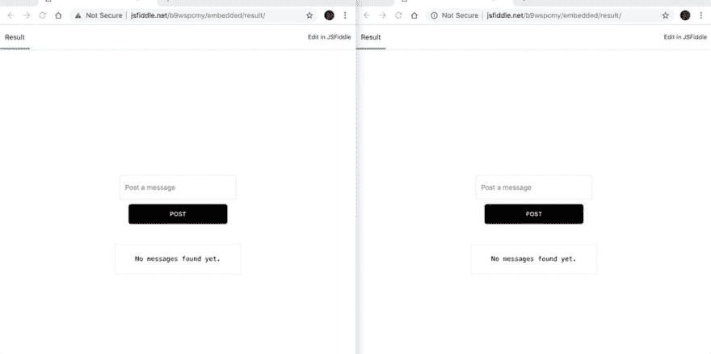

# Tabsub:创建简单的消息传递库

> 原文：<https://dev.to/vorillaz/tabsub-creating-a-simple-messaging-library-3d14>

在很多情况下，开发人员希望在应用程序中发布或收听消息。跨不同的浏览器上下文发布消息可以极大地提高性能和用户体验。显示带有消息和 pop 通知的队列、同步陈旧的 web 视图或者甚至同时从所有活动窗口注销用户是这种方法的不同用例。

## 演示

> <video loop="" controls=""><source src="https://video.twimg.com/ext_tw_video/1113758463463706625/pu/pl/WiHGUgjEFq3CDWK-.m3u8?tag=8" type="application/x-mpegURL"></video>vorillaz[@ vorillaz](https://dev.to/vorillaz)【hello world】来自 BroadcastChannel API。2019 年 04 月 04 日上午 11:01[](https://twitter.com/intent/tweet?in_reply_to=1113758606976061440)[](https://twitter.com/intent/retweet?tweet_id=1113758606976061440)0[](https://twitter.com/intent/like?tweet_id=1113758606976061440)0

## 广播频道 API

[广播频道 API](https://html.spec.whatwg.org/multipage/web-messaging.html#broadcasting-to-other-browsing-contexts) 被引入作为[现代浏览器](https://caniuse.com/#feat=broadcastchannel)的本地总线消息接口。
它允许相同来源的不同文档(在不同的窗口、标签、服务工作者、web 工作者、框架或 iframes 中)之间的通信。消息通过一个`message`事件进行广播，该事件在所有侦听该频道的 BroadcastChannel 对象上触发。

使用 BroadcastChannel API 就像创建一个收听同一频道的发布者和订阅者一样简单。

```
// subscriber
const channel = new BroadcastChannel('radio-channel');
channel.onmessage = ({
  data
}) => {
  const msg = JSON.stringify({
    data
  });
  console.log(msg);
};

// publisher
const channel = new BroadcastChannel('radio-channel');
channel.postMessage('this is a message');
channel.postMessage('This is a another one'); 
```

你可以在 [JSFiddle](https://jsfiddle.net/b9wspcmy/) 中摆弄这个例子。

BroadcastChannel API 还公开了大量关于发布者、消息来源和出处的信息，因为所有内容都打包到发布的事件中。

## 使用 localStorage 作为优雅的后备方案

虽然 BroadcastChannel API 得到了很好的支持，但是您可以使用 [localStorage API](https://html.spec.whatwg.org/multipage/webstorage.html#dom-localstorage) 来为[的旧浏览器](https://caniuse.com/#search=localstorage)提供更好的支持。当新项目添加到存储桶中时，订阅者可以收到更新通知。

使用 localStorage 的一个简单示例如下:

```
const channelName = 'radio-channel';

const post = msg => window.localStorage.setItem(
  channelName,
  JSON.stringify({
    date: new Date(),
    channelName,
    msg
  })
);

// Subscriber
window.addEventListener('storage', (data = {}) => {
  const {
    key = '__GIBBERISH__', newValue = '{}'
  } = data;
  if (key === channelName) {
    const value = JSON.parse(newValue);
    const {
      msg
    } = value;
    callback(`Message received: ${msg}`);
  }
});

// publisher
post('This is a message');
post({
  id: 1,
  foo: 'bar'
}); 
```

## 汇集一切

用于消息传递的 BroadcastChannel 策略也可以与 localStorage 策略相结合，后者可以用作后备策略。检查是否支持广播频道非常简单:

```
const isBroadcastSupported = window && window.BroadcastChannel; 
```

## 介绍 Tabsub

为了减少摩擦并创建一个可靠的解决方案来实现内部通信，我已经将上面的示例合并到一个名为 [tabsub](https://www.npmjs.com/package/tabsub) 的微型(~500 字节)库中。
API 是精简的，最小化的，库可以立即使用。

```
import radio from 'tabsub';

const channel = radio('channel-name');

// Post to channel
channel.post('this is a message');

// Subscribe
channel.on(msg => {
  console.log(`Received: ${msg}`);
});

// Stop listening for a while
channel.stop();

// Resume listening for messages
channel.start();

// Close the channel
channel.close(); 
```

## 进一步资源

*   [在 MDN 广播频道](https://developer.mozilla.org/en-US/docs/Web/API/BroadcastChannel)
*   [谷歌开发者广播频道](https://developers.google.com/web/updates/2016/09/broadcastchannel)
*   [支持 Node.js 的 broadcast channel poly fill](https://github.com/pubkey/broadcast-channel)
*   [MDN 上的本地存储](https://developer.mozilla.org/en-US/docs/Web/API/Window/localStorage)

你也可以在[vorillaz.com](https://vorillaz.com/tabsub)上找到这个帖子