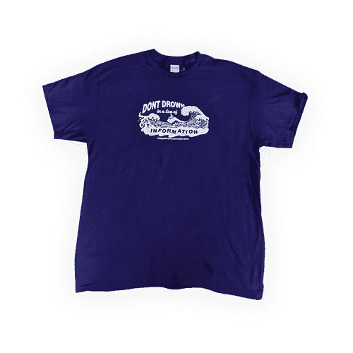

# 我学习 AWS 的课程已经有一年了🎉

> 原文：<https://dev.to/kylegalbraith/my-course-learn-aws-by-using-it-is-1-year-old-2e87>

如果你不熟悉我的课程，它侧重于通过实际使用来学习 Amazon Web Services。我们关注静态网站的托管、保护和交付问题。有一百万种方法可以解决这个问题。有些甚至不涉及 AWS。但是，在开始 AWS 之旅时，这实际上是一个非常值得关注的问题。

在课程中，我们把这个问题作为我们的焦点。通过这样做，我们学习 AWS 服务，如 S3、Lambda、CloudFront、Web 应用程序防火墙和 API 网关，以帮助我们建立一个解决方案。

去年的这个时候，我正在对伴随我的[通过使用 It 课程](https://www.kylegalbraith.com/learn-aws)学习 AWS 的截屏进行最后的润色。我决心运送我一生的梦想，一本 100%自己出版的书，并附带额外的学习材料。

在发射的前一天晚上 10 点左右，严重的冒名顶替综合症开始出现。

我开始怀疑自己是否有能力像这样走出去。人们会看到我创作的内容，可能会质疑我的能力，因为任何持怀疑态度的人都会用金钱来换取内容。我想知道人们是否会看到学习像 AWS 这样复杂的东西并实际利用它的价值。

怀疑不断蔓延，但我提醒自己一件事。我告诉自己，这首先是对自己的一种成就。向自己证明我可以创造一些东西，让人们利用这些东西来造福他们的职业生涯。如果只有一个人买了这个课程，并告诉我它帮助了他们，我就成功了。

所以我发布了课程，张贴到产品搜索，黑客新闻，并在推特上大肆宣扬。

第一天我卖了 10 本，第一个月卖了 32 本，一年后的今天我坐在这里，已经卖了 150 多本。

毫无疑问，每一笔销售都花费了大量的工作。几个月熬夜把章节拼凑起来。周末，我一个接一个地编程，尽可能地检查每一件事。

从外面看可能没什么。

但是发布这门课程是我最自豪的时刻之一。我从无到有创造了一些东西，人们从我的产品中获得了价值。没有什么是完全一样的。

### 谢谢

我想写这篇文章，因为我想对这个社区说声谢谢。

如果不是这里和[# dev discuse Twitter 聊天]上所有不可思议的人们，这个梦想可能会变成现实。你们中的每一个人都给了我动力和鼓励去完成我一生的梦想。

为此，我将永远亏欠 DEV 社区。一个支持所有人的社区。它让人们振作起来而不是沮丧，并激励每个人与世界分享他们的知识。

我将继续在 DEV 上发布我所有的技术内容，与大家分享。我还会继续我每天早上阅读你所有内容的习惯，每天学习新的东西。

### 1 年期特价

为了庆祝这个重要的里程碑，并感谢所有人的支持**我的课程的所有套餐**目前**都有五折优惠**。不需要优惠券代码，[选择适合你的套餐](https://www.kylegalbraith.com/learn-aws)，你就可以通过实际使用它开始学习 AWS 了。

作为奖励，任何购买包含该书硬拷贝的终极套装的人还将获得这件超棒的 t 恤！

