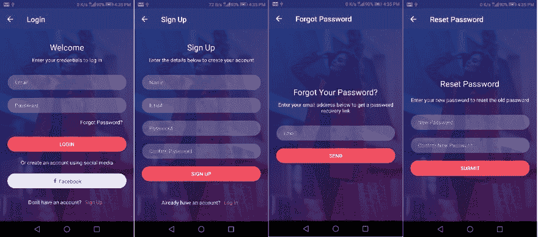
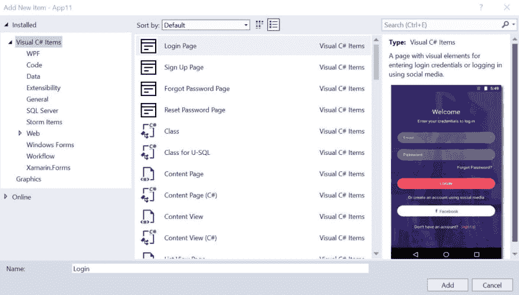
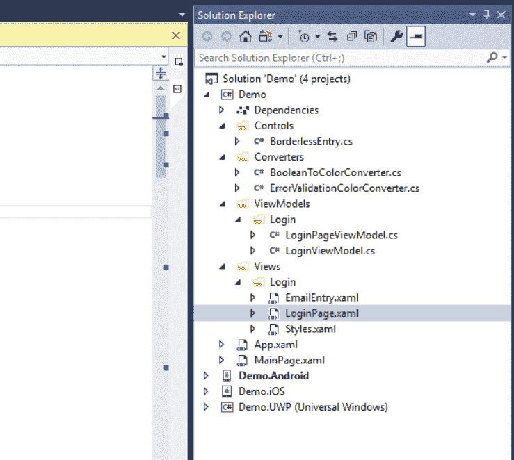
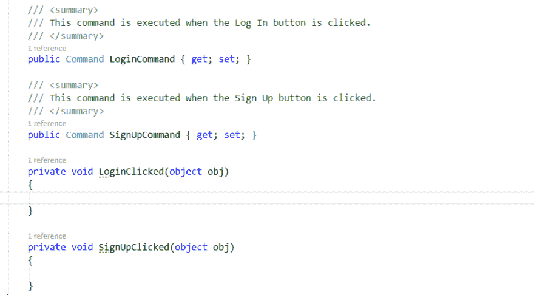

# 介绍 Xamarin 的 UI 模板。形式

> 原文：<https://dev.to/syncfusion/introducing-ui-templates-for-xamarin-forms-4gj>

创建一个优秀的用户界面是非常重要的，这样可以让用户继续使用你的应用，避免它从他们的设备上被卸载。在跨平台开发中创建这种设计不像在原生开发中那么容易。然而，Xamarin。Forms 通过添加新的视图和布局，并使开发人员能够从共享代码库访问本机 API，在各个方面积极改善设计体验。

我们 Syncfusion 非常了解 Xamarin 的需求。窗体来产生最好的用户界面。我们提供了超过 [50 个 UI 视图](https://www.syncfusion.com/xamarin-ui-controls)来从共享代码库构建任何复杂的设计。从我们的 [2019 Volume 1 release](https://www.syncfusion.com/products/whatsnew/xamarin-forms) 开始，我们通过提供完整的基于上下文的设计向前迈进了一步。这让开发人员专注于业务逻辑，而不用担心 UI，因为我们正在处理这一部分。

## 登录屏幕模板

在这个版本中，我们设计了满足任何登录流程要求的登录屏幕。登录屏幕包括登录、注册、忘记密码和重置密码页面。添加、删除或编辑现有的元素非常简单。表单开发人员可以很容易地理解代码。

此外，我们还提供了一个名为 EmailEntry 的内容视图，为电子邮件地址的输入和验证页面添加圆角外观。EmailEntry 视图从用户处获取登录、注册和忘记密码页面的电子邮件地址。

登录屏幕:

*   **登录**–登录页面包括接收电子邮件和密码的条目，以及一个从登录页面重定向到使用脸书账户登录的按钮。该页面使用 Syncfusion 的边框、按钮和 GradientView 组件。
*   **注册**–注册页面只向用户询问一些普通信息。但是您可能需要这些附加信息，例如电话号码或地址。您可以像插入任何其他视图一样简单地插入这些输入视图。最后，您将获得带有新项目的完美 UI。
*   **忘记密码**–该页面要求用户提供一个电子邮件地址，以便将链接发送到该地址，从而将忘记的密码重置为新密码。该页面具有用于输入注册电子邮件的可视元素和请求重置密码链接的按钮。
*   **重置密码**–当用户点击从忘记密码页面收到的链接时，您可以启动该页面让他们设置新密码。该页面具有用于输入新密码、确认该密码的可视元素，以及用于提交新密码的按钮。

## 从 Visual Studio 添加模板

[Visual Studio 项模板扩展](https://help.syncfusion.com/extension/xamarin-extension/syncfusion-item-templates)将随您的 sync fusion Essential Studio for xa marin 安装一起安装。从项目模板添加所需的 Syncfusion 页面，就像添加任何框架项目一样。所有文件，包括 XAML 设计页面、视图模型、视图和资源，都将被添加到它们自己的文件夹中。您不必对文件中的文件夹结构或名称空间进行任何更改，因为它们都将以有意义的标准模式进行设置。

下图显示了 Visual Studio 中的 Syncfusion 项模板。

指定保存所选模板所需文件的文件夹的名称。例如，如果您指定 Login，我们的扩展会将 Login 作为子文件夹添加到 Views 和 ViewModels 文件夹中，以保存登录文件。

下图显示了从 Visual Studio 项模板添加登录页后的解决方案资源管理器。此外，图像和字体图标将添加到特定于平台的项目中。

## 在模板中集成业务逻辑

添加业务逻辑的功能很容易，因为模板遵循 MVVM 设计模式，并且在视图和业务逻辑之间有明确的分离。视图中所有可点击的项目都链接到了 ViewModel 中的一个命令。因此，除非需要在 UI 中添加或删除元素，否则不需要修改设计。

下图显示了在注册页面的视图模型中添加功能的命令。

## 总结

这是 Xamarin.Forms 的初始模板集。我们将在即将发布的版本中添加更多模板，以便在跨平台开发中快速构建任何复杂的用户界面。

请在下面的评论部分分享您对这些登录屏幕的宝贵反馈。如果您想要请求新的设计，请通过我们的反馈门户创建新的功能请求。

[https://www.syncfusion.com/feedback](https://www.syncfusion.com/feedback/xamarin-forms)

请务必浏览我们所有的 Xamarin 质控品。在 [Google Play](https://play.google.com/store/apps/details?id=com.syncfusion.samplebrowser) 和[微软商店](https://www.microsoft.com/en-us/p/syncfusion-essential-studio-for-xamarin/9nn069tldzf4#activetab=pivot:overviewtab)上可以找到表格。

这篇文章介绍了 Xamarin 的 UI 模板。表单首先出现在 [Syncfusion 博客](https://blog.syncfusion.com)上。