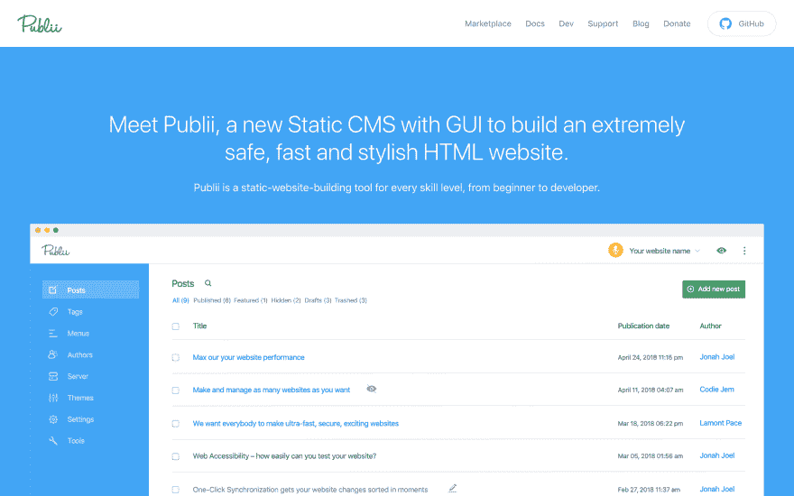

# 使用 Publii，一个免费的静态 CMS 生成 HTML 站点

> 原文：<https://dev.to/couellet/hands-on-with-publii-a-free-static-cms-generating-html-sites-2klj>

建立一个网站曾经很容易。

你可以编写一些 HTML，加入一点 CSS，用 JS 来增加它的味道，然后*瞧！*

然后你可以将这些静态文件推送到任何一台服务器上，然后**砰**，一个动态网站就会出现。

今天，你很容易迷失在构建“现代”网站的工具中:JS 框架、任务运行器、模块捆绑器、包管理器、测试框架、林挺、预处理器…

但并不总是这样:

一些 web 项目非常简单，因此它们的工具应该是

例如，在 Snipcart，我们收到许多将电子商务添加到静态站点的请求。

当我们的[杰基尔](https://snipcart.com/blog/static-site-e-commerce-part-2-integrating-snipcart-with-jekyll)、[雨果](https://snipcart.com/blog/hugo-tutorial-static-site-ecommerce)、[盖茨比](https://snipcart.com/blog/react-ecommerce-gatsby-tutorial)和 [11ty](https://snipcart.com/blog/11ty-javascript-static-site-generator-tutorial) 教程帮助开发者时，另一个反复出现的请求经常在稍后弹出:

> 我如何将 CMS 添加到我的静态站点？

最近，我自己也问了这个问题。

看，我有这个项目:建立一个网站来展示我对苹果有多失望(说来话长)。

我的目标？创建一个静态的 HTML 网站，我可以用 CMS 管理，尽可能少的编码和美元。最多在一个周末完成所有的工作。

(下面的教程部分会告诉你我是怎么做的。一步。由。一步。)

首先，我看了一下静态 CMS 空间。

→点击阅读全文