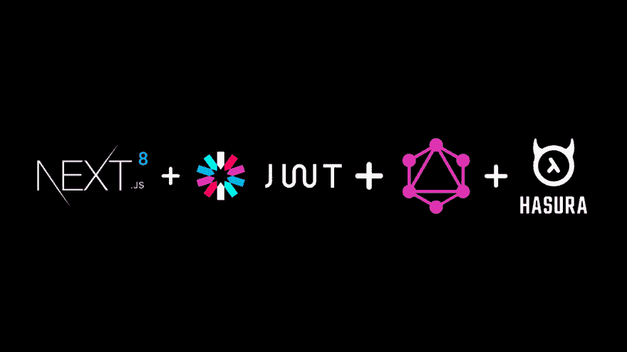
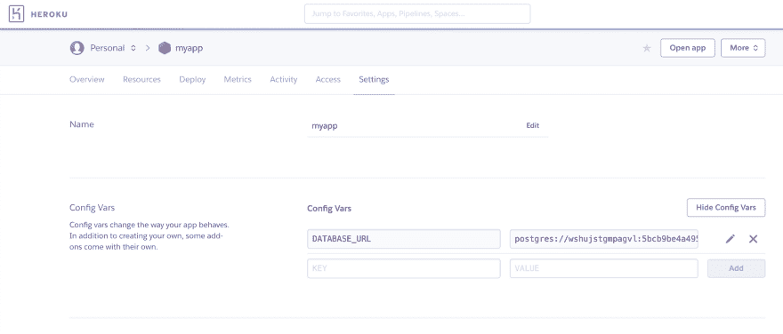
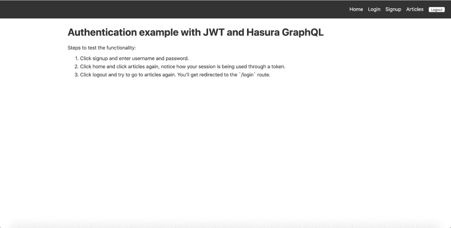
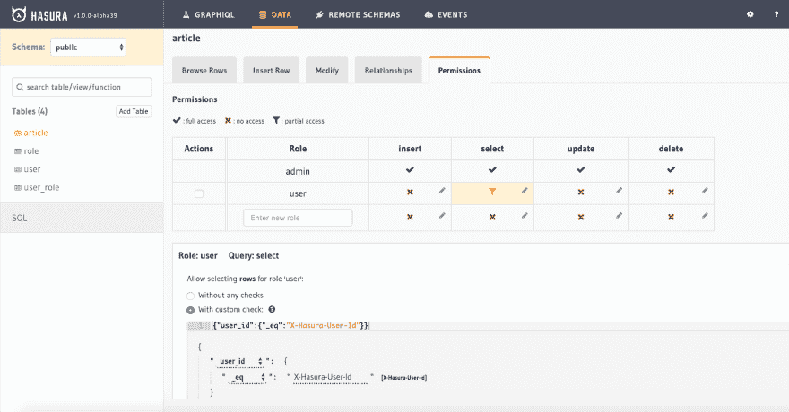
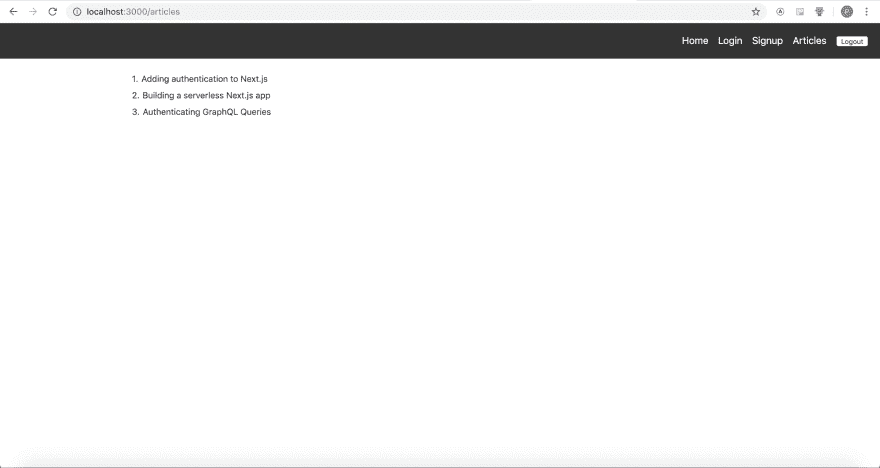

# 使用 JWT 和 GraphQL 向 Next.js 8 无服务器应用程序添加身份验证和授权

> 原文：<https://dev.to/hasurahq/add-authentication-and-authorization-to-next-js-8-serverless-apps-using-jwt-and-graphql-fol>

## TL；速度三角形定位法(dead reckoning)

*   部署 Node.js Express JWT 服务，用于验证对 Hasura GraphQL 引擎的请求。
*   使用 JWT 和 Hasura GraphQL 权限进行授权
*   一个[示例 Next.js 8 应用程序](https://github.com/hasura/graphql-engine/tree/master/community/sample-apps/nextjs-8-serverless/with-apollo-jwt)，带有登录、注册和文章列表页面
*   使用**无服务器**目标部署到 Now.sh

<figure>[](https://res.cloudinary.com/practicaldev/image/fetch/s--dTIcZ2Ik--/c_limit%2Cf_auto%2Cfl_progressive%2Cq_auto%2Cw_880/https://blog.hasura.io/conteimg/2019/04/nextjwthasura.png)

<figcaption>next . js 8+JWT+哈苏拉 GraphQL</figcaption>

</figure>

## 技术堆栈

*   [Next.js 8](https://nextjs.org) 用于构建示例无服务器 react 应用程序
*   用于 GraphQL 查询的 [Apollo 客户端](https://www.apollographql.com/docs/react/)
*   [用于 JWT 认证的 Node.js 服务器](https://github.com/hasura/graphql-engine/tree/master/community/boilerplates/auth-servers/passportjs-jwt-roles)
*   [Hasura GraphQL 引擎](https://github.com/hasura/graphql-engine)用于具有权限的 GraphQL APIs

在配置 Next.js 8 应用程序之前，让后端启动并运行。

## 部署 Hasura

[Hasura](https://hasura.io/) 是一个[开源](https://github.com/hasura/graphql-engine)引擎，为您提供新的或现有 Postgres 数据库上的实时 graph QL API，内置支持拼接定制 graph QL API 和在数据库更改时触发 webhooks。

按照[文档](https://docs.hasura.io/1.0/graphql/manual/getting-started/heroku-simple.html)中的说明部署 Hasura。注意 GraphQL 端点的 Heroku URL。稍后您将在应用程序中对此进行配置。

按照本[部分](https://github.com/hasura/graphql-engine/tree/master/community/sample-apps/nextjs-8-serverless/with-apollo-jwt/README.md#create-the-initial-tables)中的说明应用迁移，以创建必要的数据库模式和权限。

现在后端已经准备好了！您将能够使用 Hasura GraphQL APIs 进行即时查询。端点将看起来像([https://myapp.herokuapp.com/v1/graphql](https://myapp.herokuapp.com/v1/graphql))。在与 Next.js 应用程序集成的过程中，我们将回到这一点。

## 运行 JWT 服务器

我们现在将在本地运行 JWT 服务器来处理来自 Next.js 应用程序的注册和登录请求。

```
#clone the repo
git clone https://github.com/hasura/graphql-engine

# Change directory
cd community/boilerplates/auth-servers/passportjs-jwt-roles

# Install NPM dependencies
npm install

# Generate the RSA keys
openssl genrsa -out private.pem 2048
openssl rsa -in private.pem -pubout > public.pem

# print the keys in an escaped format
awk -v ORS='\\n' '1' private.pem
awk -v ORS='\\n' '1' public.pem 
```

Enter fullscreen mode Exit fullscreen mode

现在，通过前往应用程序的设置页面，从 Heroku 获取数据库 URL。

[](https://res.cloudinary.com/practicaldev/image/fetch/s--64BVq4pS--/c_limit%2Cf_auto%2Cfl_progressive%2Cq_auto%2Cw_880/https://blog.hasura.io/conteimg/2019/04/heroku-database-url.png)T3】

```
export DATABASE_URL=postgres://postgres:@localhost:5432/postgres?ssl=true

# Then simply start your app
npm start 
```

Enter fullscreen mode Exit fullscreen mode

用从 Heroku config 获得的值替换 DATABASE_URL。请注意，您需要在`DATABASE_URL`的末尾追加`?ssl=true`。

### 用 Hasura 配置 JWT

现在 JWT 服务器已经准备好了，我们需要配置 Hasura 来使用 JWT 秘密。env `HASURA_GRAPHQL_JWT_SECRET`应该这样设置:

```
{ "type": "RS256", "key": "<AUTH_PUBLIC_KEY>" } 
```

Enter fullscreen mode Exit fullscreen mode

其中`<AUTH_PUBLIC_KEY>`是 PEM 格式的 RSA 公钥，换行符用“\n”转义。这是上面刚刚生成的。

为了配置 JWT 密码，我们还需要设置管理密码。前往 [docs](https://docs.hasura.io/1.0/graphql/manual/deployment/heroku/securing-graphql-endpoint.html#add-the-hasura-graphql-admin-secret-env-var) 在 Heroku 上进行设置。

## 运行 Next.js App

JWT 服务器和 Hasura GraphQL 引擎都已经设置和配置好了。

现在，让我们通过运行以下命令来运行 Next.js 应用程序:

```
# Change directory
cd community/sample-apps/nextjs-8-serverless/with-apollo-jwt/app 
```

Enter fullscreen mode Exit fullscreen mode

在`lib/init-apollo.js`中配置 Heroku app 网址。

在`pages/signup.js`和`pages/login.js`中配置认证服务器 URL。例如，

```
// inside pages/signup.js
const apiUrl = 'http://localhost:8080/signup'

// inside pages/login.js
const apiUrl = 'http://localhost:8080/login' 
```

Enter fullscreen mode Exit fullscreen mode

现在安装 dependenices，构建无服务器包，并使用以下命令运行应用程序。

```
# Install dependencies
yarn install

# Build the app
yarn run build

# Run the app
yarn run dev 
```

Enter fullscreen mode Exit fullscreen mode

运行该应用程序后，您应该会看到如下所示的屏幕:

[](https://res.cloudinary.com/practicaldev/image/fetch/s--YxQ6Xrbe--/c_limit%2Cf_auto%2Cfl_progressive%2Cq_auto%2Cw_880/https://blog.hasura.io/conteimg/2019/04/nextjs-app-jwt.png)

## 认证查询

Apollo 客户机已经配置了一个设置授权头的 Auth 中间件(如果可用的话)。

```
const authMiddleware = new ApolloLink((operation, forward) => {
    // add the authorization to the headers
    operation.setContext({
      headers: {
        authorization: getToken(),
      }
}) 
```

Enter fullscreen mode Exit fullscreen mode

我们调用一个名为`getToken()`的实用函数，它获取存储在 cookie 中的 auth 令牌并返回该令牌。

```
const getToken = () => {
  let token = null;
  if (typeof document !== 'undefined') {
    token = 'Bearer ' + cookie.get('token')
  }
  return token
} 
```

Enter fullscreen mode Exit fullscreen mode

注册和登录的实际实现用令牌设置 cookie。

在文件`utils/auth.js`中，我们处理一旦服务器在成功注册/登录后返回令牌时需要做什么的逻辑。

## 授权使用 JWT

既然用户已经登录，我们希望只获取同一用户写的文章。权限的配置方式是只有撰写文章的用户才能获取数据。

前往 Heroku 应用程序 URL，打开 Hasura 控制台，导航至**数据- >文章- >权限**，查看为`user`角色定义的权限。

[](https://res.cloudinary.com/practicaldev/image/fetch/s--00PqIIHW--/c_limit%2Cf_auto%2Cfl_progressive%2Cq_auto%2Cw_880/https://blog.hasura.io/conteimg/2019/04/article_table_permissions.png)

权限检查看起来像:

```
{ "user_id": {"_eq": "X-Hasura-User-Id"}} 
```

Enter fullscreen mode Exit fullscreen mode

这意味着当客户端发送带有`Authorization: Bearer <token>`的请求时，它将从令牌有效负载中寻找`X-Hasura-User-Id`值，并针对`user_id`列对其进行过滤，确保只有登录的用户才能获得数据，而**也只能获得他们的数据**。用户有权访问所有列。

## 使用 HOC 保护路由

虽然我们已经处理了授权查询，但是我们希望在路由级别限制对像`/articles`这样的页面的访问，因为它只对登录的用户可用。我们再次利用一个特设来处理这一点。

当在受保护的路线上触发导航时，我们调用一个实用程序助手方法`auth`，它将使用`nextCookie`模块从 cookie 中获取令牌。如果令牌不可用，它将重定向到`/login`页面。

```
export const withAuthSync = WrappedComponent =>
  class extends Component {
    static displayName = `withAuthSync(${getDisplayName(WrappedComponent)})`

    static async getInitialProps (ctx) {
      const token = auth(ctx)

      const componentProps =
        WrappedComponent.getInitialProps &&
        (await WrappedComponent.getInitialProps(ctx))

      return { ...componentProps, token }
    }

    constructor (props) {
      super(props)

      this.syncLogout = this.syncLogout.bind(this)
    }

    componentDidMount () {
      window.addEventListener('storage', this.syncLogout)
    }

    componentWillUnmount () {
      window.removeEventListener('storage', this.syncLogout)
      window.localStorage.removeItem('logout')
    }

    syncLogout (event) {
      if (event.key === 'logout') {
        console.log('logged out from storage!')
        Router.push('/login')
      }
    }

    render () {
      return <WrappedComponent {...this.props} />
    }
  }

export const auth = ctx => {
  const { token } = nextCookie(ctx)

  /*
   * This happens on server only, ctx.req is available means it's being
   * rendered on server. If we are on server and token is not available,
   * means user is not logged in.
   */
  if (ctx.req && !token) {
    ctx.res.writeHead(302, { Location: '/login' })
    ctx.res.end()
    return
  }

  // We already checked for server. This should only happen on client.
  if (!token) {
    Router.push('/login')
  }

  return token
} 
```

Enter fullscreen mode Exit fullscreen mode

我们使用`withAuthSync` HOC 封装像`articles`这样的受保护组件，它将负责服务器上的重定向。

登录后，当你访问文章页面时，你应该会看到你写的文章。

[](https://res.cloudinary.com/practicaldev/image/fetch/s--f3fCouYr--/c_limit%2Cf_auto%2Cfl_progressive%2Cq_auto%2Cw_880/https://blog.hasura.io/conteimg/2019/04/nextjs-articles-page.png)

看到数据为空时，不要感到惊讶。您需要在 Hasura 控制台中插入标记您的用户 id 的文章。

## 立即部署

我们可以在目标为`serverless`的`now.sh`上部署这个 Next.js 应用程序。

用 [now](https://zeit.co/now) ( [下载](https://zeit.co/download) ):
部署到云端

```
npm install -g now
now 
```

Enter fullscreen mode Exit fullscreen mode

请注意，还必须部署 JWT 服务器。JWT 服务器 url 必须在 Next.js 应用程序中配置。

我整理了一个样板文件，这样你就可以快速开始了！

在 [github](https://github.com/hasura/graphql-engine/tree/master/community/sample-apps/nextjs-8-serverless/with-apollo-jwt) 上查看。

尝试一下，让我们知道你的想法。如果您有任何问题或遇到任何麻烦，请随时通过 [twitter](https://twitter.com/hasurahq) 、 [github](https://github.com/hasura/graphql-engine) 或我们的 [discord 服务器](https://discord.gg/vBPpJkS)联系我们。