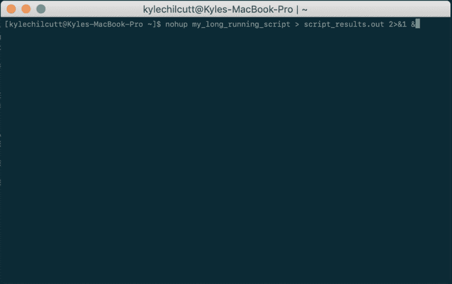

# nohup 用于运行远程脚本

> 原文：<https://dev.to/chilcutt/nohup-for-running-remote-scripts-56ah>

我知道`nohup`已经有一段时间了，但直到今天才花时间做更深入的研究。

**TL；dr** 运行一个注销时不会死的命令(对远程服务器上的任务有用)

```
$ nohup my_long_running_script > script_results.out 2>&1 & 
```

[](https://res.cloudinary.com/practicaldev/image/fetch/s--HvBmiXTX--/c_limit%2Cf_auto%2Cfl_progressive%2Cq_auto%2Cw_880/https://cdn-images-1.medium.com/max/2428/1%2Avpv1N6DEHAW-alSBREEZSg.png)

`nohup`实用程序让你运行另一个不受挂起影响的命令，这意味着当你退出机器时它不会死。当您连接到远程机器的终端时，这尤其有用(例如使用`ssh`)。

让我们从头开始分解这个例子:

```
$ nohup my_long_running_script > script_results.out 2>&1 &

```

`nohup`实用程序使得正在运行的脚本不受 [`SIGHUP`](https://en.wikipedia.org/wiki/SIGHUP) 的影响，该信号在控制它的终端关闭时被发送到一个进程。

[](https://res.cloudinary.com/practicaldev/image/fetch/s--og5pXSFn--/c_limit%2Cf_auto%2Cfl_progressive%2Cq_66%2Cw_880/https://cdn-images-1.medium.com/max/2840/1%2AUSBgmRf4noGAv1-ydENpfQ.gif)

```
$ nohup my_long_running_script > script_results.out 2>&1 &

```

下一部分是照常运行命令，并将输出发送到文本文件。因为我们将从这个终端会话断开连接，所以在脚本运行时，我们不会实时观察输出。为了捕获输出，我们将输出定向到一个文件`script_results.out`。

```
$ nohup my_long_running_script > script_results.out 2>&1 &

```

`2>&1`将`STDERR`重定向到`STDOUT`，这将允许我们在结果文件中捕获正常输出和错误输出。

```
$ nohup my_long_running_script > script_results.out 2>&1 &

```

最后一个`&`导致 nohup 命令在后台运行，这样一旦命令启动，我们就立即返回到 shell。

* * *

*在此之前，我可能已经在远程机器上启动了一个`tmux`或`screen`会话，以确保脚本不会被中断，但是 nohup 感觉更加直截了当。*