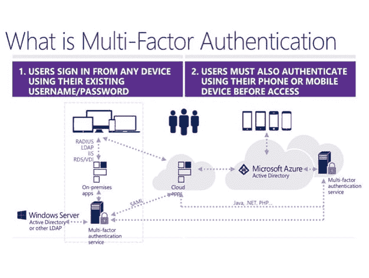
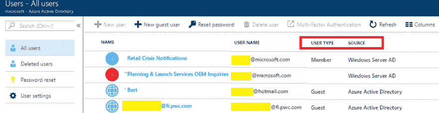
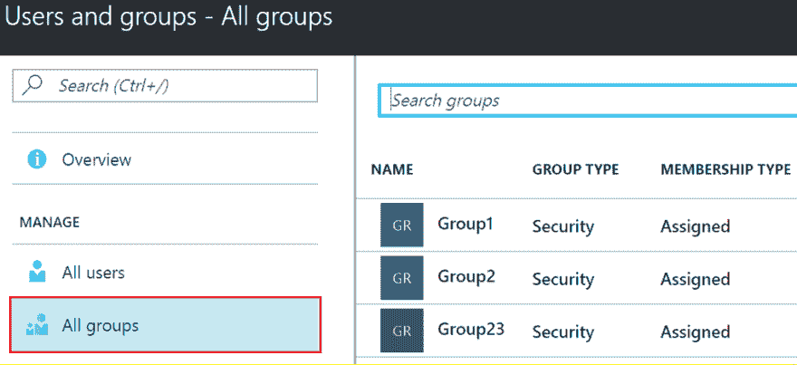
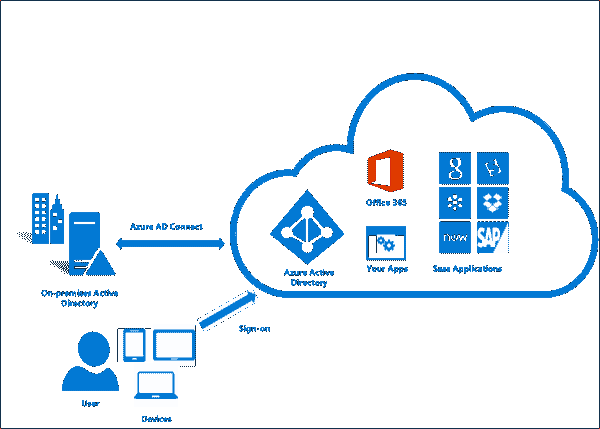
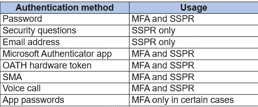
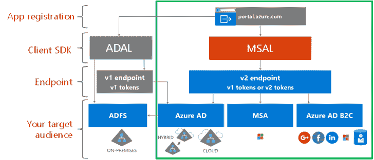
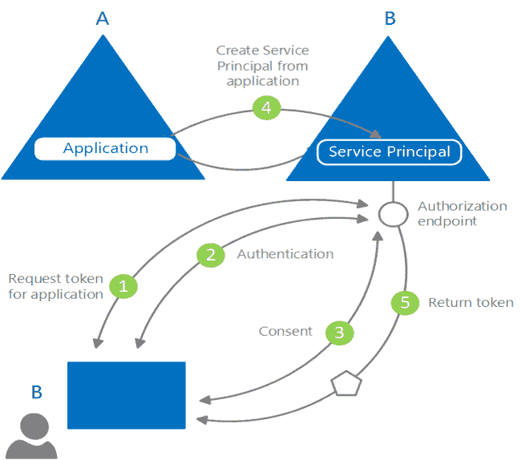

# 为 Azure 工作负载和订阅配置 Azure AD

> 原文：<https://dev.to/cheahengsoon/configure-azure-ad-for-azure-workloads-and-subscriptions-3a77>

**限时标高的多因素**

*   Azure MFA 是微软的两步验证解决方案
*   Azure MFA 通过要求两个或更多元素进行完全身份验证，为您的身份提供了额外的安全性
*   这些元素分为三类:
    *   你知道的:密码或安全问题的答案
    *   你拥有的东西:移动应用或令牌设备
    *   你是什么:生物特征，如指纹
*   使用 Azure MFA 通过限制凭据暴露的影响来提高身份安全性

Azure MFA 是以下产品的一部分:

*   Azure Active Directory 高级许可证
    *   Azure MFA 服务(云)
    *   Azure MFA 服务器
*   针对 Microsoft Office 365 的多因素身份认证
*   Azure 活动目录全局管理员

**了解用户和组**

*   在 Azure AD 中，每个需要访问资源的用户都需要一个用户帐户
*   Azure AD 以三种方式定义用户:
    *   云身份
    *   目录同步身份
    *   来宾用户
*   您可以使用以下方式向 Azure AD 添加云身份:
    *   Azure 门户
    *   Azure PowerShell 
*   组有助于组织用户，使管理权限变得更加容易
*   有两种类型的组:
    *   安全组
    *   通讯组
*   向 Azure 群组添加成员有两种方式:
    *   直接分配
    *   动态分配

**安装和配置 Azure AD Connect**

*   Azure AD Connect 将您的内部目录与 Azure Active Directory 集成在一起
*   这种集成允许您在混合身份环境中为与 Azure AD 集成的 Office 365、Azure 和 SaaS 应用程序的用户提供通用身份
*   Azure AD Connect 提供:
    *   同步服务
    *   健康监控
    *   Active Directory 联合身份验证服务(AD FS)
    *   密码哈希同步
    *   传递认证

**管理 Azure AD 目录角色**

*   Azure AD 提供了许多内置角色来处理最常见的安全场景
*   这些角色包括:
    *   所有者:拥有对所有资源的完全访问权，包括将访问权委托给他人的权利
    *   贡献者:可以创建和管理所有类型的 Azure 资源，但不能授予其他人访问权限
    *   读者:可以查看现有的 Azure 资源
*   每个角色都是 JavaScript 对象表示法(JSON)文件中定义的一组属性，包括:
    *   名称、ID 和描述
    *   允许的权限(动作)、拒绝的权限(动作)和范围(读访问等)。)的角色

**配置身份验证方法**
微软强烈建议管理员允许用户选择超过最低要求数量的身份验证方法，以防他们无法访问一种方法
 
您可以对 Azure AD 使用以下身份验证方法:

*   密码
*   安全问题
*   电子邮件地址
*   Microsoft 验证器应用程序
*   誓言硬件令牌
*   手机
*   应用程序密码

**管理应用注册**

*   微软身份平台是 Azure 广告身份服务和开发者平台的演变
*   Microsoft identity platform 有两个端点(1.0 版和 2.0 版)和两组客户端库来处理这些端点
*   Azure AD 支持五种主要应用场景:
    *   单页应用程序(SPA)
    *   Web 浏览器到 web 应用程序
    *   web API 的本机应用程序
    *   Web 应用程序到 web API
    *   web API 的守护程序或服务器应用程序
*   任何将身份验证外包给 Azure AD 的应用程序都必须在目录中注册
*   注册包括告诉 Azure AD 有关应用程序的信息，包括应用程序所在的 URL、身份验证后发送回复的 URL、识别应用程序的 URI 等等
*   Azure AD 代表遵循特定模型的应用程序，该模型旨在实现两个主要功能
    *   根据应用支持的身份验证协议识别应用
    *   在令牌请求期间处理用户同意，并促进跨租户动态调配应用

