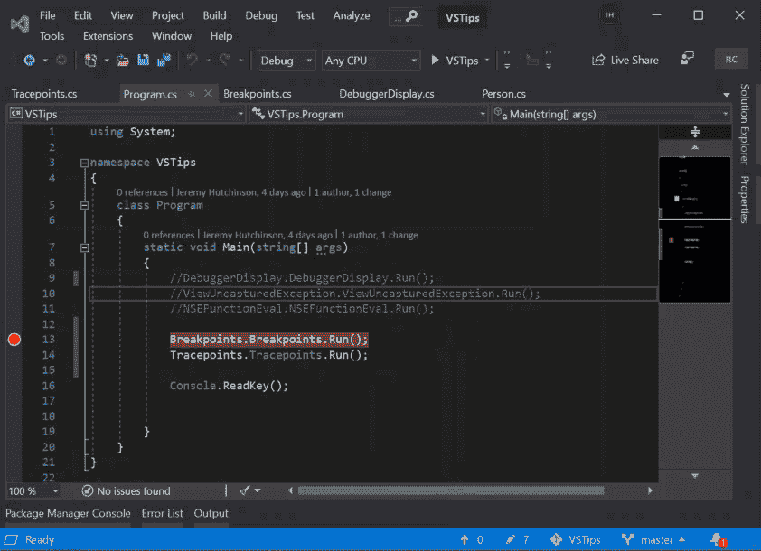
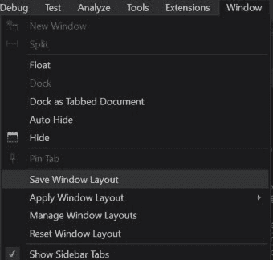
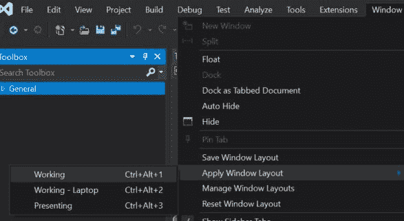

# Visual Studio 提示-窗口管理

> 原文：<https://dev.to/hutchcodes/visual-studio-tips-window-management-4db4>

对于 Visual Studio 中的各种工具窗口，每个人都有自己喜欢的布局。但是有时你想要不同的窗口布局，基于你正在做的事情，或者你是否有外部屏幕连接到你的笔记本电脑。

首先是工具窗口的基础知识。

您可以单击并按住任何窗口的标题(或其标签，如果它已经停靠)并拖动它。当拖动它的时候，你会看到一堆小蓝框，指示它可以停靠在哪里，如果你把它放在其中一个上，它就会停靠，否则它就会浮动，甚至可以移动到第二个显示器上。

如果窗口是停靠的，您可以用图钉图标固定窗口，使其始终可见；如果窗口已经固定，您可以取消固定，使其自动隐藏。

### 保存您的窗口布局

一旦你有了所有你想要的窗口，你可以通过进入窗口->保存窗口布局来保存布局。系统将提示您命名布局。这将保存哪些窗口是打开的，它们停靠在哪里，它们是固定的还是自动隐藏的，**和**它们的大小。

一旦你保存了一个或两个布局，你可以返回到窗口菜单，点击应用窗口布局并从列表中选择你的布局。或者你可以为布局使用热键组合(即`Ctrl+Shift+1`为布局 1)

### 军规

保存窗口布局的一个稍微不直观的部分是，当你保存一个布局时，那是用于编辑的布局*和用于调试的布局*，它们通常是不同的。因此，要设置布局，您需要在编辑模式下获得所有您想要的窗口，然后启动一个调试会话来获得所有您想要的窗口，然后保存布局。否则，你会发现自己每次从编辑到调试再返回时都需要切换布局。