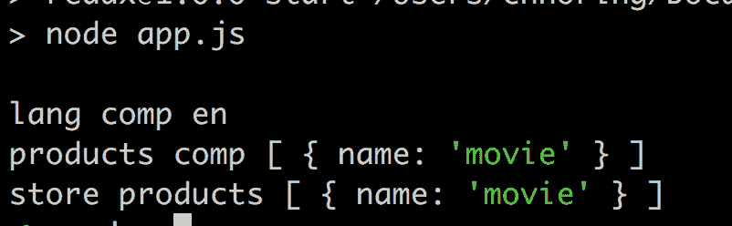

# NGRX —从头开始，第二部分，Redux

> 原文：<https://dev.to/angular/ngrx-from-the-beginning-part-ii-redux-4006>

在 [Twitter](https://twitter.com/chris_noring) 上关注我，很乐意接受您对主题或改进的建议/Chris

> Redux 是一个发布-订阅实现，但是通过添加一些新的概念，比如不变性，以及只有某些工件能够改变状态的思想，给模式添加了一些新的工件

本文是系列文章的一部分:

*   [NGRX —从头开始](https://dev.to/azure/ngrx-from-the-beginning-7k7)，第一部分，发布订阅，
*   NGRX —从第二部分开始，**我们在这里**
*   [NGRX —从第三部分开始，NGRX 商店](https://dev.to/azure/ngrx-from-the-beginning-part-iii-ngrx-store-13bf)，这涵盖了商店的基本用法
*   NGRX —从头开始，第四部分，NGRX 效果，*进行中*
*   NGRX —从开始，第五部分，NGRX 实体，*进行中*

好的，我们在上一部分已经学习了发布-订阅模式，因此我们已经了解了它的底层模式以及何时使用它。我们甚至查看了一个实现。现在我们来看一个名为 Redux 的发布-订阅模式的具体版本

在本文中，我们将涵盖以下内容:

*   **基本概念**，Redux 由一些基本概念组成，让我们列出它们是什么以及它们的职责
*   **动作**，让我们深入了解什么是动作，何时使用以及如何创建动作
*   **还原物**，还原物是保护和改变状态的功能，它们也导致相同状态的改变，但以有序和纯粹的方式
*   当我们想知道状态是什么或者想改变它时，商店是我们主要与之互动的东西
*   **幼稚的实现**，让我们看看如何实现 Redux，这样我们才能真正理解发生了什么

## 为什么 Redux

在第一部分中，我们研究了发布-订阅模式。我们希望理解，如果您需要更改数据并向许多听众传播这种更改，这是一种非常好的模式。所以为什么是 Redux，为什么我们需要这个特定版本的 Pub-Sub。嗯，Redux 在一些事情上固执己见:

*   真理应该只有一个来源，一个你所有状态都存在的地方，而不是很多
*   变化应该以不可变的方式进行，这被认为是更安全和可预测的
*   改变只能在减速器的帮助下进行

所以 Redux 增加的是一系列问题的答案。你会问，这些是什么问题？
以下:

*   **对当前状态的分歧**，当您的应用程序增长时，它开始出现管理应用程序状态的问题。许多组件想要相同的状态，而突然一个或多个组件改变了状态，并且由于某种原因，一个或多个组件没有完全意识到已经发生了改变，因此它们在状态应该是什么上存在分歧
*   **谁做了什么**，您不仅遇到了组件不能就状态达成一致的问题，而且您还忘记了谁做了什么，是什么导致了特定状态以这种方式结束？您遇到这个问题的原因很可能是因为您让任何组件直接改变状态，没有安全措施以有序的方式执行状态，确保更新相关方

## 基本概念

好了，所以有一些概念我们需要了解，才能正确掌握 Redux。我们已经在前一节提到了它们，但让我们再讨论一下:

*   **动作**，所以这个动作是我们发出的一个信息，它是一个意图，是我们想要的东西，比如把一个产品添加到一个列表中。一个动作有一个类型，它是一个代表我们意图的动词，它可以选择有一个有效载荷，我们需要携带一个变化或用于查询的数据
*   **减速器**，减速器是一个功能。缩减器的目的是获取一个现有状态，并对该现有状态应用一个动作。Reducers 以不可变的方式实现这一点，这意味着我们不会改变状态，而是基于旧的状态和动作计算新的状态
*   **店铺**，店铺就像一个盛着状态的容器。该存储就像 Redux 的 API，当您想要读取状态、更改状态或者订阅状态更改时，您可以与之交流

好了，现在我们对核心概念和它们的作用有了更多的了解。让我们通过代码示例更详细地了解每个概念，因为如果我们看到一些代码，我们会更好地理解，对吗？；)

### 动作

行动是我们表达我们想做什么的方式。一个动作有一个强制属性类型和一个可选属性有效负载。一个动作是一个对象，所以一个示例动作可以是这样的:

```
const action = { type: 'INCREMENT' }; 
```

上面是一个更简单的动作，没有有效载荷，因为不需要，意图或类型清楚地说明了需要做什么，加 1。然而，如果你想用这样的动作把它增加 2，你需要用一个有效载荷来描述它，就像这样:

```
const action = { type: 'INCREMENT', payload: 2 }; 
```

一个更常见的带有有效负载的动作是添加一个产品，它看起来像这样:

```
const action = { 
  type: '[Product] add', 
  payload: { id: 1, name: 'movie' } 
}; 
```

好了，我们对动作有了更好的理解，但是我们如何将它们应用到现有的状态呢？为此，我们需要讨论减速器。

## 减速器

Reducers 是以不可变的方式执行更改的简单函数。他们不是改变状态，而是计算状态。好吧，听起来很奇怪，让我们先来看一个突变的例子，并解释为什么这不好:

```
let value = 0;

function add(val, val2) { 
  value += val + val2; 
}

add(1,2); 
add(1,2); 
```

上面我们可以看到，当我们用相同的输入参数运行两次`add()`函数时，我们得到了不同的结果。在这样一个包含的小例子中，我们可以很容易地看到为什么我们声明了变量值，我们还可以看到`add()`函数的实现使用 value 作为其计算的一部分。在一个更现实的场景中，这可能不太容易检测到，因为函数可能有许多行长，并且包含许多复杂的内容。这是不好的，因为它是不可预测的，我们的意思是，我们不容易看到函数的结果会是什么，在不知道变量值的情况下给两个参数。`add()`方法的一个更可预测的版本是:

```
function add(lhs, rhs) { 
  return lhs + rhs; 
}

add(1,2); 
add(1,2); 
```

从上面的代码执行中我们可以看到，给定相同的输入参数值，我们会得到相同的结果，这是可以预测的。

现在记住这个原则，让我们把它应用到一个工作是处理链表操作的 reducer 上。我们来看一些代码:

```
function reducer(state = [], action) { 
  switch(action.type) { 
    case '[Product] add': 
      return [...state, action.payload] 
    default: return state; 
 } 
} 
```

看一下上面的代码，我们看到我们没有在列表上调用`push()`方法，而是使用了一个 spread 操作符，并基于我们现有的列表状态和存储在 action.payload 上的新条目构建了一个全新的列表

```
let state = reducer( [], { 
 type: '[Product] add', 
 payload: { name: 'movie'} 
});

state = reducer( state, { 
 type: '[Product] add', 
 payload: { name: 'book'} 
}); 
```

从上面的调用中我们可以看到，如果我们将`reducer()`函数调用的结果赋给变量 state，我们就能够继续向列表中添加条目。此外，我们还注意到`reducer()`如何通过计算向列表添加任何内容:

> *旧状态+动作=新状态*

这是我们如何改变事物的 React 和不可变函数中的一个重要原则，所以记住上面的陈述。

## 商店

好了，到目前为止我们已经理解了，动作是当我们想要读取数据或改变数据时，在状态下发送的消息。那么我们的国家在哪里？它存放在一家商店里。好吧，那我们怎么和商店沟通？我们通过使用方法`dispatch()`向它发送消息来实现这一点。让我们试着开始描绘一个商店实现:

```
class Store { 
 dispatch(action) {} 
} 
```

好了，这不算多，让我们看看我们是否可以改善这一点。我们知道些什么？我们知道，任何状态变化都应该发生，因为我们向 dispatch()方法发送了一个动作，但是我们也知道，只有当我们让动作通过一个 reducer 时，才允许发生任何状态变化。这意味着`dispatch()`应该调用一个 reducer 并传递动作。鉴于我们在上一节中如何使用减速器，我们现在对如何做到这一点有了更多的想法。让我们使用我们已经创建的 reducer 函数:

```
function reducer(state = [], action) { 
  switch(action.type) { 
    case '[Product] add': 
      return [...state, action.payload] 
    default: return state; 
  } 
}

class Store { 
  constructor() { 
    this.state = []; 
  }

  dispatch(action) { 
    this.state = reducer(this.state, action); 
  } 
} 
```

好的，从上面的代码中我们可以看到我们在构造函数中实例化了我们的状态，我们还可以看到我们在我们的`dispatch()`方法中调用了`reducer()`函数，我们这样做是为了计算一个新的状态。好吧，让我们兜一圈:

```
const store = new Store();

store.dispatch({ type: '[Product] add', { name: 'movie' } }); 
// store.state = [{ name: 'movie' }] 
```

### 支持更多消息类型

好吧，这很好，但是如果我们希望我们的国家支持比列表更多的东西呢？让我们思考一下，我们希望我们的状态在应用程序中是什么样子的？我们很可能希望它包含一堆不同的属性，每个属性都有自己的值，所以将所有这些属性放在一个对象中是有意义的，就像这样:

```
{ 
  products: [], 
  language: 'en' 
} 
```

好了，我们目前的商店实现明显不支持这个，需要稍微改一下，就改成这样:

```
function reducer(state = [], action) { 
  switch(action.type) { 
    case '[Product] add': 
      return [...state, action.payload] 
    default: 
      return state; 
  } 
}

class Store { 
  constructor() { 
    this.state = { 
      products: [] 
    }; 
  }

  dispatch(action) { 
    this.state = { 
      products : reducer(this.state.products, action) 
    }; 
  } 
} 
```

意识到我们希望将状态存储为一个对象，我们在构造函数中做了必要的修改:

```
this.state = { 
 products: [] 
} 
```

这也意味着我们的 dispatch()方法需要更改为:

```
dispatch(action) { 
  this.state = { 
    products : reducer(this.state.products, action) 
  }; 
} 
```

这使得我们的缩减器只能应用于状态的一部分，即 this.state.products。

### 增加一个状态属性

此时，我们意识到我们需要支持添加属性语言，所以我们在构造函数中将语言添加到初始状态，就像这样:

```
this.state = { 
  products: [], 
  language : '' 
}; 
```

好的，那么我们对`reducer()`函数做些什么呢？在这一点上，我们意识到我们缺少一个应该专注于设置语言的缩减器，所以让我们开始画草图:

```
function languageReducer(state = '', action) { 
  switch(action.type) { 
    case '[Language] load': 
      return action.payload; 
    default: 
      return state; 
  } 
}

let state = languageReducer({ 
  type: '[Language] load', 
  payload: 'en' 
}); 
```

现在我们有了一个可以设置语言的缩减器。让我们回到我们的商店实现，并向`dispatch()`方法添加必要的更改:

```
dispatch(action) { 
  return { 
    products : reducer(this.state.products, action), 
    language: languageReducer(this.state.language, action) 
  }; 
} 
```

让我们也将`reducer()`重命名为`productsReducer()`，我们的完整实现应该是这样的:

```
function productsReducer(state = [], action) { 
  switch(action.type) { 
    case '[Product] add': 
      return [...state, action.payload] 
    default: 
      return state; 
  } 
}

function languageReducer(state = '', action) { 
  switch(action.type) { 
    case '[Language] load': 
      return action.payload; 
    default: 
      return state; 
  } 
}

class Store { 
  constructor() { 
    this.state = { 
      products: [] 
    }; 
  }

  dispatch(action) { 
    return { 
      products : productsReducer(this.state.products, action),
      language: languageReducer(this.state.language, action) 
    }; 
  } 
} 
```

### 处理订阅和广播

在我们的实现完成之前，我们还有一个重要的方面。我们需要支持的主要内容是，能够传达变化:

1.  **发送**消息以便状态改变
2.  **建立/拆除**订阅
3.  向听众传达变化

我们已经完成了第一个，所以让我们支持第二个。让我们实现一个`subscribe()`和退订方法:

```
subscribe(listener) { 
 this.listeners.push(listener); 
}

unsubscribe(listener) { 
 this.listeners = this.listeners.filter(l => l !== listener); 
} 
```

2)和 3)联系非常紧密，所以让我们重温一下我们的`dispatch()`方法，并对其进行修改，使其看起来像这样:

```
dispatch(action) { 
  this.state = { 
    products : reducer(this.state.products, action), 
    language: languageReducer(this.state.language, action) 
  }; 
  this.listeners.forEach(l => l()); 
} 
```

### 切片状态

这不是必须的，但肯定是好的。目前，我们的状态由整个对象组成，但是让我们考虑一下如何使用它。使用它的组件很可能只对状态的一部分感兴趣，那么我们该怎么做呢？解决这个问题的一个方法是添加一个`select()`方法，该方法能够选择它想要的状态部分。可能是这样的:

```
select(fn) { 
  return fn(this.state); 
} 
```

这看起来没什么，但实际上有效吗，让我们来看一个用例:

```
select(state => state.products) select(state => state.language) 
```

### 全面实现

好了，我们的完整代码现在是:

```
// store.js

function productsReducer(state = [], action) { 
  switch (action.type) { 
    case '[Product] add': 
      return [...state, action.payload] 
    default: 
      return state; 
  } 
}

function languageReducer(state = '', action) { 
  switch (action.type) { 
    case '[Language] load': 
      return action.payload; 
    default: 
      return state; 
  } 
}

class Store { 
  constructor() { 
    this.listeners = []; 
    this.state = { 
      products: [] 
    }; 
  }

  dispatch(action) { 
    this.state = { 
      products: productsReducer(this.state.products, action),
      language: languageReducer(this.state.language, action) 
    }; 
    this.listeners.forEach(l => l()); 
  }

  subscribe(listener) { 
    this.listeners.push(listener); 
  }

  unsubscribe(listener) { 
    this.listeners = this.listeners.filter(l => l !== listener); 
  }

  select(fn) { 
    return fn(this.state); 
  } 
}

const store = new Store(); 
module.exports = store; 
```

### 利用我们实现

好了，我们认为我们有一个可以使用的实现，所以让我们把它应用到一些组件:

```
// components.js

const store = require('./store');

class LanguageComponent { 
  constructor() { 
    store.subscribe(this.onChange.bind(this)); 
    this.language = store.select(state => state.language); 
  }

  onChange() { 
    this.language = store.select(state => state.language); 
  } 
}

class Component { 
  changeLanguage(newLanguage) { 
    store.dispatch({ type: '[Language] load', payload: 'en' }); 
  } 
}

class ProductsComponent { 
  constructor() { 
    store.subscribe(this.onChange.bind(this)); 
    this.products = store.select(state => state.products); 
  }

  add(product) { 
    store.dispatch({ 
      type: '[Product] add', 
      payload: product 
    }); 
  }

  onChange() { 
    this.products = store.select(state => state.products); 
  } 
}

module.exports = { 
 LanguageComponent, 
 Component, 
 ProductsComponent 
} 
```

上面我们可以看到我们声明了三个组件:

*   **组件**，这个组件的目的是成为用户请求的接收者。这个想法是，如果用户选择了一个下拉列表，其中包含一个可供选择的语言列表，它应该调用组件上的方法`changeLanguage()`
*   **LanguageComponent** ，这个组件感兴趣的是显示当前语言。为了知道当前的语言是什么，它从状态中读取语言，并订阅存储中的任何更改事件
*   **ProductsComponent** ，这个组件支持两件事情，能够显示产品列表，也能够通过`add()`方法向产品列表添加项目

现在我们只需要创建一个文件`app.js`，在这里我们可以实例化我们的组件，并尝试调用一些方法来确保我们的 Redux 实现正在工作。

好了，我们试着调用上面的:

```
// app.js

const { 
 LanguageComponent, 
 ProductsComponent, 
 Component 
} = require('./components');

const store = require('./store'); 
const component = new Component(); 
const languageComponent = new LanguageComponent(); 
const productsComponent = new ProductsComponent();

component.changeLanguage('en'); 
console.log('lang comp', languageComponent.language);

productsComponent.add({ name: 'movie' });

console.log('products comp', productsComponent.products); console.log('store products', store.state.products); 
```

[](https://res.cloudinary.com/practicaldev/image/fetch/s--XbcNaTQZ--/c_limit%2Cf_auto%2Cfl_progressive%2Cq_auto%2Cw_880/https://cdn-images-1.medium.com/max/802/0%2Ai8JM9EtoAt5ksyWN.png)

### 总结

好了，我们设法解释了所有的核心概念，甚至设法创建了 Redux 的一个普通实现，甚至展示了我们如何将它与组件一起使用。您可以将该解决方案用于任何框架或库。希望大家都明白 Redux 是 public-Sub，但这种状态是我们非常关心的，我们关心的是状态以一种有序和纯粹的方式改变。

在下一部分中，我们将研究 NGRx 本身以及如何使用商店库。