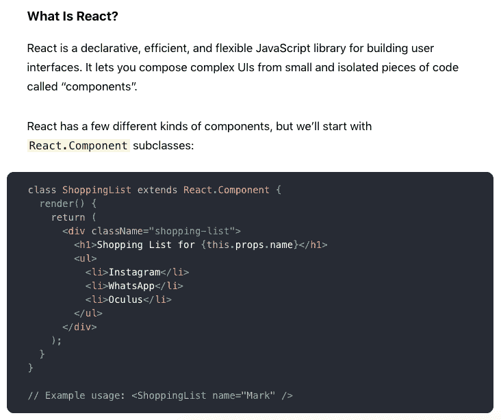
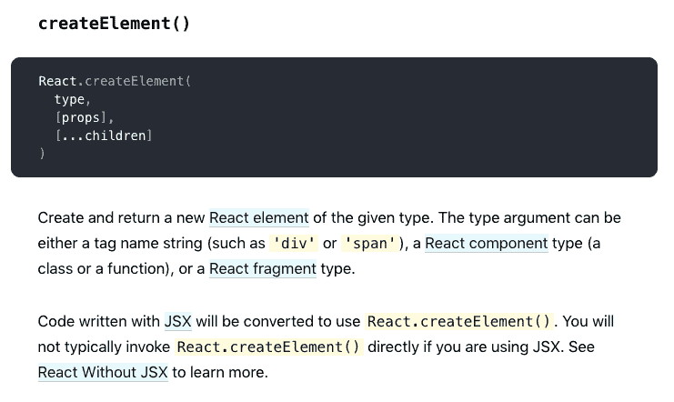
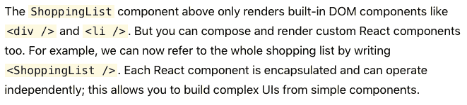
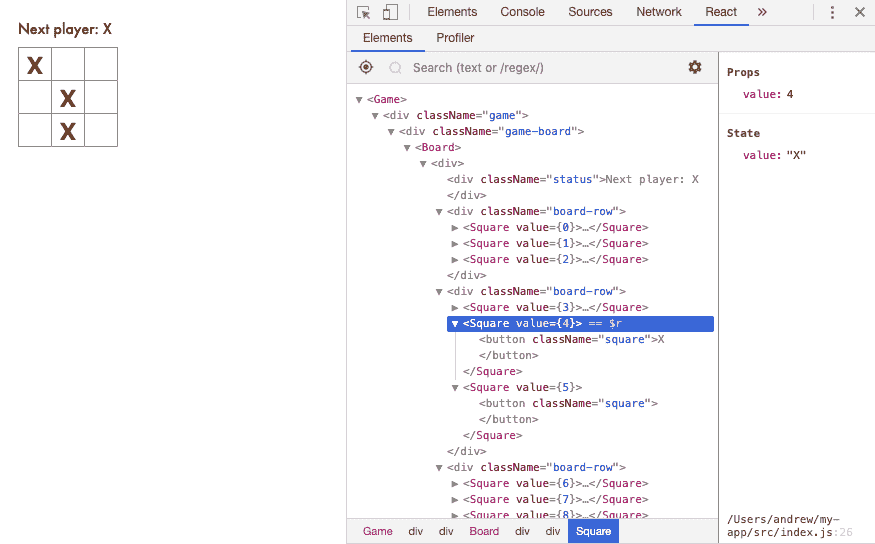

# 一个绝对的初学者学习反应，第二部分

> 原文：<https://dev.to/awwsmm/an-absolute-beginner-learns-react-part-ii-e15>

在我上一篇关于从头开始学习 React 的意识流博客文章中，我开始研究 [ReactJS.org 的教程](https://reactjs.org/tutorial/tutorial.html)。我通过复制和粘贴代码构建了我的第一个应用程序...但是成功了！今天，我希望能理解一点我运行的代码。让我们开始吧。

* * *

[](https://res.cloudinary.com/practicaldev/image/fetch/s--n2rujEP2--/c_limit%2Cf_auto%2Cfl_progressive%2Cq_auto%2Cw_880/https://thepracticaldev.s3.amazonaws.com/i/tupc58u26snqi0lr0g8g.png)

这一点我想我明白。`React.Component`是一个基本的组件类，我们创建一个`ShoppingList`类来扩展它。我猜组件需要有一个`render()`方法，它返回一些 HTML 元素来呈现。这个创建了一个带有`className`属性- *的`<div>`，这和 HTML 的`class`属性相似吗？* -它包含一个标题(`<h1>`)和一个无序列表(`<ul>`)，列出了 Mark 想要购买的所有公司。

我猜，`this.props.name`访问了`this`的`props`变量，我想它指的是`ShoppingList`类的实例。它访问`name`，它在示例中类似 XML 的标记中定义。如果您可以像这样任意定义属性，这个语法就非常酷。但是，如果我们没有将一个`name`传递给`ShoppingList`呢？代码会抛出错误吗？还是在`{this.props.name}`应该在的地方什么都不渲染？

> “当我们的数据发生变化时，React 将高效地更新和重新呈现我们的组件。”

正如我所想，这是一个反应式编程框架。考虑到它的名字，这是有道理的。

> *“在这里，ShoppingList 是一个 **React 组件类**，或者说 **React 组件类型**。组件接受名为`props`(properties 的缩写)的参数，并通过`render`方法返回视图的层次结构进行显示。*

这或多或少是我的想法，但我不明白“观点的层次”是什么意思。教程说上面那段代码看起来很像 HTML，也可以写成:

```
React.createElement("div", { className: "shopping-list" },
  React.createElement("h1", null, "Shopping List for ", props.name),
  React.createElement("ul", null,
    React.createElement("li", null, "Instagram"),
    React.createElement("li", null, "WhatsApp"),
    React.createElement("li", null, "Oculus")
  )
 ); 
```

Enter fullscreen mode Exit fullscreen mode

这让我想起了有 FXML 和没有 FXML[的 JavaFX 之间的区别。当用 FXML 构建 Java GUI *时，标记更像 XML。没有它，它看起来更像上面的代码块，其中使用点(`.`)操作符来访问函数和属性。*](https://docs.oracle.com/javafx/2/fxml_get_started/why_use_fxml.htm)

“`createElement`在 [API 参考](https://reactjs.org/docs/react-api.html#createelement)中有更详细的描述”，教程说，所以我点击那个链接，希望能找到一些像样的文档代码:

[](https://res.cloudinary.com/practicaldev/image/fetch/s--OJT7JBND--/c_limit%2Cf_auto%2Cfl_progressive%2Cq_auto%2Cw_880/https://thepracticaldev.s3.amazonaws.com/i/gkhdndrxm7lrbagsw625.png)

文档看起来很不错。非常容易理解。I thnik `[props]`是一个属性列表？但是，当我们在上面的代码块中使用它时，我们将第二个参数用花括号(`{className: 'shopping-list'}`)发送给了`createElement`。然而，当我们将变量列表`[...children]`传递给`createElement`时，它并没有用大括号括起来...我有点糊涂了。也许有两种名单？可能一个是列表，一个是字典(或者地图)？

[](https://res.cloudinary.com/practicaldev/image/fetch/s--MX_RDhgd--/c_limit%2Cf_auto%2Cfl_progressive%2Cq_auto%2Cw_880/https://thepracticaldev.s3.amazonaws.com/i/xtlnz0l2p2cpbgfx7w0i.png)

这是非常整洁的。因此，我们可以从小组件一点一点地构建一个应用程序，在更大的组件中使用它们。下一步是检查我在上一篇文章中复制并粘贴的 JavaScript 代码:

```
import React from 'react';
import ReactDOM from 'react-dom';
import './index.css';

class Square extends React.Component {
  render() {
    return (
      <button className="square">
        {/* TODO */}
      </button>
    );
  }
}

class Board extends React.Component {
  renderSquare(i) {
    return <Square />;
  }

  render() {
    const status = 'Next player: X';

    return (
      <div>
      ... 
```

Enter fullscreen mode Exit fullscreen mode

这看起来不言自明。正如教程中提到的，我们有一个`Square`类和一个`Board`类，为井字游戏呈现九个方块。我想，有些事情还没有完成，需要我去编码。

...没错。下一步是填写两个小东西，我们改变

```
 renderSquare(i) {
    return <Square />;
  } 
```

Enter fullscreen mode Exit fullscreen mode

至

```
 renderSquare(i) {
    return <Square value={i} />
  } 
```

Enter fullscreen mode Exit fullscreen mode

并改变

```
 {/* TO-DO */} 
```

Enter fullscreen mode Exit fullscreen mode

至

```
 {this.props.value} 
```

Enter fullscreen mode Exit fullscreen mode

这将传递要在按钮上呈现的正方形的“值”。我修改了这段代码并再次运行`npm start`。同样，渲染也需要非常长的时间。但是它确实有效...

[](https://res.cloudinary.com/practicaldev/image/fetch/s--SZZftAF4--/c_limit%2Cf_auto%2Cfl_progressive%2Cq_auto%2Cw_880/https://thepracticaldev.s3.amazonaws.com/i/8q81cj2b8r69bxrj7p3a.png)

...所以这很了不起。

> *恭喜你！您刚刚将一个道具从一个父棋盘组件“传递”到一个子方格组件。传递道具是信息在 React 应用中的流动方式，从父母到孩子。*

我们做的下一件事是向`Square`中的`button`添加一个`onClick`方法，这将打开一个 JavaScript `alert()`框。我在几年前的 JavaScript 经验中见过这类事情，所以它们对我来说不是很难。

我们要做的下一件事是用一个“箭头函数”替换那个`onClick`函数，因为它们显然是在 JavaScript 中被调用的。我想大多数其他编程语言都称它们为“lambda 函数”:

```
onClick={function() { alert('click'); }} 
```

Enter fullscreen mode Exit fullscreen mode

...成为...

```
onClick={() => alert('click')} 
```

Enter fullscreen mode Exit fullscreen mode

这样可以节省一点打字的时间。教程确保注意到我们需要将一个*函数*传递给`onClick`。如果我们只写...

```
onClick={alert('click')} 
```

Enter fullscreen mode Exit fullscreen mode

...那么每次组件重新呈现时都会触发警报。这可能不是我们想要的。

接下来，我们将`state`添加到`Square`类中，这样它就可以“记住”它是否被点击过。我认为这类似于大多数 OOP 语言中的实例/成员变量。看起来我们可以在类定义
中的`constructor`函数中设置 React 对象的`state`

```
class Square extends React.Component {
  constructor(props) {
    super(props);
    this.state = {
      value: null
    };
  }
} 
```

Enter fullscreen mode Exit fullscreen mode

这里有两件事:

1.  这个`Square`类显然是在用`super()`调用父类(`React.Component`)的构造函数，将`props`传递给父类构造函数。
2.  该教程实际上在`null`后面有一个逗号，我假设这是一个打字错误

> *在 JavaScript 类中，定义子类的构造函数时需要一直调用`super`。所有有一个`constructor`的 React 组件类都应该用一个`super(props)`调用来启动它。*

看起来`super(props)`在任何子类的`constructor`中都是强制的。我想知道它是否必须是构造函数的第一行，就像在 Java 中一样...？上面的摘录对此有些含糊不清。

然后我们用`setState()`改变`button`的`onClick`来改变按钮的状态，这看起来很简单。

```
onClick={() => alert('click')} 
```

Enter fullscreen mode Exit fullscreen mode

对
的更改

```
onClick={() => this.setState({value: 'X'})} 
```

Enter fullscreen mode Exit fullscreen mode

> *当您在组件中调用`setState`时，React 也会自动更新其中的子组件。*

这听起来像是*反应式依赖*。如果一个对象更新并且其他对象依赖于它，那么这些依赖对象也会更新。

我做的最后一件事是安装 [React 开发工具](https://chrome.google.com/webstore/detail/react-developer-tools/fmkadmapgofadopljbjfkapdkoienihi?hl=en) Chrome 扩展，这样我就可以在浏览器中检查我的 React 代码:

[](https://res.cloudinary.com/practicaldev/image/fetch/s--_lcOoOj3--/c_limit%2Cf_auto%2Cfl_progressive%2Cq_auto%2Cw_880/https://thepracticaldev.s3.amazonaws.com/i/v54b79sham99mc8z750j.png)

不错！

* * *

嗯，我确实开始理解 React 是如何工作的了。看到熟悉的东西，比如类、构造函数和 lambda 函数，让我更有信心，这是我能够很容易掌握的东西。到目前为止，我基本上只是在服用类固醇，所以我希望我可以用这个框架做更多的事情。我期待着制作一些很酷的互动网页！